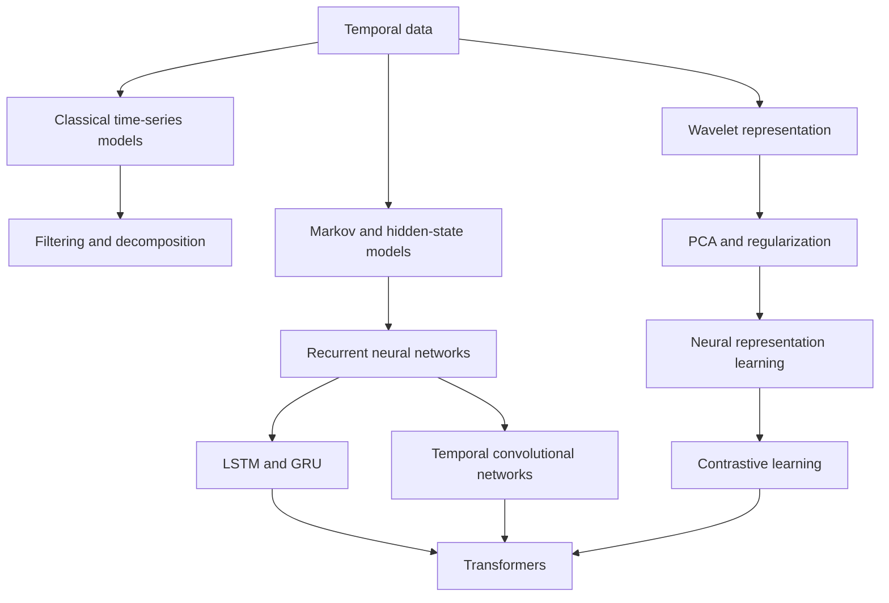

# Course Map

| Chapter | PDF pages | Topic | Status |
|---:|---:|---|---|
| 01 | 2-4 | Temporal data and temporal learning | Drafted |
| 02 | 5-13 | Stationarity and classical time-series models | Pending |
| 03 | 14-19 | Filters, smoothing, decomposition, and transfer functions | Pending |
| 04 | 20-32 | Fourier analysis and wavelets | Pending |
| 05 | 33-44 | PCA, bias-variance, regularization, and thresholding | Pending |
| 06 | 45-55 | Markov chains, HMMs, Gaussian mixtures, and EM | Pending |
| 07 | 56-65 | Neural-network foundations and training | Pending |
| 08 | 66-78 | RNNs, LSTMs, GRUs, and encoder-decoder models | Pending |
| 09 | 79-82 | Temporal convolutional networks | Drafted |
| 10 | 83-91 | Temporal representation and contrastive learning | Drafted |
| 11 | 92-100 | Transformers and temporal applications | Drafted |
| 12 | 101-103 | Handwritten stationarity and covariance appendix | Drafted |

## Concept progression

