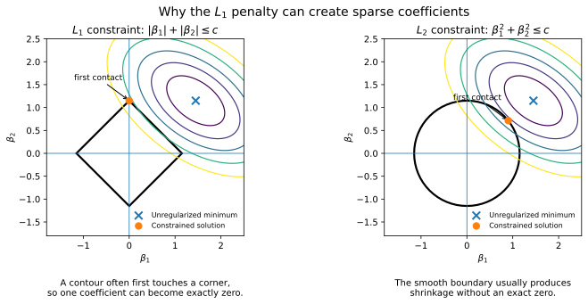

# 3. Regularization and Probabilistic Linear Regression

**Source pages:** 12–15  
**Status:** reconstructed and equation-checked

This chapter develops regularized linear regression and then gives a probabilistic interpretation of least squares. The source first uses parameter penalties to control overfitting, compares ridge, lasso, and elastic net, and then shows that minimizing residual sum of squares is equivalent to maximum-likelihood estimation under Gaussian observation noise. Page 15 ends with a brief handwritten transition toward latent-variable generative models.

## 3.1 Why regularization is needed

The previous chapter connected high model flexibility with the possibility of overfitting. A high-capacity model can search through many candidate hypotheses and may fit accidental details of the training sample.

The source introduces regularization as a way to constrain that search. Instead of minimizing only the data-fitting loss, training also discourages parameter values considered too complex:

$$ L_{\text{regularized}}(\theta) = L_{\text{data}}(\theta) + \lambda\Omega(\theta). $$

Here:

- $L_{\text{data}}(\theta)$ measures disagreement between predictions and observed targets.
- $\Omega(\theta)$ penalizes the model parameters.
- $\lambda\geq 0$ controls the relative importance of fitting the data and keeping the parameters small.

For polynomial regression, the data-fitting term remains:

$$ L_{\text{data}}(\theta) = \frac{1}{2}\sum_{i=1}^{n_{\mathrm{train}}}\left(y^{(i)}-h_\theta\left(x^{(i)}\right)\right)^2. $$

When $\lambda=0$, the objective reduces to ordinary least squares. Increasing $\lambda$ places more emphasis on the parameter penalty.

> [!TIP]
> **Review intuition**
>
> Regularization does not directly reduce the number of candidate functions. It changes which candidates are preferred: two models with similar training error are no longer considered equally good if one requires much larger coefficients.

## 3.2 Penalty form and constraint form

The source describes regularization as placing constraints on model parameters. The same idea can be written in two closely related ways.

The **penalty form** is:

$$ \min_\theta L_{\text{data}}(\theta)+\lambda\Omega(\theta). $$

The **constraint form** is:

$$ \min_\theta L_{\text{data}}(\theta) \quad \text{subject to} \quad \Omega(\theta)\leq c. $$

The penalty parameter $\lambda$ and constraint radius $c$ both control model flexibility, but in opposite directions:

- Larger $\lambda$ means stronger regularization.
- Smaller $c$ means a tighter feasible region.

> [!NOTE]
> **Added clarification**
>
> The source moves between the penalty and geometric constraint views when comparing $L_1$ and $L_2$ regularization. It does not derive the exact mapping between $\lambda$ and $c$; the important point is that both formulations limit parameter magnitude.

## 3.3 Ridge regression: the L2 penalty

Ridge regression adds the squared L2 magnitude of the coefficients:

$$ L_{\mathrm{ridge}}(\theta) = \frac{1}{2}\sum_{i=1}^{n_{\mathrm{train}}}\left(y^{(i)}-h_\theta\left(x^{(i)}\right)\right)^2 + \lambda\sum_{j=1}^{d_{\max}}\theta_j^2. $$

The source starts the penalty at $j=1$, so the intercept $\theta_0$ is not included in the displayed regularization term.

The corresponding constraint is:

$$ \sum_{j=1}^{d_{\max}}\theta_j^2\leq c. $$

Ridge regression has two effects emphasized in the notes:

1. It shrinks the magnitudes of all coefficients.
2. Large coefficients are penalized especially strongly because they are squared.

For example, changing a coefficient from $1$ to $2$ increases its squared penalty from $1$ to $4$, while changing it from $2$ to $4$ increases the penalty from $4$ to $16$.

The page 12 plots show the effect on a degree-nine polynomial model:

- With $\lambda=0$, the model is highly oscillatory and overfits.
- With a very small positive $\lambda$, the fitted curve becomes smoother while still following the data.
- With a larger $\lambda$, the coefficients become too small and the model underfits.

> [!WARNING]
> **Regularization can be too strong**
>
> The handwritten note warns against lowering the coefficients too much. Regularization trades variance for bias; it is not automatically beneficial at every strength.

## 3.4 Lasso regression: the L1 penalty

Lasso regression adds the sum of absolute coefficient values:

$$ L_{\mathrm{lasso}}(\theta) = \frac{1}{2}\sum_{i=1}^{n_{\mathrm{train}}}\left(y^{(i)}-h_\theta\left(x^{(i)}\right)\right)^2 + \lambda\sum_{j=1}^{d_{\max}}\left|\theta_j\right|. $$

The corresponding constraint is:

$$ \sum_{j=1}^{d_{\max}}\left|\theta_j\right|\leq c. $$

The source highlights three properties:

- The L1 penalty selectively shrinks coefficients.
- Some coefficients may become exactly zero.
- This behavior can be used for feature selection.

Suppose the model uses transformed features:

$$ h_\theta(x) = \theta_0 + \theta_1\phi_1(x)+\theta_2\phi_2(x)+\cdots+\theta_{d_{\max}}\phi_{d_{\max}}(x). $$

If lasso drives $\theta_j$ to zero, the corresponding feature $\phi_j(x)$ no longer contributes to the prediction. The page 13 polynomial example illustrates this by showing that only a small number of transformed features remain dominant after regularization.

The source also states that lasso converges more slowly than ridge regression and notes that the absolute-value function is difficult for ordinary gradient descent.

> [!NOTE]
> **Technical note: the point at zero**
>
> The function $|\theta_j|$ is not differentiable at $\theta_j=0$. Away from zero its derivative is the sign of $\theta_j$, but at zero optimization requires a subgradient or a solver designed for nonsmooth objectives. The handwritten notes mention specialized solver software but do not specify a complete algorithm.

## 3.5 Why L1 produces sparse coefficients

The source explains the difference geometrically using loss contours and parameter constraints.

Let $\beta^{\star}$ denote the unregularized minimizer of the data-fitting loss. Around $\beta^{\star}$, equal-loss contours are drawn as ellipses. A constrained solution is the point where the smallest reachable contour first touches the feasible parameter region.

For two parameters, the L1 region is diamond-shaped:

$$ \left|\beta_1\right|+\left|\beta_2\right|\leq c. $$

The L2 region is circular:

$$ \beta_1^2+\beta_2^2\leq c. $$

*Redrawn from the contour argument on source page 13. The exact contact point depends on the loss surface; the diagram illustrates the source's central geometric intuition.*

The L1 boundary has sharp corners on the coordinate axes. An expanding elliptical contour often reaches one of these corners first, which gives a solution with either $\beta_1=0$ or $\beta_2=0$.

The L2 boundary is smooth. The first contact usually occurs away from the axes, so both coefficients are reduced but remain nonzero.

> [!NOTE]
> **Source conclusion**
>
> The handwritten answer to “Why does the L1 penalty give a few large coefficients compared with the L2 penalty?” is that the first intersection with the L1 constraint often occurs where one parameter is zero or almost zero, while the L2 intersection usually leaves both parameters away from zero.

## 3.6 Ridge and lasso compared

| Property | Ridge regression | Lasso regression |
|---|---|---|
| Penalty | squared L2 magnitude | L1 magnitude |
| Typical coefficient effect | shrinks all coefficients | can set selected coefficients to zero |
| Feature selection | not directly | yes, through zero coefficients |
| Geometry | smooth circular or spherical constraint | diamond or cross-polytope constraint with corners |
| Optimization in the source | smooth objective | nonsmooth at zero and described as slower |

Both methods can reduce overfitting, but they express different preferences about the parameter vector. Ridge prefers distributed small coefficients; lasso permits a smaller number of active coefficients while suppressing the others.

## 3.7 Elastic Net regularization

Elastic Net combines the L2 and L1 penalties:

$$ L_{\mathrm{EN}}(\theta) = \frac{1}{2}\sum_{i=1}^{n_{\mathrm{train}}}\left(y^{(i)}-h_\theta\left(x^{(i)}\right)\right)^2 + \lambda_1\sum_{j=1}^{d_{\max}}\theta_j^2 + \lambda_2\sum_{j=1}^{d_{\max}}\left|\theta_j\right|. $$

In the source notation, $\lambda_1$ multiplies the L2 term and $\lambda_2$ multiplies the L1 term.

Elastic Net is presented as a compromise between ridge and lasso. It can combine broad coefficient shrinkage with selective sparsity, but it introduces an additional tuning decision: how much of the regularization should come from the L2 term and how much from the L1 term.

## 3.8 Regularization and the bias–variance trade-off

Pages 12–13 visually continue the generalization discussion from Chapter 2. A flexible polynomial model can have low training error but high variance. Regularization reduces the effective flexibility of the fitted model by discouraging extreme coefficients.

As $\lambda$ increases:

- training fit generally becomes less exact;
- coefficient magnitudes become smaller;
- variance can decrease;
- bias can increase.

The goal is not to minimize the coefficient norm by itself. It is to choose a balance that improves performance on unseen data.

## 3.9 A probabilistic modeling setup

The handwritten notes on page 14 introduce a general statistical modeling view before specializing to linear regression.

Let $p_{\mathrm{data}}(x)$ be the unknown data-generating distribution, and let the observed training examples be:

$$ X=\left\lbrace x^{(1)},x^{(2)},\ldots,x^{(n)}\right\rbrace. $$

A parameterized probability model is written as:

$$ p_{\mathrm{model}}(x;\theta). $$

The goal is to choose $\theta$ so that the model assigns high probability to the observed data. Under an independent and identically distributed assumption, the likelihood is:

$$ L(\theta)=\prod_{i=1}^{n}p_{\mathrm{model}}\left(x^{(i)};\theta\right). $$

The maximum-likelihood estimate is:

$$ \theta_{\mathrm{MLE}}=\mathrm{arg\,max}_{\theta}\prod_{i=1}^{n}p_{\mathrm{model}}\left(x^{(i)};\theta\right). $$

Products of many probabilities can become numerically extremely small. The source therefore moves to the log-likelihood:

$$ \ell(\theta)=\log L(\theta)=\sum_{i=1}^{n}\log p_{\mathrm{model}}\left(x^{(i)};\theta\right). $$

Because the logarithm is increasing, maximizing $L(\theta)$ and maximizing $\ell(\theta)$ give the same optimizer.

## 3.10 Maximum likelihood and KL divergence

The page 14 handwritten derivation connects maximum likelihood with the forward Kullback–Leibler divergence:

$$ D_{\mathrm{KL}}\left(p_{\mathrm{data}}\parallel p_{\mathrm{model}}\right)=\mathbb{E}_{x\sim p_{\mathrm{data}}}\left[\log p_{\mathrm{data}}(x)-\log p_{\mathrm{model}}(x;\theta)\right]. $$

The first term does not depend on $\theta$. Therefore, minimizing this KL divergence with respect to $\theta$ is equivalent to maximizing:

$$ \mathbb{E}_{x\sim p_{\mathrm{data}}}\left[\log p_{\mathrm{model}}(x;\theta)\right]. $$

The empirical approximation based on the training examples is:

$$ \mathbb{E}_{x\sim p_{\mathrm{data}}}\left[\log p_{\mathrm{model}}(x;\theta)\right] \approx \frac{1}{n}\sum_{i=1}^{n}\log p_{\mathrm{model}}\left(x^{(i)};\theta\right). $$

Thus maximum likelihood can be interpreted as fitting the model distribution to the data distribution by minimizing the empirical forward KL divergence.

> [!NOTE]
> **Source boundary: the KL direction**
>
> The handwritten page says that the “other direction,” $D_{\mathrm{KL}}(p_{\mathrm{model}}\parallel p_{\mathrm{data}})$, does not make sense for this derivation. More precisely, reversing the arguments does not produce the maximum-likelihood objective, because the expectation would be taken under the model and the dependence on $\theta$ changes. The source does not develop reverse-KL optimization further.

## 3.11 Gaussian-noise model for linear regression

The probabilistic interpretation of linear regression begins with the assumption:

$$ y=h_\theta(x)+\epsilon. $$

The noise is assumed Gaussian with zero mean and variance $\sigma^2$:

$$ \epsilon\sim\mathcal{N}\left(0,\sigma^2\right). $$

Its density is:

$$ p(\epsilon)=\frac{1}{\sqrt{2\pi}\sigma}\exp\left(-\frac{\epsilon^2}{2\sigma^2}\right). $$

Since $\epsilon=y-h_\theta(x)$, the conditional distribution of the target is:

$$ p(y\mid x;\theta)=\frac{1}{\sqrt{2\pi}\sigma}\exp\left(-\frac{\left(y-h_\theta(x)\right)^2}{2\sigma^2}\right). $$

Equivalently:

$$ y\mid x;\theta\sim\mathcal{N}\left(h_\theta(x),\sigma^2\right). $$

For each input $x$, the model predicts the center of a Gaussian distribution over possible targets. The source diagram places the Gaussian vertically around $h_\theta(x)$ and marks its spread using $\sigma$.

## 3.12 Likelihood of the regression dataset

Under the i.i.d. assumption, the conditional likelihood of all training targets is:

$$ L(\theta)=\prod_{i=1}^{n_{\mathrm{train}}}p\left(y^{(i)}\mid x^{(i)};\theta\right). $$

Substituting the Gaussian density gives:

$$ L(\theta)=\prod_{i=1}^{n_{\mathrm{train}}}\frac{1}{\sqrt{2\pi}\sigma}\exp\left(-\frac{\left(y^{(i)}-h_\theta\left(x^{(i)}\right)\right)^2}{2\sigma^2}\right). $$

Using the logarithm turns the product into a sum:

$$ \ell(\theta)=\log L(\theta)=-n_{\mathrm{train}}\log\left(\sqrt{2\pi}\sigma\right)-\frac{1}{2\sigma^2}\sum_{i=1}^{n_{\mathrm{train}}}\left(y^{(i)}-h_\theta\left(x^{(i)}\right)\right)^2. $$

If $\sigma$ is treated as fixed, the first term is constant with respect to $\theta$, and the factor $1/(2\sigma^2)$ is positive. Therefore:

$$ \mathrm{arg\,max}_{\theta}\ell(\theta)=\mathrm{arg\,min}_{\theta}\sum_{i=1}^{n_{\mathrm{train}}}\left(y^{(i)}-h_\theta\left(x^{(i)}\right)\right)^2. $$

This is the central result of page 14:

> Maximizing the Gaussian log-likelihood is equivalent to minimizing residual sum of squares.

The squared-error objective is therefore not only a geometric choice. It is the negative log-likelihood induced by a Gaussian-noise assumption.

## 3.13 What the probabilistic interpretation adds

The deterministic and probabilistic views describe the same fitted mean function but answer different questions.

| View | Main object | Interpretation |
|---|---|---|
| Least squares | prediction function $h_\theta(x)$ | choose parameters that minimize squared residuals |
| Probabilistic regression | conditional density $p(y\mid x;\theta)$ | choose parameters that maximize the probability of observed targets |

The probabilistic view makes the modeling assumptions explicit:

- the prediction $h_\theta(x)$ is the conditional mean;
- residual variation is Gaussian;
- the noise variance is the same across inputs in the displayed model;
- training examples are conditionally independent under the model.

> [!NOTE]
> **Added clarification**
>
> The source derives the objective for fixed $\sigma$. If $\sigma$ were also estimated, the likelihood would additionally determine a noise-scale estimate, but that calculation is not developed on these pages.

## 3.14 Transition sketch: latent-variable generative models

Page 15 is a handwritten transition rather than a complete lecture section. It sketches high-dimensional observations such as MNIST images and audio, and introduces a latent representation $z$.

The source suggests that $z$ may encode factors such as:

- the digit identity;
- handwriting style;
- other compact attributes underlying an observation.

A conditional distribution is written as:

$$ p(x\mid z). $$

The page draws multiple images generated from related latent information and includes a VAE-style encoder-decoder sketch in which an observation is mapped to a latent code and then reconstructed or generated.

It also records an unresolved design question: when adding text or audio information, should that information enter as an input, as part of the latent representation, or as another conditioning variable?

> [!NOTE]
> **Source boundary**
>
> Page 15 does not provide a VAE objective, encoder distribution, decoder derivation, or training algorithm. This reconstruction preserves the sketch as a transition and does not turn it into a full variational-autoencoder treatment.

## 3.15 Common mistakes

1. **Assuming larger $\lambda$ is always better.** Too much regularization can create underfitting.
2. **Treating ridge and lasso as interchangeable.** Both shrink coefficients, but lasso's geometry can create exact zeros.
3. **Ignoring whether the intercept is penalized.** The source's displayed sums begin at coefficient index one and omit $\theta_0$.
4. **Saying lasso is differentiable everywhere.** The absolute-value penalty is nonsmooth at zero.
5. **Interpreting small coefficients as unimportant without considering feature scale.** Coefficient magnitude depends on the numerical scaling of the corresponding feature.
6. **Maximizing a product of probabilities directly in finite precision.** Log-likelihood is preferred because it converts the product to a sum and avoids severe underflow.
7. **Reversing the KL divergence and claiming it is still maximum likelihood.** The forward direction used in the notes is the one whose empirical objective matches log-likelihood.
8. **Using squared error without recognizing the modeling assumption.** The likelihood derivation depends on Gaussian residual noise with constant variance.
9. **Treating page 15 as a complete VAE derivation.** It is only a conceptual transition sketch.

## 3.16 Chapter summary

- Regularization adds a parameter penalty to the data-fitting objective.
- The parameter $\lambda$ controls the trade-off between fitting the observed data and limiting model complexity.
- Ridge regression uses an L2 penalty and broadly shrinks coefficient magnitudes.
- Lasso regression uses an L1 penalty and can set selected coefficients exactly to zero.
- The corner geometry of the L1 constraint explains its sparse solutions.
- Elastic Net combines L2 shrinkage with L1 sparsity.
- Maximum likelihood chooses model parameters that assign high probability to observed data.
- Maximizing empirical log-likelihood corresponds to minimizing forward KL divergence from the data distribution to the model distribution.
- Under additive Gaussian noise, maximizing the linear-regression likelihood is equivalent to minimizing residual sum of squares.
- Page 15 briefly introduces latent-variable generative modeling but does not develop its objective.

## 3.17 Self-check questions

1. What roles do $L_{\mathrm{data}}$, $\Omega(\theta)$, and $\lambda$ play in a regularized objective?
2. Why does ridge penalize large coefficients more strongly than small coefficients?
3. Why can lasso set coefficients exactly to zero while ridge usually does not?
4. How are penalty and constraint formulations related conceptually?
5. What trade-off occurs as regularization strength increases?
6. Why is log-likelihood easier to optimize numerically than a product likelihood?
7. Why does minimizing $D_{\mathrm{KL}}(p_{\mathrm{data}}\parallel p_{\mathrm{model}})$ lead to maximum likelihood?
8. Which Gaussian assumptions make least squares a maximum-likelihood estimator?
9. What information does the page 15 latent variable $z$ appear intended to represent?
