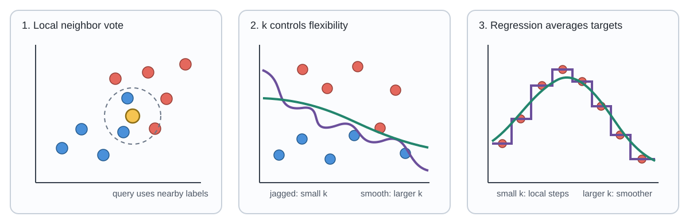

# 4. K-Nearest Neighbors

**Source pages:** 16–18  
**Status:** reconstructed and equation-checked

This chapter introduces K-nearest neighbors (KNN) as a similarity-based method for classification and regression. The source focuses on four decisions: how examples are represented, how closeness is measured, how the value of $k$ changes the model, and why feature scaling matters.

## 4.1 Classification through similarity

The source describes a classification problem as requiring:

- quantifiable input features;
- known class labels, making the task supervised;
- a method for measuring similarity between examples.

Its introductory example is a flower shop that predicts a customer's next purchase from purchases made by similar customers. The same principle is illustrated with two numerical features, age and number of malignant nodes, and a binary outcome indicating whether a patient survived.

KNN does not begin by assuming a line, polynomial, or sigmoid-shaped prediction function. Instead, it predicts a new example from the labels or target values of nearby training examples.

> [!TIP]
> **Review intuition**
>
> KNN expresses the assumption that examples located close together in feature space tend to have similar outputs.

## 4.2 The KNN classification rule

Let the supervised training set be:

$$ \mathcal{D}_{\mathrm{train}}=\left\lbrace \left(x^{(i)},y^{(i)}\right)\right\rbrace_{i=1}^{n_{\mathrm{train}}}. $$

For a query input $x$, let $\mathcal{N}_k(x)$ denote the indices of the $k$ closest training examples.

For each class $c$, count how many of those neighbors have label $c$:

$$ S_c(x)=\sum_{i\in\mathcal{N}_k(x)}\mathbf{1}\left[y^{(i)}=c\right]. $$

The predicted class is the class with the largest count:

$$ \hat{y}(x)=\mathrm{arg\,max}_{c}S_c(x). $$

This is a majority vote among the $k$ nearest neighbors.

> [!NOTE]
> **Added clarification: ties**
>
> The source does not specify a tie-breaking rule. A complete implementation must choose one, such as preferring the class of the closest neighbor or using a fixed class ordering.

## 4.3 Measuring closeness

Page 16 identifies Euclidean, or L2, distance as the closeness measure used in the example. For two $d$-dimensional feature vectors $x$ and $z$:

$$ d_2(x,z)=\left(\sum_{j=1}^{d}\left(x_j-z_j\right)^2\right)^{1/2}. $$

The KNN neighborhood contains the $k$ training examples with the smallest distances to the query.

The choice of distance is part of the model. A distance function determines which examples are considered similar and therefore which observations influence the prediction.

## 4.4 How the value of k changes classification

The source compares two extreme choices.

### When k = 1

The prediction is the label of the single closest training example. The resulting decision boundary can bend around individual observations and create small isolated regions.

Consequences emphasized by the source figures:

- highly local predictions;
- a flexible and irregular decision boundary;
- sensitivity to individual training examples;
- greater risk of overfitting.

### When k uses all training examples

Every query uses the same complete training set as its neighborhood. The predicted class is therefore the overall majority class, independent of the query location.

Consequences:

- the same output is predicted throughout the feature space;
- local structure is ignored;
- the model is too simple and can underfit.

The useful value of $k$ is generally between these extremes. Page 16 identifies selecting the correct $k$ as a central model-selection problem. The validation and cross-validation procedures from Chapter 2 can be used to compare candidate values.

*Redrawn from the main ideas on source pages 16 and 18: neighbor voting, decreasing boundary complexity as $k$ grows, and increasing smoothness in KNN regression.*

## 4.5 Feature scaling

Page 17 shows that Euclidean distance can be dominated by a feature with a much larger numerical scale.

Suppose one feature varies from $0$ to $5$ while another varies from $10$ to $60$. A difference of one unit in the first coordinate contributes only $1^2$ to squared distance, while a difference of ten units in the second contributes $10^2=100$. The larger-scale feature can therefore determine the neighborhood even when both features are intended to matter.

Feature scaling changes the numerical representation before distances are computed.

### Standard scaling

For feature $j$, let the training-set mean and variance be:

$$ \mu_j=\frac{1}{n_{\mathrm{train}}}\sum_{i=1}^{n_{\mathrm{train}}}x_j^{(i)}, \qquad s_j^2=\frac{1}{n_{\mathrm{train}}}\sum_{i=1}^{n_{\mathrm{train}}}\left(x_j^{(i)}-\mu_j\right)^2. $$

The standardized feature is:

$$ x_j'=\frac{x_j-\mu_j}{s_j}. $$

This mean-centers the feature and scales it to unit variance.

### Minimum-maximum scaling

The source describes scaling each feature to a fixed interval, usually $[0,1]$:

$$ x_j'=\frac{x_j-x_{j,\min}}{x_{j,\max}-x_{j,\min}}. $$

### Maximum-absolute-value scaling

The feature is divided by its maximum absolute training value:

$$ x_j'=\frac{x_j}{\max_i\left|x_j^{(i)}\right|}. $$

When the denominator is nonzero, the transformed training values lie within $[-1,1]$.

> [!WARNING]
> **Fit the scaler on training data**
>
> This is an added implementation clarification. The means, variances, minima, and maxima should be estimated from the training split and then reused for validation, test, and future examples. Estimating them from the test set would allow test information to influence the model-building pipeline.

## 4.6 Scaling usually helps, but not always

The handwritten annotation on page 17 explicitly says that feature scaling “usually helps, not always.” It gives an example in which one feature is a function of another, such as:

$$ x_2=2x_1. $$

Scaling can make the two coordinates numerically comparable, but it does not remove their deterministic dependence. A Euclidean distance computed with both coordinates can still count essentially the same underlying information more than once.

> [!NOTE]
> **Interpretation of the handwritten caveat**
>
> The source does not develop a general rule for dependent features. Its example warns that scaling fixes unequal numerical ranges, not redundancy or an unsuitable feature representation.

## 4.7 KNN regression

KNN can also predict a continuous target. Instead of taking a majority vote, it averages the target values of the nearest neighbors:

$$ \hat{y}(x)=\frac{1}{k}\sum_{i\in\mathcal{N}_k(x)}y^{(i)}. $$

The page 18 plots compare several values of $k$.

- With a very small $k$, the prediction follows individual samples closely and changes abruptly.
- As $k$ increases, each prediction averages more observations and the fitted function becomes smoother.
- When $k=n_{\mathrm{train}}$, every prediction equals the global mean target:

$$ \hat{y}(x)=\frac{1}{n_{\mathrm{train}}}\sum_{i=1}^{n_{\mathrm{train}}}y^{(i)}. $$

This final case is constant in $x$ and therefore cannot represent local variation.

## 4.8 K and effective model complexity

The handwritten discussion on page 18 asks whether increasing $k$ increases or decreases complexity. Its conclusion is:

> Increasing $k$ decreases the effective complexity of KNN and moves the model toward underfitting.

The direction is important:

| Choice of k | Neighborhood behavior | Typical effect |
|---|---|---|
| small $k$ | highly local | lower bias, higher variance, possible overfitting |
| large $k$ | broad averaging | higher bias, lower variance, possible underfitting |

The generic U-shaped validation-error picture from Chapter 2 still provides the model-selection idea, but $k$ runs in the opposite direction from many direct complexity controls. Increasing polynomial degree increases flexibility, whereas increasing the KNN neighborhood size reduces flexibility.

> [!NOTE]
> **Why the source warns about the graph**
>
> The handwritten note says not to infer the direction mechanically from a generic “complexity” graph. KNN is not parameterized by degree, and increasing its named hyperparameter $k$ makes predictions smoother rather than more flexible.

## 4.9 Classification and regression compared

| Component | KNN classification | KNN regression |
|---|---|---|
| Neighborhood | $k$ closest training inputs | $k$ closest training inputs |
| Neighbor outputs | class labels | numerical targets |
| Aggregation | majority vote | arithmetic mean |
| Very small $k$ | irregular class regions | jagged or step-like function |
| Very large $k$ | global majority class | global mean target |

Both versions depend on the same representation, distance measure, scaling procedure, and value of $k$.

## 4.10 Common mistakes

1. **Assuming a larger k creates a more complex KNN model.** Larger neighborhoods average more examples and usually reduce effective complexity.
2. **Using unscaled features with very different numerical ranges.** Euclidean distance may then be dominated by the largest-scale feature.
3. **Scaling validation or test data independently.** The same transformation learned from the training set must be applied to all later data.
4. **Assuming scaling removes redundant features.** It changes units and ranges, not the informational dependence between coordinates.
5. **Treating k = 1 as automatically optimal because it fits locally.** Its sensitivity to individual examples can produce high variance.
6. **Treating k = all as a meaningful local method.** It collapses classification to the global majority and regression to the global mean.
7. **Forgetting that distance defines similarity.** Changing the representation or distance can change the selected neighbors and the prediction.

## 4.11 Chapter summary

- KNN predicts from nearby labeled training examples.
- Classification uses a neighbor vote; regression uses a neighbor average.
- Euclidean distance is the closeness measure used in the source examples.
- Small $k$ produces highly local, flexible predictions and can overfit.
- Large $k$ produces broad averaging, smoother predictions, and can underfit.
- Increasing $k$ decreases KNN's effective model complexity.
- Feature scaling is important when coordinates have different numerical ranges.
- Standard, minimum-maximum, and maximum-absolute-value scaling are presented in the source.
- Scaling does not by itself remove redundant or dependent features.

## 4.12 Self-check questions

1. What assumption about nearby examples makes KNN reasonable?
2. How is a KNN classification prediction computed?
3. How is a KNN regression prediction computed?
4. Why can Euclidean distance be distorted by unequal feature scales?
5. What is the difference between standard, minimum-maximum, and maximum-absolute-value scaling?
6. Why does $k=1$ tend to have high variance?
7. Why does $k=n_{\mathrm{train}}$ underfit?
8. Does increasing $k$ increase or decrease effective model complexity?
9. Why does scaling not solve the dependence problem when $x_2=2x_1$?
