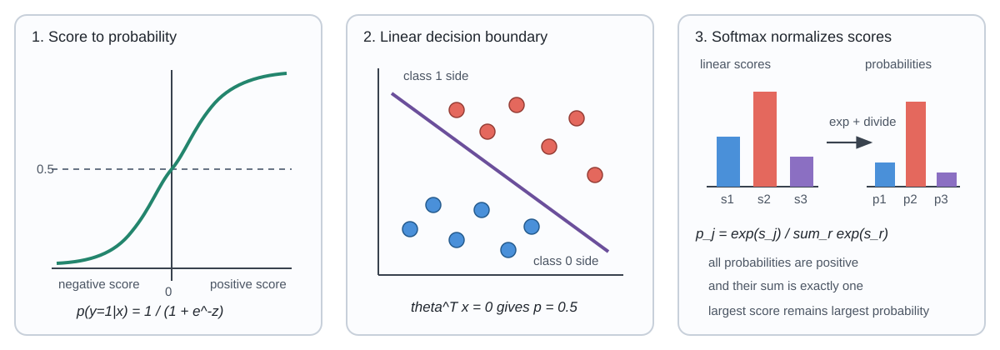

# 5. Logistic and Softmax Regression

This chapter moves from similarity-based classification to probabilistic classifiers with parameters. Logistic regression squeezes a linear score through a sigmoid and is trained by maximum likelihood; softmax regression generalizes it to $K$ classes. The chapter ends by showing that both come out of the same recipe, the generalized linear model, together with linear regression.

## 5.1 Why not use linear regression for classification?

With labels $y\in\lbrace0,1\rbrace$ you could fit $h_\theta(x)=\theta_0+\theta_1x$ and predict 1 when $h_\theta(x)\ge 0.5$. Two problems:

- the output isn't confined to $[0,1]$, so it isn't a probability;
- squared error punishes points that are "too correct" (a score of 3 for a positive example), so a few far-away points can drag the boundary.

The fix is to keep the linear score but pass it through a function that maps $\mathbb R$ to $(0,1)$.

## 5.2 The sigmoid

$$ \sigma(z)=\frac{1}{1+e^{-z}}, \qquad 0<\sigma(z)<1, \qquad \frac{d\sigma}{dz}=\sigma(z)\left(1-\sigma(z)\right). $$

Logistic regression uses

$$ h_\theta(x)=\sigma\left(\theta^\top x\right)=\frac{1}{1+e^{-\theta^\top x}}. $$

A very negative score gives a probability near 0, a very positive one near 1.

*The sigmoid turns a score into a probability, the 0.5 threshold is a linear boundary, and softmax normalizes several scores at once.*

## 5.3 Probabilities and the decision threshold

$$ h_\theta(x)=p(y=1\mid x;\theta), \qquad p(y=0\mid x;\theta)=1-h_\theta(x). $$

With threshold 0.5, since $\sigma(0)=0.5$:

$$ \hat y=1 \iff h_\theta(x)\ge0.5 \iff \theta^\top x\ge 0 . $$

For one feature the boundary is the point $x=-\theta_0/\theta_1$.

> [!NOTE]
> **Probability first, decision second**
>
> Logistic regression outputs a probability; the threshold turns it into a label. 0.5 minimizes the error rate when the two kinds of error cost the same. If a false negative costs $c_{FN}$ and a false positive $c_{FP}$, the optimal threshold is $c_{FP}/(c_{FP}+c_{FN})$. Chapter 6 evaluates classifiers across all thresholds.

## 5.4 Bernoulli likelihood

Model the label as a Bernoulli draw with success probability $h_\theta(x)$. Both cases fit in one expression:

$$ p(y\mid x;\theta)=h_\theta(x)^y\left(1-h_\theta(x)\right)^{1-y}. $$

## 5.5 Log-likelihood and cross-entropy

For independent examples,

$$ \ell(\theta)=\sum_{i=1}^{n}\left[y^{(i)}\log h_\theta\left(x^{(i)}\right)+\left(1-y^{(i)}\right)\log\left(1-h_\theta\left(x^{(i)}\right)\right)\right], \qquad \theta_{\mathrm{MLE}}=\mathrm{arg\,max}_{\theta}\,\ell(\theta). $$

$-\ell(\theta)$ is the **binary cross-entropy** or log loss that deep-learning libraries minimize.

## 5.6 The gradient

Using $\nabla_\theta h_\theta(x)=h_\theta(x)(1-h_\theta(x))\,x$ and the chain rule, the sigmoid derivative cancels neatly:

$$ \nabla_\theta\ell(\theta)=\sum_{i=1}^{n}\left(y^{(i)}-h_\theta\left(x^{(i)}\right)\right)x^{(i)}. $$

This has the same "error × input" form as the least-squares gradient in Chapter 1. It is not a coincidence (§5.16). We *maximize* $\ell$, so the update is gradient **ascent**:

$$ \theta^{(t+1)}=\theta^{(t)}+\eta\nabla_\theta\ell\left(\theta^{(t)}\right), $$

which is identical to gradient descent on the loss $-\ell$. Keep track of the sign.

> [!NOTE]
> **Beyond the lecture: two practical facts**
>
> 1. **The log-likelihood is concave**, so there are no bad local optima. Newton's method (IRLS) converges in a handful of steps.
> 2. **On linearly separable data the MLE doesn't exist.** Scaling $\theta$ up always increases the likelihood, so $\|\theta\|\to\infty$ and the predicted probabilities collapse to 0 and 1. Adding an L2 penalty (Chapter 3) fixes this, which is why scikit-learn's `LogisticRegression` regularizes by default (`C=1.0`).

## 5.7 Several features

With $x=[1,x_1,\ldots,x_d]^\top$ the model is unchanged and the 0.5 boundary is the hyperplane $\theta^\top x=0$. In 2-D (e.g. age and number of positive lymph nodes) it is the line $\theta_0+\theta_1x_1+\theta_2x_2=0$. Transformed features (Chapter 1) give curved boundaries while the model stays linear in $\theta$.

## 5.8 One-vs-rest for multiple classes

For $K$ classes, train $K$ binary classifiers, where classifier $j$ separates class $j$ from everything else, and predict

$$ \hat{y}=\mathrm{arg\,max}_{j}\,h_{\theta_j}(x). $$

The $K$ sigmoid outputs are trained separately, so they don't have to sum to 1. The argmax still works, but the outputs aren't a proper distribution over classes.

## 5.9 From Bernoulli to categorical

For $K$ mutually exclusive classes use a categorical distribution with $\phi_j=p(y=j)$, $\sum_j\phi_j=1$:

$$ p(y;\phi)=\prod_{j=1}^{K}\phi_j^{\mathbf{1}[y=j]}. $$

## 5.10 Softmax regression

Give each class a linear score $s_j(x)=\theta_j^\top x$, exponentiate so they're positive, and normalize:

$$ p(y=j\mid x;\theta)=\frac{e^{\theta_j^\top x}}{\sum_{r=1}^{K}e^{\theta_r^\top x}}, \qquad \hat{y}=\mathrm{arg\,max}_{j}\,\theta_j^\top x . $$

The probabilities sum to 1 by construction. Only $K-1$ of them are free: once $K-1$ are known, the last is $1-\sum_{j<K}p_j$. Equivalently, adding the same vector to every $\theta_j$ leaves the probabilities unchanged, so the parameters are identifiable only up to a shift.

## 5.11 Logistic regression is two-class softmax

$$ h_\theta(x)=\frac{e^{\theta^\top x}}{e^{\theta^\top x}+e^0}, \qquad 1-h_\theta(x)=\frac{e^0}{e^{\theta^\top x}+e^0}. $$

That is softmax with scores $\theta^\top x$ and $0$, i.e. with one class's score fixed as the reference.

## 5.12 Multiclass log-likelihood and gradient

$$ \ell(\theta)=\sum_{i=1}^{n}\sum_{j=1}^{K}\mathbf{1}[y^{(i)}=j]\left[\theta_j^\top x^{(i)}-\log\sum_{r=1}^{K}e^{\theta_r^\top x^{(i)}}\right]. $$

Its negative is the **categorical cross-entropy**. Differentiating (the lecture stopped at the objective, so I added this):

$$ \nabla_{\theta_j}\ell(\theta)=\sum_{i=1}^{n}\left(\mathbf{1}[y^{(i)}=j]-p\left(y=j\mid x^{(i)};\theta\right)\right)x^{(i)} . $$

This is "observed minus predicted, times input" again, now once per class.

> [!WARNING]
> **Compute softmax stably**
>
> $e^{s_j}$ overflows for scores around 700. Subtract the maximum score first, $\mathrm{softmax}(s)=\mathrm{softmax}(s-\max_r s_r)$, which leaves the result unchanged. For the loss use the log-sum-exp trick, $\log\sum_r e^{s_r}=m+\log\sum_r e^{s_r-m}$ with $m=\max_r s_r$. Library functions like `torch.nn.CrossEntropyLoss` take raw scores (logits) for exactly this reason.

## 5.13 The exponential family

Gaussian, Bernoulli and categorical distributions can all be written as

$$ p(y;\eta)=b(y)\exp\left(\eta^\top T(y)-a(\eta)\right), $$

with natural parameter $\eta$, sufficient statistic $T(y)$, log-partition function $a(\eta)$ (it makes the density integrate or sum to 1; $e^{a(\eta)}$ is the partition function) and base measure $b(y)$.

## 5.14 Gaussian (unit variance)

$$ p(y;\mu)=\frac{1}{\sqrt{2\pi}}e^{-y^2/2}\,\exp\left(\mu y-\tfrac{\mu^2}{2}\right) $$

gives $b(y)=\tfrac{1}{\sqrt{2\pi}}e^{-y^2/2}$, $T(y)=y$, $\eta=\mu$, $a(\eta)=\eta^2/2$.

## 5.15 Bernoulli

$$ p(y;\phi)=\phi^y(1-\phi)^{1-y}=\exp\left(y\log\frac{\phi}{1-\phi}+\log(1-\phi)\right), $$

so $\eta=\log\frac{\phi}{1-\phi}$ (the **log-odds** or logit), $T(y)=y$, $b(y)=1$, $a(\eta)=\log(1+e^\eta)$. Inverting, $\phi=\frac{1}{1+e^{-\eta}}$: **the mean of a Bernoulli as a function of its natural parameter is exactly the sigmoid.**

A handy check: $a'(\eta)=\frac{e^\eta}{1+e^\eta}=\phi=\mathbb E[y]$. In general the derivative of the log-partition function gives the mean.

## 5.16 Generalized linear models

A GLM makes three assumptions:

1. $y\mid x;\theta$ follows an exponential-family distribution with natural parameter $\eta$;
2. the prediction is the conditional mean, $h_\theta(x)=\mathbb{E}[T(y)\mid x]$;
3. the natural parameter is linear in the input, $\eta=\theta^\top x$.

| Response distribution | Mean as a function of $\eta$ | Model |
|---|---|---|
| Gaussian | $\mu=\eta$ | linear regression |
| Bernoulli | $\phi=\sigma(\eta)$ | logistic regression |
| Categorical | $\phi_j=\mathrm{softmax}(\eta)_j$ | softmax regression |
| Poisson | $\lambda=e^\eta$ | Poisson regression (counts) |

So the sigmoid isn't pulled out of thin air: it is what a Bernoulli response plus a linear natural parameter forces. It also explains why every GLM's log-likelihood gradient has the form $\sum_i(y^{(i)}-h_\theta(x^{(i)}))x^{(i)}$.

## 5.17 Softmax as a GLM

Take class $K$ as the reference and set $\eta_j=\log(\phi_j/\phi_K)$ for $j<K$. Then $\phi_j=e^{\eta_j}\phi_K$, and normalization gives

$$ \phi_K=\frac{1}{1+\sum_{j=1}^{K-1}e^{\eta_j}}, \qquad \phi_j=\frac{e^{\eta_j}}{1+\sum_{r=1}^{K-1}e^{\eta_r}} . $$

Defining $\eta_K=0$ makes this symmetric, $\phi_j=e^{\eta_j}/\sum_{r=1}^{K}e^{\eta_r}$, and with $\eta_j=\theta_j^\top x$ we get softmax regression.

## 5.18 One-vs-rest versus softmax

| | One-vs-rest | Softmax |
|---|---|---|
| Models trained | $K$ separate binary models | one joint model |
| Outputs | independent sigmoids | a normalized distribution |
| Sum of outputs | not necessarily 1 | exactly 1 |
| Use when | classes can overlap (multi-label) | exactly one class is true |

## 5.19 Common mistakes

1. **Using the score $\theta^\top x$ as a probability.**
2. **Confusing the probability with the thresholded label.**
3. **Fitting classification with squared error** without noticing it breaks the likelihood model.
4. **Mixing up the sign** of gradient ascent on $\ell$ and gradient descent on $-\ell$.
5. **Expecting one-vs-rest outputs to sum to 1.**
6. **Exponentiating raw scores** without subtracting the maximum.
7. **Treating all $K$ softmax parameter vectors as identifiable.**
8. **Confusing the partition function $e^{a(\eta)}$ with its log $a(\eta)$.**

## 5.20 Summary

- Logistic regression applies a sigmoid to a linear score and is trained by Bernoulli maximum likelihood (cross-entropy).
- Its gradient is (label − prediction) × input; the objective is concave.
- Softmax regression generalizes this to $K$ classes; logistic regression is its two-class case.
- Gaussian, Bernoulli and categorical responses are exponential-family members; the GLM recipe produces linear, logistic and softmax regression.

## 5.21 Self-check

1. Why is a raw linear score a poor probability?
2. Derive $\sigma'(z)=\sigma(z)(1-\sigma(z))$.
3. Why is the 0.5 boundary $\theta^\top x=0$?
4. What happens to logistic regression on separable data?
5. Why do softmax probabilities sum to 1, and why are only $K-1$ parameter vectors free?
6. How does the Bernoulli natural parameter lead to the sigmoid?
7. What are the three GLM assumptions?

Answers

1. It is unbounded and isn't calibrated to any likelihood.
2. $\sigma'=e^{-z}/(1+e^{-z})^2=\sigma\cdot\frac{e^{-z}}{1+e^{-z}}=\sigma(1-\sigma)$.
3. $\sigma(z)\ge 0.5\iff z\ge0$.
4. The weights grow without bound; add regularization.
5. Each probability is divided by the sum of all exponentiated scores. Shifting all $\theta_j$ by the same vector cancels in the ratio.
6. $\eta=\log\frac{\phi}{1-\phi}$; solving for $\phi$ gives $\sigma(\eta)$.
7. Exponential-family response; predict the conditional mean of $T(y)$; natural parameter linear in $x$.

