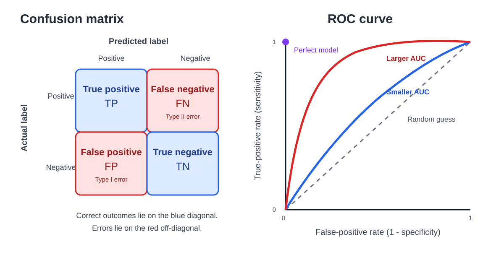

# 6. Classification Evaluation

**Source pages:** 24–25  
**Status:** reconstructed and equation-checked

This chapter evaluates a classifier after it has produced predictions. The source begins with an imbalanced leukemia example to show why accuracy alone can be misleading, organizes prediction outcomes with a confusion matrix, defines accuracy, recall, specificity, precision, and the $F_1$ score, and then evaluates a score-based classifier across all thresholds using the receiver operating characteristic curve and area under the curve.

## 6.1 Why accuracy alone can be misleading

Page 24 considers a leukemia classifier with a highly imbalanced dataset:

- $1\%$ of the patients have leukemia;
- $99\%$ are healthy.

A trivial model that always predicts **healthy** is correct for the $99\%$ majority class. Its accuracy is therefore still:

$$ \mathrm{Accuracy}=0.99. $$

The model nevertheless fails to identify every patient with leukemia.

The example establishes the main motivation for the chapter: a single overall percentage can hide which kinds of mistakes a classifier is making.

> [!TIP]
> **Review intuition**
>
> Accuracy asks how often the classifier is correct overall. In an imbalanced dataset, that number can be dominated by the majority class.

## 6.2 Confusion matrix

For binary classification, each example has an actual label and a predicted label. Page 24 arranges the four possible outcomes as follows:

|  | Predicted positive | Predicted negative |
|---|---:|---:|
| **Actual positive** | True positive ($TP$) | False negative ($FN$) |
| **Actual negative** | False positive ($FP$) | True negative ($TN$) |

The four entries mean:

- **True positive:** the example is positive and the classifier predicts positive.
- **False negative:** the example is positive but the classifier predicts negative.
- **False positive:** the example is negative but the classifier predicts positive.
- **True negative:** the example is negative and the classifier predicts negative.

The source labels a false positive as a **Type I error** and a false negative as a **Type II error**.

*Redrawn from source pages 24–25: the confusion matrix separates the two correct and two incorrect outcomes, while an ROC curve traces true-positive rate against false-positive rate as the classification threshold changes.*

## 6.3 Accuracy

Accuracy is the fraction of all predictions that are correct:

$$ \mathrm{Accuracy}=\frac{TP+TN}{TP+FN+FP+TN}. $$

The numerator counts the true positives and true negatives. The denominator counts every evaluated example.

Accuracy is useful when correct classification of both classes matters and the class distribution does not make the aggregate number misleading. The leukemia example shows why it should not automatically be used as the only evaluation metric.

## 6.4 Recall or sensitivity

Page 24 defines recall, also called sensitivity, as:

$$ \mathrm{Recall}=\mathrm{Sensitivity}=\frac{TP}{TP+FN}. $$

The denominator contains all actual positives. Sensitivity therefore answers:

> Of all examples that were actually positive, what fraction did the classifier identify?

A high-sensitivity classifier has relatively few false negatives.

The source connects this metric to medical screening: when a test has high sensitivity, a negative result is useful for **ruling out** a disease because the test rarely misses people who actually have the disease.

> [!NOTE]
> **Source interpretation**
>
> The page emphasizes the negative result of a highly sensitive test. The key error being controlled is the false negative.

## 6.5 Specificity

Specificity is:

$$ \mathrm{Specificity}=\frac{TN}{FP+TN}. $$

The denominator contains all actual negatives. Specificity therefore answers:

> Of all examples that were actually negative, what fraction did the classifier identify as negative?

A high-specificity classifier has relatively few false positives.

The source connects this metric to confirmation: when a test has high specificity, a positive result is useful for **ruling in** a disease because the test rarely produces positive results for healthy patients.

> [!NOTE]
> **Source interpretation**
>
> The page emphasizes the positive result of a highly specific test. The key error being controlled is the false positive.

## 6.6 Precision

Precision is:

$$ \mathrm{Precision}=\frac{TP}{TP+FP}. $$

The denominator contains all predicted positives. Precision therefore answers:

> Of all examples predicted as positive, what fraction were actually positive?

High precision means that positive predictions are usually correct.

Recall and precision use the same numerator but different denominators:

$$ \mathrm{Recall}=\frac{TP}{\text{all actual positives}}, $$

$$ \mathrm{Precision}=\frac{TP}{\text{all predicted positives}}. $$

## 6.7 Precision and recall examples from the source

### Dog-recognition example

Page 24 gives a dataset containing:

- $10$ cat images;
- $12$ dog images.

The program identifies $8$ images as dogs. Among those predictions:

- $5$ are actually dogs, so $TP=5$;
- $3$ are actually cats, so $FP=3$.

The precision is:

$$ \mathrm{Precision}=\frac{5}{8}. $$

Because there are $12$ actual dog images, the recall is:

$$ \mathrm{Recall}=\frac{5}{12}. $$

The difference is important: precision evaluates the returned dog predictions, while recall evaluates coverage of all actual dogs.

### Search-engine example

The source also considers a search engine that returns $30$ pages. Of these, $20$ are relevant, and the search engine fails to return $40$ additional relevant pages.

Thus:

$$ TP=20, \qquad FP=10, \qquad FN=40. $$

Precision is:

$$ \mathrm{Precision}=\frac{20}{30}. $$

There are $20+40=60$ relevant pages in total, so recall is:

$$ \mathrm{Recall}=\frac{20}{60}. $$

The search engine has a higher fraction of relevant results among the returned pages than it has coverage of all relevant pages.

## 6.8 The $F_1$ score

The source combines precision and recall using their harmonic mean:

$$ F_1=2\frac{\mathrm{Precision}\cdot\mathrm{Recall}}{\mathrm{Precision}+\mathrm{Recall}}. $$

The $F_1$ score is high only when both precision and recall are high. A very small value for either component pulls the harmonic mean downward.

> [!NOTE]
> **Added clarification: why not an ordinary average?**
>
> The harmonic mean penalizes an imbalance between precision and recall more strongly than the arithmetic mean. This is why a model cannot obtain a high $F_1$ score merely by making one of the two metrics high while the other remains poor.

## 6.9 Metrics depend on the positive class

The confusion matrix is defined relative to whichever class has been designated as **positive**. If the positive class changes, the meanings of $TP$, $FN$, $FP$, and $TN$ also change.

In the leukemia example, treating leukemia as positive makes sensitivity directly measure how many leukemia cases are detected. This matches the source's concern about an always-healthy classifier missing every positive patient.

> [!WARNING]
> **Common setup mistake**
>
> Always state which class is positive before reporting precision, recall, sensitivity, specificity, or $F_1$.

## 6.10 From probabilities to thresholded predictions

Chapter 5 showed that logistic regression produces a score or probability such as:

$$ h_\theta(x)=p(y=1\mid x;\theta). $$

A threshold $\tau$ converts that output into a class prediction:

$$ \hat{y}=1 \quad \text{when} \quad h_\theta(x)\geq \tau. $$

Changing $\tau$ changes which examples are called positive. Therefore it also changes the entries in the confusion matrix and the resulting sensitivity and specificity.

This threshold dependence motivates the receiver operating characteristic curve on page 25.

## 6.11 Receiver operating characteristic curve

The receiver operating characteristic, or **ROC**, curve evaluates a model at all possible classification thresholds.

Its vertical axis is the true-positive rate:

$$ \mathrm{TPR}=\mathrm{Sensitivity}=\frac{TP}{TP+FN}. $$

Its horizontal axis is the false-positive rate, labeled on the source as $1-\mathrm{Specificity}$:

$$ \mathrm{FPR}=1-\mathrm{Specificity}. $$

Using the specificity formula:

$$ \mathrm{FPR}=\frac{FP}{FP+TN}. $$

> [!NOTE]
> **Added clarification: one point per threshold**
>
> Each threshold produces one confusion matrix and therefore one pair $(\mathrm{FPR},\mathrm{TPR})$. Sweeping the threshold traces the ROC curve.

## 6.12 Reading the ROC plot

Page 25 identifies several reference regions:

- The upper-left corner represents a **perfect model**: high true-positive rate with zero false-positive rate.
- The diagonal line represents **random guessing**.
- Points or curves above the diagonal are labeled **better**.
- Points below the diagonal are labeled **worse**.

The desired direction is therefore toward:

$$ (\mathrm{FPR},\mathrm{TPR})=(0,1). $$

An ROC curve summarizes the trade-off between detecting positives and incorrectly labeling negatives as positive as the threshold changes.

## 6.13 Area under the ROC curve

The area under the ROC curve is abbreviated **AUC**. The source describes it as the total area under the ROC curve.

Page 25 compares example curves with:

- $\mathrm{AUC}=0.9$;
- $\mathrm{AUC}=0.75$;
- $\mathrm{AUC}=0.5$.

The curve with AUC $0.9$ stays closer to the upper-left region than the curve with AUC $0.75$. The diagonal random-guess line has AUC $0.5$.

A larger AUC indicates better performance across the collection of evaluated thresholds in the source comparison.

## 6.14 Which metric answers which question?

The following review table reorganizes the source definitions without introducing additional metrics.

| Metric | Denominator | Question answered |
|---|---|---|
| Accuracy | all examples | How often is the classifier correct overall? |
| Recall / sensitivity | all actual positives | How many actual positives were found? |
| Specificity | all actual negatives | How many actual negatives were rejected? |
| Precision | all predicted positives | How trustworthy are positive predictions? |
| $F_1$ | precision and recall | How strong are precision and recall together? |
| ROC curve | all thresholds | How do TPR and FPR trade off as the threshold changes? |
| AUC | area under ROC | How strong is the ROC curve across thresholds? |

> [!NOTE]
> **Added review guide**
>
> The source's leukemia example shows that metric selection depends on the error that matters. Accuracy can hide missed positives; sensitivity exposes false negatives, while specificity and precision expose different consequences of false positives.

## 6.15 Common mistakes

1. **Reporting accuracy alone on a highly imbalanced dataset.** The leukemia example achieves $99\%$ accuracy while detecting no positive cases.
2. **Switching the actual and predicted axes of the confusion matrix.** Define the table orientation before reading its cells.
3. **Confusing false positives and false negatives.** A false positive is an actual negative predicted positive; a false negative is an actual positive predicted negative.
4. **Confusing precision and recall.** Precision divides by predicted positives, while recall divides by actual positives.
5. **Confusing sensitivity and specificity.** Sensitivity concerns actual positives; specificity concerns actual negatives.
6. **Forgetting that the positive class must be declared.** The metric meanings depend on the chosen positive class.
7. **Interpreting one threshold as the whole ROC curve.** A single threshold gives one ROC point; the curve comes from evaluating many thresholds.
8. **Putting specificity on the ROC horizontal axis.** The source uses false-positive rate, which is $1-\mathrm{Specificity}$.
9. **Treating AUC as accuracy.** AUC summarizes the ROC curve across thresholds; accuracy is computed from one thresholded confusion matrix.
10. **Assuming $F_1$ includes true negatives.** It is constructed only from precision and recall.

## 6.16 Chapter summary

- Accuracy is the fraction of all predictions that are correct.
- A majority-class classifier can have high accuracy while completely failing on a rare positive class.
- The confusion matrix separates true positives, false negatives, false positives, and true negatives.
- The source identifies false positives as Type I errors and false negatives as Type II errors.
- Recall or sensitivity measures the fraction of actual positives detected.
- Specificity measures the fraction of actual negatives correctly rejected.
- Precision measures the fraction of positive predictions that are correct.
- The $F_1$ score is the harmonic mean of precision and recall.
- Changing a probability threshold changes the confusion matrix and its metrics.
- The ROC curve plots true-positive rate against false-positive rate across thresholds.
- The upper-left ROC region is best, while the diagonal represents random guessing.
- AUC measures the total area under the ROC curve; the source compares AUC values of $0.9$, $0.75$, and $0.5$.

## 6.17 Self-check questions

1. Why can a classifier with $99\%$ accuracy still be useless in the leukemia example?
2. What are the four cells of a binary confusion matrix?
3. Which confusion-matrix cells represent Type I and Type II errors in the source?
4. What is the denominator of accuracy?
5. What is the difference between recall and precision?
6. Why does high sensitivity make a negative result useful for ruling out disease?
7. Why does high specificity make a positive result useful for ruling in disease?
8. In the dog example, why is precision $5/8$ but recall $5/12$?
9. In the search example, how are $TP$, $FP$, and $FN$ obtained?
10. Why is the $F_1$ score low when either precision or recall is low?
11. How does changing a classification threshold affect the confusion matrix?
12. What quantities are plotted on the vertical and horizontal axes of an ROC curve?
13. What do the upper-left corner and diagonal line mean on an ROC plot?
14. What does AUC summarize?
