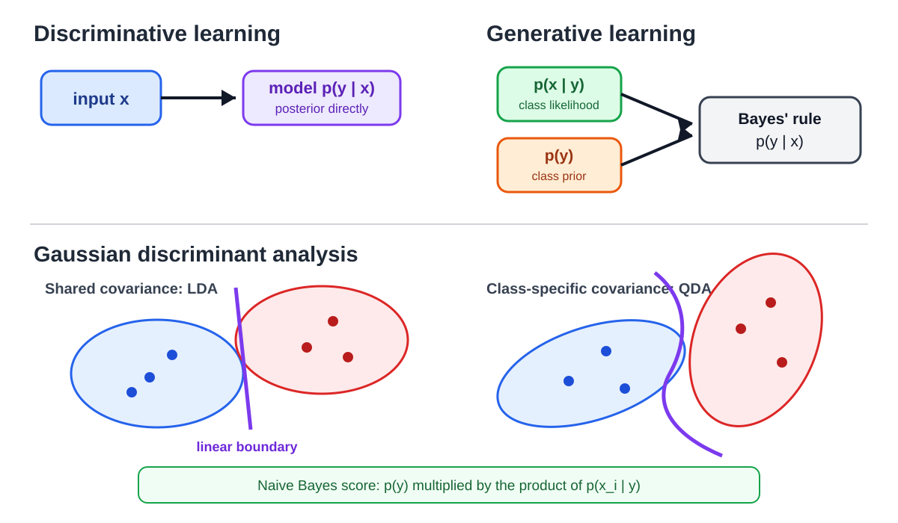

# 7. Generative Classification

Logistic regression models $p(y\mid x)$ directly. A **generative** classifier instead models how each class produces its inputs, $p(x\mid y)$, together with how common each class is, $p(y)$, and then uses Bayes' rule to classify. This chapter covers the two standard examples, Gaussian discriminant analysis and Naive Bayes, and ends with a note on why assumptions (inductive bias) are useful.

## 7.1 Discriminative versus generative

$$ p(y\mid x)=\frac{p(x\mid y)\,p(y)}{p(x)}, \qquad p(x)=\sum_{k}p(x\mid y=k)\,p(y=k). $$

The denominator is the same for every class, so to classify we only need to compare

$$ p(y\mid x)\propto p(x\mid y)\,p(y). $$

*Discriminative models learn the posterior directly. Generative models combine a class prior with a class-conditional input model. Shared Gaussian covariance gives a linear boundary; separate covariances can give a quadratic one.*

> [!TIP]
> **Intuition**
>
> A discriminative model asks "which label fits this input?" A generative model asks "how likely is this input if the class were $k$?" for every $k$, and weighs the answers by how common each class is.

## 7.2 Generative models need distributional assumptions

The prior $p(y)$ is easy: count labels. But $p(x\mid y)$ has to assign a probability to every possible input, so we must pick a form for it. **Gaussian discriminant analysis** (GDA) assumes

1. $y\sim\mathrm{Bernoulli}(\pi)$;
2. $x\mid y=k\sim\mathcal N(\mu_k,\Sigma)$.

## 7.3 The multivariate Gaussian

$$ p(x;\mu,\Sigma)=\frac{1}{(2\pi)^{d/2}\det(\Sigma)^{1/2}}\exp\left(-\frac{1}{2}(x-\mu)^\top\Sigma^{-1}(x-\mu)\right), $$

with mean $\mu=\mathbb E[x]$ and covariance $\Sigma=\mathbb E[(x-\mu)(x-\mu)^\top]$. $\Sigma$ is symmetric; its diagonal holds the per-feature variances and its off-diagonal entries are positive when two features tend to rise together.

## 7.4 The GDA model

$$ p(y)=\pi^y(1-\pi)^{1-y}, \qquad x\mid y=0\sim\mathcal{N}(\mu_0,\Sigma), \qquad x\mid y=1\sim\mathcal{N}(\mu_1,\Sigma). $$

The two classes have different means and **share** one covariance matrix.

## 7.5 Maximum-likelihood estimates

Because $p(x,y)=p(x\mid y)p(y)$, the joint log-likelihood splits into a Gaussian part and a Bernoulli part, and each has a closed-form maximizer that amounts to counting and averaging:

$$ \hat{\pi}=\frac{1}{n}\sum_{i}\mathbb{1}[y^{(i)}=1], \qquad \hat{\mu}_k=\frac{\sum_{i}\mathbb{1}[y^{(i)}=k]\,x^{(i)}}{\sum_{i}\mathbb{1}[y^{(i)}=k]}, \qquad \hat{\Sigma}=\frac{1}{n}\sum_{i}\left(x^{(i)}-\hat{\mu}_{y^{(i)}}\right)\left(x^{(i)}-\hat{\mu}_{y^{(i)}}\right)^\top . $$

That is: the fraction of class-1 examples, the mean of each class, and a pooled covariance in which every point is centered on its own class mean.

## 7.6 Shared covariance gives a linear boundary (LDA)

The log posterior odds are

$$ \log\frac{p(y=1\mid x)}{p(y=0\mid x)}=\log\frac{\pi}{1-\pi}-\frac{1}{2}(x-\mu_1)^\top\Sigma^{-1}(x-\mu_1)+\frac{1}{2}(x-\mu_0)^\top\Sigma^{-1}(x-\mu_0). $$

Expand both quadratics. The $x^\top\Sigma^{-1}x$ terms are identical and cancel because $\Sigma$ is shared, leaving an affine function:

$$ \log\frac{p(y=1\mid x)}{p(y=0\mid x)}=\theta_0+\theta^\top x, \qquad \theta=\Sigma^{-1}(\mu_1-\mu_0). $$

The boundary $\theta_0+\theta^\top x=0$ is a hyperplane. This is **linear discriminant analysis** (LDA).

## 7.7 Separate covariances give a quadratic boundary (QDA)

With $\Sigma_0\ne\Sigma_1$ the quadratic terms $x^\top\Sigma_0^{-1}x-x^\top\Sigma_1^{-1}x$ no longer cancel, so the boundary is a quadric: **quadratic discriminant analysis**.

| Model | Covariance | Boundary | Parameters for covariance |
|---|---|---|---|
| LDA | one shared $\Sigma$ | linear | $d(d+1)/2$ |
| QDA | $\Sigma_0,\Sigma_1$ | quadratic | $2\cdot d(d+1)/2$ |

QDA is more flexible but needs more data to estimate its extra covariance entries. This is the bias–variance trade-off again.

## 7.8 GDA and logistic regression

Rearranging the LDA log-odds gives

$$ p(y=1\mid x)=\frac{1}{1+\exp\left(-\theta_0-\theta^\top x\right)}, $$

which is exactly the logistic-regression form. So:

- **GDA ⇒ logistic posterior.** If the Gaussian assumptions hold, the posterior is logistic.
- **Logistic ⇏ GDA.** Many other class-conditionals (e.g. Poisson with a shared rate structure) also produce a logistic posterior.

> [!NOTE]
> **Beyond the lecture: which one to use**
>
> Because GDA makes stronger assumptions, it is more *data-efficient* when they hold: it reaches its asymptotic error with fewer examples. Logistic regression is more *robust* when they don't. Ng & Jordan (2002) showed that the generative model often wins at small $n$ and the discriminative one at large $n$.

## 7.9 Naive Bayes

For high-dimensional discrete inputs $x=(x_1,\ldots,x_d)$, even writing down $p(x_1,\ldots,x_d\mid y)$ is hopeless. The chain rule

$$ p(x_1,\ldots,x_d\mid y)=p(x_1\mid x_2,\ldots,x_d,y)\,p(x_2\mid x_3,\ldots,x_d,y)\cdots p(x_d\mid y) $$

needs exponentially many parameters.

## 7.10 The naive assumption

Assume the features are **conditionally independent given the class**:

$$ p(x\mid y)=\prod_{j=1}^{d}p(x_j\mid y), \qquad \hat{y}=\mathrm{arg\,max}_{k}\;p(y=k)\prod_{j=1}^{d}p(x_j\mid y=k). $$

> [!WARNING]
> **Conditional, not unconditional, independence**
>
> Naive Bayes doesn't claim features are independent overall. Words like "free" and "winner" are strongly correlated across all email. It claims they're independent *within* each class. The assumption is almost always false, yet the classifier often ranks well, because it only has to get the argmax right, not the probabilities.

## 7.11 Worked example: Play Tennis

| Day | Outlook | Temperature | Humidity | Wind | Play |
|---|---|---|---|---|---|
| D1 | Sunny | Hot | High | Weak | No |
| D2 | Sunny | Hot | High | Strong | No |
| D3 | Overcast | Hot | High | Weak | Yes |
| D4 | Rain | Mild | High | Weak | Yes |
| D5 | Rain | Cool | Normal | Weak | Yes |
| D6 | Rain | Cool | Normal | Strong | No |
| D7 | Overcast | Cool | Normal | Strong | Yes |
| D8 | Sunny | Mild | High | Weak | No |
| D9 | Sunny | Cool | Normal | Weak | Yes |
| D10 | Rain | Mild | Normal | Weak | Yes |
| D11 | Sunny | Mild | Normal | Strong | Yes |
| D12 | Overcast | Mild | High | Strong | Yes |
| D13 | Overcast | Hot | Normal | Weak | Yes |
| D14 | Rain | Mild | High | Strong | No |

Priors: $p(\text{Yes})=9/14$, $p(\text{No})=5/14$. Conditional frequencies:

| Value | $p(\cdot\mid\text{Yes})$ | $p(\cdot\mid\text{No})$ |
|---|---:|---:|
| Outlook = Sunny / Overcast / Rain | 2/9, 4/9, 3/9 | 3/5, 0/5, 2/5 |
| Temp = Hot / Mild / Cool | 2/9, 4/9, 3/9 | 2/5, 2/5, 1/5 |
| Humidity = High / Normal | 3/9, 6/9 | 4/5, 1/5 |
| Wind = Strong / Weak | 3/9, 6/9 | 3/5, 2/5 |

Query: Sunny, Cool, High, Strong.

$$ s_{\text{Yes}}=\tfrac{9}{14}\cdot\tfrac{2}{9}\cdot\tfrac{3}{9}\cdot\tfrac{3}{9}\cdot\tfrac{3}{9}\approx0.0053, \qquad s_{\text{No}}=\tfrac{5}{14}\cdot\tfrac{3}{5}\cdot\tfrac{1}{5}\cdot\tfrac{4}{5}\cdot\tfrac{3}{5}\approx0.0206 . $$

Predict **No**. Normalized, $p(\text{No}\mid x)=0.0206/(0.0206+0.0053)\approx0.80$.

### The zero-count problem and Laplace smoothing

$p(\text{Overcast}\mid\text{No})=0/5$, so *any* overcast day gets $s_{\text{No}}=0$ no matter what the other features say. One unseen combination vetoes all the evidence. The standard fix is **Laplace (add-one) smoothing**:

$$ \hat p(x_j=v\mid y=k)=\frac{\text{count}(x_j=v,\,y=k)+1}{\text{count}(y=k)+V_j}, $$

where $V_j$ is the number of values feature $j$ can take. For Outlook ($V=3$): $p(\text{Overcast}\mid\text{No})=(0+1)/(5+3)=1/8$. This is the MAP estimate under a uniform Dirichlet prior, the same "regularization = prior" idea from Chapter 3.

## 7.12 Worked example: spam filtering

Represent an email as a binary vector $x\in\lbrace0,1\rbrace^{50000}$ over a vocabulary, with $x_j=1$ if word $j$ appears. Estimate

$$ \hat{p}(\text{spam})=\frac{\#\text{spam}}{n}, \qquad \phi_{j\mid k}=\hat{p}(x_j=1\mid y=k)=\frac{\#\{\text{class-}k\text{ emails containing word }j\}+1}{\#\{\text{class-}k\text{ emails}\}+2}. $$

For binary features each factor is Bernoulli, so absent words count too:

$$ p(x\mid y=k)=\prod_{j}\phi_{j\mid k}^{\,x_j}\left(1-\phi_{j\mid k}\right)^{1-x_j}. $$

> [!WARNING]
> **Work in log space**
>
> A product of 50,000 probabilities underflows to 0.0 in floating point. Compare $\log p(y=k)+\sum_j\left[x_j\log\phi_{j\mid k}+(1-x_j)\log(1-\phi_{j\mid k})\right]$ instead. The argmax is the same.

## 7.13 Assumptions as inductive bias

Compare two ways to fit a periodic signal from a few samples:

$$ h_\theta(z)=\theta_0+\theta_1z+\cdots+\theta_{100}z^{100} \qquad\text{versus}\qquad h_\theta(t)=\theta_1\sin(\theta_2t+\theta_3). $$

The polynomial can fit almost anything, so many very different curves match the data equally well. The sinusoid encodes domain knowledge. It has three parameters, is easy to interpret, and trains from little data, but it is badly wrong if the signal isn't periodic. That is the trade-off of every assumption in this chapter: Gaussian classes, shared covariance, conditional independence. A good assumption is worth a lot of data; a bad one adds bias that no amount of data removes.

## 7.14 Common mistakes

1. **Confusing $p(y\mid x)$ with $p(x\mid y)$.**
2. **Forgetting the prior $p(y)$.**
3. **Mixing up LDA and QDA covariance structures.**
4. **Thinking shared-covariance GDA has a quadratic boundary.** The quadratic terms cancel.
5. **Assuming logistic regression needs Gaussian features.**
6. **Reading Naive Bayes as unconditional independence.**
7. **Leaving zero counts unsmoothed.**
8. **Multiplying thousands of probabilities** instead of summing logs.
9. **Treating unnormalized scores as probabilities.**

## 7.15 Summary

- Generative classifiers model $p(x\mid y)$ and $p(y)$ and apply Bayes' rule.
- GDA's MLEs are class frequencies, class means and a pooled covariance.
- Shared covariance gives LDA (linear boundary); separate covariances give QDA (quadratic).
- LDA's posterior is logistic, but not conversely.
- Naive Bayes assumes conditional independence; it needs smoothing and log-space arithmetic in practice.
- Assumptions are inductive bias: they save data when right and add bias when wrong.

## 7.16 Self-check

1. Why can $p(x)$ be dropped when classifying?
2. Why is the GDA covariance estimate centered on each point's own class mean?
3. Show why shared covariance gives a linear boundary.
4. What exactly does Naive Bayes assume?
5. What goes wrong with $p(\text{Overcast}\mid\text{No})=0$, and how does smoothing fix it?
6. When would you prefer GDA over logistic regression?

Answers

1. It is the same for every class, so it doesn't affect the argmax.
2. The model says each class has its own mean; the shared part is the spread around those means.
3. Expanding the two quadratic forms gives identical $x^\top\Sigma^{-1}x$ terms, which cancel.
4. Features are independent given the class.
5. Any Overcast query gets zero probability for No regardless of other features; add-one smoothing makes it $1/8$.
6. With little data, when the classes really are roughly Gaussian with similar covariance.

