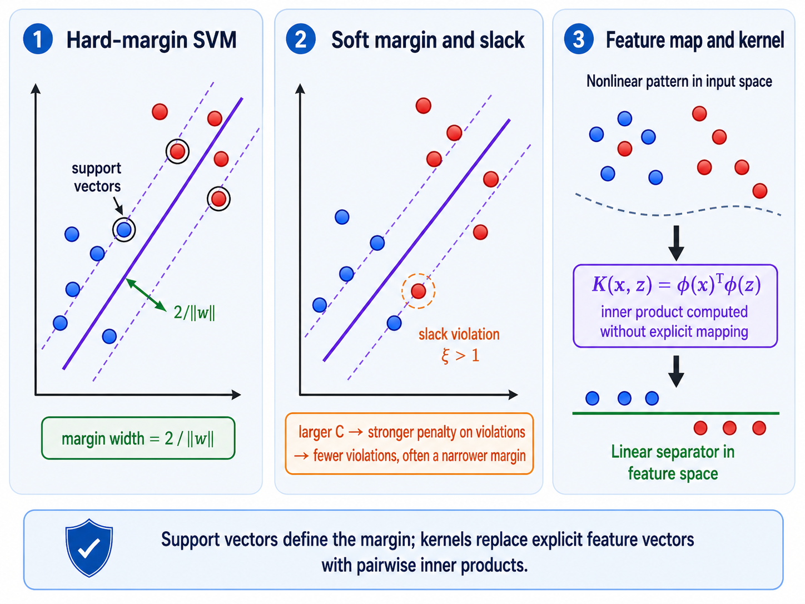

# 8. Support Vector Machines and Kernels

**Source pages:** 31–39  
**Status:** reconstructed and equation-checked

This chapter develops support vector machines from the idea of choosing a separating hyperplane with a large margin. It then introduces slack variables for nonseparable or outlier-sensitive data, feature maps for nonlinear boundaries, and the kernel trick for computing feature-space inner products without explicitly constructing every transformed feature.

## 8.1 From logistic regression to margin-based classification

The source begins by returning to binary logistic regression:

$$ h_\theta(x)=\frac{1}{1+e^{-\theta^\top x}}. $$

With a threshold of $0.5$, the prediction depends on the sign of the linear score:

$$ \theta^\top x\geq 0 \Longrightarrow \hat{y}=1, $$

$$ \theta^\top x<0 \Longrightarrow \hat{y}=0. $$

Logistic regression models a class probability. The handwritten note on page 31 emphasizes a different objective for SVMs: when classification is the goal, it may be enough to learn a good separating region rather than model the complete class distributions.

For SVM notation, the source changes the labels from $\lbrace 0,1\rbrace$ to:

$$ y^{(i)}\in\lbrace -1,+1\rbrace. $$

The classifier is written as:

$$ h_{w,b}(x)=g\left(w^\top x+b\right). $$

> [!NOTE]
> **Added clarification: the decision function**
>
> The source leaves $g$ abstract. For the binary SVM decision rule, it can be read as a sign function:
>
> $$ g(z)=\mathrm{sign}(z). $$

The decision boundary is the hyperplane:

$$ w^\top x+b=0. $$

## 8.2 Why maximize a separation margin?

A linearly separable dataset can admit many separating lines or hyperplanes. The SVM preference shown on page 31 is the separator that leaves the largest buffer between the two classes.

*Redrawn from source pages 31–39: hard-margin separation, soft-margin slack, and nonlinear classification through a feature map and kernel inner products.*

The central intuition is:

- the middle hyperplane is the decision boundary;
- two parallel hyperplanes mark the closest permitted class locations;
- the closest training examples are the **support vectors**;
- maximizing the distance between the two margin boundaries makes the separator less dependent on small movements of non-support-vector points.

## 8.3 Functional margin

For a training example $\left(x^{(i)},y^{(i)}\right)$, the source defines the functional margin as:

$$ \delta_{\mathrm{func}}^{(i)}=y^{(i)}\left(w^\top x^{(i)}+b\right). $$

This combines both class cases:

- if $y^{(i)}=+1$, a large positive score is desirable;
- if $y^{(i)}=-1$, a large negative score is desirable;
- in both cases, a correctly classified point has positive functional margin.

The functional margin of the complete training set is the smallest example-level margin:

$$ \delta_{\mathrm{func}}=\min_{i\in\lbrace 1,\ldots,n_{\mathrm{train}}\rbrace}\delta_{\mathrm{func}}^{(i)}. $$

The optimization idea written in the margin note on page 32 is therefore:

$$ \max_{w,b}\min_i\delta_{\mathrm{func}}^{(i)}. $$

The examples attaining the minimum are the points closest to the decision boundary and become the support vectors after normalization.

## 8.4 Scale ambiguity of the functional margin

The decision boundary does not change if $w$ and $b$ are multiplied by the same positive constant $c$:

$$ w^\top x+b=0 \Longleftrightarrow (cw)^\top x+cb=0. $$

However, the functional margin is multiplied by $c$:

$$ y^{(i)}\left((cw)^\top x^{(i)}+cb\right)=c\,y^{(i)}\left(w^\top x^{(i)}+b\right). $$

Therefore the functional margin can be made arbitrarily large without changing the geometric boundary. This is why page 32 introduces normalization by $\lVert w\rVert_2$.

> [!TIP]
> **Review intuition**
>
> Functional margin measures signed score, not physical distance. Dividing by $\lVert w\rVert_2$ removes the arbitrary scaling of the parameter vector.

## 8.5 Geometric margin

The signed Euclidean distance from a point $x^{(i)}$ to the hyperplane is:

$$ \frac{w^\top x^{(i)}+b}{\lVert w\rVert_2}. $$

Including the class label gives the geometric margin:

$$ \delta_{\mathrm{geo}}^{(i)}=\frac{y^{(i)}\left(w^\top x^{(i)}+b\right)}{\lVert w\rVert_2}. $$

For a correctly classified example, this quantity is positive. Unlike the functional margin, it is unchanged by positive rescaling of $w$ and $b$.

### Projection argument from page 33

Let $x_0^{(i)}$ be the orthogonal projection of $x^{(i)}$ onto the decision hyperplane. Then:

$$ w^\top x_0^{(i)}+b=0. $$

The unit vector normal to the hyperplane is:

$$ \hat{w}=\frac{w}{\lVert w\rVert_2}. $$

The handwritten derivation represents the projected point as:

$$ x_0^{(i)}=x^{(i)}-y^{(i)}\delta_{\mathrm{geo}}^{(i)}\hat{w}. $$

Substituting this expression into the hyperplane equation gives:

$$ w^\top\left(x^{(i)}-y^{(i)}\delta_{\mathrm{geo}}^{(i)}\frac{w}{\lVert w\rVert_2}\right)+b=0. $$

Because $w^\top w=\lVert w\rVert_2^2$, the result is:

$$ \delta_{\mathrm{geo}}^{(i)}=\frac{y^{(i)}\left(w^\top x^{(i)}+b\right)}{\lVert w\rVert_2}. $$

The geometric-margin optimization problem on page 33 is:

$$ \max_{w,b,\delta}\ \delta \qquad \text{subject to}\qquad \frac{y^{(i)}\left(w^\top x^{(i)}+b\right)}{\lVert w\rVert_2}\geq\delta\quad\text{for every }i. $$

## 8.6 Hard-margin SVM

Page 34 chooses a normalization in which the closest positive and negative examples satisfy:

$$ w^\top x^{(i)}+b=1 \qquad \text{for a positive support vector}, $$

$$ w^\top x^{(i)}+b=-1 \qquad \text{for a negative support vector}. $$

The two margin boundaries are therefore:

$$ w^\top x+b=1, $$

$$ w^\top x+b=-1. $$

Each boundary is $1/\lVert w\rVert_2$ from the central decision hyperplane, so the full margin width is:

$$ \frac{2}{\lVert w\rVert_2}. $$

Maximizing this width is equivalent to minimizing $\lVert w\rVert_2$ under the normalized classification constraints:

$$ \min_{w,b}\ \lVert w\rVert_2 \qquad \text{subject to}\qquad y^{(i)}\left(w^\top x^{(i)}+b\right)\geq 1\quad\text{for every }i. $$

> [!NOTE]
> **Added clarification: equivalent conventional objective**
>
> Squaring the nonnegative norm and multiplying it by a positive constant do not change the minimizer. The same hard-margin problem is often written as:
>
> $$ \min_{w,b}\ \frac{1}{2}\lVert w\rVert_2^2 \qquad \text{subject to}\qquad y^{(i)}\left(w^\top x^{(i)}+b\right)\geq 1. $$

A support vector lies on a margin boundary and satisfies equality:

$$ y^{(i)}\left(w^\top x^{(i)}+b\right)=1. $$

Points farther from the boundary satisfy a strict inequality and do not directly determine the maximum-margin hyperplane.

## 8.7 Outlier sensitivity of a hard margin

The lower sketches on page 34 show that a strict maximum-margin separator can be sensitive to an outlier. A single point near or inside the opposite class can rotate or shift the hyperplane substantially.

Page 35 therefore states a practical tradeoff:

> There is a tradeoff between the margin and the number of mistakes on the training data.

A narrow separator may classify every training point correctly, while a wider separator may tolerate one or more violations and potentially give a more stable boundary.

## 8.8 Slack variables

To permit margin violations, the source introduces one slack variable per training example:

$$ \xi_i\geq 0. $$

The hard-margin constraint becomes:

$$ y^{(i)}\left(w^\top x^{(i)}+b\right)\geq 1-\xi_i. $$

The source diagram supports the following interpretation:

| Slack value | Position and classification |
|---:|---|
| $\xi_i=0$ | correctly classified and on or outside the margin boundary |
| $0<\xi_i<1$ | correctly classified but inside the margin |
| $\xi_i=1$ | on the decision hyperplane |
| $\xi_i>1$ | misclassified |

The slack variable measures how far the normalized margin requirement is violated.

## 8.9 Soft-margin SVM

The soft-margin objective shown on page 35 is:

$$ \min_{w,b,\xi}\ \lVert w\rVert_2^2+C\sum_{i=1}^{n_{\mathrm{train}}}\xi_i \qquad \text{subject to}\qquad y^{(i)}\left(w^\top x^{(i)}+b\right)\geq 1-\xi_i,\quad \xi_i\geq 0. $$

The two objective terms have different roles:

- $\lVert w\rVert_2^2$ favors a wider margin;
- $\sum_i\xi_i$ penalizes margin violations and misclassifications;
- $C$ controls the tradeoff.

Page 36 compares boundaries obtained with different values of $C$.

> [!NOTE]
> **Added clarification: interpreting $C$**
>
> A larger $C$ places more weight on violations, pushing the model toward fitting the training points more strictly. A smaller $C$ tolerates more violations in exchange for a wider margin. The best value is a model-selection choice rather than a fixed property of SVMs.

| Model | Training constraints | Typical sensitivity described in the source |
|---|---|---|
| Hard-margin SVM | no violations allowed | sensitive to outliers and requires separability |
| Soft-margin SVM | violations allowed through $\xi_i$ | trades margin width against violations |

## 8.10 Nonlinear data and feature maps

A linear boundary in the original input space cannot separate every dataset. The kernel-method section begins by introducing a feature map:

$$ \phi:x\mapsto\phi(x). $$

For a scalar attribute $x$, page 36 gives the polynomial feature map:

$$ \phi(x)=\left[1,x,x^2,x^3\right]^\top. $$

A cubic polynomial can then be written as a linear model in transformed features:

$$ \theta_0+\theta_1x+\theta_2x^2+\theta_3x^3=\theta^\top\phi(x). $$

The resulting function is nonlinear in the original attribute $x$ but linear in the feature vector $\phi(x)$.

> [!NOTE]
> **Connection to the earlier linear-regression chapter**
>
> The word “linear” refers to a linear combination of features. The features themselves may be nonlinear functions of the original input.

An SVM can therefore use the feature-space decision boundary:

$$ w^\top\phi(x)+b=0. $$

## 8.11 Why feature-space computation can be expensive

Page 37 considers a very high-dimensional transformed representation:

$$ \phi(x)\in\mathbb{R}^{10000}. $$

Explicitly constructing and repeatedly multiplying such feature vectors can be expensive. The source uses a gradient-descent example to show that the learned parameter vector remains a linear combination of transformed training examples.

The displayed transformed-feature update is:

$$ \theta^{(k+1)}\leftarrow\theta^{(k)}+\eta\sum_{i=1}^{n_{\mathrm{train}}}\left(y^{(i)}-\left(\theta^{(k)}\right)^\top\phi\left(x^{(i)}\right)\right)\phi\left(x^{(i)}\right). $$

Suppose after some iterations:

$$ \theta^{(k)}=\sum_{j=1}^{n_{\mathrm{train}}}c_j\phi\left(x^{(j)}\right). $$

Substitution into the next update gives another expansion in the same transformed training vectors:

$$ \theta^{(k+1)}=\sum_{i=1}^{n_{\mathrm{train}}}c_i^{\mathrm{new}}\phi\left(x^{(i)}\right). $$

The coefficient update shown at the bottom of page 37 is:

$$ c_i^{\mathrm{new}}=c_i+\eta\left(y^{(i)}-\sum_{j=1}^{n_{\mathrm{train}}}c_j\phi\left(x^{(j)}\right)^\top\phi\left(x^{(i)}\right)\right). $$

The only feature-space operation needed in this expression is an inner product:

$$ \phi\left(x^{(j)}\right)^\top\phi\left(x^{(i)}\right). $$

> [!WARNING]
> **Source scope of the gradient-descent derivation**
>
> Page 37 uses a squared-error gradient-descent update to demonstrate how feature-space parameters can be represented through training examples. It is not presented as the soft-margin SVM optimization algorithm itself.

## 8.12 The kernel trick

A kernel evaluates the feature-space inner product directly:

$$ K\left(x^{(i)},x^{(j)}\right)=\phi\left(x^{(i)}\right)^\top\phi\left(x^{(j)}\right). $$

This gives two computational advantages emphasized on page 38:

- pairwise kernel values can be precomputed;
- the feature map does not have to be evaluated explicitly when a cheap kernel formula is available.

For a training set, the pairwise values form a Gram matrix:

$$ \mathbf{K}_{ij}=K\left(x^{(i)},x^{(j)}\right). $$

Using a kernel, the coefficient update from the previous section becomes:

$$ c_i^{\mathrm{new}}=c_i+\eta\left(y^{(i)}-\sum_{j=1}^{n_{\mathrm{train}}}c_jK\left(x^{(j)},x^{(i)}\right)\right). $$

A prediction can likewise be expressed using similarities to training examples:

$$ \theta^\top\phi(x)=\sum_{i=1}^{n_{\mathrm{train}}}c_iK\left(x^{(i)},x\right). $$

## 8.13 Polynomial kernels

Page 38 builds an explicit monomial representation and shows how its inner product can be reduced to powers of the original-space inner product.

A degree-two homogeneous polynomial kernel is:

$$ K(x,y)=\left(x^\top y\right)^2. $$

For a three-dimensional input, the page uses the ordered-product feature vector:

$$ \phi(x)=\left[x_1x_1,x_1x_2,x_1x_3,x_2x_1,x_2x_2,x_2x_3,x_3x_1,x_3x_2,x_3x_3\right]^\top. $$

Then:

$$ \phi(x)^\top\phi(y)=\left(x^\top y\right)^2. $$

The second example is the inhomogeneous degree-two kernel:

$$ K(x,y)=\left(x^\top y+c\right)^2. $$

Let the quadratic ordered-product block be:

$$ q(x)=\left[x_1x_1,x_1x_2,x_1x_3,x_2x_1,x_2x_2,x_2x_3,x_3x_1,x_3x_2,x_3x_3\right]^\top. $$

One explicit feature map consistent with the page is:

$$ \phi(x)=\left[q(x)^\top,\sqrt{2c}\,x_1,\sqrt{2c}\,x_2,\sqrt{2c}\,x_3,c\right]^\top. $$

Its inner product expands as:

$$ \phi(x)^\top\phi(y)=\left(x^\top y\right)^2+2c\,x^\top y+c^2=\left(x^\top y+c\right)^2. $$

The monomial sketch on the same page extends the idea through degree three:

$$ 1+\sum_i x_iy_i+\left(\sum_i x_iy_i\right)^2+\left(\sum_i x_iy_i\right)^3. $$

> [!NOTE]
> **Interpretation of repeated monomials**
>
> The source's ordered feature lists include repeated cross terms such as $x_1x_2$ and $x_2x_1$. Those repetitions supply the multiplicities that appear when powers of $x^\top y$ are expanded.

## 8.14 Gaussian kernel as similarity

Page 39 presents the Gaussian kernel:

$$ K(x,y)=\exp\left(-\frac{\lVert x-y\rVert_2^2}{2\sigma^2}\right). $$

Its value depends on Euclidean distance:

- if $x$ and $y$ are close, $K(x,y)$ is near $1$;
- if they are far apart, $K(x,y)$ approaches $0$.

This gives the kernel a direct similarity interpretation.

The handwritten one-dimensional expansion begins with:

$$ K(x,y)=\exp\left(-\frac{x^2}{2\sigma^2}\right)\exp\left(-\frac{y^2}{2\sigma^2}\right)\exp\left(\frac{xy}{\sigma^2}\right). $$

Using the Taylor series:

$$ e^z=1+z+\frac{z^2}{2!}+\frac{z^3}{3!}+\cdots, $$

we obtain:

$$ \exp\left(\frac{xy}{\sigma^2}\right)=\sum_{m=0}^{\infty}\frac{x^my^m}{\sigma^{2m}m!}. $$

> [!NOTE]
> **Added clarification: exact infinite-dimensional feature interpretation**
>
> The handwritten note represents the Gaussian kernel conceptually using features such as $1,x,x^2,\ldots$. An exact one-dimensional feature coordinate is:
>
> $$ \phi_m(x)=\exp\left(-\frac{x^2}{2\sigma^2}\right)\frac{x^m}{\sigma^m\sqrt{m!}}. $$
>
> Therefore:
>
> $$ K(x,y)=\sum_{m=0}^{\infty}\phi_m(x)\phi_m(y). $$
>
> The scaling and exponential envelope are required for exact equality; the source sketch is illustrating the infinite-feature idea rather than listing every factor.

## 8.15 Conditions for a valid kernel

The source lists two conditions:

1. symmetry;
2. positive semidefiniteness.

Symmetry means:

$$ K(x,y)=K(y,x). $$

> [!NOTE]
> **Added clarification: positive-semidefinite Gram matrix**
>
> For any finite inputs $x^{(1)},\ldots,x^{(n)}$, construct the Gram matrix $\mathbf{K}$ with entries $\mathbf{K}_{ij}=K\left(x^{(i)},x^{(j)}\right)$. Positive semidefiniteness means:
>
> $$ a^\top\mathbf{K}a\geq 0 \qquad \text{for every }a\in\mathbb{R}^n. $$

These conditions ensure that the kernel behaves like an inner product in some feature space.

## 8.16 Common mistakes

1. **Using labels $0$ and $1$ inside the SVM margin formula.** The source changes SVM labels to $-1$ and $+1$ so one product represents both classes.
2. **Treating functional margin as geometric distance.** Functional margin changes when $w$ and $b$ are rescaled; geometric margin does not.
3. **Maximizing functional margin without a normalization.** The value can be increased arbitrarily by multiplying both $w$ and $b$ by a positive constant.
4. **Forgetting the norm in point-to-hyperplane distance.** The geometric margin divides by $\lVert w\rVert_2$.
5. **Confusing one-sided margin with full margin width.** Under the source normalization, the distance from the decision plane to either boundary is $1/\lVert w\rVert_2$, while the total width is $2/\lVert w\rVert_2$.
6. **Assuming every training point determines the boundary.** The closest points, or support vectors, determine the maximum-margin separator.
7. **Assuming hard-margin SVM is robust to an outlier.** The source explicitly illustrates its outlier sensitivity.
8. **Interpreting every positive slack value as a misclassification.** A point with $0<\xi_i<1$ remains correctly classified but violates the margin.
9. **Interpreting $C$ as the margin itself.** $C$ is the weight assigned to violations in the optimization objective.
10. **Thinking nonlinear features make the model nonlinear in its parameters.** The model remains linear in $\phi(x)$.
11. **Constructing an enormous feature vector when only its inner products are needed.** A kernel may compute those inner products directly.
12. **Assuming any similarity function is a valid kernel.** The source requires symmetry and positive semidefiniteness.
13. **Reading page 37 as an SVM training derivation.** It is a general gradient-descent illustration of the kernel representation.
14. **Dropping multiplicity or scaling factors from an explicit polynomial feature map.** The kernel identity must reproduce every term in the polynomial expansion.
15. **Treating the handwritten Gaussian feature list as an exact unscaled map.** The exact expansion also contains factorial, bandwidth, and exponential-envelope factors.

## 8.17 Chapter summary

- SVMs classify according to the sign of $w^\top x+b$ and use labels in $\lbrace -1,+1\rbrace$.
- The functional margin is $y^{(i)}\left(w^\top x^{(i)}+b\right)$.
- Functional margin has a scale ambiguity because multiplying $w$ and $b$ leaves the boundary unchanged.
- Dividing by $\lVert w\rVert_2$ produces the geometric margin, which equals signed Euclidean distance.
- Under canonical normalization, the two support hyperplanes are $w^\top x+b=1$ and $w^\top x+b=-1$.
- Their total separation is $2/\lVert w\rVert_2$.
- Hard-margin SVM minimizes the parameter norm while requiring every normalized margin to be at least $1$.
- Support vectors satisfy the margin constraint with equality.
- Hard margins are sensitive to outliers and require separable data.
- Soft-margin SVM introduces nonnegative slack variables and trades margin width against violations through $C$.
- A feature map can make nonlinear patterns linearly separable in a transformed space.
- High-dimensional feature-space algorithms can often be expressed using only pairwise inner products.
- A kernel computes $\phi(x)^\top\phi(y)$ without explicitly constructing $\phi(x)$.
- Polynomial kernels correspond to finite monomial feature spaces.
- The Gaussian kernel measures similarity and has an infinite-dimensional feature interpretation.
- A valid kernel is symmetric and positive semidefinite.

## 8.18 Self-check questions

1. Why does logistic regression use a probability model while the SVM discussion focuses on a decision margin?
2. Why are SVM labels represented as $-1$ and $+1$?
3. What is the functional margin of one training example?
4. Why can functional margin not be maximized without normalization?
5. What is the geometric margin formula?
6. How does the projection derivation connect point-to-plane distance to $w^\top x+b$?
7. What normalization is imposed on the closest positive and negative examples?
8. Why is the full margin width $2/\lVert w\rVert_2$?
9. What optimization problem defines the hard-margin SVM in the source?
10. What condition identifies a support vector?
11. Why can one outlier cause a hard-margin separator to change substantially?
12. What does $\xi_i=0$ mean?
13. How do $0<\xi_i<1$, $\xi_i=1$, and $\xi_i>1$ differ?
14. What are the two competing terms in the soft-margin objective?
15. How does changing $C$ change the margin-versus-violation tradeoff?
16. How can a model be nonlinear in $x$ but linear in $\phi(x)$?
17. Why does page 37 express $\theta$ as a sum of transformed training examples?
18. What operation remains after substituting that representation into the update?
19. What is the definition of a kernel?
20. How does $\left(x^\top y\right)^2$ correspond to pairwise monomial features?
21. Why do the source's ordered polynomial feature vectors include repeated cross terms?
22. How should the Gaussian kernel be interpreted as a similarity measure?
23. What does the Taylor expansion reveal about the Gaussian kernel's feature space?
24. What two validity conditions for kernels are listed by the source?
