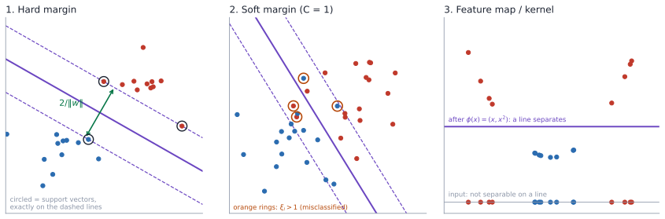

# 8. Support Vector Machines and Kernels

Support vector machines choose, among all separating hyperplanes, the one with the widest buffer between the classes. This chapter builds the idea from margins, relaxes it with slack variables for data that isn't separable, and then shows how kernels let a linear method draw nonlinear boundaries without ever computing the high-dimensional features. The duality and generalization theory behind SVMs is developed further in [Statistical Learning Theory, Chapters 2–5 and 7](../../statistical-learning-theory/docs/study_guide.md).

## 8.1 From probabilities to margins

Logistic regression predicts class 1 when $\theta^\top x\ge0$, and it models the full probability $p(y\mid x)$ to get there. If all we need is the decision, we can instead aim directly for a boundary that separates the classes *confidently*.

For SVMs we switch to labels $y^{(i)}\in\lbrace-1,+1\rbrace$ and write the classifier as

$$ h_{w,b}(x)=\mathrm{sign}\left(w^\top x+b\right), $$

with decision boundary $w^\top x+b=0$.

## 8.2 Why maximize the margin?

Separable data admits infinitely many separating hyperplanes. The SVM picks the one that leaves the widest gap. Two parallel hyperplanes mark the edge of the gap on each side, the training points lying on those edges are the **support vectors**, and every other point could move a little without changing the solution.

*Left: hard margin, with support vectors on the dashed margin lines and margin width $2/\lVert w\rVert$. Middle: soft margin, where slack lets points violate the margin. Right: points that are not linearly separable in 1-D become separable after the feature map $x\mapsto(x,x^2)$.*

## 8.3 Functional margin

$$ \delta_{\mathrm{func}}^{(i)}=y^{(i)}\left(w^\top x^{(i)}+b\right). $$

Using $\pm1$ labels folds both cases into one expression: the margin is positive exactly when example $i$ is classified correctly, and larger means more confident. The margin of the whole training set is the worst case, $\delta_{\mathrm{func}}=\min_i\delta_{\mathrm{func}}^{(i)}$, and the goal is $\max_{w,b}\min_i\delta_{\mathrm{func}}^{(i)}$.

## 8.4 The scaling problem

Multiplying $w$ and $b$ by $c>0$ doesn't move the boundary but multiplies every functional margin by $c$. So the functional margin can be made as large as we like without changing anything. It measures a score, not a distance, and we need to normalize.

## 8.5 Geometric margin

The signed Euclidean distance from $x^{(i)}$ to the hyperplane is

$$ \delta_{\mathrm{geo}}^{(i)}=\frac{y^{(i)}\left(w^\top x^{(i)}+b\right)}{\lVert w\rVert_2}, $$

which is invariant to rescaling.

**Derivation.** Let $x_0$ be the orthogonal projection of $x^{(i)}$ onto the hyperplane, so $w^\top x_0+b=0$. Moving from $x^{(i)}$ toward the plane along the unit normal $\hat w=w/\lVert w\rVert$ by the distance $\delta$ gives $x_0=x^{(i)}-y^{(i)}\delta\,\hat w$. Substituting,

$$ w^\top\left(x^{(i)}-y^{(i)}\delta\frac{w}{\lVert w\rVert}\right)+b=0 \;\;\Longrightarrow\;\; \delta=\frac{y^{(i)}\left(w^\top x^{(i)}+b\right)}{\lVert w\rVert}, $$

using $w^\top w=\lVert w\rVert^2$ and $(y^{(i)})^2=1$. The max-margin problem is then

$$ \max_{w,b,\delta}\;\delta \quad\text{s.t.}\quad \frac{y^{(i)}\left(w^\top x^{(i)}+b\right)}{\lVert w\rVert}\geq\delta \;\;\forall i. $$

## 8.6 Hard-margin SVM

Use the scaling freedom to fix the functional margin of the closest points to 1. The margin boundaries become $w^\top x+b=\pm1$, each at distance $1/\lVert w\rVert$ from the decision boundary, so the full width is $2/\lVert w\rVert$. Maximizing the width is minimizing $\lVert w\rVert$, and we square it for a smooth convex objective:

$$ \min_{w,b}\;\frac{1}{2}\lVert w\rVert^2 \quad\text{s.t.}\quad y^{(i)}\left(w^\top x^{(i)}+b\right)\geq 1 \;\;\forall i. $$

This is a convex quadratic program. Support vectors are the points where the constraint holds with equality, $y^{(i)}(w^\top x^{(i)}+b)=1$; the rest don't affect the solution.

## 8.7 One outlier can wreck a hard margin

Hard margin requires perfect separation. A single mislabeled point close to the other class can rotate the boundary sharply or make the problem infeasible. There's a trade-off between a wide margin and making zero training mistakes.

## 8.8 Slack variables

Give each example a slack $\xi_i\ge0$ and relax its constraint:

$$ y^{(i)}\left(w^\top x^{(i)}+b\right)\geq 1-\xi_i . $$

| $\xi_i$ | Where the point is |
|---:|---|
| $0$ | on or outside its margin (correct, confident) |
| $(0,1)$ | inside the margin but on the correct side |
| $1$ | exactly on the decision boundary |
| $>1$ | on the wrong side (misclassified) |

Since every misclassified point has $\xi_i>1$, $\sum_i\xi_i$ is an upper bound on the number of training errors.

## 8.9 Soft-margin SVM

$$ \min_{w,b,\xi}\;\frac12\lVert w\rVert^2+C\sum_{i=1}^{n}\xi_i \quad\text{s.t.}\quad y^{(i)}\left(w^\top x^{(i)}+b\right)\geq 1-\xi_i,\;\;\xi_i\geq 0 . $$

The first term wants a wide margin; the second penalizes violations; $C$ sets the exchange rate. **Large $C$** punishes violations heavily, giving a narrow margin that fits the training data closely (lower bias, higher variance). **Small $C$** tolerates violations for a wider, smoother boundary. Choose $C$ by cross-validation.

| | Hard margin | Soft margin |
|---|---|---|
| Violations | none allowed | allowed, penalized by $C$ |
| Needs separable data | yes | no |
| Outlier sensitivity | high | controlled by $C$ |

> [!NOTE]
> **Beyond the lecture: soft-margin SVM = hinge loss + L2**
>
> At the optimum each slack is as small as its constraint allows, $\xi_i=\max\{0,\,1-y^{(i)}(w^\top x^{(i)}+b)\}$. Substituting removes the constraints:
>
> $$ \min_{w,b}\;\frac12\lVert w\rVert^2+C\sum_i\max\left\{0,\,1-y^{(i)}(w^\top x^{(i)}+b)\right\}. $$
>
> So an SVM is a linear model trained with the **hinge loss** and L2 regularization, the same template as ridge-regularized logistic regression but with a different loss. Hinge loss is exactly zero for confidently correct points, which is why only the support vectors matter. (Proof in [SLT Chapter 4](../../statistical-learning-theory/docs/chapters/04_soft_margin_svm.md).)

## 8.10 Nonlinear data and feature maps

A linear boundary can't separate every dataset. Map inputs to features, e.g. $\phi(x)=[1,x,x^2,x^3]^\top$, and fit a linear boundary there:

$$ w^\top\phi(x)+b=0 . $$

The boundary is linear in $\phi(x)$ and nonlinear in $x$. Points of one class sitting between points of the other on a line become separable by a straight line once we add $x^2$ as a second coordinate.

## 8.11 Everything can be written with inner products

With many features, say $\phi(x)\in\mathbb{R}^{10000}$, computing and storing them gets expensive. The key observation is that the learned weights stay in the span of the training features. Run gradient descent on squared loss in feature space,

$$ \theta^{(k+1)}=\theta^{(k)}+\eta\sum_{i}\left(y^{(i)}-\theta^{(k)\top}\phi(x^{(i)})\right)\phi(x^{(i)}), $$

and suppose $\theta^{(k)}=\sum_j c_j\phi(x^{(j)})$ (true at $\theta^{(0)}=0$). Then $\theta^{(k+1)}$ is again such a sum, with

$$ c_i^{\mathrm{new}}=c_i+\eta\left(y^{(i)}-\sum_{j}c_j\,\phi(x^{(j)})^\top\phi(x^{(i)})\right). $$

The features appear only through inner products $\phi(x^{(j)})^\top\phi(x^{(i)})$. (This example uses squared loss to show the idea; the SVM itself is usually solved in its dual form, which has the same property. See [SLT Chapter 2](../../statistical-learning-theory/docs/chapters/02_hard_margin_svm.md). The general statement is the representer theorem, [SLT Chapter 5](../../statistical-learning-theory/docs/chapters/05_rkhs_and_representer.md).)

## 8.12 The kernel trick

A **kernel** computes that inner product directly:

$$ K(x,z)=\phi(x)^\top\phi(z). $$

Collect all pairwise values in the Gram matrix $\mathbf K_{ij}=K(x^{(i)},x^{(j)})$, which can be precomputed. Training and prediction then need only kernel evaluations:

$$ c_i^{\mathrm{new}}=c_i+\eta\left(y^{(i)}-\sum_{j}c_jK(x^{(j)},x^{(i)})\right), \qquad \theta^\top\phi(x)=\sum_{i}c_iK(x^{(i)},x). $$

A prediction is a weighted sum of similarities to training points.

## 8.13 Polynomial kernels

For $x,z\in\mathbb R^3$, $K(x,z)=(x^\top z)^2$ equals $\phi(x)^\top\phi(z)$ with the 9 ordered products

$$ \phi(x)=\left[x_1x_1,x_1x_2,x_1x_3,x_2x_1,x_2x_2,x_2x_3,x_3x_1,x_3x_2,x_3x_3\right]^\top . $$

Computing $(x^\top z)^2$ costs $O(d)$; building $\phi$ costs $O(d^2)$. For the inhomogeneous kernel $(x^\top z+c)^2$, one valid feature map is

$$ \phi(x)=\left[q(x)^\top,\sqrt{2c}\,x_1,\sqrt{2c}\,x_2,\sqrt{2c}\,x_3,\,c\right]^\top, \qquad \phi(x)^\top\phi(z)=(x^\top z)^2+2c\,x^\top z+c^2, $$

with $q(x)$ the 9 products above. In general $(x^\top z+c)^p$ corresponds to all monomials up to degree $p$, which is $\binom{d+p}{p}$ features, while the kernel still costs $O(d)$.

## 8.14 The Gaussian (RBF) kernel

$$ K(x,z)=\exp\left(-\frac{\lVert x-z\rVert^2}{2\sigma^2}\right) $$

is near 1 for nearby points and near 0 for distant ones: a similarity. In 1-D,

$$ K(x,z)=e^{-x^2/2\sigma^2}\,e^{-z^2/2\sigma^2}\,e^{xz/\sigma^2}, \qquad e^{xz/\sigma^2}=\sum_{m=0}^{\infty}\frac{x^mz^m}{\sigma^{2m}m!}, $$

so $K(x,z)=\sum_{m=0}^\infty\phi_m(x)\phi_m(z)$ with

$$ \phi_m(x)=e^{-x^2/2\sigma^2}\frac{x^m}{\sigma^m\sqrt{m!}} . $$

The RBF kernel corresponds to an **infinite**-dimensional feature space, which we never have to construct. $\sigma$ controls smoothness. A small $\sigma$ makes every point its own island (overfit); a large $\sigma$ makes the kernel nearly constant (underfit).

## 8.15 When is a function a valid kernel?

$K$ must be

1. **symmetric**, $K(x,z)=K(z,x)$, and
2. **positive semidefinite**: for any points $x^{(1)},\ldots,x^{(n)}$, the Gram matrix satisfies $a^\top\mathbf{K}a\geq0$ for all $a\in\mathbb R^n$.

(Mercer's condition.) These guarantee that $K$ really is an inner product in *some* feature space. Sums, positive scalings and products of valid kernels are valid kernels, which is how new kernels are built.

## 8.16 Common mistakes

1. **Using $\{0,1\}$ labels in the margin formula.**
2. **Treating the functional margin as a distance.**
3. **Maximizing the functional margin without normalization.**
4. **Confusing the half-width $1/\lVert w\rVert$ with the full width $2/\lVert w\rVert$.**
5. **Thinking every point shapes the boundary.** Only support vectors do.
6. **Calling every positive slack a misclassification.** Only $\xi_i>1$.
7. **Reading $C$ as the margin.** It is the violation penalty.
8. **Accepting any similarity function as a kernel.** It must be PSD.
9. **Not scaling features before an RBF kernel.** It is a Euclidean distance, as in KNN.

## 8.17 Summary

- SVMs maximize the geometric margin $2/\lVert w\rVert$; with canonical scaling this is $\min\frac12\lVert w\rVert^2$ subject to $y(w^\top x+b)\ge1$.
- Support vectors sit on the margin and determine the boundary.
- Slack variables and $C$ give the soft margin, equivalent to hinge loss plus L2.
- Algorithms that use only inner products can be kernelized; polynomial kernels are finite feature maps, RBF is infinite.
- Valid kernels are symmetric and PSD.

## 8.18 Self-check

1. Why can't the functional margin be maximized directly?
2. Why is the margin width $2/\lVert w\rVert$?
3. What distinguishes a support vector?
4. Interpret $\xi_i=0.5$ and $\xi_i=1.5$.
5. What does increasing $C$ do?
6. Why does $(x^\top z)^2$ correspond to pairwise-product features?
7. Why is the RBF feature space infinite-dimensional?

Answers

1. Scaling $(w,b)$ scales it arbitrarily without changing the classifier.
2. Each margin plane $w^\top x+b=\pm1$ is at distance $1/\lVert w\rVert$ from the boundary.
3. Its constraint is active: $y(w^\top x+b)=1$ in the hard-margin case (nonzero dual variable in general).
4. $0.5$: correct but inside the margin. $1.5$: misclassified.
5. It penalizes violations more, giving a narrower margin, fewer training errors and potentially more overfitting.
6. $(\sum_i x_iz_i)^2=\sum_{i,j}(x_ix_j)(z_iz_j)$.
7. Its Taylor expansion contains every power $x^m$.

