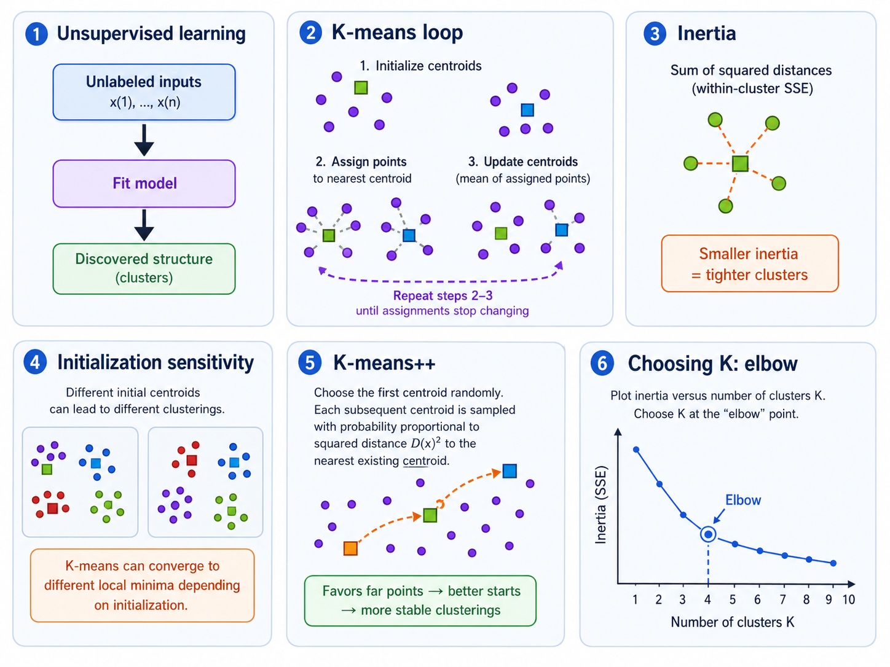

# 9. Unsupervised Learning and K-Means

**Source pages:** 40–42  
**Status:** reconstructed and equation-checked

This chapter introduces unsupervised learning as learning structure from data without observed target labels. The source distinguishes clustering from dimensionality reduction, then develops K-means as the first unsupervised-learning algorithm: initialize centroids, alternate assignment and centroid updates, measure cluster tightness with inertia, reduce initialization sensitivity with K-means++, and choose the number of clusters using application knowledge or the elbow heuristic.

## 9.1 What changes in unsupervised learning?

In supervised learning, each training example includes an observed answer. In unsupervised learning, the dataset contains only inputs:

$$ \mathcal{D}=\left\lbrace x^{(i)}\right\rbrace_{i=1}^{n_{\mathrm{train}}}. $$

There is no target variable $y^{(i)}$ telling the algorithm what output should be produced. The goal is instead to discover useful structure already present in the inputs.

Page 40 presents the workflow as:

1. fit a model to unlabeled data;
2. extract a structure from the data;
3. use the learned model to map new unlabeled examples into that structure.

*Redrawn from source pages 40–42: unsupervised structure discovery, the K-means assignment/update loop, sensitivity to initialization, K-means++ seeding, and the elbow heuristic.*

## 9.2 Two types of unsupervised learning in the source

The source introduces two broad tasks.

### Clustering

**Clustering** identifies unknown groups or structure in data. Page 40 uses text articles as an example: a model fitted to articles with unknown topics can group similar articles together.

A second example considers users of a web application represented by age. Depending on the purpose, the same users might be partitioned into two groups or five groups. This illustrates that the requested number of clusters is part of the modeling decision rather than an observed label supplied by the data.

### Dimensionality reduction

**Dimensionality reduction** uses structural characteristics to simplify the data. The page 40 example fits a model to high-resolution images and produces compressed representations.

| Task | Source framing | Example from page 40 |
|---|---|---|
| Clustering | identify distinct groups | group articles with similar unknown topics |
| Dimensionality reduction | simplify structure | compress high-resolution images |

This chapter develops clustering. Dimensionality reduction returns later in the course notes.

## 9.3 K-means notation

Let the unlabeled dataset be:

$$ x^{(i)}\in\mathbb{R}^{d}, \qquad i\in\lbrace 1,\ldots,n_{\mathrm{train}}\rbrace. $$

Choose a number of clusters $K$. K-means maintains:

- one cluster assignment $c^{(i)}$ for every training example;
- one centroid $\mu_j\in\mathbb{R}^{d}$ for every cluster $j$.

The assignment takes a value in:

$$ c^{(i)}\in\lbrace 1,\ldots,K\rbrace. $$

The centroid $\mu_j$ represents the current center of cluster $j$.

## 9.4 The K-means algorithm

Page 41 gives the following iterative procedure.

### Step 1: initialize the centroids

Initialize $K$ cluster centroids randomly:

$$ \mu_1,\mu_2,\ldots,\mu_K\in\mathbb{R}^{d}. $$

The source example uses $K=2$ and places two random centers in an age-income plot.

### Step 2: assign every point to its closest centroid

For every example $i$, set:

$$ c^{(i)}\leftarrow\underset{j\in\lbrace 1,\ldots,K\rbrace}{\mathrm{arg\,min}}\left\lVert x^{(i)}-\mu_j\right\rVert_2^2. $$

Each example is assigned to whichever centroid has the smallest squared Euclidean distance.

### Step 3: recompute every centroid

For every cluster $j$, set:

$$ \mu_j\leftarrow\frac{\sum_{i=1}^{n_{\mathrm{train}}}\mathbb{1}\left[c^{(i)}=j\right]x^{(i)}}{\sum_{i=1}^{n_{\mathrm{train}}}\mathbb{1}\left[c^{(i)}=j\right]}. $$

The numerator adds all points currently assigned to cluster $j$. The denominator counts them. Therefore the updated centroid is the mean of the points in that cluster.

### Step 4: repeat until convergence

Repeat the assignment and centroid-update steps. In the source diagram, the algorithm is declared converged when the points no longer move between clusters.

> [!NOTE]
> **Added clarification: two alternating minimizations**
>
> With the centroids fixed, the assignment step chooses the closest center for each point. With the assignments fixed, the update step chooses the mean of each cluster. Each step therefore minimizes the K-means objective with respect to one group of variables while holding the other fixed.

## 9.5 The K-means objective: inertia

Page 41 calls the objective **inertia**, also described as a distortion function. It is the sum of squared distances from every point to the centroid of its assigned cluster:

$$ J(c,\mu)=\sum_{i=1}^{n_{\mathrm{train}}}\left\lVert x^{(i)}-\mu_{c^{(i)}}\right\rVert_2^2. $$

Smaller inertia means that points lie closer to their assigned centroids, so the clusters are tighter according to squared Euclidean distance.

The assignment step reduces or preserves $J$ because each point is moved to its nearest current centroid. The centroid update also reduces or preserves $J$ because the arithmetic mean minimizes the sum of squared distances within a fixed cluster.

> [!NOTE]
> **Added clarification: convergence is not global optimality**
>
> The objective cannot increase during the standard assignment/update loop, so the algorithm eventually reaches a stable solution. The initialization examples on pages 41–42 show, however, that different initial centroids can lead to different stable clusterings and different inertia values. Convergence therefore does not guarantee the globally smallest possible inertia.

## 9.6 Why initialization matters

The lower part of page 41 shows two different final clusterings produced from different initial cluster assignments. Page 42 then compares three solutions with inertias approximately:

$$ 12.645, \qquad 12.943, \qquad 13.112. $$

The handwritten conclusion is explicit:

> A disadvantage of K-means is that results depend largely on the initial centroids.

The solution with the smallest displayed inertia is preferred among these three runs under the source's stated criterion. More importantly, the examples show that one run of randomly initialized K-means is not enough to establish that the best available clustering has been found.

> [!TIP]
> **Review intuition**
>
> Random initialization changes the first assignments. Those assignments change the first centroid updates, which change later assignments, and the entire optimization path can finish at a different stable solution.

## 9.7 K-means++ initialization

Page 42 introduces **K-means++** as a smarter initialization method.

### First centroid

Choose one training point at random as the first centroid.

### Distance to the nearest selected centroid

For every point $x^{(i)}$, define its distance to the closest centroid already selected:

$$ D\left(x^{(i)}\right)=\min_{\mu\in\mathcal{M}}\left\lVert x^{(i)}-\mu\right\rVert_2, $$

where $\mathcal{M}$ is the set of centroids chosen so far.

### Next centroid

Choose the next point with probability proportional to the squared distance:

$$ p\left(x^{(i)}\right)=\frac{D\left(x^{(i)}\right)^2}{\sum_{r=1}^{n_{\mathrm{train}}}D\left(x^{(r)}\right)^2}. $$

A point far from every existing centroid receives a larger probability of becoming the next centroid. In the source illustration, after choosing a point in one visible group, the next center is likely to be placed in the distant group rather than next to the first center.

> [!NOTE]
> **Added clarification: completing the initialization**
>
> Repeat the distance-weighted selection until $K$ initial centroids have been chosen, then run the ordinary K-means assignment/update loop.

## 9.8 Choosing the number of clusters

Page 42 describes $K$ as the algorithm's main knob and gives two ways to choose it.

### Predefine $K$ from the application

Sometimes the use case determines the number of groups directly. The source examples are:

- cluster similar jobs across four CPU cores, giving $K=4$;
- create clothing designs in ten sizes, giving $K=10$.

In these cases, $K$ comes from an external requirement rather than from the geometry of the data alone.

### Use the elbow method

The elbow heuristic evaluates inertia for several choices of $K$.

As $K$ increases, inertia decreases because additional centroids can represent the data more closely. The source recommends looking for an **elbow**: a point after which increasing $K$ produces only a much smaller reduction in inertia.

> [!WARNING]
> **A lower inertia alone does not select $K$**
>
> Inertia is expected to decrease as $K$ increases. Choosing the largest tested $K$ merely because it has the lowest inertia would ignore the purpose of the elbow heuristic. The decision is based on where the improvement begins to flatten.

## 9.9 Source transition notes

Two brief handwritten notes connect this chapter to later material:

1. Page 40 writes “K-means $\rightarrow$ probabilistic extension $\rightarrow$ EM algorithm.” The following chapter develops mixture models and expectation-maximization.
2. Page 42 mentions a nonparametric Bayesian alternative, the **Dirichlet process**, in which the number of clusters can change during training.

The source does not develop the Dirichlet process further in these pages, so it is preserved here only as a transition note.

## 9.10 Common mistakes

### Mistake 1: treating cluster identifiers as observed class labels

Cluster number $1$ or $2$ has no target meaning supplied by the dataset. The assignments are discovered group identifiers, and their numeric names can be exchanged without changing the partition.

### Mistake 2: recomputing a centroid from all points

Each $\mu_j$ is the mean only of points whose current assignment is $j$:

$$ c^{(i)}=j. $$

Using every training point would make all centroid updates identical.

### Mistake 3: stopping after one assignment step

K-means alternates assignment and centroid recomputation. The first nearest-center assignment is generally not the final clustering.

### Mistake 4: assuming convergence means the best possible clustering

Pages 41–42 show that different initializations can converge to different solutions. A stable assignment is not necessarily the global optimum.

### Mistake 5: choosing $K$ only by the minimum inertia

Inertia falls as model flexibility grows with $K$. The elbow heuristic looks for diminishing returns rather than the absolute minimum over all tested values.

## 9.11 Chapter summary

- Unsupervised learning operates on inputs without observed target labels.
- Clustering discovers groups; dimensionality reduction simplifies structure.
- K-means alternates nearest-centroid assignment and centroid-mean updates.
- Its objective is inertia, the within-cluster sum of squared distances.
- The algorithm converges to a stable solution, but the result depends on initialization.
- K-means++ spreads initial centroids using squared-distance probabilities.
- $K$ can be supplied by the application or estimated heuristically with an inertia elbow.
- The source points forward from K-means to probabilistic clustering and EM.

## 9.12 Self-check questions

1. What information is absent from an unsupervised training set?
2. How do clustering and dimensionality reduction differ in the source examples?
3. What does $c^{(i)}$ represent in K-means?
4. Write the nearest-centroid assignment rule.
5. Why is the updated centroid the mean of its assigned points?
6. What quantity does inertia measure?
7. Why can different random initializations produce different final clusterings?
8. How does K-means++ choose a new initial centroid?
9. Why does inertia normally decrease as $K$ increases?
10. What does the elbow heuristic look for?
