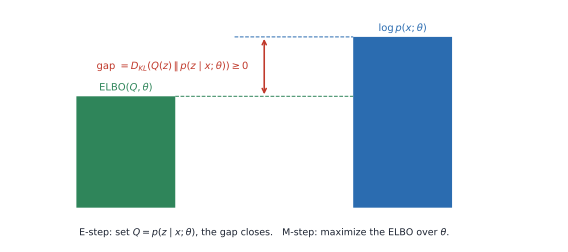

# 10. Gaussian Mixture Models and Expectation-Maximization

K-means gives every point exactly one cluster. A Gaussian mixture model instead says each point was generated by one of $K$ Gaussians, but we don't know which, and it computes the *probability* that each component generated each point. Fitting it leads to the expectation-maximization (EM) algorithm, which the chapter then derives in general through Jensen's inequality and the evidence lower bound (ELBO), the same quantity behind variational inference and VAEs.

## 10.1 From hard to soft clusters

Replace the K-means assignment $c^{(i)}$ by a **latent** variable $z^{(i)}\in\lbrace1,\ldots,K\rbrace$, meaning "the component that generated $x^{(i)}$", which we never observe. Its prior is a probability vector:

$$ p\left(z^{(i)}=k\right)=\phi_k, \qquad \phi_k\ge0, \qquad \sum_k\phi_k=1 . $$

(Many texts write the mixture weights as $\pi_k$; they're the same thing.)

## 10.2 The generative model

$$ x^{(i)}\mid z^{(i)}=k\sim\mathcal{N}\left(\mu_k,\Sigma_k\right), \qquad p\left(x^{(i)},z^{(i)}=k\right)=\phi_k\,\mathcal{N}\left(x^{(i)}\mid\mu_k,\Sigma_k\right). $$

To sample a point: roll a $K$-sided die with probabilities $\phi$, then draw from that component's Gaussian. The parameters are $\Theta=\lbrace\phi_k,\mu_k,\Sigma_k\rbrace_{k=1}^K$.

## 10.3 An example: image colors

Summarize each image by its average red, green and blue intensity, $x=(R,G,B)$. Photos of clouds, sunsets and forests form different groups. Looking only at the blue channel, the histogram has three bumps, around 0.8, 0.3 and 0.42. No single Gaussian fits that, but a weighted sum of three does. In two dimensions (blue, green), each component is an ellipse whose shape comes from its covariance:

$$ \Sigma=\begin{pmatrix}\sigma_{\text{blue}}^2 & \sigma_{\text{blue,green}}\\ \sigma_{\text{green,blue}} & \sigma_{\text{green}}^2\end{pmatrix}. $$

## 10.4 The mixture density

Since $z$ is hidden, sum it out:

$$ p(x;\Theta)=\sum_{k=1}^{K}\phi_k\,\mathcal{N}\left(x\mid\mu_k,\Sigma_k\right). $$

The weights $\phi_k$ are the fractions of the population in each hidden group.

## 10.5 Why direct maximum likelihood is hard

$$ \ell(\Theta)=\sum_{i=1}^{n}\log\left(\sum_{k=1}^{K}\phi_k\,\mathcal{N}\left(x^{(i)}\mid\mu_k,\Sigma_k\right)\right). $$

The log sits *outside* a sum, so it doesn't break the objective into separate pieces. Setting the gradient to zero gives coupled equations with no closed form.

## 10.6 If we knew the assignments…

If every $z^{(i)}$ were observed, this would be GDA from Chapter 7, and the MLEs would be simple counts and averages:

$$ \phi_j=\frac{1}{n}\sum_{i}\mathbb{1}[z^{(i)}=j], \qquad \mu_j=\frac{\sum_{i}\mathbb{1}[z^{(i)}=j]\,x^{(i)}}{\sum_{i}\mathbb{1}[z^{(i)}=j]}, \qquad \Sigma_j=\frac{\sum_{i}\mathbb{1}[z^{(i)}=j]\left(x^{(i)}-\mu_j\right)\left(x^{(i)}-\mu_j\right)^\top}{\sum_{i}\mathbb{1}[z^{(i)}=j]} . $$

## 10.7 The EM idea

We don't know the assignments, so alternate:

1. **E-step:** using the current parameters, compute how likely each component is for each point (a soft guess of $z^{(i)}$).
2. **M-step:** update the parameters as if those soft guesses were the truth.

*Weighted Gaussian components define the mixture; the E-step computes responsibilities and the M-step re-fits each component with them.*

## 10.8 E-step: responsibilities

$$ w_j^{(i)}=p\left(z^{(i)}=j\mid x^{(i)};\Theta\right)=\frac{\phi_j\,\mathcal{N}\left(x^{(i)}\mid\mu_j,\Sigma_j\right)}{\sum_{l=1}^{K}\phi_l\,\mathcal{N}\left(x^{(i)}\mid\mu_l,\Sigma_l\right)}, \qquad \sum_{j}w_j^{(i)}=1 . $$

This is Bayes' rule: prior weight times likelihood, normalized. A component gets a high responsibility when it is both common and close to the point.

## 10.9 M-step: weighted maximum likelihood

Replace each indicator in §10.6 by the corresponding responsibility. With the effective count $N_j=\sum_i w_j^{(i)}$,

$$ \phi_j\leftarrow\frac{N_j}{n}, \qquad \mu_j\leftarrow\frac{1}{N_j}\sum_{i}w_j^{(i)}x^{(i)}, \qquad \Sigma_j\leftarrow\frac{1}{N_j}\sum_{i}w_j^{(i)}\left(x^{(i)}-\mu_j\right)\left(x^{(i)}-\mu_j\right)^\top . $$

Every point contributes to every component in proportion to its responsibility.

## 10.10 Hard assignments as a special case

If every responsibility is 0 or 1 (a one-hot row per point), the M-step becomes exactly the hard-assignment formulas.

| Hard (K-means) | Soft (GMM) |
|---|---|
| each point belongs to one cluster | each point splits across clusters |
| cluster size is a count | cluster size is $N_j=\sum_i w_j^{(i)}$ |
| centroid is a plain mean | mean is a responsibility-weighted average |
| spherical, equal-size clusters | elliptical clusters with their own weights |

## 10.11 EM in general

Now forget Gaussians. We have observed $x$, latent $z$, parameters $\theta$, and a joint model $p(x,z;\theta)$. The quantity we want to maximize is

$$ \log p(x;\theta)=\log\sum_z p(x,z;\theta). $$

The same algorithm works for mixtures of other distributions, hidden Markov models ([Temporal Learning, Chapter 6](../../modern-temporal-learning/notes/06_markov_models_hmm_and_em.md)), missing data and more.

## 10.12 Jensen's inequality gives a lower bound

Multiply and divide by any distribution $Q(z)$:

$$ \log p(x;\theta)=\log\sum_z Q(z)\frac{p(x,z;\theta)}{Q(z)}\;\geq\;\sum_z Q(z)\log\frac{p(x,z;\theta)}{Q(z)}\;=:\;\mathrm{ELBO}(x;Q,\theta), $$

because $\log$ is concave (Jensen's inequality: $\log\mathbb E[\cdot]\ge\mathbb E[\log\cdot]$). Equivalently,

$$ \mathrm{ELBO}=\mathbb{E}_{Q}\left[\log p(x,z;\theta)\right]+H(Q), $$

an expected complete-data log-likelihood plus the entropy of $Q$.

## 10.13 The gap is a KL divergence

Writing $p(x,z)=p(z\mid x)p(x)$ gives the exact identity

$$ \log p(x;\theta)=\mathrm{ELBO}(x;Q,\theta)+D_{\mathrm{KL}}\left(Q(z)\,\|\,p(z\mid x;\theta)\right). $$

The KL divergence is non-negative, so the ELBO is a lower bound, and it is **tight exactly when $Q(z)=p(z\mid x;\theta)$**.

*The ELBO sits below the log-likelihood by a KL gap. The E-step closes the gap; the M-step raises the bound.*

## 10.14 EM is coordinate ascent on the ELBO

- **E-step:** fix $\theta$ and set $Q(z)\leftarrow p(z\mid x;\theta)$. The gap becomes zero, so the bound touches the log-likelihood at the current $\theta$.
- **M-step:** fix $Q$ and set $\theta\leftarrow\mathrm{arg\,max}_\theta\,\mathrm{ELBO}(x;Q,\theta)$. For a GMM this gives the weighted updates in §10.9.

**Why the likelihood never decreases:** after the E-step, $\log p(x;\theta^{\text{old}})=\mathrm{ELBO}(Q,\theta^{\text{old}})$. The M-step gives $\mathrm{ELBO}(Q,\theta^{\text{new}})\ge\mathrm{ELBO}(Q,\theta^{\text{old}})$. And always $\log p(x;\theta^{\text{new}})\ge\mathrm{ELBO}(Q,\theta^{\text{new}})$. Chaining the three, $\log p(x;\theta^{\text{new}})\ge\log p(x;\theta^{\text{old}})$.

## 10.15 Variational inference

When the posterior $p(z\mid x;\theta)$ is intractable, the E-step can't set $Q$ equal to it. **Variational inference** restricts $Q$ to a tractable family and maximizes the ELBO over that family instead:

$$ \mathrm{ELBO}(Q,\theta)=\sum_{i=1}^{n}\sum_z Q_i(z)\log\frac{p\left(x^{(i)},z;\theta\right)}{Q_i(z)} . $$

Two common choices:

- **Mean field:** $Q_i(z)=\prod_m Q_i^{(m)}(z_m)$, which treats the latent coordinates as independent.
- **Amortized Gaussian:** $Q_i=\mathcal{N}\left(g(x^{(i)}),\mathrm{diag}\left(h(x^{(i)})\right)\right)$, where $g$ and $h$ are neural networks shared across all points.

The second is exactly the encoder of a **variational autoencoder**. Its ELBO splits into a reconstruction term and a KL term that keeps $Q$ close to the prior:

$$ \mathrm{ELBO}=\mathbb E_{Q(z\mid x)}\left[\log p(x\mid z)\right]-D_{\mathrm{KL}}\left(Q(z\mid x)\,\|\,p(z)\right). $$

This closes the loop on the latent-variable preview in [Chapter 3](03_regularization_and_probabilistic_linear_regression.md).

## 10.16 Practical notes

> [!NOTE]
> **Beyond the lecture: things that bite in practice**
>
> - **Collapsing components.** If a Gaussian centers on a single point and its variance shrinks toward 0, the likelihood goes to $+\infty$. The MLE is degenerate. Implementations add a small ridge to each covariance (`reg_covar` in scikit-learn).
> - **Initialization.** EM finds a local maximum. Initialize from K-means and use several restarts.
> - **Choosing K.** Likelihood always improves with more components; use BIC or held-out likelihood.
> - **Numerics.** Compute responsibilities in log space with log-sum-exp; densities in high dimension underflow.

## 10.17 Common mistakes

1. **Treating $z^{(i)}$ as observed.**
2. **Leaving $\phi_j$ out of the responsibility.**
3. **Normalizing responsibilities over points** instead of over components.
4. **Using unweighted means in the M-step.**
5. **Assuming the ELBO equals the log-likelihood.** Only when $Q$ is the exact posterior.
6. **Assuming EM finds the global optimum.**

## 10.18 Summary

- A GMM is a weighted sum of Gaussians with a hidden component label.
- Direct MLE is hard because of the log of a sum.
- EM alternates computing responsibilities (E) and weighted MLE updates (M).
- In general, EM is coordinate ascent on the ELBO: the E-step closes the KL gap, the M-step raises the bound, and the likelihood never decreases.
- Variational inference and VAEs maximize the same ELBO with a restricted $Q$.

## 10.19 Self-check

1. What does $z^{(i)}$ represent?
2. Why is the GMM log-likelihood hard to maximize directly?
3. Derive the E-step responsibility.
4. Why is $N_j$ called an effective count?
5. What is the gap between $\log p(x)$ and the ELBO?
6. Prove that EM never decreases the likelihood.
7. How is a VAE's encoder related to the E-step?

Answers

1. The unobserved index of the component that generated $x^{(i)}$.
2. The log of a sum couples all parameters; there's no closed-form stationary point.
3. Bayes' rule: $p(z=j\mid x)\propto p(x\mid z=j)p(z=j)=\phi_j\mathcal N(x\mid\mu_j,\Sigma_j)$, normalized over $j$.
4. It is the number of points "belonging" to component $j$, counting fractional memberships.
5. $D_{\mathrm{KL}}(Q(z)\,\|\,p(z\mid x;\theta))$.
6. See §10.14: tight bound, then M-step improvement, then the bound property.
7. It is an amortized, approximate E-step: a network that outputs $Q(z\mid x)$ instead of computing the exact posterior.

