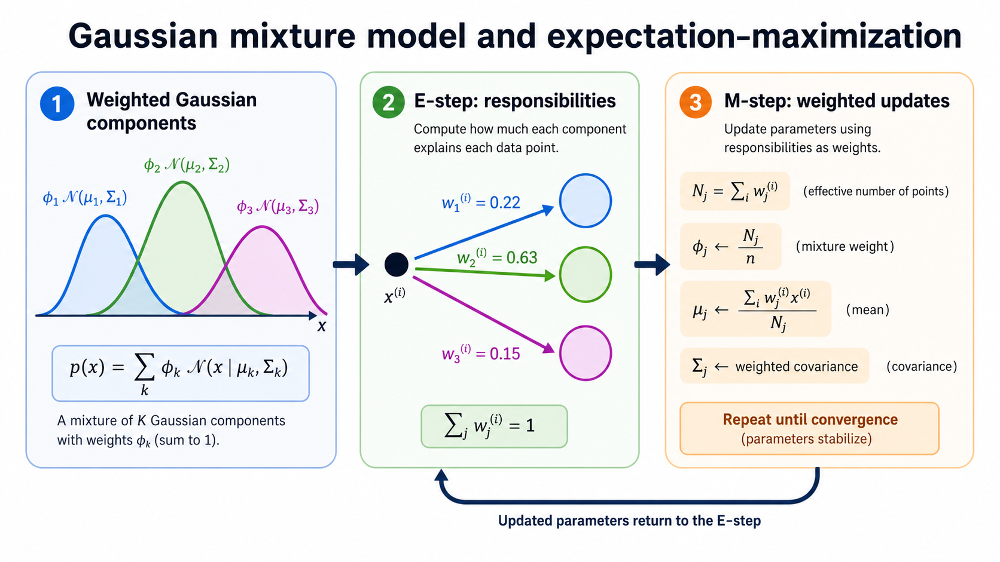
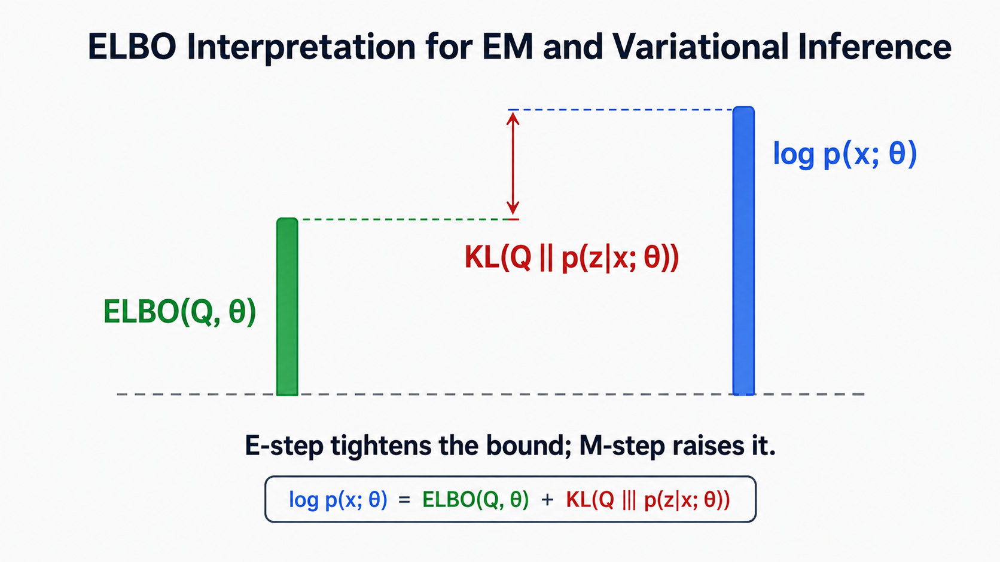

# 10. Gaussian Mixture Models and Expectation-Maximization

**Source pages:** 43–50  
**Status:** reconstructed and equation-checked

This chapter develops a probabilistic extension of K-means. Instead of assigning each example to exactly one centroid, a Gaussian mixture model introduces an unobserved cluster variable and gives every example a probability of belonging to each component. The expectation-maximization algorithm alternates between estimating those hidden assignments and updating the mixture parameters. The final pages broaden EM through Jensen's inequality, the evidence lower bound, and variational inference.

## 10.1 From hard clusters to probabilistic clusters

K-means represents cluster membership with a hard assignment. For example $i$:

$$ c^{(i)}\in\lbrace 1,\ldots,K\rbrace. $$

A Gaussian mixture model replaces that observed-looking assignment with a latent variable:

$$ z^{(i)}\in\lbrace 1,\ldots,K\rbrace. $$

The value of $z^{(i)}$ indicates which Gaussian component generated $x^{(i)}$, but $z^{(i)}$ is not observed in the dataset.

The source introduces a probability vector for the hidden component:

$$ \phi=\left(\phi_1,\ldots,\phi_K\right), \qquad \phi_k\geq 0, \qquad \sum_{k=1}^{K}\phi_k=1. $$

The prior probability of component $k$ is:

$$ p\left(z^{(i)}=k\right)=\phi_k. $$

> [!NOTE]
> **Source notation**
>
> Pages 43–50 use both $\phi_k$ and $\pi_k$ for mixture weights. This reconstruction uses $\phi_k$ consistently; the two symbols play the same role in these pages.

## 10.2 Conditional Gaussian model

Conditioned on component $k$, the observation follows a Gaussian distribution:

$$ x^{(i)}\mid z^{(i)}=k\sim\mathcal{N}\left(\mu_k,\Sigma_k\right). $$

Equivalently:

$$ p\left(x^{(i)}\mid z^{(i)}=k;\mu_k,\Sigma_k\right)=\mathcal{N}\left(x^{(i)}\mid\mu_k,\Sigma_k\right). $$

The joint distribution factors as:

$$ p\left(x^{(i)},z^{(i)}\right)=p\left(x^{(i)}\mid z^{(i)}\right)p\left(z^{(i)}\right). $$

For component $k$:

$$ p\left(x^{(i)},z^{(i)}=k\right)=\phi_k\mathcal{N}\left(x^{(i)}\mid\mu_k,\Sigma_k\right). $$

The model parameters are the mixture proportions, component means, and component covariances:

$$ \Theta=\left\lbrace \phi_1,\ldots,\phi_K,\mu_1,\ldots,\mu_K,\Sigma_1,\ldots,\Sigma_K\right\rbrace. $$

## 10.3 Gaussian components in the image example

Pages 44–45 use a simplified image representation. Each image is represented by its average red, green, and blue intensities:

$$ x=\left(R,G,B\right). $$

Cloud, sunset, and forest images create different distributions over these features. Looking only at the blue coordinate, the slides illustrate approximate component centers near:

$$ 0.8, \qquad 0.3, \qquad 0.42. $$

A single Gaussian is described by a mean and variance in one dimension:

$$ x\sim\mathcal{N}\left(\mu,\sigma^2\right). $$

In two dimensions, the mean specifies the center while the covariance controls spread and orientation. Using blue and green as the two coordinates:

$$ \mu=\left[\mu_{\mathrm{blue}},\mu_{\mathrm{green}}\right]^\top. $$

The covariance entries are:

$$ \Sigma_{11}=\sigma_{\mathrm{blue}}^2, \qquad \Sigma_{12}=\sigma_{\mathrm{blue,green}}, \qquad \Sigma_{21}=\sigma_{\mathrm{green,blue}}, \qquad \Sigma_{22}=\sigma_{\mathrm{green}}^2. $$

The contour ellipse on page 45 visualizes those covariance effects.

Without labels, the observed histogram may appear multimodal. The modeling idea is that the combined distribution can be explained as a weighted mixture of simpler Gaussian components.

## 10.4 The Gaussian mixture density

Because the component identity is hidden, the probability of an observation marginalizes over all possible component values:

$$ p(x;\Theta)=\sum_{k=1}^{K}p\left(x\mid z=k;\mu_k,\Sigma_k\right)p(z=k;\phi). $$

Substituting the Gaussian conditional and categorical prior gives:

$$ p(x;\Theta)=\sum_{k=1}^{K}\phi_k\mathcal{N}\left(x\mid\mu_k,\Sigma_k\right). $$

The mixture weights determine how much probability mass each Gaussian contributes. The source describes them as the relative proportions of the hidden groups in the population from which the data are drawn.

## 10.5 Maximum likelihood with hidden assignments

For independent observations, the log-likelihood is:

$$ \ell(\Theta)=\sum_{i=1}^{n_{\mathrm{train}}}\log p\left(x^{(i)};\Theta\right). $$

After marginalizing the hidden component:

$$ \ell(\Theta)=\sum_{i=1}^{n_{\mathrm{train}}}\log\left(\sum_{k=1}^{K}\phi_k\mathcal{N}\left(x^{(i)}\mid\mu_k,\Sigma_k\right)\right). $$

The difficult structure is the logarithm outside the sum over components. Directly separating the optimization into independent closed-form updates is no longer possible in the same way as when the assignments are known.

## 10.6 What would happen if the hidden assignments were known?

Page 47 first recalls the Gaussian discriminant analysis case. Suppose every $z^{(i)}$ were observed. The complete-data log-likelihood would separate into a Gaussian term and a categorical term:

$$ \ell_{\mathrm{complete}}(\Theta)=\sum_{i=1}^{n_{\mathrm{train}}}\left[\log p\left(x^{(i)}\mid z^{(i)};\mu,\Sigma\right)+\log p\left(z^{(i)};\phi\right)\right]. $$

The maximum-likelihood estimates would then be:

$$ \phi_j=\frac{1}{n_{\mathrm{train}}}\sum_{i=1}^{n_{\mathrm{train}}}\mathbb{1}\left[z^{(i)}=j\right]. $$

$$ \mu_j=\frac{\sum_{i=1}^{n_{\mathrm{train}}}\mathbb{1}\left[z^{(i)}=j\right]x^{(i)}}{\sum_{i=1}^{n_{\mathrm{train}}}\mathbb{1}\left[z^{(i)}=j\right]}. $$

$$ \Sigma_j=\frac{\sum_{i=1}^{n_{\mathrm{train}}}\mathbb{1}\left[z^{(i)}=j\right]\left(x^{(i)}-\mu_j\right)\left(x^{(i)}-\mu_j\right)^\top}{\sum_{i=1}^{n_{\mathrm{train}}}\mathbb{1}\left[z^{(i)}=j\right]}. $$

These estimates are the component proportion, component mean, and component covariance computed from the examples assigned to component $j$.

## 10.7 The expectation-maximization idea

The hidden assignments are not known, so EM alternates between two operations:

1. **Expectation step:** estimate the component-membership probabilities using the current parameters.
2. **Maximization step:** update the parameters using those estimated memberships.

The page 47 notes summarize the intuition as “guess the values of $z^{(i)}$” and then “update the model parameters based on the guesses.” The assignments are soft probabilities rather than hard labels.

*Redrawn from source pages 43–48: weighted Gaussian components define the mixture, the E-step computes responsibilities, and the M-step uses those responsibilities to update the parameters before repeating.*

## 10.8 E-step: responsibilities

Define the responsibility of component $j$ for example $i$ as:

$$ w_j^{(i)}=p\left(z^{(i)}=j\mid x^{(i)};\Theta\right). $$

Using Bayes' rule:

$$ w_j^{(i)}=\frac{p\left(x^{(i)}\mid z^{(i)}=j;\mu_j,\Sigma_j\right)p\left(z^{(i)}=j;\phi\right)}{\sum_{l=1}^{K}p\left(x^{(i)}\mid z^{(i)}=l;\mu_l,\Sigma_l\right)p\left(z^{(i)}=l;\phi\right)}. $$

For a Gaussian mixture:

$$ w_j^{(i)}=\frac{\phi_j\mathcal{N}\left(x^{(i)}\mid\mu_j,\Sigma_j\right)}{\sum_{l=1}^{K}\phi_l\mathcal{N}\left(x^{(i)}\mid\mu_l,\Sigma_l\right)}. $$

For each example, the responsibilities form a probability distribution:

$$ \sum_{j=1}^{K}w_j^{(i)}=1. $$

A component receives a high responsibility when both its prior weight and its likelihood for the observation are high.

## 10.9 M-step: weighted maximum likelihood

The M-step replaces the hard indicator in the known-assignment formulas with the soft responsibility.

Define the effective number of observations assigned to component $j$:

$$ N_j=\sum_{i=1}^{n_{\mathrm{train}}}w_j^{(i)}. $$

Then update the mixture proportion:

$$ \phi_j\leftarrow\frac{N_j}{n_{\mathrm{train}}}=\frac{1}{n_{\mathrm{train}}}\sum_{i=1}^{n_{\mathrm{train}}}w_j^{(i)}. $$

Update the mean:

$$ \mu_j\leftarrow\frac{\sum_{i=1}^{n_{\mathrm{train}}}w_j^{(i)}x^{(i)}}{\sum_{i=1}^{n_{\mathrm{train}}}w_j^{(i)}}. $$

Update the covariance:

$$ \Sigma_j\leftarrow\frac{\sum_{i=1}^{n_{\mathrm{train}}}w_j^{(i)}\left(x^{(i)}-\mu_j\right)\left(x^{(i)}-\mu_j\right)^\top}{\sum_{i=1}^{n_{\mathrm{train}}}w_j^{(i)}}. $$

Page 48 compares this update to weighted maximum likelihood: each observation contributes to every component, but its contribution is scaled by its responsibility.

## 10.10 Soft assignments include hard assignments as a special case

Page 48 also writes the responsibility as $r_{ik}$. When:

$$ r_{ik}\in\lbrace 0,1\rbrace, $$

exactly one component receives weight $1$ and every other component receives weight $0$. The responsibility table becomes a one-hot assignment matrix, and the weighted formulas reduce to the hard-assignment formulas.

This gives the connection:

| Hard clustering | Soft mixture assignment |
|---|---|
| one component has weight $1$ | every component can receive a fractional weight |
| cluster size is a count | cluster size is an effective weighted count |
| mean averages assigned points | mean is a responsibility-weighted average |

## 10.11 EM beyond Gaussian mixtures

Page 49 broadens the discussion beyond Gaussian components. The general setting contains:

- observed variable $x$;
- latent variable $z$;
- model parameters $\theta$;
- joint model $p(x,z;\theta)$.

The observed-data likelihood marginalizes over $z$:

$$ p(x;\theta)=\sum_z p(x,z;\theta). $$

The log-likelihood is:

$$ \log p(x;\theta)=\log\sum_z p(x,z;\theta). $$

For a Gaussian mixture, $z$ is categorical and $p(x\mid z)$ is Gaussian. The source notes that EM also applies to non-Gaussian mixtures and other latent-variable models.

## 10.12 Jensen's inequality and a lower bound

Let $Q(z)$ be any distribution over the latent variable. Insert $Q(z)$ into the marginal likelihood:

$$ \log p(x;\theta)=\log\sum_z Q(z)\frac{p(x,z;\theta)}{Q(z)}. $$

Because the logarithm is concave, Jensen's inequality gives:

$$ \log p(x;\theta)\geq\sum_z Q(z)\log\frac{p(x,z;\theta)}{Q(z)}. $$

The right-hand side is the **evidence lower bound**:

$$ \mathrm{ELBO}(x;Q,\theta)=\sum_z Q(z)\log\frac{p(x,z;\theta)}{Q(z)}. $$

Equivalently:

$$ \mathrm{ELBO}(x;Q,\theta)=\mathbb{E}_{z\sim Q}\left[\log p(x,z;\theta)\right]-\mathbb{E}_{z\sim Q}\left[\log Q(z)\right]. $$

## 10.13 The ELBO decomposition

Using Bayes' rule, the lower bound can be written as:

$$ \mathrm{ELBO}(x;Q,\theta)=\log p(x;\theta)-D_{\mathrm{KL}}\left(Q(z)\parallel p(z\mid x;\theta)\right). $$

Therefore:

$$ \log p(x;\theta)-\mathrm{ELBO}(x;Q,\theta)=D_{\mathrm{KL}}\left(Q(z)\parallel p(z\mid x;\theta)\right)\geq 0. $$

The KL divergence is the gap between the lower bound and the log-likelihood. The bound becomes tight when:

$$ Q(z)=p(z\mid x;\theta). $$

*The ELBO lies below the log-likelihood by a KL-divergence gap. The E-step tightens this bound by updating $Q$, while the M-step raises the bound by updating the model parameters.*

## 10.14 EM as alternating optimization of the ELBO

The source interprets EM as alternating between the two arguments of the lower bound.

### E-step

Fix $\theta$ and choose:

$$ Q(z)\leftarrow p(z\mid x;\theta). $$

This makes the KL gap zero for the current parameter values, so the lower bound touches the current log-likelihood.

### M-step

Fix $Q$ and update:

$$ \theta\leftarrow\underset{\theta}{\mathrm{arg\,max}}\mathrm{ELBO}(x;Q,\theta). $$

For a Gaussian mixture, this produces the responsibility-weighted updates for $\phi_j$, $\mu_j$, and $\Sigma_j$.

> [!NOTE]
> **Added clarification: why the likelihood does not decrease**
>
> The E-step makes the lower bound tight at the current parameters. The M-step raises or preserves that bound. Because the likelihood is always at least as large as the bound and the bound was tight before the update, the observed-data likelihood does not decrease from one complete EM iteration to the next.

## 10.15 Variational inference

Page 50 presents variational inference as an extension of the EM viewpoint. Exact posterior computation may be difficult, so $Q$ is restricted to a simpler family and optimized to make the ELBO as large as possible.

For independent training observations, the total objective is written as:

$$ \mathrm{ELBO}(Q,\theta)=\sum_{i=1}^{n_{\mathrm{train}}}\sum_z Q_i(z)\log\frac{p\left(x^{(i)},z;\theta\right)}{Q_i(z)}. $$

A mean-field assumption factorizes a multivariable latent distribution:

$$ Q_i(z)=Q_i^{(1)}\left(z_1\right)Q_i^{(2)}\left(z_2\right)\cdots Q_i^{(m)}\left(z_m\right). $$

The final source example suggests a Gaussian variational distribution with diagonal covariance:

$$ Q_i=\mathcal{N}\left(g_i\left(x^{(i)};\theta\right),\mathrm{diag}\left(h_i\left(x^{(i)};\theta\right)\right)\right). $$

The handwritten note indicates that $g_i$ and $h_i$ can be learned model outputs, including outputs of neural networks. The source does not develop the neural-network construction further on these pages.

## 10.16 Common mistakes

### Mistake 1: treating $z^{(i)}$ as an observed label

The hidden component identity is precisely the missing information that motivates EM. The E-step computes a distribution over possible values rather than reading a label from the dataset.

### Mistake 2: omitting the mixture weight in the responsibility

The posterior assignment depends on both the component likelihood and its prior proportion:

$$ w_j^{(i)}\propto\phi_j\mathcal{N}\left(x^{(i)}\mid\mu_j,\Sigma_j\right). $$

### Mistake 3: normalizing responsibilities over examples

For a fixed example $i$, responsibilities normalize over components:

$$ \sum_{j=1}^{K}w_j^{(i)}=1. $$

The effective count $N_j$ instead sums one component's responsibility over examples.

### Mistake 4: using unweighted means in the M-step

An example with responsibility $0.9$ should influence a component more than an example with responsibility $0.1$. The M-step therefore uses weighted sufficient statistics.

### Mistake 5: assuming the ELBO always equals the log-likelihood

The equality holds only when $Q$ matches the exact posterior. Otherwise the difference is a nonnegative KL divergence.

### Mistake 6: assuming EM guarantees the global optimum

Like K-means, EM can depend on initialization and can converge to different local solutions.

## 10.17 Chapter summary

- A Gaussian mixture model combines $K$ Gaussian components with weights that sum to one.
- The latent variable $z^{(i)}$ identifies the hidden component responsible for an observation.
- Marginalizing $z$ produces a weighted sum of Gaussian densities.
- The logarithm of that sum makes direct maximum-likelihood optimization difficult.
- The E-step computes posterior responsibilities for the hidden components.
- The M-step performs responsibility-weighted updates of component proportions, means, and covariances.
- Hard assignments are the special case in which responsibilities are one-hot.
- Jensen's inequality produces the evidence lower bound.
- The gap between the log-likelihood and ELBO is $D_{\mathrm{KL}}\left(Q\parallel p(z\mid x)\right)$.
- Exact EM sets $Q$ to the posterior; variational inference optimizes over a restricted approximation family.

## 10.18 Self-check questions

1. What does the latent variable $z^{(i)}$ represent in a Gaussian mixture model?
2. How do the mixture weights $\phi_k$ constrain one another?
3. Write the marginal density $p(x;\Theta)$ for a $K$-component Gaussian mixture.
4. Why does the observed-data log-likelihood contain a difficult log-sum expression?
5. What estimates would be available if every hidden assignment were known?
6. What is a responsibility $w_j^{(i)}$?
7. Derive the E-step responsibility using Bayes' rule.
8. Why is $N_j=\sum_i w_j^{(i)}$ called an effective cluster size?
9. How do soft assignments reduce to hard assignments?
10. State Jensen's lower bound used in the EM derivation.
11. What is the KL-divergence gap between the ELBO and log-likelihood?
12. How do the E-step and M-step alternate over $Q$ and $\theta$?
13. What changes when exact EM is replaced by variational inference?
