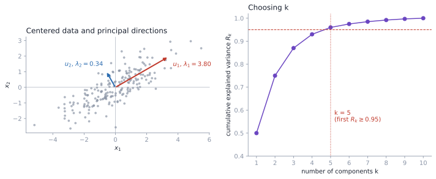

# 11. Dimensionality Reduction and Principal Component Analysis

High-dimensional data is expensive to store, hard to visualize, and, as KNN showed, it makes distances less meaningful. This chapter motivates dimensionality reduction with the curse of dimensionality, derives principal component analysis as the projection that keeps the most variance, and connects it to the SVD, feature scaling and explained variance, which is how PCA is actually computed and tuned.

**Notation.** $n$ examples, $N$ original features, $k$ kept dimensions. The data matrix $X\in\mathbb R^{n\times N}$ has one example per row.

## 11.1 Why reduce dimensionality?

More features can mean more information, but in practice:

- adding features can make models *worse*;
- the number of examples needed to cover the space grows exponentially with dimension.

Ten points spread over a line are dense. The same ten points in a square are sparse, and in a cube sparser still. That is the **curse of dimensionality**. Dimensionality reduction looks for

$$ \mathbb{R}^{N}\longrightarrow\mathbb{R}^{k}, \qquad k\ll N, $$

that keeps the structure we care about.



*Left: centered 2-D data with its principal directions $u_1$ (most variance) and $u_2 \perp u_1$. Right: cumulative explained variance; keep the smallest $k$ that reaches the target (here 95%).*

## 11.2 Feature selection versus feature extraction

- **Selection** keeps a subset of the original features, which keep their meaning.
- **Extraction** builds new features from combinations of the old ones. For example, height and cigarettes-per-day might collapse into one derived "health-risk" direction.

PCA is extraction: every new coordinate is a linear combination of all the original features.

## 11.3 Linear projection

Pick $U=[u_1,\ldots,u_k]\in\mathbb{R}^{N\times k}$ with **orthonormal** columns,

$$ \lVert u_j\rVert=1,\qquad u_i^\top u_j=0\;(i\neq j) \qquad\Longleftrightarrow\qquad U^\top U=I_k, $$

and map each example to $y^{(i)}=U^\top x^{(i)}\in\mathbb{R}^{k}$, so $y_j^{(i)}=u_j^\top x^{(i)}$. Orthonormality means the new coordinates don't overlap and lengths are preserved within the subspace.

## 11.4 Center first

PCA measures spread around the mean, so subtract it:

$$ \mu=\frac{1}{n}\sum_{i}x^{(i)}, \qquad x^{(i)}\leftarrow x^{(i)}-\mu . $$

From here on $x^{(i)}$ is centered.

## 11.5 Projection onto one direction

For a unit vector $u$, the scalar $z^{(i)}=u^\top x^{(i)}$ is the signed coordinate of the point along $u$. PCA looks for the direction along which these coordinates spread out the most.

## 11.6 Maximizing projected variance

Because the data are centered, the projections have mean zero, and their variance is

$$ \frac{1}{n}\sum_{i}\left(u^\top x^{(i)}\right)^2=u^\top\left(\frac{1}{n}\sum_{i}x^{(i)}x^{(i)\top}\right)u=u^\top\Sigma u, $$

with $\Sigma$ the sample covariance matrix. The first principal direction solves

$$ u_1=\underset{\lVert u\rVert=1}{\mathrm{arg\,max}}\;u^\top\Sigma u . $$

## 11.7 The answer is an eigenvector

Add a Lagrange multiplier for the unit-length constraint, $\mathcal L=u^\top\Sigma u-\lambda(u^\top u-1)$, and set the gradient to zero:

$$ 2\Sigma u-2\lambda u=0 \quad\Longrightarrow\quad \Sigma u=\lambda u . $$

So $u$ must be an eigenvector, and then the variance is $u^\top\Sigma u=\lambda$. To maximize it, take the eigenvector with the **largest** eigenvalue. The second direction maximizes variance subject to being orthogonal to the first, which gives the second eigenvector, and so on:

$$ \Sigma u_j=\lambda_ju_j, \qquad \lambda_1\geq\lambda_2\geq\cdots\geq\lambda_N\geq 0, \qquad \Sigma=\sum_{j=1}^{N}\lambda_ju_ju_j^\top . $$

The eigenvector gives the direction; the eigenvalue is the variance captured along it.

## 11.8 Keeping $k$ components and reconstructing

$$ U_k=[u_1,\ldots,u_k], \qquad y^{(i)}=U_k^\top x^{(i)}, \qquad \hat{x}^{(i)}=U_ky^{(i)}=U_kU_k^\top x^{(i)} . $$

$\hat x^{(i)}$ is the orthogonal projection of $x^{(i)}$ back in the original space. The same $U_k$ that maximizes retained variance also **minimizes the average squared reconstruction error** $\frac1n\sum_i\lVert x^{(i)}-\hat x^{(i)}\rVert^2$, which equals $\sum_{j>k}\lambda_j$, the variance thrown away. Maximum variance and minimum reconstruction error are the same problem.

## 11.9 Computing PCA with the SVD

Any matrix factors as $A=USV^\top$ with orthogonal $U\in\mathbb R^{m\times m}$, $V\in\mathbb R^{n\times n}$ and non-negative singular values $s_1\ge s_2\ge\cdots\ge0$ on the diagonal of $S$. Then

$$ A^\top A=VS^\top SV^\top, \qquad AA^\top=USS^\top U^\top, $$

so the columns of $V$ are eigenvectors of $A^\top A$, the columns of $U$ are eigenvectors of $AA^\top$, and both have eigenvalues $s_j^2$.

**Which vectors are the PCA directions?** With examples as rows (the $n\times N$ convention used here), take $A=X$ (centered). Then $\Sigma=\frac1nX^\top X$, so:

- principal directions are the **right** singular vectors, the columns of $V$;
- eigenvalues are $\lambda_j=s_j^2/n$;
- scores are $XV_k=U_kS_k$.

(If examples are stored as columns, swap the roles of $U$ and $V$.) This is how scikit-learn's `PCA` works. It never forms $\Sigma$, which avoids squaring the condition number.

## 11.10 Truncated SVD

$$ A=\sum_{j=1}^{r}s_ju_jv_j^\top \quad(r=\mathrm{rank}\,A), \qquad A_k=\sum_{j=1}^{k}s_ju_jv_j^\top=U_kS_kV_k^\top . $$

For example, singular values $9,7,1$ with $k=2$ keep the first two terms and drop the third. By the Eckart–Young theorem, $A_k$ is the best rank-$k$ approximation of $A$ in both Frobenius and spectral norm. The factor shapes are $U_k\in\mathbb{R}^{m\times k}$, $S_k\in\mathbb{R}^{k\times k}$, $V_k^\top\in\mathbb{R}^{k\times n}$.

## 11.11 Scale your features

PCA chases variance, and variance depends on units. A feature ranging over 0–500 will dominate one ranging over 0–50 even if the second carries the structure. When features have different units, standardize first:

$$ \tilde{x}_j^{(i)}=\frac{x_j^{(i)}-\mu_j}{s_j}, $$

which is the same as doing PCA on the correlation matrix instead of the covariance matrix. When all features share a unit (pixel intensities, for example), leaving them unscaled is often better.

> [!WARNING]
> **Fit the scaler and PCA on training data only**
>
> $\mu_j$, $s_j$ and $U_k$ are learned parameters. Compute them on the training split and apply them unchanged to validation, test and production data.

## 11.12 Explained variance

$$ r_j=\frac{\lambda_j}{\sum_{l=1}^{N}\lambda_l}, \qquad R_k=\sum_{j=1}^{k}r_j , $$

where $r_j$ is the fraction of total variance on component $j$ and $R_k$ the cumulative fraction kept by the first $k$. $R_k$ rises quickly, then flattens.

## 11.13 Choosing $k$

- **Elbow:** stop where the cumulative curve flattens.
- **Variance threshold:** the smallest $k$ with $R_k\ge0.95$ (or 0.90, 0.99), i.e. $k=\min\lbrace q:R_q\geq 0.95\rbrace$.

```python
from sklearn.decomposition import PCA
from sklearn.preprocessing import StandardScaler
from sklearn.pipeline import make_pipeline
import numpy as np

pca = make_pipeline(StandardScaler(), PCA()).fit(X_train)
cum = np.cumsum(pca[-1].explained_variance_ratio_)
k = int(np.argmax(cum >= 0.95)) + 1     # +1: argmax returns a 0-based index
# shortcut: PCA(n_components=0.95) picks k for you
```

If PCA feeds a supervised model, a third option is usually best: treat $k$ as a hyperparameter and pick it by validation error.

## 11.14 Workflow

1. Arrange the data as $n\times N$.
2. Center (and standardize if units differ), fitting on training data.
3. Compute the SVD of the centered matrix.
4. Sort directions by singular value.
5. Choose $k$.
6. Project: $y=U_k^\top x$, or equivalently $XV_k$ in SVD notation.

> [!NOTE]
> **Beyond the lecture: what PCA can't do**
>
> PCA is linear and unsupervised. It misses curved structure (use kernel PCA or an autoencoder; see [Temporal Learning, Chapter 10](../../modern-temporal-learning/notes/10_representation_learning.md)), and the highest-variance direction isn't necessarily the one that predicts the label. If a label exists and the goal is classification, LDA (Chapter 7) or partial least squares may be better. PCA also ignores time order, which matters for sequences ([Temporal Learning, Chapter 5](../../modern-temporal-learning/notes/05_pca_and_regularization.md)).

## 11.15 Common mistakes

1. **Skipping centering.** The first "component" then points at the mean.
2. **Ignoring feature scales** when units differ.
3. **Treating components as selected original features.** They are mixtures of all features.
4. **Using non-orthogonal directions.**
5. **Keeping the smallest eigenvalues** instead of the largest.
6. **Reading singular values as variances.** Variance is $s_j^2/n$.
7. **Choosing $k$ using the test set.**
8. **Mixing up $U$ and $V$** because of the data-matrix orientation.

## 11.16 Summary

- PCA finds orthonormal directions of maximum variance: the top eigenvectors of the covariance matrix.
- Maximum retained variance is the same as minimum reconstruction error.
- In practice PCA is computed by the SVD of the centered data; with rows as examples, the directions are the right singular vectors and $\lambda_j=s_j^2/n$.
- Standardize when units differ, fit on training data, and choose $k$ by explained variance or validation error.

## 11.17 Self-check

1. Show that projected variance equals $u^\top\Sigma u$.
2. Why does the first principal direction have to be an eigenvector?
3. What is the reconstruction error of keeping $k$ components?
4. With examples as rows, which SVD factor holds the principal directions?
5. When should you *not* standardize before PCA?
6. How does `argmax(cum >= 0.95) + 1` choose $k$?

<details>
<summary>Answers</summary>

1. $\frac1n\sum_i(u^\top x^{(i)})^2=\frac1n\sum_iu^\top x^{(i)}x^{(i)\top}u=u^\top\Sigma u$.
2. The Lagrangian stationarity condition is $\Sigma u=\lambda u$.
3. $\sum_{j>k}\lambda_j$, the sum of the discarded eigenvalues.
4. $V$, the right singular vectors.
5. When all features share a meaningful common unit and their relative variances carry information.
6. It finds the first index where the cumulative ratio reaches 0.95; adding 1 turns the 0-based index into a count.

</details>
