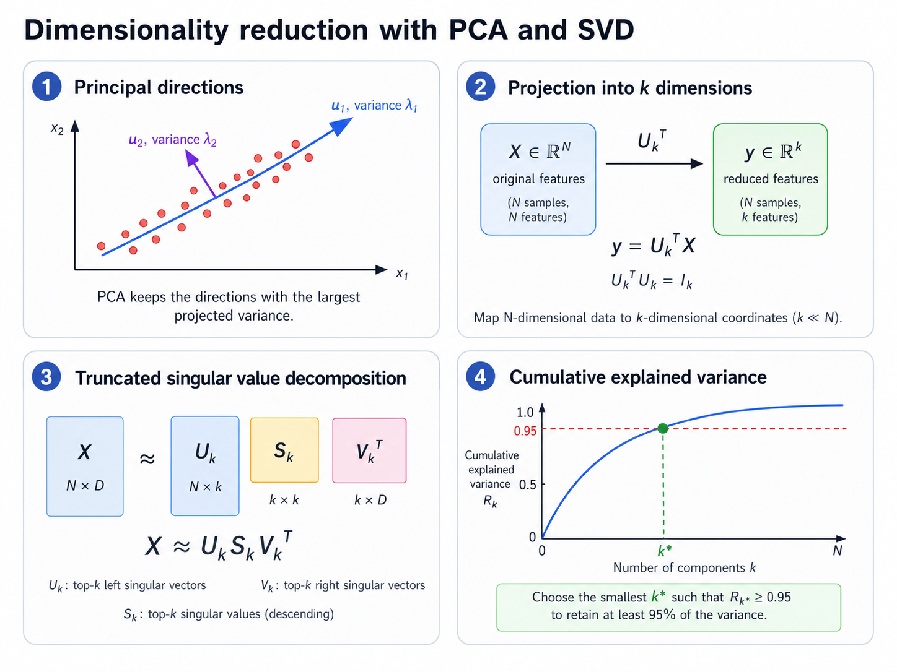

# 11. Dimensionality Reduction and Principal Component Analysis

**Source pages:** 51–53  
**Status:** reconstructed and equation-checked

This chapter studies how to represent high-dimensional data with fewer coordinates. The source first motivates dimensionality reduction through the curse of dimensionality, then develops principal component analysis as a variance-preserving linear projection. The final pages connect PCA to singular value decomposition, feature scaling, and explained variance.

## 11.1 Why reduce dimensionality?

Page 51 begins with the **curse of dimensionality**. In theory, additional features can provide more information. In practice, increasing dimensionality can also create two problems:

- too many features can lead to worse performance in practice;
- the number of training examples required increases exponentially with dimensionality.

The source illustrates this effect by comparing points placed in one-, two-, and three-dimensional spaces. As the number of dimensions grows, the same number of points becomes increasingly sparse.

Dimensionality reduction seeks a lower-dimensional representation:

$$ \mathbb{R}^{N}\longrightarrow\mathbb{R}^{k}, \qquad k\ll N. $$

The purpose is not simply to delete information. The goal is to preserve the structure judged most important for the task while using fewer coordinates.



*Redrawn from source pages 51–53: centered observations are projected onto principal directions, a rank-$k$ SVD retains the dominant singular components, and cumulative explained variance helps select the retained dimension.*

## 11.2 Feature selection and feature extraction

The source identifies two broad approaches.

### Feature selection

Choose a subset of the original features and discard the rest. The retained coordinates keep their original meanings.

### Feature extraction

Construct new features by combining the original coordinates through linear or nonlinear transformations.

Page 51 gives the conceptual example of combining height and cigarettes per day into a single derived direction. PCA belongs to the second category: it creates new coordinates as linear combinations of the original features.

## 11.3 Linear projection from $N$ dimensions to $k$ dimensions

Let an input example be:

$$ x^{(i)}\in\mathbb{R}^{N}. $$

To represent it in $k$ dimensions, choose a matrix:

$$ U\in\mathbb{R}^{N\times k}. $$

The lower-dimensional representation is:

$$ y^{(i)}=U^{\top}x^{(i)}\in\mathbb{R}^{k}. $$

Write the columns of $U$ as:

$$ U=\begin{bmatrix}u_1 & u_2 & \cdots & u_k\end{bmatrix}. $$

The handwritten notes require these directions to be orthonormal:

$$ \lVert u_j\rVert_2=1, \qquad u_i^{\top}u_j=0 \text{ for } i\neq j. $$

Equivalently:

$$ U^{\top}U=I_k. $$

Each reduced coordinate is the projection onto one direction:

$$ y_j^{(i)}=u_j^{\top}x^{(i)}. $$

## 11.4 Centering the data

The variance derivation on page 52 assumes that the data have mean zero. For the training mean:

$$ \mu=\frac{1}{n_{\mathrm{train}}}\sum_{i=1}^{n_{\mathrm{train}}}x^{(i)}, $$

center each example as:

$$ x_c^{(i)}=x^{(i)}-\mu. $$

After centering:

$$ \frac{1}{n_{\mathrm{train}}}\sum_{i=1}^{n_{\mathrm{train}}}x_c^{(i)}=0. $$

For the remaining PCA derivation, $x^{(i)}$ denotes a centered example unless stated otherwise.

## 11.5 Projection onto one direction

For a unit vector $u$, the scalar projection of example $i$ is:

$$ z^{(i)}=u^{\top}x^{(i)}. $$

Because $u$ has unit length, $u^{\top}x^{(i)}$ is the signed coordinate of the point along that direction. Page 52 describes it as the distance from the origin to the projected quantity.

PCA asks for the direction along which these scalar projections have the greatest variance.

## 11.6 Maximizing projected variance

With centered data, the projected values have mean zero. Their empirical variance is therefore:

$$ \frac{1}{n_{\mathrm{train}}}\sum_{i=1}^{n_{\mathrm{train}}}\left(u^{\top}x^{(i)}\right)^2. $$

Rewrite one term as:

$$ \left(u^{\top}x^{(i)}\right)^2=u^{\top}x^{(i)}x^{(i)\top}u. $$

Then:

$$ \frac{1}{n_{\mathrm{train}}}\sum_{i=1}^{n_{\mathrm{train}}}\left(u^{\top}x^{(i)}\right)^2=u^{\top}\left(\frac{1}{n_{\mathrm{train}}}\sum_{i=1}^{n_{\mathrm{train}}}x^{(i)}x^{(i)\top}\right)u. $$

Define the covariance matrix used in the source derivation:

$$ \Sigma=\frac{1}{n_{\mathrm{train}}}\sum_{i=1}^{n_{\mathrm{train}}}x^{(i)}x^{(i)\top}. $$

The projected variance becomes:

$$ \mathrm{Var}\left(u^{\top}x\right)=u^{\top}\Sigma u. $$

The first principal direction solves:

$$ u_1=\underset{\lVert u\rVert_2=1}{\mathrm{arg\,max}}\;u^{\top}\Sigma u. $$

## 11.7 The principal component is an eigenvector

The constrained variance maximization leads to the eigenvalue equation:

$$ \Sigma u=\lambda u. $$

The direction with the largest achievable projected variance is the eigenvector associated with the largest eigenvalue:

$$ \Sigma u_1=\lambda_1u_1, \qquad \lambda_1\geq\lambda_2\geq\cdots\geq\lambda_N\geq 0. $$

The PCA figure labels its directions $v_1$ and $v_2$, while the variance derivation uses $u$. This reconstruction uses $u_j$ consistently. The figure associates:

- direction $u_1$ with length or importance $\lambda_1$;
- direction $u_2$ with length or importance $\lambda_2$.

The first direction follows the dominant spread of the point cloud. The second direction is orthogonal to the first and captures the largest remaining variance. The handwritten notes also record the spectral form:

$$ \Sigma=\sum_{j=1}^{N}\lambda_ju_ju_j^{\top}. $$

> [!NOTE]
> **Source terminology**
>
> The slide labels the eigenvalue as the direction's “length.” More precisely, the eigenvector gives the direction and the eigenvalue measures the variance captured along that direction.


## 11.8 Retaining multiple principal components

Collect the first $k$ eigenvectors:

$$ U_k=\begin{bmatrix}u_1 & u_2 & \cdots & u_k\end{bmatrix}. $$

Then the reduced representation is:

$$ y^{(i)}=U_k^{\top}x^{(i)}. $$

The retained directions satisfy:

$$ U_k^{\top}U_k=I_k. $$

The source sketch shows a three-dimensional dataset projected onto a two-dimensional plane. In that example:

$$ N=3, \qquad k=2. $$

> [!NOTE]
> **Added clarification: reconstructing in the original space**
>
> A reduced vector can be mapped back into the original coordinate system by:
>
> $$ \hat{x}^{(i)}=U_ky^{(i)}=U_kU_k^{\top}x^{(i)}. $$
>
> This is the orthogonal projection of $x^{(i)}$ onto the retained $k$-dimensional subspace. This reconstruction formula is an explicit clarification of the projection geometry; it is not separately derived on pages 51–53.


## 11.9 Singular value decomposition

Page 52 introduces singular value decomposition as a numerical method commonly used to compute PCA, including in software such as scikit-learn.

For a matrix $A\in\mathbb{R}^{m\times n}$:

$$ A=USV^{\top}. $$

The full matrices have dimensions:

$$ U\in\mathbb{R}^{m\times m}, \qquad S\in\mathbb{R}^{m\times n}, \qquad V\in\mathbb{R}^{n\times n}. $$

The columns of $U$ are left singular vectors, the columns of $V$ are right singular vectors, and the diagonal entries of $S$ are singular values:

$$ s_1\geq s_2\geq\cdots\geq 0. $$

The handwritten derivation relates SVD to an eigendecomposition:

$$ AA^{\top}=USV^{\top}\left(USV^{\top}\right)^{\top}. $$

Using orthogonality of $V$:

$$ AA^{\top}=USS^{\top}U^{\top}. $$

Therefore, the columns of $U$ are eigenvectors of $AA^{\top}$, and the corresponding eigenvalues are squared singular values.

> [!NOTE]
> **Technical note: which singular vectors are PCA directions?**
>
> The answer depends on the orientation of the data matrix. If observations are stored as rows, PCA directions in feature space are the right singular vectors in $V$. If observations are stored as columns, they are the left singular vectors in $U$. The source writes the generic $AA^{\top}$ relation but does not fix one data-matrix orientation.


## 11.10 Truncated SVD

The SVD can also be written as a sum of rank-one matrices:

$$ A=\sum_{j=1}^{r}s_ju_jv_j^{\top}, $$

where $r=\mathrm{rank}(A)$.

Truncated SVD keeps only the first $k$ singular components:

$$ A\approx A_k=\sum_{j=1}^{k}s_ju_jv_j^{\top}. $$

In matrix form:

$$ A_k=U_kS_kV_k^{\top}. $$

The source illustrates the retained diagonal with singular values such as $9$, $7$, and $1$, while zero rows and columns outside the truncated factors are omitted. The retained approximation has rank at most $k$.

The reduced factor dimensions are:

$$ U_k\in\mathbb{R}^{m\times k}, \qquad S_k\in\mathbb{R}^{k\times k}, \qquad V_k^{\top}\in\mathbb{R}^{k\times n}. $$

## 11.11 Why feature scaling matters

Page 53 emphasizes that PCA and SVD seek directions that capture the most variance. Variance changes when a feature is measured on a different numerical scale.

For example, one coordinate ranging from $0$ to $500$ can dominate another ranging from $0$ to $50$, even when the smaller-scale feature contains meaningful structure. The principal direction may then reflect units rather than the intended relationship between variables.

The source therefore recommends scaling the data to zero mean and unit variance before PCA:

$$ \widetilde{x}_j^{(i)}=\frac{x_j^{(i)}-\mu_j}{s_j}, $$

where:

$$ \mu_j=\frac{1}{n_{\mathrm{train}}}\sum_{i=1}^{n_{\mathrm{train}}}x_j^{(i)} $$

and $s_j$ is the feature's training-set standard deviation.

After standardization, each feature has approximately:

$$ \mathrm{mean}\left(\widetilde{x}_j\right)=0, \qquad \mathrm{Var}\left(\widetilde{x}_j\right)=1. $$

> [!WARNING]
> **Fit scaling only on the training data**
>
> The source states that the data must be scaled but does not discuss data leakage. In an implementation, estimate $\mu_j$ and $s_j$ from the training set and reuse those same values for validation and test examples.


## 11.12 Explained variance

Page 53 uses scikit-learn's `explained_variance_ratio_` and then takes its cumulative sum. The corresponding ratio for component $j$ can be written as:

$$ r_j=\frac{\lambda_j}{\sum_{l=1}^{N}\lambda_l}. $$

> [!NOTE]
> **Added clarification: interpreting the plotted quantity**
>
> The source shows the cumulative explained-variance plot and code but does not separately derive this ratio. The formula above makes explicit what the plotted quantity represents.


The ratios satisfy:

$$ r_j\geq 0, \qquad \sum_{j=1}^{N}r_j=1. $$

The cumulative explained variance after retaining $k$ components is:

$$ R_k=\sum_{j=1}^{k}r_j. $$

Page 53 plots $R_k$ against the number of dimensions. The curve rises quickly when the first components capture most of the variance and then flattens as additional components add less information.

## 11.13 Choosing the retained dimension

The source shows two related selection ideas.

### Elbow heuristic

Choose a point where the cumulative curve begins to flatten. Beyond this point, each additional component contributes relatively little variance.

### Variance threshold

Choose the smallest $k$ whose cumulative explained variance exceeds a target such as $0.95$:

$$ k=\min\left\lbrace q:R_q\geq 0.95\right\rbrace. $$

The source gives the following scikit-learn-style procedure:

```python
from sklearn.decomposition import PCA
import numpy as np

pca = PCA()
pca.fit(X)

cumulative_variance = np.cumsum(pca.explained_variance_ratio_)
k = np.argmax(cumulative_variance >= 0.95) + 1
```

The added $1$ converts the zero-based array position returned by `argmax` into the number of retained components.

## 11.14 PCA workflow from the source pages

A compact workflow is:

1. Organize the data into $N$ original features.
2. Center the features.
3. Standardize them when their numerical scales differ.
4. Compute principal directions through covariance eigendecomposition or SVD.
5. Sort directions by decreasing eigenvalue or singular value.
6. Choose $k$ using an elbow or explained-variance threshold.
7. Form $U_k$ from the leading directions.
8. Project each example with $y^{(i)}=U_k^{\top}x^{(i)}$.

## 11.15 Common mistakes

The following review checks are added from the equations and implementation implications developed in this chapter.

### Mistake 1: applying PCA before centering

The variance derivation assumes zero-mean data. Without centering, the direction may be influenced by the offset from the origin rather than by variation around the data mean.

### Mistake 2: ignoring feature scales

PCA maximizes variance, so large-unit features can dominate the result. Standardization is especially important when the original variables use different units.

### Mistake 3: treating principal components as selected original features

A principal component is generally a linear combination of all original coordinates, not one original feature chosen from the dataset.

### Mistake 4: using non-orthogonal projection directions

The projection matrix in the source uses orthonormal columns. Without orthogonality, coordinates can duplicate information and the simple projection geometry no longer holds.

### Mistake 5: keeping the smallest eigenvalues first

PCA orders directions from greatest to least captured variance. Dimensionality reduction keeps the leading components, not the trailing ones.

### Mistake 6: confusing singular values with explained variance

For PCA, variance is associated with squared singular values after the appropriate normalization. A singular value itself is not directly the variance ratio.

### Mistake 7: choosing $k$ from the test set

The retained dimension is a modeling choice. It should be selected using training information, and validation information when task performance is part of the criterion, rather than by optimizing against the final test set.

## 11.16 Chapter summary

- High-dimensional spaces require increasingly many examples and can make data sparse.
- Dimensionality reduction can select original features or construct new ones.
- A linear reduction uses $y=U^{\top}x$ with orthonormal columns in $U$.
- PCA chooses directions that maximize projected variance.
- Principal directions are eigenvectors of the covariance matrix.
- Their eigenvalues measure the variance captured along those directions.
- SVD provides a practical route to the same principal subspaces.
- Truncated SVD keeps the dominant rank-one components of a matrix.
- PCA is sensitive to feature scales because it optimizes variance.
- Explained-variance ratios and cumulative explained variance help choose the retained dimension $k$.

## 11.17 Self-check questions

1. What is the curse of dimensionality described on page 51?
2. How does feature selection differ from feature extraction?
3. What are the dimensions of $U$ when mapping $\mathbb{R}^{N}$ to $\mathbb{R}^{k}$?
4. Why are the columns of $U$ required to be orthonormal?
5. What scalar does $u^{\top}x^{(i)}$ represent?
6. Why does centering simplify the projected-variance expression?
7. Show that projected variance can be written as $u^{\top}\Sigma u$.
8. Which eigenvector defines the first principal direction?
9. How is a $k$-dimensional PCA representation computed?
10. Write the full SVD of an $m\times n$ matrix.
11. How does truncated SVD approximate the original matrix?
12. Why can unscaled features change the principal directions?
13. What is the explained-variance ratio of a component?
14. How does the source select the smallest dimension that explains at least $95\%$ of the variance?
15. When do PCA directions correspond to left versus right singular vectors?
