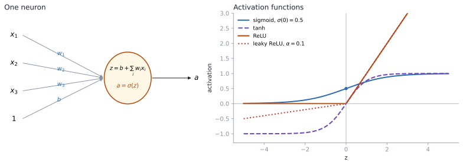

# 12. Neural Networks and Backpropagation

This last chapter builds feed-forward neural networks from the single neuron up. A sigmoid neuron turns out to be logistic regression; stacking neurons in layers gives nonlinear decision boundaries; and backpropagation, which is just the chain rule applied carefully, computes every gradient in one backward pass. It ends with why sigmoid networks suffer vanishing gradients and how ReLU-type activations help.

## 12.1 Biological motivation

The brain has about 86 billion neurons, each connected to roughly a thousand others. A biological neuron sums electrochemical inputs and fires a spike when a voltage threshold is crossed, a response that is roughly all-or-nothing. The artificial neuron keeps only the useful abstraction: combine inputs, decide how strongly to activate, pass the result on. Arranging many of them in layers lets the model represent far more than a single linear boundary.



*Left: a neuron computes $z=b+\sum_iw_ix_i$ and outputs $a=\sigma(z)$. Right: sigmoid ($\sigma(0)=0.5$, range $(0,1)$), tanh (range $(-1,1)$), ReLU (kink at 0) and leaky ReLU ($\alpha=0.1$).*

## 12.2 The artificial neuron

For inputs $x_1,\ldots,x_m$, weights $w_1,\ldots,w_m$ and bias $b$:

$$ z=b+\sum_{i=1}^{m}x_iw_i=b+x^\top w, \qquad a=\sigma(z). $$

| Symbol | Name |
|---|---|
| $z$ | net input / pre-activation |
| $b$ | bias (a weight on a constant input of 1) |
| $\sigma$ | activation function |
| $a$ | activation, passed to the next layer |

## 12.3 A sigmoid neuron is logistic regression

With $\sigma(z)=1/(1+e^{-z})$ the neuron computes $a=\sigma(b+x^\top w)$, which is exactly the logistic-regression model from [Chapter 5](05_logistic_and_softmax_regression.md): the weights are the coefficients and the bias is the intercept. A network is many logistic regressions feeding into each other.

## 12.4 The sigmoid derivative

$$ \sigma'(z)=\frac{e^{-z}}{(1+e^{-z})^2}=\frac{(1+e^{-z})-1}{(1+e^{-z})^2}=\frac{1}{1+e^{-z}}-\frac{1}{(1+e^{-z})^2}=\sigma(z)\left(1-\sigma(z)\right). $$

This is convenient for backpropagation: the derivative comes straight from the activation value already computed in the forward pass.

## 12.5 A worked neuron

$$ x=[0.9,\;0.2,\;0.3], \qquad w=[2,\;3,\;-1], \qquad b=0.5, $$

$$ z=(0.9)(2)+(0.2)(3)+(0.3)(-1)+0.5=2.6, \qquad a=\sigma(2.6)=\frac{1}{1+e^{-2.6}}\approx0.93 . $$

## 12.6 Why more than one neuron?

A single sigmoid neuron's decision boundary is $b+x^\top w=0$, a hyperplane. It can't learn XOR, for example. A hidden layer computes new features, each a nonlinear function of the input, and the output layer draws a linear boundary in *that* space. The boundary in input space becomes nonlinear.

> [!NOTE]
> **Beyond the lecture: how expressive?**
>
> The universal approximation theorem (Cybenko 1989; Hornik 1991) says one hidden layer with enough units and a non-polynomial activation can approximate any continuous function on a compact set to any accuracy. It says nothing about how many units that takes or whether gradient descent will find them. In practice, depth buys the same expressiveness with far fewer units.

## 12.7 A layer in matrix form

I use a **row-vector** convention: an example is a row and $W^{(l)}$ maps layer $l$ to layer $l+1$. With 3 inputs and 4 hidden units, $W^{(1)}\in\mathbb{R}^{3\times4}$ and

$$ a^{(1)}=x, \qquad z^{(2)}=a^{(1)}W^{(1)}+b^{(2)}, \qquad a^{(2)}=\sigma\left(z^{(2)}\right)\in\mathbb R^{4}, $$

with $\sigma$ applied elementwise. Stacking a mini-batch of $B$ examples as the rows of $A^{(1)}\in\mathbb R^{B\times3}$ makes the same formula compute the whole batch at once. Many textbooks use columns and write $Wx$ instead; both work as long as you stay consistent about transposes.

## 12.8 Forward propagation

$$ a^{(1)}=x, \qquad z^{(l+1)}=a^{(l)}W^{(l)}+b^{(l+1)}, \qquad a^{(l+1)}=\sigma^{(l+1)}\left(z^{(l+1)}\right), \qquad \hat{y}=a^{(L)} . $$

A forward pass is a chain of affine maps and elementwise nonlinearities. Keep every $z^{(l)}$ and $a^{(l)}$; the backward pass needs them.

## 12.9 Training loop

1. Predict (forward pass).
2. Compute the loss $J(y,\hat y)$.
3. Compute $\partial J/\partial W^{(l)}$ for every layer (backward pass).
4. Update $W^{(l)}\leftarrow W^{(l)}-\eta\,\partial J/\partial W^{(l)}$.
5. Repeat over mini-batches and epochs.

## 12.10 The chain rule

For $y=g(x)$ and $f=f(y)$, $\dfrac{df}{dx}=\dfrac{df}{dy}\dfrac{dy}{dx}$. For a longer chain $f(x)=f^{(3)}(f^{(2)}(f^{(1)}(x)))$, multiply the local derivatives along the path.

**Worked example.** $a=e^x$, $b=a+1$, $c=1/b$, so $c=1/(e^x+1)$. At $x=-1$:

| Step | Forward value | Local derivative |
|---|---|---|
| $a=e^x$ | $0.368$ | $\partial a/\partial x=e^x=0.368$ |
| $b=a+1$ | $1.368$ | $\partial b/\partial a=1$ |
| $c=1/b$ | $0.731$ | $\partial c/\partial b=-1/b^2=-0.534$ |

$$ \frac{\partial c}{\partial x}=(-0.534)(1)(0.368)\approx-0.197 . $$

That is the whole mechanism: store forward values, compute each local derivative, multiply backward.

## 12.11 Backpropagation for a feed-forward network

Define the **error signal** at layer $l$ as $\delta^{(l)}=\partial J/\partial z^{(l)}$ (a row vector). Then:

**Output layer:**

$$ \delta^{(L)}=\nabla_{a^{(L)}}J\odot\sigma^{(L)\prime}\left(z^{(L)}\right). $$

**Hidden layers**, going backward for $l=L-1,\ldots,2$:

$$ \delta^{(l)}=\left(\delta^{(l+1)}\left(W^{(l)}\right)^{\top}\right)\odot\sigma^{(l)\prime}\left(z^{(l)}\right). $$

**Parameter gradients:**

$$ \frac{\partial J}{\partial W^{(l)}}=\left(a^{(l)}\right)^{\top}\delta^{(l+1)}, \qquad \frac{\partial J}{\partial b^{(l+1)}}=\delta^{(l+1)} . $$

Read the hidden-layer rule as: send the error back through the weights that carried the signal forward, then scale by how sensitive each unit's activation was. The weight gradient is an outer product of the layer's input activation and the error at its output.

> [!TIP]
> **A handy special case**
>
> With a sigmoid output and binary cross-entropy loss, or a softmax output and categorical cross-entropy, the output error simplifies to $\delta^{(L)}=\hat y-y$. The $\sigma'$ factor cancels, just as in the logistic-regression gradient. This is one reason cross-entropy, not squared error, is the standard classification loss.

Written as a scalar chain for a 3-weight-layer network, the same result reads

$$ \frac{\partial J}{\partial W^{(1)}}\;\propto\;(\hat y-y)\,W^{(3)}\,\sigma'\left(z^{(3)}\right)\,W^{(2)}\,\sigma'\left(z^{(2)}\right)\,x, $$

which hides the transposes and elementwise products but makes the key point visible: **an early layer's gradient contains a product of every downstream weight and activation derivative.**

```python
import numpy as np
# Two-layer network, row-vector convention, sigmoid hidden + sigmoid output, BCE loss.
sig = lambda z: 1 / (1 + np.exp(-z))
def forward_backward(X, y, W1, b2, W2, b3):
    z2 = X @ W1 + b2;  a2 = sig(z2)
    z3 = a2 @ W2 + b3; a3 = sig(z3)
    d3 = a3 - y                          # output error (sigmoid + BCE)
    d2 = (d3 @ W2.T) * a2 * (1 - a2)     # hidden error
    # gradients of the summed BCE loss; checked against finite differences
    return a3, (X.T @ d2, d2.sum(0), a2.T @ d3, d3.sum(0))
```

## 12.12 Forward and backward together

**Forward:** compute and store $z^{(l)}$, $a^{(l)}$ for all layers, then the loss.
**Backward:** compute $\delta^{(L)}$; propagate with $(W^{(l)})^\top$; multiply by $\sigma'(z^{(l)})$; form the weight gradients as outer products; update.

The backward pass costs about the same as the forward pass. That is why training a network with millions of parameters is feasible. Computing each gradient separately would multiply the cost by the number of parameters.

## 12.13 Vanishing gradients

For the sigmoid, $\sigma'(z)=\sigma(z)(1-\sigma(z))\le\tfrac14$, with the maximum at $z=0$. The early-layer gradient multiplies one such factor per layer, so with 10 sigmoid layers the activation part alone can shrink the gradient by up to $4^{-10}\approx10^{-6}$. Early layers barely learn. It gets worse when units saturate ($|z|$ large, $\sigma'\approx0$). The weights also enter the product: large weights can instead make gradients **explode**.

## 12.14 tanh

$$ \tanh(z)=\frac{e^{z}-e^{-z}}{e^{z}+e^{-z}}, \qquad \tanh(0)=0, \qquad \tanh(z)\to\pm1, \qquad \frac{d}{dz}\tanh(z)=1-\tanh^2(z)\le1 . $$

tanh is zero-centered, which helps optimization compared with the always-positive sigmoid, but it still saturates, so it still suffers vanishing gradients in deep stacks.

## 12.15 ReLU

$$ \mathrm{ReLU}(z)=\max(0,z), \qquad \mathrm{ReLU}'(z)=\begin{cases}1 & z>0\\ 0 & z<0\end{cases} $$

(at $z=0$ pick either value). On the active side the slope is exactly 1, so ReLU doesn't contribute the repeated $\le\frac14$ factors. It is also cheap to compute. This is the default hidden activation in modern networks.

## 12.16 Leaky ReLU

$$ \mathrm{LReLU}(z)=\max(\alpha z,z), \qquad 0<\alpha<1 \;(\text{e.g. }\alpha=0.1), $$

whose slope is $\alpha$ instead of 0 for $z<0$.

## 12.17 Dying ReLU

A ReLU unit is **dead** if its pre-activation is negative for every input. It always outputs 0, its gradient is 0, and it never recovers. Common causes are a learning rate that's too high (one big step pushes the bias very negative) or a large negative bias.

ReLU networks still train despite the zero slope because a unit only needs to be positive for *some* examples in a mini-batch to receive gradient. Leaky ReLU (and relatives like ELU and GELU) removes the dead zone entirely. Its outputs are also more centered around zero, which tends to speed up optimization.

## 12.18 Activation comparison

| Activation | Range | Max slope | Negative side | Main issue |
|---|---|---|---|---|
| Sigmoid | $(0,1)$ | $0.25$ | small positive slope | vanishing gradients; not zero-centered |
| tanh | $(-1,1)$ | $1$ | saturates at $-1$ | still saturates |
| ReLU | $[0,\infty)$ | $1$ | exactly 0 | dying units |
| Leaky ReLU | $(-\infty,\infty)$ | $1$ | slope $\alpha$ | one more hyperparameter |

> [!NOTE]
> **Beyond the lecture: the rest of the toolkit against vanishing and exploding gradients**
>
> Activation choice is one lever. The others: **initialization** scaled to layer width (He initialization for ReLU, Xavier/Glorot for tanh) so activations keep a steady variance through depth; **normalization** layers (batch norm, layer norm); **residual connections** $a^{(l+1)}=a^{(l)}+F(a^{(l)})$, which give gradients an identity path; and **gradient clipping** against explosions. Recurrent networks face the same problem across time steps, which is what LSTM gates address ([Temporal Learning, Chapter 8](../../modern-temporal-learning/notes/08_rnn_lstm_gru_and_seq2seq.md)).

## 12.19 Common mistakes

1. **Forgetting the bias.** Every boundary is then forced through the origin.
2. **Applying the activation before the weighted sum.**
3. **Mixing row- and column-vector conventions.**
4. **Coding the scalar chain formula directly.** Matrices need the transposes and elementwise products of §12.11.
5. **Differentiating only the local layer.** An early weight's gradient includes every later layer.
6. **Recomputing forward values during the backward pass** instead of caching them.
7. **Assuming ReLU solves everything.** Dead units and exploding gradients remain.
8. **Pairing a sigmoid output with squared error** for classification. Use cross-entropy.

## 12.20 Summary

- A neuron computes an affine function followed by a nonlinearity; a sigmoid neuron is logistic regression.
- Hidden layers create nonlinear features, and hence nonlinear boundaries.
- Backpropagation applies the chain rule backward, reusing stored forward values, to get all gradients in one pass.
- Sigmoid derivatives are at most 1/4, so deep sigmoid networks suffer vanishing gradients.
- ReLU's unit slope avoids this but can produce dead units; leaky ReLU, good initialization, normalization and residual connections help further.

## 12.21 Self-check

1. Why is a sigmoid neuron equivalent to logistic regression?
2. Reproduce the worked neuron: $z=2.6$, $a\approx0.93$.
3. Why can't a single neuron learn XOR?
4. What shape is $W^{(1)}$ for 3 inputs and 4 hidden units in the row convention?
5. Write the hidden-layer error-signal recursion.
6. Why is $\partial J/\partial W^{(l)}$ an outer product?
7. What is the maximum of $\sigma'$, and why does it matter?
8. What makes a ReLU unit die?

<details>
<summary>Answers</summary>

1. It computes $\sigma(b+x^\top w)$, the logistic-regression hypothesis.
2. $1.8+0.6-0.3+0.5=2.6$; $1/(1+e^{-2.6})=0.931$.
3. Its boundary is a single hyperplane, and XOR's classes aren't linearly separable.
4. $3\times4$.
5. $\delta^{(l)}=(\delta^{(l+1)}W^{(l)\top})\odot\sigma'(z^{(l)})$.
6. Each weight $W^{(l)}_{jk}$ connects input unit $j$ to output unit $k$, so its gradient is $a^{(l)}_j\,\delta^{(l+1)}_k$.
7. $1/4$ at $z=0$; repeated multiplication shrinks gradients exponentially with depth.
8. Its pre-activation becomes negative for all inputs (often after a large update), so it gets zero gradient forever.

</details>
