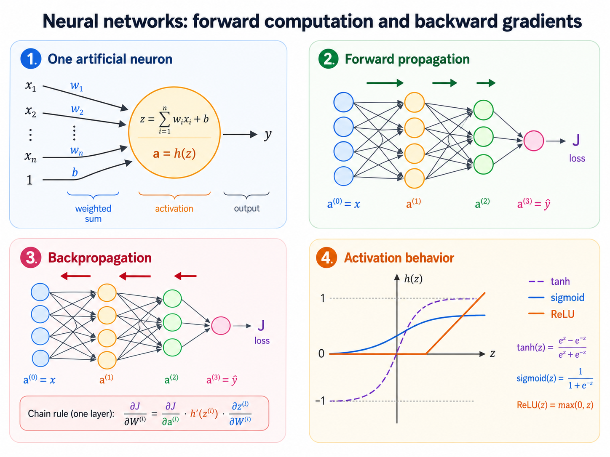

# 12. Neural Networks and Backpropagation

**Source pages:** 54–60  
**Status:** reconstructed and equation-checked

This chapter introduces feedforward neural networks from the source's biological motivation, connects a single sigmoid neuron to logistic regression, and develops the forward and backward computations used for training. The final pages explain vanishing gradients and compare sigmoid, hyperbolic tangent, ReLU, and leaky ReLU activations.

## 12.1 Biological motivation

Page 54 begins with a simplified analogy to biological neural systems. The source states that the human brain contains approximately $86$ billion neurons and that each neuron connects to roughly $1{,}000$ others. It describes biological neurons as receiving electrochemical inputs, producing spikes when a voltage threshold is exceeded, and passing signals to other neurons. The response is presented as approximately all-or-nothing.

The purpose of the analogy is not to reproduce the biology exactly. It motivates a mathematical unit that:

- receives signals from previous units;
- combines those signals;
- decides how strongly to activate;
- passes its output to units in the next layer.

By arranging many units in layers, the model can represent a more complicated input-output relationship than a single linear decision boundary.

*Redrawn from source pages 54–60: each neuron computes a weighted sum followed by an activation, layers compose these computations in the forward direction, and backpropagation sends loss derivatives in the reverse direction.*

## 12.2 The basic artificial neuron

For inputs $x_1,\ldots,x_m$, weights $w_1,\ldots,w_m$, and bias $b$, the source defines the net input:

$$ z=b+\sum_{i=1}^{m}x_iw_i. $$

In vector notation:

$$ z=b+x^{\top}w. $$

An activation function $\sigma$ transforms this net input into the neuron's output:

$$ a=\sigma(z). $$

The source uses the following terminology:

| Quantity | Meaning |
|---|---|
| $z$ | net input or pre-activation |
| $b$ | bias term |
| $\sigma$ | activation function |
| $a$ | output passed to the next layer |

The bias can be represented as a weight attached to a constant input of $1$:

$$ z=x_1w_1+\cdots+x_mw_m+1\cdot b. $$

## 12.3 A sigmoid neuron is logistic regression

When the activation is the logistic sigmoid:

$$ \sigma(z)=\frac{1}{1+e^{-z}}, $$

the neuron computes:

$$ a=\sigma\left(b+x^{\top}w\right). $$

This is the same functional form used by binary logistic regression. The source makes the following correspondence:

- neural-network weights correspond to logistic-regression coefficients;
- neural-network inputs correspond to predictor variables;
- the bias corresponds to the constant or intercept term.

A single sigmoid neuron is therefore a logistic-regression unit. A neural network becomes more expressive by composing many such units across layers.

## 12.4 Derivative of the sigmoid function

Page 55 derives a useful identity. Starting from:

$$ \sigma(z)=\frac{1}{1+e^{-z}}, $$

its derivative is:

$$ \sigma'(z)=\frac{e^{-z}}{\left(1+e^{-z}\right)^2}. $$

Rewrite the numerator as:

$$ e^{-z}=\left(1+e^{-z}\right)-1. $$

Then:

$$ \sigma'(z)=\frac{1}{1+e^{-z}}-\frac{1}{\left(1+e^{-z}\right)^2}. $$

Factoring the sigmoid gives:

$$ \sigma'(z)=\sigma(z)\left(1-\sigma(z)\right). $$

This identity is especially useful in backpropagation because the derivative can be computed from the already available activation value.

## 12.5 Numerical neuron example

The source evaluates a sigmoid neuron with:

$$ x=\begin{bmatrix}0.9 & 0.2 & 0.3\end{bmatrix}, \qquad w=\begin{bmatrix}2 & 3 & -1\end{bmatrix}, \qquad b=0.5. $$

The net input is:

$$ z=(0.9)(2)+(0.2)(3)+(0.3)(-1)+0.5=2.6. $$

The output is approximately:

$$ a=\sigma(2.6)=\frac{1}{1+e^{-2.6}}\approx 0.93. $$

The neuron therefore passes a value near $0.93$ to the next layer.

## 12.6 Why use more than one neuron?

Page 56 asks why a larger network is needed when one neuron already performs logistic regression. A single sigmoid neuron uses:

$$ \sigma\left(b+x^{\top}w\right), $$

so its threshold is determined by a linear equation:

$$ b+x^{\top}w=0. $$

It can therefore produce only a linear decision boundary in the original feature space. The source argues that many real-world relationships are more complicated. Hidden layers create intermediate representations that allow the final prediction to depend on nonlinear combinations of the original inputs.

> [!NOTE]
> **Source scope**
>
> The source motivates greater representational capacity but does not state or prove a universal-approximation theorem. This chapter therefore keeps the claim at the source's level: layered neurons can construct more complex models than a single linear classifier.

## 12.7 Matrix representation of a layer

The source uses a row-vector convention for its first layer. Let the input also be the activation of layer $1$:

$$ x=a^{(1)}. $$

For three inputs and four neurons in the next layer:

$$ W^{(1)}\in\mathbb{R}^{3\times 4}. $$

The pre-activation vector is:

$$ z^{(2)}=a^{(1)}W^{(1)}+b^{(2)}, $$

and the activation vector is:

$$ a^{(2)}=\sigma\left(z^{(2)}\right). $$

Thus:

$$ z^{(2)},a^{(2)}\in\mathbb{R}^{4}. $$

The activation is applied elementwise:

$$ a_j^{(2)}=\sigma\left(z_j^{(2)}\right). $$

> [!NOTE]
> **Added clarification: vector conventions**
>
> The source stores examples and activations as row vectors, so $W^{(l)}$ maps layer $l$ to layer $l+1$. Many textbooks store activations as columns and transpose the weight matrices. Both conventions describe the same computation, but matrix dimensions and transpose locations must remain consistent. This chapter keeps the source's row-vector convention.

## 12.8 Forward propagation

A feedforward network computes layer after layer from the input toward the prediction. Begin with:

$$ a^{(1)}=x. $$

For each connection $l=1,\ldots,L-1$:

$$ z^{(l+1)}=a^{(l)}W^{(l)}+b^{(l+1)}, $$

$$ a^{(l+1)}=\sigma^{(l+1)}\left(z^{(l+1)}\right). $$

The final activation is the prediction:

$$ \hat{y}=a^{(L)}. $$

A forward pass therefore consists of repeated affine transformations and activation functions.

## 12.9 Training with gradient descent

Page 57 reviews the training loop:

1. Make a prediction.
2. Calculate the loss.
3. Calculate the gradient of the loss with respect to the parameters.
4. Move the parameters in the direction that lowers the loss.
5. Repeat.

Let the neural network define a function:

$$ F:X\longrightarrow Y. $$

Its weights determine the particular function represented by the network. For a loss $J(y,F(x))$, training requires the derivative with respect to every weight:

$$ \frac{\partial J}{\partial W_k}. $$

Gradient descent updates a parameter matrix as:

$$ W^{(l)}\leftarrow W^{(l)}-\eta\frac{\partial J}{\partial W^{(l)}}, $$

where $\eta$ is the learning rate.

## 12.10 The chain rule

Backpropagation is repeated application of the chain rule through a computation graph. If:

$$ y=g(x), \qquad f=f(y), $$

then:

$$ \frac{df}{dx}=\frac{df}{dy}\frac{dy}{dx}. $$

For a longer composition:

$$ f(x)=f^{(3)}\left(f^{(2)}\left(f^{(1)}(x)\right)\right), $$

the derivative is:

$$ \frac{df}{dx}=\frac{\partial f}{\partial f^{(3)}}\frac{\partial f^{(3)}}{\partial f^{(2)}}\frac{\partial f^{(2)}}{\partial f^{(1)}}\frac{\partial f^{(1)}}{\partial x}. $$

Page 58 illustrates this with the composition:

$$ f^{(1)}(x)=e^x, \qquad f^{(2)}(a)=a+1, \qquad f^{(3)}(b)=\frac{1}{b}. $$

Thus:

$$ f(x)=\frac{1}{e^x+1}. $$

At $x=-1$, the forward values in the source are approximately:

$$ a=e^{-1}\approx 0.37, \qquad b=a+1\approx 1.37, \qquad c=\frac{1}{b}\approx 0.73. $$

The local derivatives are:

$$ \frac{\partial c}{\partial b}=-\frac{1}{b^2}, \qquad \frac{\partial b}{\partial a}=1, \qquad \frac{\partial a}{\partial x}=e^x. $$

Multiplying them gives:

$$ \frac{\partial c}{\partial x}=-\frac{e^x}{\left(e^x+1\right)^2}\approx -0.20 \quad \text{at } x=-1. $$

The example shows the central mechanism: save forward values, compute each local derivative, and multiply derivatives backward along the path.

## 12.11 Backpropagation through a feedforward network

Page 57 gives dependency-chain expressions for a network with several weight matrices. In the source's scalar-style notation, the last-layer derivative has the form:

$$ \frac{\partial J}{\partial W^{(3)}}=(\hat{y}-y)\,a^{(3)}. $$

Moving one layer earlier introduces the next weight and the activation derivative:

$$ \frac{\partial J}{\partial W^{(2)}}=(\hat{y}-y)\,W^{(3)}\,\sigma'\left(z^{(3)}\right)\,a^{(2)}. $$

For an earlier layer, another weight and activation derivative are added:

$$ \frac{\partial J}{\partial W^{(1)}}=(\hat{y}-y)\,W^{(3)}\,\sigma'\left(z^{(3)}\right)\,W^{(2)}\,\sigma'\left(z^{(2)}\right)\,x. $$

These expressions emphasize the chain of dependencies. Each earlier gradient includes every downstream derivative between that parameter and the loss.

> [!WARNING]
> **Source notation and matrix shapes**
>
> The slide's “punchline” suppresses transposes, outer products, and elementwise products so that the dependency chain is visible. It should not be copied directly as dimension-complete matrix code.

A dimension-explicit row-vector form defines the error signal at layer $l$ as:

$$ \delta^{(l)}=\frac{\partial J}{\partial z^{(l)}}. $$

For the output layer:

$$ \delta^{(L)}=\nabla_{a^{(L)}}J\odot\sigma^{(L)\prime}\left(z^{(L)}\right). $$

For a hidden layer $l=L-1,\ldots,2$:

$$ \delta^{(l)}=\delta^{(l+1)}\left(W^{(l)}\right)^{\top}\odot\sigma^{(l)\prime}\left(z^{(l)}\right). $$

Because $W^{(l)}$ connects layer $l$ to layer $l+1$, the parameter gradients are:

$$ \frac{\partial J}{\partial W^{(l)}}=\left(a^{(l)}\right)^{\top}\delta^{(l+1)}, $$

$$ \frac{\partial J}{\partial b^{(l+1)}}=\delta^{(l+1)}. $$

Here $\odot$ denotes elementwise multiplication. These equations make explicit the transposes, elementwise products, and outer products hidden by the source's compact chain notation.

## 12.12 Forward and backward passes together

Training one example can be summarized as follows.

### Forward pass

For $l=1,\ldots,L-1$:

$$ z^{(l+1)}=a^{(l)}W^{(l)}+b^{(l+1)}, $$

$$ a^{(l+1)}=\sigma^{(l+1)}\left(z^{(l+1)}\right). $$

Then calculate:

$$ J\left(y,a^{(L)}\right). $$

### Backward pass

1. Compute $\delta^{(L)}$ from the loss and the output activation.
2. Propagate error signals backward with $\left(W^{(l)}\right)^{\top}$.
3. Multiply by the local activation derivative.
4. Form each weight gradient as an outer product with the previous activation.
5. Update the weights and biases.

The forward pass evaluates the network. The backward pass efficiently reuses intermediate derivatives to evaluate all parameter gradients.

## 12.13 Vanishing gradients

Page 59 recalls the early-layer dependency chain:

$$ \frac{\partial J}{\partial W^{(1)}}=(\hat{y}-y)\,W^{(3)}\,\sigma'\left(z^{(3)}\right)\,W^{(2)}\,\sigma'\left(z^{(2)}\right)\,x. $$

For the sigmoid function:

$$ \sigma'(z)=\sigma(z)\left(1-\sigma(z)\right). $$

Because $0<\sigma(z)<1$:

$$ 0<\sigma'(z)\leq\frac{1}{4}. $$

As more sigmoid layers are added, the backward chain repeatedly multiplies by factors no larger than $0.25$. The source explains that gradients reaching early layers can become very small. This is the **vanishing-gradient problem**.

> [!NOTE]
> **Added clarification**
>
> The complete gradient also contains weight matrices, so the exact magnitude depends on both weights and activation derivatives. The source's main point is that repeated small sigmoid derivatives strongly encourage shrinking gradients, especially when units are saturated.

## 12.14 Hyperbolic tangent activation

The hyperbolic tangent activation is:

$$ \tanh(z)=\frac{\sinh(z)}{\cosh(z)}=\frac{e^{2z}-1}{e^{2z}+1}. $$

The source records:

$$ \tanh(0)=0, $$

$$ \lim_{z\to\infty}\tanh(z)=1, $$

$$ \lim_{z\to-\infty}\tanh(z)=-1. $$

Unlike the sigmoid, tanh is centered around zero. It is still a saturating activation, so its derivative can also become small for inputs with large magnitude.

> [!NOTE]
> **Added derivative for review**
>
> The source plots and defines tanh but does not derive its derivative. For reference:
>
> $$ \frac{d}{dz}\tanh(z)=1-\tanh^2(z). $$

## 12.15 Rectified linear unit

The rectified linear unit is:

$$ \mathrm{ReLU}(z)=\max(0,z). $$

It returns $0$ for negative inputs and $z$ for nonnegative inputs.

The source highlights:

$$ \mathrm{ReLU}(0)=0, $$

$$ \mathrm{ReLU}(z)=z \quad \text{for large positive } z, $$

$$ \mathrm{ReLU}(-z)=0 \quad \text{for } z>0. $$

For positive inputs, the slope is $1$, so the activation does not introduce the same repeated factor of at most $0.25$ as the sigmoid.

## 12.16 Leaky ReLU

Leaky ReLU replaces the zero negative branch with a small nonzero slope:

$$ \mathrm{LReLU}(z)=\max(\alpha z,z), \qquad 0<\alpha<1. $$

It returns $\alpha z$ for negative inputs and $z$ for nonnegative inputs.

The source's graph uses an example value:

$$ \alpha=0.1. $$

Its negative-side derivative is $\alpha$ rather than $0$.

## 12.17 Dying ReLU

Page 60 explains a failure mode of ordinary ReLU. A ReLU unit is described as **dead** when its pre-activation remains negative for all relevant examples, so it always outputs:

$$ a=0. $$

The negative-side slope is also zero:

$$ \frac{d}{dz}\mathrm{ReLU}(z)=0 \quad \text{for } z<0. $$

Consequently, that unit receives no gradient through the activation and may fail to recover. The source states that this is more likely when:

- the learning rate is too high;
- the unit has a large negative bias.

The notes also clarify why ReLU can still train despite its zero negative slope. A stochastic-gradient step normally contains multiple examples. As long as some examples place the unit on the positive side, the batch can still produce a nonzero gradient.

Leaky ReLU addresses the dead-unit problem because its negative branch has a nonzero slope. The source also states that it may speed training because its activations can be more balanced around zero. It briefly connects this claim to smaller off-diagonal entries in the Fisher information matrix but explicitly says that this detail can be ignored for the course discussion.

## 12.18 Activation comparison

| Activation | Output range | Negative-side behavior | Main source observation |
|---|---|---|---|
| Sigmoid | $(0,1)$ | positive but can be very small | derivative is at most $0.25$; repeated factors can vanish |
| Tanh | $(-1,1)$ | smooth and saturating | centered at zero |
| ReLU | $[0,\infty)$ | exactly zero for $z<0$ | avoids sigmoid-style saturation on the positive side but can die |
| Leaky ReLU | $(-\infty,\infty)$ | slope $\alpha$ for $z<0$ | reduces the dying-ReLU problem |

## 12.19 Common mistakes

### Mistake 1: forgetting the bias

A neuron computes an affine transformation before activation. Omitting $b$ restricts every decision surface to pass through the origin.

### Mistake 2: applying activation before the weighted sum

The source computation is:

$$ z=b+x^{\top}w, \qquad a=\sigma(z). $$

The activation is applied after combining the inputs.

### Mistake 3: mixing row- and column-vector conventions

Both conventions are valid, but switching conventions without adjusting matrix dimensions and transposes produces incorrect formulas.

### Mistake 4: treating the source's scalar chain as matrix-ready code

The slide intentionally emphasizes dependency factors. Matrix gradients require transposes, elementwise products, and outer products.

### Mistake 5: differentiating only the local layer

An early weight affects the loss through every later layer. Its derivative must include the entire downstream chain.

### Mistake 6: recomputing forward quantities during every derivative

Backpropagation reuses stored activations and pre-activations from the forward pass. This reuse is what makes the procedure efficient.

### Mistake 7: assuming ReLU always prevents vanishing gradients

ReLU has derivative $1$ on its positive side, but it has derivative $0$ on its negative side. Units that remain negative can become inactive.

### Mistake 8: treating activation choice as independent of optimization

The source links sigmoid to vanishing gradients and ReLU to dead units. Activation behavior directly affects how gradients move through the network.

## 12.20 Chapter summary

- A neuron computes a weighted sum plus bias and then applies an activation.
- A sigmoid neuron has the same form as logistic regression.
- The sigmoid derivative is $\sigma(z)(1-\sigma(z))$.
- Hidden layers compose many neuron computations to represent more complex relationships.
- Forward propagation evaluates affine transformations and activations layer by layer.
- Backpropagation applies the chain rule in reverse to obtain every parameter gradient.
- Earlier-layer gradients contain all downstream weight and activation-derivative factors.
- Repeated sigmoid derivatives can produce vanishing gradients.
- Tanh is zero-centered but still saturates.
- ReLU has a unit positive-side slope but can suffer from dying units.
- Leaky ReLU provides a nonzero negative-side slope and reduces the dying-ReLU problem.

## 12.21 Self-check questions

1. What biological properties motivate the artificial-neuron abstraction in the source?
2. Write the scalar and vector forms of a neuron's net input.
3. How is the output activation computed from the net input?
4. Why is a sigmoid neuron equivalent to a logistic-regression unit?
5. Derive $\sigma'(z)=\sigma(z)(1-\sigma(z))$.
6. Reproduce the source's numerical neuron example and its output.
7. Why can a single sigmoid neuron create only a linear decision boundary?
8. Under the source's row-vector convention, what are the dimensions of $W^{(1)}$ for three inputs and four next-layer units?
9. Write the forward-propagation equations for layer $l$.
10. What five steps form the gradient-descent training loop?
11. How does the chain rule operate through a composed computation graph?
12. What quantities should be stored during the forward pass for backpropagation?
13. Define the error signal $\delta^{(l)}$.
14. How is a hidden-layer error signal computed from the next layer?
15. Why is $\partial J/\partial W^{(l)}$ an outer product in the source's row-vector convention?
16. Why can repeated sigmoid layers produce vanishing gradients?
17. What is the maximum value of the sigmoid derivative?
18. How do sigmoid and tanh output ranges differ?
19. Define ReLU and leaky ReLU.
20. What causes a ReLU unit to become dead, and how does leaky ReLU address the problem?
