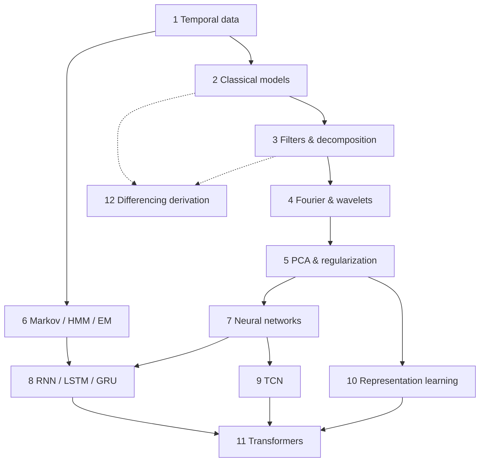

# Course Map: Modern Temporal Learning

The course runs from classical statistics to deep sequence models. Each row says which question the chapter answers and what to take away from it.

| # | Chapter | Question it answers | Key takeaways |
|---:|---|---|---|
| 1 | [Temporal data and learning](notes/01_temporal_data_and_learning.md) | What makes time series different from tabular data? | dependence, ordering, leakage, time-aware validation |
| 2 | [Stationarity and classical models](notes/02_classical_time_series_models.md) | How do we model dependence with few parameters? | stationarity, ACF/PACF, AR/MA/ARIMA/SARIMAX, residual checks |
| 3 | [Filters, smoothing and decomposition](notes/03_filters_smoothing_and_decomposition.md) | How do we separate trend, season and noise? | moving averages, EWMA ⇔ IMA(1,1), Holt–Winters, STL, transfer functions |
| 4 | [Fourier analysis and wavelets](notes/04_wavelets.md) | Which frequencies are present, and *when*? | DFT, time–frequency trade-off, Haar/Daubechies, thresholding |
| 5 | [PCA and regularization](notes/05_pca_and_regularization.md) | How do we compress and control variance? | PCA, T²/Q monitoring, ridge, lasso, soft thresholding |
| 6 | [Markov models, HMMs and EM](notes/06_markov_models_hmm_and_em.md) | How do we reason about hidden discrete states? | forward–backward, Viterbi, Baum–Welch, GMM + EM |
| 7 | [Neural-network foundations](notes/07_neural_network_foundations.md) | How do we train a flexible nonlinear model? | cross-entropy = MLE, SGD variants, regularizers, parameter counting |
| 8 | [RNNs, LSTMs, GRUs and seq2seq](notes/08_rnn_lstm_gru_and_seq2seq.md) | How can a network carry memory through time? | BPTT, vanishing gradients, gates, stateful training, attention's origin |
| 9 | [Temporal convolutional networks](notes/09_temporal_convolutional_networks.md) | Can convolutions replace recurrence? | causal + dilated convs, receptive field $1+(k-1)\sum d$, residual blocks |
| 10 | [Representation and contrastive learning](notes/10_representation_learning.md) | How do we learn good features without labels? | kernel PCA, temporal autoencoders, NT-Xent, projection heads |
| 11 | [Transformers](notes/11_transformers.md) | What if every step can look at every other step? | scaled dot-product attention, multi-head, masking, time-series variants |
| 12 | [Appendix: stationarity and differencing](notes/12_handwritten_appendix.md) | Why is a differenced random walk plus noise MA(1)? | full derivation, the MA coefficient, link to EWMA |

## How the ideas connect

Dashed lines lead to the appendix. For every formula in one place, see the [equation reference](reference/equations.md). To test yourself, use the [questions and discussion](reference/questions_and_discussion.md) page.
