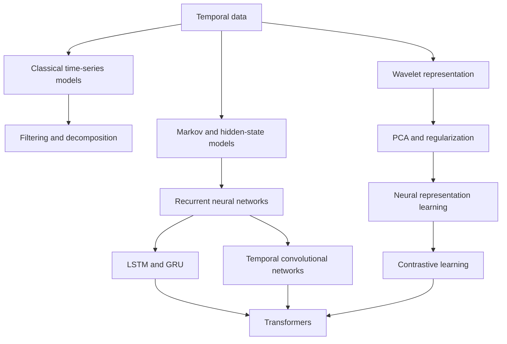

# Course Map

| Chapter | Lecture pages | Topic |
|---:|---:|---|
| 01 | 2-4 | [Temporal data and temporal learning](notes/01_temporal_data_and_learning.md) |
| 02 | 5-13 | [Stationarity and classical time-series models](notes/02_classical_time_series_models.md) |
| 03 | 14-19 | [Filters, smoothing, decomposition, and transfer functions](notes/03_filters_smoothing_and_decomposition.md) |
| 04 | 20-32 | [Fourier analysis and wavelets](notes/04_wavelets.md) |
| 05 | 33-44 | [PCA, bias-variance, regularization, and thresholding](notes/05_pca_and_regularization.md) |
| 06 | 45-55 | [Markov chains, HMMs, Gaussian mixtures, and EM](notes/06_markov_models_hmm_and_em.md) |
| 07 | 56-65 | [Neural-network foundations and training](notes/07_neural_network_foundations.md) |
| 08 | 66-78 | [RNNs, LSTMs, GRUs, and encoder-decoder models](notes/08_rnn_lstm_gru_and_seq2seq.md) |
| 09 | 79-82 | [Temporal convolutional networks](notes/09_temporal_convolutional_networks.md) |
| 10 | 83-91 | [Temporal representation and contrastive learning](notes/10_representation_learning.md) |
| 11 | 92-100 | [Transformers and temporal applications](notes/11_transformers.md) |
| 12 | 101-103 | [Handwritten stationarity and covariance appendix](notes/12_handwritten_appendix.md) |

## Concept progression

