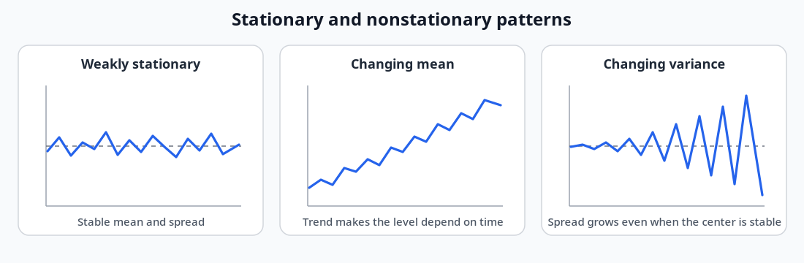
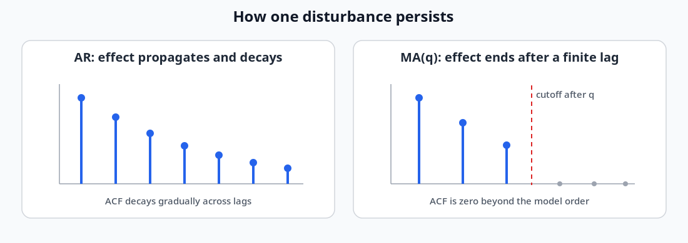
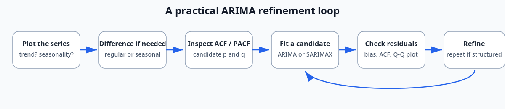

# Stationarity and Classical Time-Series Models

## Chapter map

This chapter builds one continuous idea:

```text
stable statistical behavior
    -> temporal dependence
    -> AR and MA models
    -> differencing for nonstationarity
    -> ARIMA / SARIMAX
    -> residuals that should look like white noise
```

By the end, the main question is not simply **“Does the model fit?”** It is:

> **Key idea:** Has the model captured the temporal structure well enough
> that the remaining residuals no longer contain a predictable pattern?

**Sources:** CSE598MTL.pdf, pp. 5-13

---

## 1. Stationarity: what must remain stable?

A time series can move up and down while still being stationary.
Stationarity describes the **data-generating process**, not whether the
observed line is visually flat.



### Strong stationarity

A process is strongly stationary when shifting every selected time index
by the same amount does not change the joint distribution:

```math
F(x_{t_1},x_{t_2},\ldots,x_{t_n})
=
F(x_{t_1+\tau},x_{t_2+\tau},\ldots,x_{t_n+\tau}).
```

This condition concerns the complete finite-dimensional distribution.

### Weak stationarity

The course presents weak, covariance, or second-order stationarity through
three requirements:

1. the mean is constant over time;
2. the variance is constant over time;
3. covariance depends only on the lag.

For any shift $\tau$:

```math
\mathrm{Cov}(x_i,x_j)
=
\mathrm{Cov}(x_{i+\tau},x_{j+\tau}).
```

The covariance can therefore be written as a function of the separation
between observations rather than their absolute position in time.

### IID and white noise

| Process | Same distribution | Independent | Uncorrelated across time |
|---|---:|---:|---:|
| IID | Yes | Yes | Yes, when moments exist |
| White noise in these notes | Stable mean/variance | Not required | Yes |
| Weakly stationary process | Stable first two moments | Not required | Not necessarily |

> **Handwritten annotation:** White noise is not necessarily IID and does
> not need to be normally distributed.

**Source:** CSE598MTL.pdf, p. 5

---

## 2. Why use an intermediate temporal model?

The course places time-series models between two extremes:

```text
IID assumption
    no temporal dependence

AR / MA / state-space structure
    selected, interpretable dependence

No reusable model structure
    maximum flexibility but little guidance
```

A simple physical system—the ideal stirred tank—shows why current
observations may depend on previous observations.

**Source:** CSE598MTL.pdf, pp. 5-6

---

## 3. Physical intuition: the ideal stirred tank

The system contains:

- tank volume $V$;
- flow rate $f$;
- input concentration $w_t$;
- output concentration $x_t$.

The time constant is:

```math
T=\frac{V}{f}.
```

A larger tank or slower flow creates a larger $T$, so the system responds
more slowly.

For a step change in the input, the response is:

```math
x_t=w_0\left(1-e^{-t/T}\right).
```

The output approaches the new level gradually. Equivalently, the
remaining distance from equilibrium decays exponentially:

```math
w_0-x_t=w_0e^{-t/T}.
```

### Sampling the process

At sampling interval $\Delta t$, the course gives:

```math
x_t=bw_t+(1-b)x_{t-1},
```

where:

```math
b=1-e^{-\Delta t/T}.
```

If $w_t$ is white noise, the lag-one correlation is:

```math
\rho=e^{-\Delta t/T}.
```

| $\Delta t/T$ | 3.0 | 2.0 | 1.0 | 0.5 | 0.25 | 0.10 |
|---:|---:|---:|---:|---:|---:|---:|
| $\rho$ | 0.05 | 0.14 | 0.37 | 0.50 | 0.78 | 0.90 |

> **Intuition:** Faster sampling means the system has had less time to
> change between observations, so adjacent observations are more strongly
> correlated.

**Source:** CSE598MTL.pdf, p. 6

---

## 4. Autocorrelation

Lag $k$ autocorrelation measures the relationship between observations
separated by $k$ time steps:

```math
\rho_k
=
\frac{
\mathrm{Cov}(x_t,x_{t-k})
}{
\mathrm{Var}(x_t)
}.
```

The sample autocorrelation shown in the notes is:

```math
r_k
=
\frac{
\sum_{t=1}^{n-k}
(x_t-\bar{x})(x_{t-k}-\bar{x})
}{
\sum_{t=1}^{n}
(x_t-\bar{x})^2
}.
```

A lag plot visualizes pairs $(x_t,x_{t-k})$:

- a narrow diagonal cloud indicates strong lag dependence;
- a diffuse cloud indicates weak dependence.

**Source:** CSE598MTL.pdf, p. 6

---

## 5. Autoregressive models

### AR(1)

The first-order autoregressive model is:

```math
x_t=c+\phi x_{t-1}+e_t,
\qquad
|\phi|<1.
```

The errors $e_t$ are described as IID with mean $0$ and standard
deviation $\sigma$, usually with a normal-distribution assumption.

For the stationary model:

```math
E[x_t]=\frac{c}{1-\phi},
```

and:

```math
\mathrm{SD}(x_t)
=
\frac{\sigma}{\sqrt{1-\phi^2}}.
```

Its autocorrelation is:

```math
\rho_k=\phi^k.
```

Therefore the effect of a disturbance decays gradually rather than ending
after a fixed number of lags.

If $|\phi|\geq1$, the process is not stationary. The special case:

```math
x_t=x_{t-1}+e_t
```

is a random walk.

### AR(p)

A higher-order model uses several previous observations:

```math
x_t
=
c+\phi_1x_{t-1}
+\phi_2x_{t-2}
+\cdots
+\phi_px_{t-p}
+e_t.
```

The course motivates AR(2) through two tanks in series.

### Forecast horizon matters

The notes compare:

- one-step prediction, where a recent observed value is repeatedly
  available;
- a 20-step forecast, where predictions must extend without observing the
  true intermediate future values.

A model can perform well in one-step prediction yet drift over a longer
recursive horizon.

**Source:** CSE598MTL.pdf, p. 7

---

## 6. Moving-average models

### MA(1)

Using the source's sign convention:

```math
x_t=\mu+e_t-\theta e_{t-1},
\qquad
|\theta|<1.
```

The mean and variance are:

```math
E[x_t]=\mu,
```

```math
\mathrm{Var}(x_t)
=
\sigma^2(1+\theta^2).
```

The autocorrelation is:

```math
\rho_1
=
\frac{-\theta}{1+\theta^2},
```

and:

```math
\rho_k=0
\qquad
\text{for }k>1.
```

Why? Adjacent values share the error $e_{t-1}$:

```math
x_t=\mu+e_t-\theta e_{t-1},
```

```math
x_{t-1}
=
\mu+e_{t-1}-\theta e_{t-2}.
```

At lag two, an MA(1) pair shares no error term.

### MA(q)

The general form is:

```math
x_t
=
\mu+e_t
-\theta_1e_{t-1}
-\cdots
-\theta_qe_{t-q}.
```

A disturbance affects a finite number of future observations, and:

```math
\rho_k=0
\qquad
\text{for }k>q.
```



**Source:** CSE598MTL.pdf, p. 8

---

## 7. AR versus MA: the distinction to remember

| Question | AR($p$) | MA($q$) |
|---|---|---|
| What enters the equation directly? | Previous observations | Current and previous errors |
| How long can one disturbance persist? | It propagates recursively | It ends after a finite number of periods |
| ACF pattern emphasized in the notes | Gradual decay | Cutoff after lag $q$ |
| Practical interpretation | Memory in the observed process | Finite shock response |

> **Common confusion:** A moving-average **model** combines disturbance
> terms. It is different from a rolling moving-average **filter**, which
> averages observed values.

**Sources:** CSE598MTL.pdf, pp. 7-8 and 14

---

## 8. Differencing and integrated models

The notes introduce an evolving latent mean:

```math
x_t=\mu_t+e_t,
```

```math
\mu_t=\mu_{t-1}+\delta_t.
```

If the level innovation $\delta_t$ is very small, the series is close to
white noise around a slowly changing mean. If the observation error
$e_t$ is very small, the observed series is close to a random walk.

The model can be written as:

```math
x_t
=
x_{t-1}
+\epsilon_t
-\theta\epsilon_{t-1}.
```

After first differencing:

```math
\Delta x_t
=
x_t-x_{t-1}
=
\epsilon_t-\theta\epsilon_{t-1}.
```

The differenced series is therefore MA(1). The page calls this an
IMA$(1,1)$ model: one difference and one moving-average term.

### What differencing does to a trend

```math
\Delta x_t=x_t-x_{t-1}.
```

The plotted examples imply:

```text
polynomial trend of degree d
    -> one difference
    -> trend of degree approximately d - 1
```

One difference removes a linear trend, but a higher-order trend may require
additional differencing.

> **Caution:** Differencing should remove nonstationary structure without
> unnecessarily removing useful signal.

**Sources:** CSE598MTL.pdf, pp. 9-10

---

## 9. ARIMA and SARIMAX

ARIMA combines three operations:

```math
\mathrm{ARIMA}(p,d,q),
```

where:

- $p$: autoregressive order;
- $d$: number of differences;
- $q$: moving-average order.

SARIMAX extends the model with:

- seasonal AR, differencing, and MA terms;
- exogenous predictors.

For monthly seasonality, the backshift operator gives:

```math
B^{12}x_t=x_{t-12}.
```

Seasonal differencing is:

```math
(1-B^{12})x_t.
```

Regular and seasonal differencing can be combined:

```math
(1-B)(1-B^{12})x_t.
```

The course's CO$_2$ example contains both a long-term increase and a
repeating annual cycle.

**Sources:** CSE598MTL.pdf, pp. 11 and 13

---

## 10. ACF, PACF, and model order

The notes use two diagnostic ideas:

### ACF

The autocorrelation function shows correlation at successive lags.

Reference patterns emphasized in the course:

- AR: ACF decays;
- MA($q$): ACF cuts off after lag $q$.

### PACF

Partial autocorrelation measures the remaining relationship between
$x_t$ and $x_{t-k}$ after adjusting for the intermediate lags:

```math
x_{t-k+1},x_{t-k+2},\ldots,x_{t-1}.
```

The page presents PACF as useful for identifying the AR order $p$: the
last nonzero partial-autocorrelation lag suggests a candidate order.

> **Source note:** Page 13 contains handwritten ACF/PACF heuristics tied
> to the seasonal example. They are preserved in the review log but should
> not be treated as universal rules without more context.

**Sources:** CSE598MTL.pdf, pp. 11 and 13

---

## 11. Residuals: the real model check

A residual is:

```math
r_t=x_t-\hat{x}_t.
```

A useful model should leave residuals that resemble white noise.

Check four different questions:

| Diagnostic | Question |
|---|---|
| Residual time plot | Is a trend, level shift, or changing spread still visible? |
| Residual mean | Is the model systematically high or low? |
| Residual ACF | Is temporal dependence still present? |
| Histogram / Q-Q plot | Is the residual distribution close to the assumed distribution? |

These checks are not interchangeable. A residual correlogram can look
acceptable even when the model consistently underpredicts.

### Course refinement example

1. **ARIMA$(1,0,0)$**: misses the trend and underpredicts.
2. **ARIMA$(1,1,0)$**: differencing improves the forecast, but lag-one
   residual correlation remains.
3. **ARIMA$(1,1,1)$**: proposed next model, adding an MA term.



**Sources:** CSE598MTL.pdf, pp. 11-12

---

## 12. What to remember

### Model signatures

| Model | Compact signature |
|---|---|
| White noise | No temporal correlation |
| AR($p$) | Previous observations; ACF decays |
| MA($q$) | Previous shocks; ACF cuts off after $q$ |
| IMA | Difference the level, then model an MA process |
| ARIMA | AR + differencing + MA |
| SARIMAX | ARIMA + seasonality + external predictors |

### Practical sequence

```text
plot
-> remove nonstationary trend/season if needed
-> inspect ACF/PACF
-> fit a small candidate model
-> inspect forecasts and residuals
-> refine only when structure remains
```

**Sources:** CSE598MTL.pdf, pp. 5-13

---

## Source ambiguities preserved

- The small maximum-likelihood handwriting on page 7 is interpreted as a
  normal-mean MLE example.
- Page 13's handwritten ACF/PACF statements appear example-specific.
- The source presents model-order selection as partly an art and does not
  provide one automatic rule.

## Open questions

1. How should the differencing order be selected without overdifferencing?
2. How far can an AR forecast extend before recursive uncertainty becomes
   dominant?
3. How should a seasonal period be estimated when it is not known from
   the application?
4. How should several candidate models be compared when all leave
   approximately white residuals?

## Source map

| PDF page | Material |
|---:|---|
| 5 | Stationarity, IID, white noise, model motivation |
| 6 | Stirred tank, sampling, autocorrelation |
| 7 | AR models and forecasting |
| 8 | MA models and finite disturbance memory |
| 9 | Integrated moving-average construction |
| 10 | Differencing polynomial trends |
| 11 | ARIMA, ACF, PACF, residual diagnostics |
| 12 | Iterative model refinement |
| 13 | SARIMAX and seasonal differencing |
