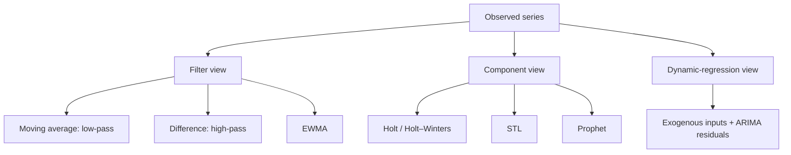

# 3. Filters, Smoothing, Decomposition, and Transfer Functions

Chapter 2 modeled a series as a stochastic process. This chapter takes a signal-processing view instead: separate a series into meaningful parts (level, trend, seasonality, noise, the effect of external inputs) and forecast each part. The path is

```text
linear filters → moving averages and differences → exponential smoothing (EWMA)
→ Holt (trend) → Holt–Winters (trend + season) → LOESS / STL → Prophet → transfer functions
```

## 1. Linear filters

A filter maps a series $x_t$ to a new series $y_t$, usually to separate signal from noise. A **time-invariant linear filter** is a convolution:

```math
y_t = \sum_{k=-\infty}^{\infty} \beta_k x_{t-k}.
```

The coefficients $\beta_k$ are the **impulse response**: feed in $x_t=1$ at $t=0$ and $0$ elsewhere, and out comes $y_t=\beta_t$.

The filter is **causal** if it never uses the future, $\beta_k=0$ for $k<0$ (since $x_{t-k}$ with $k<0$ is a future value). A **finite** causal filter also has $\beta_k=0$ for $k>K$. Forecasting and real-time monitoring need causal filters; offline smoothing can use both sides.

## 2. Moving-average and difference filters

**Moving average** of width $K$:

```math
y_t=\frac{1}{K}\sum_{k=0}^{K-1}x_{t-k}, \qquad \beta_k=\tfrac1K,\;k=0,\ldots,K-1 .
```

It is a **low-pass** filter: it suppresses fast wiggles and keeps slow movement.

**First difference**, with the backshift operator $Bx_t=x_{t-1}$:

```math
y_t=(1-B)x_t=x_t-x_{t-1}.
```

It is a **high-pass** filter: it removes the slowly varying level and keeps changes.

| Filter | Keeps | Removes | Example |
|---|---|---|---|
| low-pass | slow structure | rapid fluctuation | moving average |
| high-pass | local changes | slow level/trend | first difference |

## 3. Exponentially weighted moving average (EWMA)

A moving average weights the last $K$ points equally and ignores everything older. EWMA weights recent points most and lets older points fade geometrically. Start from the weighted sum

```math
y_t=\sum_{k=0}^{t-1}\theta^k x_{t-k}, \qquad |\theta|<1 .
```

The weights sum to $\frac{1-\theta^t}{1-\theta}\approx\frac{1}{1-\theta}$ for large $t$, so normalize by $(1-\theta)$:

```math
y_t=(1-\theta)\left(x_t+\theta x_{t-1}+\cdots+\theta^{t-1}x_1\right)
\quad\Longrightarrow\quad
y_t=(1-\theta)x_t+\theta y_{t-1}.
```

With $\lambda=1-\theta$ this is the familiar recursion

```math
y_t=\lambda x_t+(1-\lambda)y_{t-1}.
```

It is cheap: one multiply-add per step and no stored window.

## 4. The smoothing parameter

| $\lambda$ | Weight on the newest point | Smoothing | Reaction | Memory |
|---|---|---|---|---|
| large (e.g. 0.6) | high | little | fast | short |
| small (e.g. 0.05) | low | heavy | slow | long |

The limits: $\lambda=0$ means $y_t=y_{t-1}$, which never updates; $\lambda=1$ means $y_t=x_t$, no smoothing. The weight on an observation $k$ steps back is $\lambda(1-\lambda)^k$, so the "effective memory" is about $1/\lambda$ observations (and the mean age of the data is $(1-\lambda)/\lambda$).

**Initialization:** $y_0=x_1$ or $y_0=\bar x$. Its influence decays like $(1-\lambda)^t$.

## 5. EWMA as a forecaster

For short horizons, the latest smoothed level is the forecast: $\hat x_{t}=y_{t-1}$. Choose $\lambda$ by minimizing one-step-ahead forecast error on history:

```math
\mathrm{MSE}=\frac1T\sum_t(x_t-\hat x_t)^2, \qquad
\mathrm{MAE}=\frac1T\sum_t|x_t-\hat x_t|, \qquad
\mathrm{MAPE}=\frac{100}{T}\sum_t\left|\frac{x_t-\hat x_t}{x_t}\right| .
```

MSE punishes big misses; MAE is in the original units and is robust to outliers; MAPE is scale-free but explodes when $x_t$ is near zero.

> [!NOTE]
> **EWMA is optimal for IMA(1,1)**
>
> For the IMA(1,1) process $x_t=x_{t-1}+\epsilon_t-\theta\epsilon_{t-1}$ from Chapter 2, the minimum-MSE one-step forecast is EWMA with $\lambda=1-\theta$. Proof sketch: invert the MA part to write $\epsilon_t=\sum_{j\ge0}\theta^j(x_{t-j}-x_{t-j-1})$. Rearranging gives $x_t=\sum_{j\ge1}(1-\theta)\theta^{j-1}x_{t-j}+\epsilon_t$. The best predictor of $x_t$ drops the unpredictable $\epsilon_t$, leaving exactly exponentially decaying weights. This is why exponential smoothing works so well on level-shifting series.

## 6. Backshift notation

Every model in Chapter 2 is a pair of polynomials in $B$:

```math
\Phi(B)(1-B)^d x_t=\Theta(B)e_t,
```

with AR terms on the left (applied to $x_t$), differencing as $(1-B)$ factors, and MA terms on the right (applied to $e_t$). Examples: AR(1) is $(1-\phi B)x_t=e_t$ and MA(1) is $x_t=(1-\theta B)e_t$. Seasonal models add polynomials in $B^{s}$ (e.g. $B^{12}$), which multiply the regular ones.

The idea behind all of them: **after applying the model's operators, what remains should be white noise.**

## 7. EWMA lags a trend

Suppose $x_t=\beta_0+\beta_1t+e_t$. Then the smoothed value is biased:

```math
\mathbb{E}[y_t]=\beta_0+\beta_1t-\frac{1-\lambda}{\lambda}\beta_1 ,
```

so it lags behind by $\frac{1-\lambda}{\lambda}\beta_1$. If it's used as a one-step forecast of $x_{t+1}$, the bias is $\beta_1/\lambda$. An upward trend is under-predicted, a downward trend over-predicted, and the lag grows with the slope and with heavier smoothing. Simple EWMA tracks a level; it has no notion of slope.

## 8. Holt's method: level and trend

Keep two smoothed quantities, a level $L_t$ and a trend $b_t$:

```math
L_t=\lambda_1x_t+(1-\lambda_1)(L_{t-1}+b_{t-1}), \qquad
b_t=\lambda_2(L_t-L_{t-1})+(1-\lambda_2)b_{t-1}, \qquad
\hat{x}_{t+h}=L_t+h\,b_t .
```

The level blends the new observation with where the old level *plus* trend said we'd be; the trend blends the newest level change with the old trend. Forecasts now extrapolate the slope.

## 9. Component models

The classical decomposition is

```math
x_t=L_t+S_t+N_t \quad(\text{additive}), \qquad x_t=L_t\times S_t\times N_t \quad(\text{multiplicative}),
```

with level/trend $L_t$, seasonal effect $S_t$ repeating every $s$ steps ($S_t=S_{t-s}$), and noise $N_t$. This is the Error–Trend–Season (**ETS**) family. In the additive case the seasonal effects sum to zero over a cycle, $\sum_{t=1}^sS_t=0$, which separates the average level from the seasonal deviations. In the multiplicative case they average to 1 (e.g. $S=1.1$ means 10% above the level), and taking logs turns multiplicative into additive:

```math
\log x_t=\log L_t+\log S_t+\log N_t .
```

Use additive when seasonal swings have a constant size, multiplicative when they grow with the level.

## 10. Holt–Winters

When a series has **both** trend and seasonality, add a seasonal state. With $q=\lfloor(h-1)/s\rfloor$ so that the seasonal index refers to the most recent observed cycle:

**Additive:**

```math
\begin{aligned}
L_t&=\lambda_1(x_t-S_{t-s})+(1-\lambda_1)(L_{t-1}+b_{t-1})\\
b_t&=\lambda_2(L_t-L_{t-1})+(1-\lambda_2)b_{t-1}\\
S_t&=\lambda_3(x_t-L_{t-1}-b_{t-1})+(1-\lambda_3)S_{t-s}\\
\hat{x}_{t+h}&=L_t+h\,b_t+S_{t+h-s(q+1)}
\end{aligned}
```

**Multiplicative:** divide instead of subtract,

```math
L_t=\lambda_1\frac{x_t}{S_{t-s}}+(1-\lambda_1)(L_{t-1}+b_{t-1}), \qquad
S_t=\lambda_3\frac{x_t}{L_{t-1}+b_{t-1}}+(1-\lambda_3)S_{t-s}, \qquad
\hat{x}_{t+h}=(L_t+h\,b_t)\,S_{t+h-s(q+1)} .
```

In words: the level is a weighted average of the *deseasonalized* observation and the previous level-plus-trend, and each seasonal index is a weighted average of this cycle's seasonal deviation and the same season last cycle.

## 11. Picking a model: AIC and BIC

Parameters are fit by least squares or maximum likelihood. Models are compared with

```math
\mathrm{AIC}=-2\log L+2p, \qquad \mathrm{BIC}=-2\log L+p\log T ,
```

where $p$ counts parameters **and initial states** and $T$ is the number of observations. Lower is better. BIC's penalty grows with $T$, so it prefers smaller models. Software packages differ by constants, so compare values only within one tool.

## 12. LOESS and STL

**LOESS** (locally estimated scatterplot smoothing) fits a small weighted regression around each point, with a local constant, line or low-order polynomial and weights that decay with distance. Because the weights are recomputed at every point (and adapt near the edges), LOESS is **not** a convolution. It sits between a global filter and a fully local fit:

| Method | Weights |
|---|---|
| moving average | equal, fixed |
| EWMA | exponentially decaying, fixed |
| local linear fit | equal within a window, linear model |
| LOESS | distance-weighted within a window, recomputed per point |

**STL** (Seasonal–Trend decomposition using LOESS) alternates LOESS fits to extract trend and seasonal components. Its two main knobs are the trend window $w_t$ and the seasonal window $w_s$ (e.g. 13 and 7 observations). Small windows let components change quickly; large windows keep them stable. STL's robust mode downweights outliers.

**Anomalies leak into components.** Add a temporary anomaly lasting a few cycles and the estimated trend bends toward it, while the residual shows spikes at the start and end of the anomaly. Components are *estimates*, and what goes where depends on the window sizes.

## 13. Prophet

Prophet (Taylor & Letham, 2018) is an **additive regression model**:

```math
y(t)=g(t)+s(t)+h(t)+\sum_m\beta_mx_m(t)+\epsilon_t ,
```

with a piecewise-linear or logistic trend $g$ whose change points are learned, Fourier-series yearly and weekly seasonality $s$, holiday effects $h$, optional exogenous regressors, and Bayesian fitting. It lands between a convolution with one set of weights everywhere and a regression whose weights change at every point: a few global components with occasional trend changes.

## 14. Transfer-function (dynamic regression) models

Real series respond to external inputs, such as price driving demand or temperature driving load, and their errors are rarely white. A transfer-function model has both:

```math
y_t=\beta_0+\beta_1x_t+\beta_2x_{t-2}+N_t, \qquad N_t=\phi N_{t-1}+e_t .
```

Current and lagged inputs enter the mean, and the residual $N_t$ gets its own ARIMA model. The general form is

```math
\Phi(B)\,y_t=\Psi(B)\,x_t+\Theta(B)\,e_t ,
```

with $\Psi(B)$ the input (transfer) polynomial. Several inputs, each with its own lags, are allowed. The model is powerful, but identifying all the lag orders gets complicated. Cross-correlation of pre-whitened series is the classical tool.

## 15. How the methods relate



| Method | Trend | Season | Exogenous | Weights |
|---|:---:|:---:|:---:|---|
| Moving average | – | – | – | fixed, equal |
| Difference | removes | seasonal diff. possible | – | fixed |
| EWMA | – | – | – | fixed, exponential |
| Holt | ✓ | – | – | recursive |
| Holt–Winters | ✓ | ✓ | – | recursive |
| STL | ✓ | ✓ | – | local, recomputed |
| Prophet | piecewise | Fourier | ✓ | global regression |
| Transfer function | via regressors/ARIMA | via lags | ✓ | parametric |

## 16. Common confusions

- **Moving-average filter vs MA model:** averages of observations vs combinations of shocks.
- **EWMA vs Holt:** level only vs level + trend.
- **Additive vs multiplicative seasonality:** constant-size swings vs swings that scale with level.
- **Convolution vs LOESS:** fixed lag weights vs locally refitted weights.
- **White vs normal residuals:** uncorrelated doesn't mean Gaussian; check both.

## 17. Questions and answers

<details><summary>How do I pick between MSE, MAE and MAPE?</summary>

Match the business cost. MSE if large misses are disproportionately bad; MAE if cost is linear in the error, or with outliers; MAPE for comparing across series of different scales, but not near zero (use MASE or sMAPE there).
</details>

<details><summary>How do I tell additive from multiplicative seasonality?</summary>

Plot the series. If the seasonal swing grows with the level, it's multiplicative (or take logs). Or fit both and compare AIC and holdout error.
</details>

<details><summary>How do I choose STL window sizes?</summary>

The seasonal window should span several cycles and be odd; a larger value means a more stable season. The trend window is typically about $1.5s$ rounded up to odd. Tune on holdout forecast error or residual whiteness, and use robust STL when outliers exist.
</details>

<details><summary>How are transfer-function lag orders chosen?</summary>

Pre-whiten the input with its own ARIMA model, apply the same filter to the output, and read significant lags off their cross-correlation. Then check the residuals. In practice, a regression with a small lag grid chosen by AIC often does the job.
</details>

---

[← Previous: Classical Models](02_classical_time_series_models.md) · [Course map](../course_map.md) · [Next: Wavelets →](04_wavelets.md)
