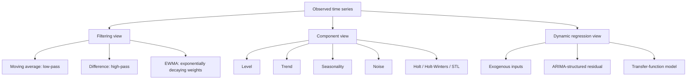

# Filters, Smoothing, Decomposition, and Transfer Functions

## 1. Chapter overview

This chapter shifts from explicit ARIMA-style stochastic models to a
signal-processing and component-model view of time series.

The main progression is:

```text
Linear filters
    -> moving averages and differences
    -> exponentially weighted smoothing
    -> trend-aware smoothing
    -> trend-seasonal decomposition
    -> local regression decomposition
    -> additive regression and transfer-function models
```

A central idea in these pages is that a useful representation may separate
a time series into meaningful components such as:

- level;
- trend;
- seasonality;
- stochastic residual behavior;
- exogenous-input effects.

**Sources:** CSE598MTL.pdf, pp. 14-19

---

## 2. Learning objectives

After this chapter, the reader should be able to:

1. define a time-invariant linear filter as a convolution;
2. distinguish low-pass and high-pass filters;
3. derive the recursive form of an exponentially weighted moving average;
4. interpret the EWMA smoothing parameter;
5. compare MSE, MAE, and MAPE;
6. explain why simple EWMA underpredicts a rising trend;
7. describe Holt's level-and-trend method;
8. distinguish additive and multiplicative component models;
9. describe additive and multiplicative Holt-Winters methods;
10. explain AIC, BIC, LOESS, and STL at the level presented in the notes;
11. summarize Prophet as an additive regression model;
12. explain how transfer-function models incorporate exogenous inputs with
    temporally structured residuals.

**Sources:** CSE598MTL.pdf, pp. 14-19

---

## 3. Filters

### 3.1 Signal-plus-noise view

The course introduces filtering through the idea that a time series may
contain:

- a signal of interest;
- noise that obscures that signal.

A filter transforms the original series $x_t$ into a new series $y_t$.

**Source:** CSE598MTL.pdf, p. 14

### 3.2 Time-invariant linear filter

The slide defines a common time-invariant linear filter as:

```math
y_t = \sum_{k=-\infty}^{\infty} \beta_k x_{t-k}.
```

This operation is identified as a convolution.

The coefficient sequence $\beta_k$ determines how observations at
different lags contribute to the filtered output.

**Source:** CSE598MTL.pdf, p. 14

### 3.3 Causality

The filter is causal when future observations do not affect the current
output.

The slide states:

```math
\beta_k = 0
\qquad \text{for } k<0.
```

A finite causal filter may also set:

```math
\beta_k = 0
\qquad \text{for } k>K.
```

### Clarification

With the indexing used on the slide, $x_{t-k}$ is a past value when
$k>0$. Negative $k$ would refer to a future value.

**Source:** CSE598MTL.pdf, p. 14

### 3.4 Impulse response

The coefficient sequence $\beta_k$ is called the impulse response.

If the input is:

```math
x_t =
\begin{cases}
1, & t=0 \\
0, & \text{otherwise},
\end{cases}
```

then the filtered output is:

```math
y_t = \beta_t.
```

This means the impulse response directly reveals how the filter responds
to a one-time input.

**Source:** CSE598MTL.pdf, p. 14

---

## 4. Moving-average and difference filters

### 4.1 Moving-average filter

A moving-average filter of width $K$ is:

```math
y_t =
\frac{1}{K}
\sum_{k=0}^{K-1}x_{t-k}.
```

Therefore:

```math
\beta_k = \frac{1}{K},
\qquad
k \in \{0,1,\ldots,K-1\}.
```

The slide labels this a low-pass filter.

### Interpretation

A local average suppresses rapid fluctuations while preserving slower
changes.

```text
Rapid variation / high-frequency detail
    -> reduced

Slow variation / low-frequency structure
    -> retained more strongly
```

**Source:** CSE598MTL.pdf, p. 14

### 4.2 Difference filter

Using the backshift operator:

```math
Bx_t=x_{t-1},
```

the first-difference filter is:

```math
y_t=(1-B)x_t
```

or:

```math
y_t=x_t-x_{t-1}.
```

The slide labels this a high-pass filter.

### Interpretation

Differencing suppresses slowly varying level and emphasizes changes
between adjacent points.

**Source:** CSE598MTL.pdf, p. 14

### 4.3 Low-pass versus high-pass

| Filter | Main effect | Course example |
|---|---|---|
| Low-pass | Smooth rapid fluctuations | Moving average |
| High-pass | Emphasize local changes and remove slow level | First difference |

**Source:** CSE598MTL.pdf, p. 14

---

## 5. Exponentially weighted moving average

### 5.1 Motivation

A fixed moving average gives equal weight to the most recent $K$
observations and zero weight to older values.

EWMA instead:

- gives more weight to recent observations;
- decreases weights gradually with age;
- allows all historical observations to contribute.

The initial weighted form on the slide is:

```math
y_t =
\sum_{k=0}^{t-1}\theta^k x_{t-k},
\qquad |\theta|<1.
```

The finite geometric sum is:

```math
\sum_{k=0}^{t-1}\theta^k
=
\frac{1-\theta^t}{1-\theta}.
```

For large $t$, the notes ignore the factor $1-\theta^t$, which is near
one.

**Source:** CSE598MTL.pdf, p. 14

### 5.2 Normalized form

The slide rewrites the smoother as:

```math
y_t =
(1-\theta)
\left(
x_t+\theta x_{t-1}
+\cdots+\theta^{t-1}x_1
\right).
```

This becomes the recursive relation:

```math
y_t=(1-\theta)x_t+\theta y_{t-1}.
```

Let:

```math
\lambda=1-\theta.
```

Then:

```math
y_t=\lambda x_t+(1-\lambda)y_{t-1}.
```

This is called the exponentially weighted moving average.

**Source:** CSE598MTL.pdf, p. 14

### 5.3 Weight pattern

The page's handwritten sketch contrasts:

```text
Moving average:
equal weights for K observations, then zero

EWMA:
largest weight on the current observation,
then exponentially decreasing weights
```

**Source:** CSE598MTL.pdf, p. 14

---

## 6. Interpreting the EWMA parameter

The key parameter is $\lambda$.

```math
y_t=\lambda x_t+(1-\lambda)y_{t-1}.
```

### Larger lambda

A larger $\lambda$ puts more weight on the current observation.

Consequences:

- less smoothing;
- faster response to new changes;
- shorter effective memory.

### Smaller lambda

A smaller $\lambda$ puts more weight on the previous smoothed value.

Consequences:

- more smoothing;
- slower response;
- longer effective memory.

The plot on page 15 compares smoothing values 0.05, 0.2, and 0.6.
The larger smoothing parameter follows short-term changes more closely.

**Source:** CSE598MTL.pdf, p. 15

### 6.1 Boundary cases

The slide asks what happens when $\lambda=0$ or $\lambda=1$.

From the recursive equation:

- if $\lambda=0$, then $y_t=y_{t-1}$, so the estimate never updates;
- if $\lambda=1$, then $y_t=x_t$, so there is no smoothing.

These conclusions follow directly from the displayed EWMA equation.

**Source:** CSE598MTL.pdf, p. 15

### 6.2 Initialization

An initial value $y_0$ is required.

The slide suggests:

```math
y_0=x_1
```

or:

```math
y_0=\bar{x}.
```

It also notes that the effect of the initial value becomes small as time
increases.

**Source:** CSE598MTL.pdf, p. 15

---

## 7. EWMA as a short-horizon predictor

The course states that EWMA is commonly used to:

- smooth a series;
- make short-term predictions when the forecast horizon is small.

The prediction notation on the page is:

```math
\tilde{x}_t = \tilde{x}_{t-1}=y_{t-1}
```

with handwritten clarification that the prediction uses the previous
EWMA value.

### Clarification

The exact notation on the slide is compact and visually ambiguous, but
the intended idea is clear: the most recent smoothed level is used as the
next short-horizon forecast.

**Source:** CSE598MTL.pdf, p. 15

---

## 8. Prediction-error measures

### 8.1 Mean squared error

```math
\mathrm{MSE}
=
\frac{1}{T}
\sum_{t=1}^{T}
\left(x_t-\tilde{x}_{t-1}\right)^2.
```

Squaring makes large errors contribute disproportionately.

### 8.2 Mean absolute error

```math
\mathrm{MAE}
=
\frac{1}{T}
\sum_{t=1}^{T}
\left|x_t-\tilde{x}_{t-1}\right|.
```

MAE preserves the original unit of the response.

### 8.3 Mean absolute percentage error

```math
\mathrm{MAPE}
=
\frac{1}{T}
\sum_{t=1}^{T}
\left|
\frac{x_t-\tilde{x}_{t-1}}{x_t}
\right|
\times 100,
\qquad x_t\neq0.
```

The slide notes that MAPE adds context to the magnitude of the error.

### 8.4 Parameter selection

The page states that $\lambda$ is often selected to obtain a good
prediction measure.

```text
Choose candidate λ
    -> compute forecasts
    -> compute MSE, MAE, or MAPE
    -> prefer the λ with better error performance
```

**Source:** CSE598MTL.pdf, p. 15

---

## 9. EWMA and IMA

The page states that EWMA is motivated by the state-space foundation used
to build an IMA $(1,1)$ model.

It also states:

> Given an IMA $(1,1)$ model, the prediction with minimum MSE is EWMA.

The source page does not provide the full derivation, so the note preserves
this result without adding an external proof.

**Source:** CSE598MTL.pdf, p. 16

---

## 10. Backshift representation

The handwritten section uses backshift notation to summarize AR, MA, and
integrated components.

A generic representation appears as:

```math
\Phi(B)x_t=\Theta(B)e_t.
```

The annotation explains the intended division:

```text
AR terms:
polynomial in B applied to x_t
appear on the left-hand side

MA terms:
polynomial in B applied to e_t
appear on the right-hand side

Integrated terms:
difference factors such as (1-B) applied to x_t
```

The handwritten note gives examples such as:

```math
(1-\phi B)x_t=e_t
```

for AR(1), and:

```math
x_t=(1-\theta B)e_t
```

for MA(1), using the page's sign conventions.

### Core interpretation from the annotation

> Capture the temporal information in the model so that after applying
> the corresponding operations, the remaining process should be white
> noise.

**Source:** CSE598MTL.pdf, p. 16

### 10.1 Seasonal notation

The annotation also states that seasonal models replace regular lags with
cycle-length lags, for example:

```math
B \rightarrow B^{12}.
```

Seasonal AR and MA coefficients are written separately from the regular
coefficients.

The small handwritten algebra is preserved conceptually, but not every
symbol is transcribed because several exponents and coefficient marks are
too small to verify exactly.

**Source:** CSE598MTL.pdf, p. 16

---

## 11. EWMA bias under a linear trend

Suppose:

```math
x_t=\beta_0+\beta_1t+e_t,
```

where $e_t$ is white noise.

The slide gives:

```math
E(\tilde{x}_t)
=
\beta_0+\beta_1t
-
\frac{1-\lambda}{\lambda}\beta_1.
```

Therefore:

```math
E(\tilde{x}_t)
=
E(x_t)
-
\frac{1-\lambda}{\lambda}\beta_1.
```

If:

```math
\beta_1>0,
```

then EWMA systematically underpredicts.

If:

```math
\beta_1<0,
```

then it systematically overpredicts.

> **Handwritten interpretation:** The amount of underprediction depends
> on $\lambda$ and the magnitude of the trend, represented by
> $\beta_1$.

### Clarification

Simple EWMA estimates a level but does not maintain a separate trend
state. When the true series rises, the smoothed level lags behind.

**Source:** CSE598MTL.pdf, p. 16

---

## 12. Holt's method

To address trend, Holt's method uses two recursively updated components:

- a level estimate $L_t$;
- a trend estimate $b_t$.

The page gives:

```math
\hat{x}_{t+h}=L_t+hb_t.
```

The level update is:

```math
L_t=
\lambda_1x_t+
(1-\lambda_1)(L_{t-1}+b_{t-1}).
```

The trend update is:

```math
b_t=
\lambda_2(L_t-L_{t-1})
+
(1-\lambda_2)b_{t-1}.
```

### Interpretation

The level is a weighted combination of:

- the current observation;
- the previous level advanced by the previous trend.

The trend is a weighted combination of:

- the newest change in level;
- the previous trend estimate.

**Source:** CSE598MTL.pdf, p. 16

### 12.1 Plot interpretation

The page-17 plot compares combinations of smoothing and trend parameters.

The handwritten comments interpret the method as:

- changing the level;
- adding an explicit trend contribution;
- shifting forecasts upward when the series is increasing.

**Source:** CSE598MTL.pdf, p. 17

---

## 13. Component models

The page introduces the traditional decomposition:

```math
x_t=L_t+S_t+N_t,
```

where:

- $L_t$: level or trend component;
- $S_t$: seasonal effect;
- $N_t$: stochastic, error, or noise component.

The notes call these ETS-style component models, using the labels:

```text
Error
Trend
Season
```

**Source:** CSE598MTL.pdf, p. 17

### 13.1 Seasonal effect

The seasonal component repeats with period $s$:

```math
S_t=S_{t-s}=S_{t-2s}=\cdots
```

for times after the initial seasonal cycle.

The slide often assumes:

```math
\sum_{t=1}^{s}S_t=0.
```

> **Handwritten annotation:** The sum of seasonal effects over one season
> is zero.

### Clarification

This zero-sum convention separates the average level from the seasonal
deviations in an additive model.

**Source:** CSE598MTL.pdf, p. 17

### 13.2 Additive model

The additive component model is:

```math
x_t=L_t+S_t+N_t.
```

It is appropriate when seasonal variation is expressed in roughly
constant absolute units.

### 13.3 Multiplicative model

The multiplicative form is:

```math
x_t=L_t\times S_t\times N_t.
```

The slide notes that a seasonal estimate may multiply the level, such as
$1.1$ for a 10% increase.

A log transformation gives:

```math
\log(x_t)
=
\log(L_t)+\log(S_t)+\log(N_t).
```

> **Handwritten annotation:** The log base depends on the application.

**Source:** CSE598MTL.pdf, p. 17

---

## 14. Holt-Winters methods

The handwritten note states:

> If the time series contains both trend and seasonality, choose
> Holt-Winters rather than simple EWMA.

**Source:** CSE598MTL.pdf, p. 17

### 14.1 Additive Holt-Winters

The forecast equation on the slide is:

```math
\hat{x}_{t+h}
=
L_t+hb_t+S_{t+h-s(q+1)},
```

where:

```math
q=\mathrm{floor}\left(\frac{h-1}{s}\right).
```

The level update is:

```math
L_t=
\lambda_1(x_t-S_{t-s})
+
(1-\lambda_1)(L_{t-1}+b_{t-1}).
```

The trend update is:

```math
b_t=
\lambda_2(L_t-L_{t-1})
+
(1-\lambda_2)b_{t-1}.
```

The seasonal update is:

```math
S_t=
\lambda_3(x_t-L_{t-1}-b_{t-1})
+
(1-\lambda_3)S_{t-s}.
```

The highlighted interpretation states that the level is a weighted
average between:

- the seasonally adjusted observation;
- the previous nonseasonal forecast.

The seasonal component is a weighted average between:

- the current estimated seasonal deviation;
- the previous value from the same season.

**Source:** CSE598MTL.pdf, p. 17

### 14.2 Multiplicative Holt-Winters

The multiplicative forecast is:

```math
\hat{x}_{t+h}
=
(L_t+hb_t)S_{t+h-s(q+1)}.
```

The level update shown is:

```math
L_t=
\lambda_1
\frac{x_t}{S_{t-s}}
+
(1-\lambda_1)(L_{t-1}+b_{t-1}).
```

The trend update remains:

```math
b_t=
\lambda_2(L_t-L_{t-1})
+
(1-\lambda_2)b_{t-1}.
```

The seasonal update is:

```math
S_t=
\lambda_3
\frac{x_t}{L_{t-1}+b_{t-1}}
+
(1-\lambda_3)S_{t-s}.
```

The slide notes that the seasonal component acts as a multiplier.

**Source:** CSE598MTL.pdf, p. 17

---

## 15. Model selection with AIC and BIC

The page states that parameters are commonly estimated by:

- minimizing a sum of squared errors;
- maximizing likelihood.

A model may then be selected using an information criterion.

### 15.1 AIC

The slide gives:

```math
\mathrm{AIC}
=
-2\log(L)+2p,
```

where:

- $L$: likelihood;
- $p$: number of parameters and initial states estimated.

The handwritten note says to minimize the criterion.

### 15.2 BIC

The slide gives:

```math
\mathrm{BIC}
=
-2\log(L)+p\log(T),
```

where $T$ is the number of observations.

### Interpretation

Both criteria balance:

```text
better fit
    against
greater model complexity
```

BIC uses a penalty that increases with sample size.

The page notes that software may define the criteria somewhat differently.

**Source:** CSE598MTL.pdf, p. 18

---

## 16. LOESS and STL

### 16.1 Local smoothing

LOESS is described as locally estimated scatterplot smoothing.

For each time location, a local neighborhood is selected and a weighted
fit is computed.

The page lists:

- locally weighted averages;
- locally weighted linear regression;
- locally weighted higher-order polynomial terms.

### Handwritten interpretation

The annotation compares several operations:

1. equal-weight local average;
2. decaying-weight average, such as EWMA;
3. unweighted linear approximation;
4. weighted local linear approximation.

It also states:

> The weights are not time invariant, so this is not a convolution.

### Clarification

A convolution uses the same lag weights everywhere. LOESS recomputes local
weights and a local fit around each target point.

**Source:** CSE598MTL.pdf, p. 18

### 16.2 STL decomposition

The slide describes STL as seasonal and trend decomposition using LOESS.

Local estimates are fitted for:

- the trend component;
- the seasonal component.

The principal tuning parameters shown are:

- trend window size $w_t$;
- seasonal window size $w_s$.

These specify the number of time-series values included in a local
neighborhood.

The slide gives default examples:

```math
w_t=13,
\qquad
w_s=7.
```

### 16.3 Window-size interpretation

The page states:

- small $w_t$ and $w_s$ allow trend and seasonality to change more
  quickly;
- large $w_t$ and $w_s$ keep them more stable.

> **Handwritten annotation:** Smaller windows make component estimates
> change quickly; larger windows make them change less.

**Source:** CSE598MTL.pdf, p. 18

### 16.4 Effect of an anomaly

The page adds a temporary anomaly over several cycles and shows its effect
on:

- observed data;
- estimated trend;
- estimated seasonal component;
- residual.

The trend estimate rises during the anomalous interval, while the residual
captures substantial deviations around the change boundaries.

### Clarification

The example shows that decomposition components are estimates and can
absorb part of an anomaly depending on the smoothing windows.

**Source:** CSE598MTL.pdf, p. 18

---

## 17. Prophet

The page describes the Facebook Prophet model as an additive regression
model:

```math
y=
\beta_0+
\sum_{m=1}^{M}
f_m(x_{im}).
```

The slide lists components such as:

- piecewise linear or logistic growth trend;
- learned change points;
- yearly seasonality;
- weekly seasonality;
- additional flexible details;
- Bayesian estimation methods.

> **Handwritten annotations:** Exogenous variables may be included, and
> change points determine where the trend changes.

### Clarification

The page presents Prophet as lying between a fixed global filter and a
fully local regression that changes at every point:

> “Somewhere between using a convolution with the same weights everywhere
> and using a regression model that changes the weights at every point.”

This wording is preserved from the handwritten note.

**Source:** CSE598MTL.pdf, p. 19

---

## 18. Transfer-function models

### 18.1 Dynamic regression view

Transfer-function models are also called dynamic regression models.

The page emphasizes that they include:

- exogenous attributes;
- stochastic errors that are not necessarily white noise.

A simple example is:

```math
y_t=
\beta_0+\beta_1x_t+N_t,
```

where $N_t$ follows a time-series model.

The page gives an AR-style residual process:

```math
N_t=\phi N_{t-1}+e_t,
```

where $e_t$ is white noise.

**Source:** CSE598MTL.pdf, p. 19

### 18.2 Lagged exogenous effects

Another example is:

```math
y_t=
\beta_0+\beta_1x_t+\beta_2x_{t-2}+N_t.
```

This shows that current and lagged values of an external input may both
affect the response.

### 18.3 General backshift form

The page gives the general form:

```math
\Phi(B)y_t
=
\Psi(B)x_t+
\Theta(B)e_t.
```

The annotation labels $\Psi(B)$ as the exogenous-input component.

The slide states that models may include:

- current exogenous values;
- lagged exogenous values;
- lagged response values;
- several exogenous attributes.

It also notes that ARIMA-style transfer models can become complex.

**Source:** CSE598MTL.pdf, p. 19

---

## 19. Component and model relationships



This diagram is synthesized from pages 14-19.

**Sources:** CSE598MTL.pdf, pp. 14-19

---

## 20. Method comparison

| Method | Main representation | Trend | Seasonality | Exogenous inputs | Local or global weighting |
|---|---|---:|---:|---:|---|
| Moving average filter | Equal local average | No explicit state | No | No | Same finite weights everywhere |
| Difference filter | Adjacent change | Removes or reduces slow trend | Seasonal differencing possible elsewhere | No | Same weights everywhere |
| EWMA | Smoothed level | No explicit trend | No | No | Same exponential lag weights |
| Holt | Level + trend | Yes | No | No | Recursive global form |
| Holt-Winters | Level + trend + seasonal state | Yes | Yes | No | Recursive global form |
| STL | LOESS trend + LOESS seasonality | Yes | Yes | No | Local, changing weights |
| Prophet | Additive regression components | Piecewise trend | Yearly/weekly and other components | Can include flexible attributes | Regression components |
| Transfer function | Regression + temporal residual model | Through regressors and residual model | Possible through lag structure | Yes | Parametric dynamic regression |

**Sources:** CSE598MTL.pdf, pp. 14-19

---

## 21. Common confusions

### Moving-average filter versus MA model

A moving-average filter averages observed values:

```math
\frac{1}{K}\sum x_{t-k}.
```

An MA $(q)$ stochastic model combines disturbances:

```math
e_t-\theta_1e_{t-1}-\cdots.
```

They share a name but represent different operations.

### EWMA versus Holt

EWMA estimates a changing level. Holt maintains both level and trend.

### Holt-Winters additive versus multiplicative

Additive seasonality is expressed in constant units. Multiplicative
seasonality scales with the level.

### Convolution versus LOESS

A convolution uses fixed lag weights. LOESS recalculates local weights and
fits around each target point.

### White-noise residual versus normal residual

A residual process may have no temporal correlation without being
normally distributed. The course examines these with different diagnostic
plots in Chapter 2.

### Prophet versus SARIMAX

The Prophet page describes additive regression components and learned
change points. SARIMAX emphasizes ARIMA-style regular and seasonal
dependence plus exogenous terms.

**Sources:** CSE598MTL.pdf, pp. 14-19

---

## 22. Questions preserved for later discussion

1. How should the effective memory of EWMA be quantified from $\lambda$?
2. Why is EWMA the minimum-MSE predictor for the stated IMA $(1,1)$
   model?
3. How should $y_0$ be selected for a short series?
4. When should MSE, MAE, or MAPE be preferred?
5. How should additive versus multiplicative seasonality be diagnosed?
6. How are Holt-Winters parameters estimated in the software used in the
   course?
7. How should STL window sizes be selected beyond the qualitative rules
   given on page 18?
8. How robust is STL to prolonged anomalies?
9. Which Prophet terms were actually used in the course implementation?
10. How should transfer-function lag orders be selected in practice?

These questions are motivated by the source pages but are not fully
answered there.

---

## 23. Source map

| PDF page | Material reconstructed |
|---:|---|
| 14 | Linear filters, convolution, low-pass/high-pass filters, EWMA derivation |
| 15 | EWMA parameter, initialization, forecasting, MSE/MAE/MAPE |
| 16 | EWMA-IMA relationship, backshift representation, trend bias, Holt method |
| 17 | Holt plot, component models, additive/multiplicative Holt-Winters |
| 18 | AIC, BIC, LOESS, STL, smoothing windows, anomaly example |
| 19 | Prophet and transfer-function models |

## Review status

- Printed slide definitions and main equations: `[VERIFIED]`
- EWMA recursion and prediction-error measures: `[VERIFIED]`
- Backshift handwritten summary: `[INTERPRETED]`
- Small seasonal backshift algebra on page 16: `[NEEDS REVIEW]`
- Holt-Winters equations: `[VERIFIED]`
- Prophet handwritten positioning statement: `[VERIFIED]`
- Exact software-specific definitions of AIC/BIC: preserved as slide caveat
