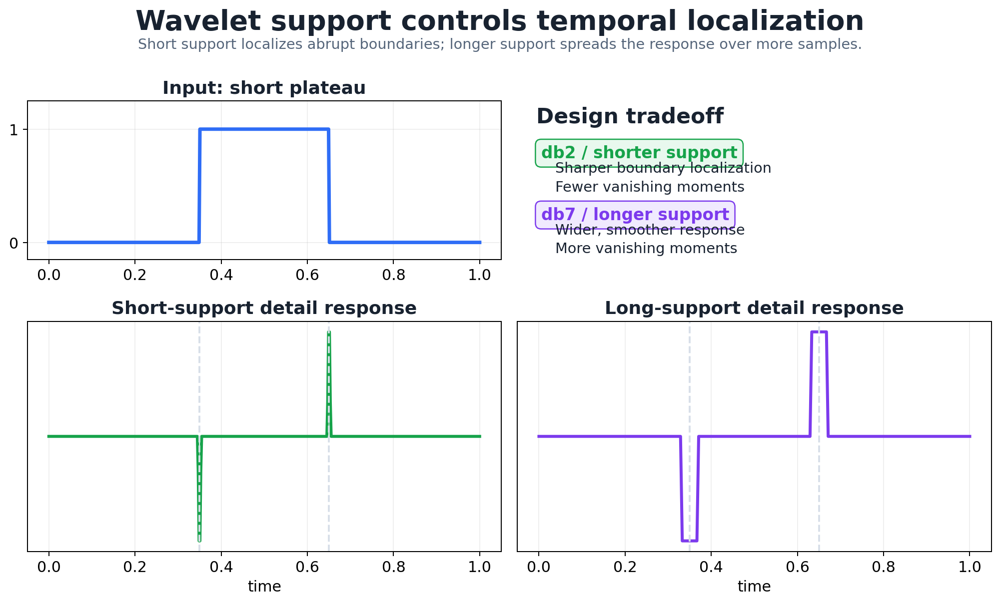
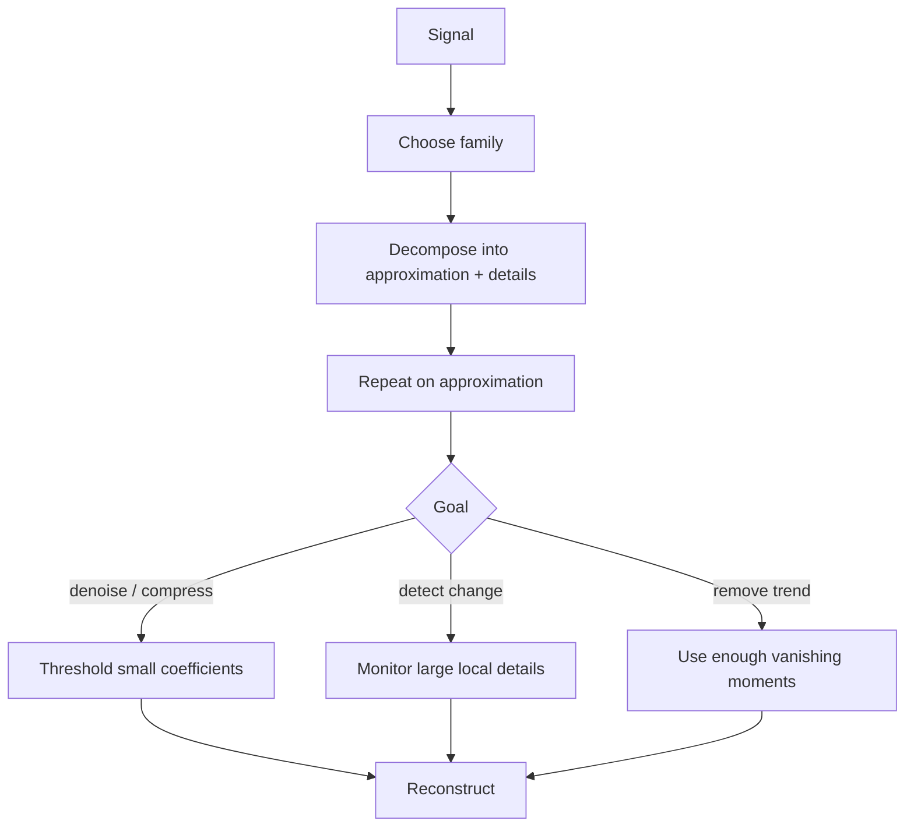

# 4. Fourier Analysis and Wavelets

A long signal (hundreds of points, several channels) is a poor direct input to a model. We want a **sparse** representation: a small set of coefficients that captures the important structure. Fourier analysis gives one, but it can't say *when* something happened. Wavelets can, because they are local in time and multi-scale. This chapter covers orthonormal bases, the Haar transform, the pyramid algorithm, how to choose a wavelet family, vanishing moments, change detection and thresholding.

## 1. Why a representation?

Useful information is spread across a long trace. A good transform concentrates it: most coefficients near zero, a few large. Sparsity here means sparse **after** the transform, not zeros in the raw signal. It enables compression (keep the big coefficients), denoising (drop the small ones), and monitoring (watch a few coefficients instead of every sample).

Wavelets are used for denoising, compression (JPEG 2000, audio, video), change and anomaly detection, trend suppression, seismology and turbulence, and feature extraction. In medical imaging, how a coefficient's size changes across scales tells you what kind of feature it is: similar size across scales suggests a sharp jump, while magnitudes that decay quickly with scale suggest a brief, fleeting change.

## 2. Fourier versus wavelets

Fourier analysis writes a signal as a sum of sinusoids, each spanning the **whole** time axis. That has two drawbacks for our purposes:

1. **No time localization.** If one hour of signal has a glitch in its last five minutes, *every* Fourier coefficient changes, and you can't tell when it happened.
2. **Implicit periodicity.** The DFT treats the signal as one period of a periodic signal, so trends and mismatched endpoints leak into high frequencies.

Wavelets are short, oscillating functions that are **shifted** (to localize in time) and **scaled** (to localize in frequency). Mallat's (1989) discrete wavelet transform (DWT) organizes them into a multiresolution "mathematical microscope": coarse scales summarize, fine scales show detail. The standard DWT assumes length $n=2^J$. The continuous wavelet transform exists too, but on a computer it is also evaluated on discrete samples.

## 3. What a wavelet system gives you

- **One generating function:** all basis functions are scaled and shifted copies of a single mother wavelet.
- **Exact reconstruction:** all the coefficients together reproduce the signal exactly.
- **Multiresolution:** coarse approximations plus details at every scale.
- **Sensitivity to change:** flat stretches give near-zero detail coefficients; jumps give large ones, which is exactly what anomaly detection wants.
- **Choice:** different families suit different signals, and all are fast to compute ($O(n)$).

## 4. Signals in a basis

Any signal can be written in a basis, $f(t)=\sum_kb_kg_k(t)$. For sampled data, put the basis vectors as columns of $W$:

```math
\mathbf y=W\boldsymbol\beta, \qquad \hat{\boldsymbol\beta}=(W^\top W)^{-1}W^\top\mathbf y .
```

For an **orthonormal** basis ($W^\top W=I$) this is just

```math
\hat{\boldsymbol\beta}=W^\top\mathbf y ,
```

and each coefficient is an inner product with one basis vector. A 1,000-point signal has 1,000 coefficients in a 1,000-vector orthonormal basis. The point of the wavelet basis is that most of those coefficients are small.

## 5. Scaling and wavelet functions

A wavelet system has two kinds of basis function:

- the **scaling ("father") function** $\phi_{j,k}$, which carries the approximation or coarse content;
- the **wavelet ("mother") function** $\psi_{j,k}$, which carries the detail or change content,

with $j$ indexing scale and $k$ position. Conventions for which direction $j$ runs differ between texts and libraries. Here level 1 is the finest detail, as in PyWavelets.


*Haar, Daubechies, Symlet and Coiflet families differ in support length, smoothness, symmetry and number of vanishing moments.*

## 6. Coefficients as local matches

A detail coefficient is the correlation between the signal and a wavelet placed at one position and scale. It's large where the local shape resembles the wavelet and small where it doesn't. In one example the same wavelet gives $C=0.0102$ at a poorly matching location and $C=0.2247$ at a well-matching one.

Shifted copies of an orthonormal wavelet filter have inner product 1 with themselves and 0 with each other, so each coefficient isolates one component. Orthonormality holds **both within and across levels**: every scaling and wavelet vector in the full decomposition is orthogonal to every other.

## 7. How many coefficients?

For a signal of length $2^M$ decomposed to depth $K$, the coefficients split as

```math
\underbrace{2^{M-K}}_{\text{approximation}}+\underbrace{2^{M-K}+2^{M-K+1}+\cdots+2^{M-1}}_{\text{details, levels }K,\ldots,1}=2^M .
```

**Example:** $|x|=512=2^9$ with $K=5$:

| | approx | level 5 | level 4 | level 3 | level 2 | level 1 |
|---|---:|---:|---:|---:|---:|---:|
| # coefficients | 16 | 16 | 32 | 64 | 128 | 256 |

and $16+16+32+64+128+256=512$. No redundancy: the transform is a change of basis.

## 8. Reconstructing from selected coefficients

All coefficients give exact reconstruction. Dropping some gives an approximation: for example, drop all the finest details (smoothing), or drop every coefficient below a threshold (compression or denoising). On a 512-point CO₂ series, thresholding at 5.0 keeps just 51 coefficients (10%) and still reproduces the trend and seasonal cycle.

In a multiscale Haar view of the CO₂ series, the level-5 approximation follows the broad contour, fine details carry the rapid oscillation, and a sudden jump produces large detail coefficients at every level near the event. Coarser levels use fewer values and trace the big shape; finer levels use more values and keep detail.

## 9. Edges

Near the ends of a finite signal the wavelet overhangs the data, so the transform has to extend the signal somehow: by symmetric reflection, periodization or zero padding. This creates **edge artifacts**, large coefficients that are not real events, and longer wavelets (db2 versus Haar) show them more. Choose the extension mode deliberately (e.g. `mode="symmetric"` in PyWavelets) and don't flag edge coefficients as anomalies.

## 10. Why scales halve: the pyramid algorithm

The dyadic structure follows from sampling theory: a signal whose highest frequency is $F$ needs $2F$ samples per second (Nyquist). After a low-pass split removes the upper half of the band, half the samples suffice, so we **downsample by 2**. Repeating this on the approximation branch only gives Mallat's pyramid:

```text
S ─┬─ cA1 ─┬─ cA2 ─┬─ cA3
   │       │       └─ cD3
   │       └─ cD2
   └─ cD1              (cD1 = finest detail)
```


Each level costs half the previous one, so the whole transform is $O(n)$, faster than the FFT's $O(n\log n)$.

## 11. Haar by hand

Pairwise scaled sums and differences:

```math
a_1=\frac{x_1+x_2}{\sqrt2},\quad d_1=\frac{x_1-x_2}{\sqrt2},\qquad a_2=\frac{x_3+x_4}{\sqrt2},\quad d_2=\frac{x_3-x_4}{\sqrt2},\;\ldots
```

Invert pair by pair:

```math
x_1=\frac{a_1+d_1}{\sqrt2}, \qquad x_2=\frac{a_1-d_1}{\sqrt2}.
```

Apply the same step to the approximations to go one level coarser:

```math
a_1^{(2)}=\frac{a_1+a_2}{\sqrt2}=\frac{x_1+x_2+x_3+x_4}{2},\qquad d_1^{(2)}=\frac{x_1+x_2-x_3-x_4}{2},
```

```math
a_1^{(3)}=\frac{x_1+\cdots+x_8}{\sqrt8},\qquad d_1^{(3)}=\frac{(x_1+\cdots+x_4)-(x_5+\cdots+x_8)}{\sqrt8}.
```

Each level summarizes twice as long an interval. The $\sqrt2$ factors keep the transform orthonormal, so energy is preserved: $\sum x_t^2=\sum(\text{all coefficients})^2$.

**Exercise.** Given approximation coefficients $[4.9,-1.4,7.1,1.4]$, the first detail at the next level is $\frac{4.9-(-1.4)}{\sqrt2}=\frac{6.3}{\sqrt2}\approx4.45$.

```python
import pywt, numpy as np
x = np.array([1., 3., 2., 2., 5., 7., 6., 6.])
cA, cD = pywt.dwt(x, "haar")
print(cA, cD)   # [2.83 2.83 8.49 8.49] [-1.41 0. -1.41 0.]  i.e. (x1±x2)/√2, ...
print(np.allclose(pywt.idwt(cA, cD, "haar"), x))   # True: exact reconstruction
```

(PyWavelets' Haar detail coefficient is $(x_1-x_2)/\sqrt2$, the same convention as above.)

## 12. Choosing a wavelet family

- **Support (duration).** Short support localizes better. Most practical wavelets are compactly supported; Gaussian-derivative, Mexican-hat and Morlet wavelets have infinite support (used in the continuous transform).
- **Symmetry.** Compactly supported orthogonal wavelets can't be symmetric, **except Haar**. When symmetry matters (images, to avoid phase distortion), use near-symmetric Symlets or biorthogonal wavelets.
- **Regularity.** Smoother wavelets represent smooth signals with fewer coefficients.
- **Vanishing moments.** A wavelet with $K$ vanishing moments, $\int t^m\psi(t)\,dt=0$ for $m=0,\ldots,K-1$, gives **zero** detail coefficients on any polynomial of degree $<K$. $K$ vanishing moments require support of length at least $2K-1$, and Daubechies wavelets achieve that minimum.

**Daubechies db$K$:** orthogonal, compact support, asymmetric, $K$ vanishing moments, smoother as $K$ grows, and defined by filter coefficients computed numerically (no closed form). For db5 the moments of degree 0–4 are about zero and degree 5 is not.

## 13. Vanishing moments make changes stand out

- Flat regions give near-zero details (every wavelet has at least one vanishing moment).
- With $K$ vanishing moments, any polynomial trend of degree $<K$ also disappears from the details.

So a smooth trend drops out of the detail coefficients and a discontinuity or unexpected feature produces a large, localized response.

```text
smooth polynomial trend  → suppressed in details
unexpected discontinuity → large localized detail coefficient
```

**Examples:**

- *Step (db2, five levels):* the step shows up sharply in the details, and finer levels localize it more precisely.
- *Frequency change (db5):* the approximation keeps the broad shape, and the details light up exactly where the oscillation speeds up.
- *Quadratic trend + noise (db3 vs db2):* db3 ($K=3>2$) removes the quadratic, so its details are pure noise; db2 ($K=2$) leaves trend residue. In general **db$K$ suppresses polynomials of degree $p<K$**.
- *Plateau in a linear trend (db2 vs db7):* both find the plateau edges, but the short db2 pins them down more sharply.



| Goal | Choose |
|---|---|
| sharp time localization | short support (Haar, db2) |
| remove higher-degree polynomial background | more vanishing moments (higher db$K$) |

## 14. Beyond fixed bases

Instead of fixing one wavelet, you can pick the best representation from a large dictionary of bases:

- **Matching pursuit:** greedy, adds the single best-matching atom at each step.
- **Basis pursuit:** solves $\min\lVert\boldsymbol\beta\rVert_1$ subject to $W\boldsymbol\beta=\mathbf y$ (or its noisy version, basis-pursuit denoising). This is an **$\ell_1$ (lasso-type)** problem, not a ridge problem, and that is exactly what makes it sparse.

## 15. Thresholding

With threshold $\lambda$:

```math
H_\lambda(w)=\begin{cases}w,&|w|>\lambda\\0,&|w|\le\lambda\end{cases}
\qquad\qquad
S_\lambda(w)=\mathrm{sgn}(w)\max(|w|-\lambda,0).
```

| | Small coefficients | Large coefficients | Behavior |
|---|---|---|---|
| **Hard** | set to 0 | unchanged | discontinuous, keeps peak heights |
| **Soft** | set to 0 | shrunk by $\lambda$ | continuous, biases large coefficients toward 0 |

Soft thresholding is exactly the lasso solution in an orthonormal basis ([Chapter 5, §9](05_pca_and_regularization.md)). A standard choice of $\lambda$ is the **universal threshold** $\sigma\sqrt{2\log n}$ (Donoho & Johnstone, 1994), with the noise level estimated robustly from the finest details: $\hat\sigma=\mathrm{median}(|cD_1|)/0.6745$.

A scalegram (coefficient magnitude by scale and position) of a denoised signal shows the result: most coefficients are zero, and the survivors mark where the structure is.

## 16. Where wavelets sit among representations

| Data-adaptive | Non-data-adaptive |
|---|---|
| SVD / PCA, piecewise polynomials, symbolic (SAX), trees, sorted coefficients | DFT, DCT, wavelets (orthonormal: Haar, Daubechies, Coiflets, Symlets; biorthogonal), PAA, random projections |

Chebyshev polynomials are orthogonal too, but they are a global polynomial basis, not a time–frequency representation.



## 17. Trade-offs

| Choice | Benefit | Cost |
|---|---|---|
| coarse approximation | compact contour | loses fine behavior |
| fine details | localizes fast change | more coefficients, more noise |
| short support | sharp time localization | few vanishing moments |
| many vanishing moments | removes polynomial trends | longer support, blurrier localization |
| hard threshold | preserves peak size | discontinuous, can ring |
| soft threshold | smooth, stable | shrinks real features |

## 18. Common confusions

- **Level numbering:** libraries differ on whether level 1 is finest or coarsest. Check the coefficient lengths.
- **Large coefficient ≠ anomaly:** it may be a real edge, an expected transition or an edge artifact.
- **More vanishing moments isn't always better:** it costs localization.
- **Details aren't just noise:** they are only noise when the chosen wavelet has already removed the signal's smooth part.

## 19. Questions and answers

<details><summary>How deep should the decomposition go?</summary>

Until the approximation is smoother than the structure you care about, and at most $\lfloor\log_2(n/(L-1))\rfloor$ levels for filter length $L$ (`pywt.dwt_max_level`). For monitoring, stop at the scale of the events you want to detect.
</details>

<details><summary>How should I pick a wavelet family for anomaly detection?</summary>

Short support (Haar, db2) for sharp jumps; enough vanishing moments to cancel the normal trend; try the candidates on labeled examples and keep the one whose details separate normal from abnormal best.
</details>

<details><summary>When is hard thresholding better than soft?</summary>

When peak amplitudes matter, e.g. spike heights. Soft thresholding gives smoother, lower-variance reconstructions and is usually better for general denoising.
</details>

<details><summary>How does the size of a coefficient change with scale for a jump versus a smooth feature?</summary>

For a jump, magnitudes decay slowly across scales (roughly $2^{j/2}$ growth in the orthonormal convention as scale coarsens); for smooth regions, fine-scale details vanish quickly. Comparing magnitudes across scales measures local regularity.
</details>

<details><summary>What if the signal length isn't a power of two?</summary>

Libraries handle it with the chosen extension mode, and coefficient arrays come out slightly longer. Watch for extra edge coefficients, or pad deliberately by symmetric reflection.
</details>

<details><summary>How are wavelet features used by later models?</summary>

As inputs: coefficient energies per level, thresholded coefficients, or the denoised signal. They feed classifiers, PCA (Chapter 5) and neural models, and the orthonormal lasso link in Chapter 5 ties thresholding to supervised regularization.
</details>

---

[← Previous: Filters and Decomposition](03_filters_smoothing_and_decomposition.md) · [Course map](../course_map.md) · [Next: PCA and Regularization →](05_pca_and_regularization.md)
