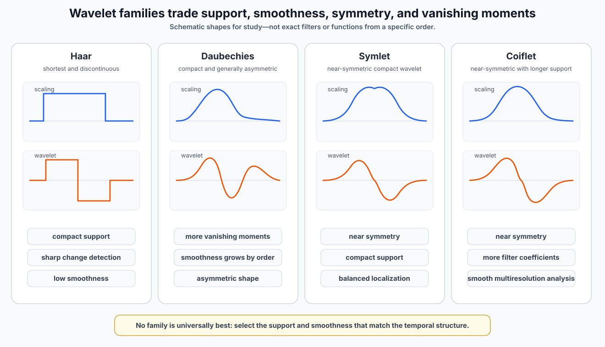
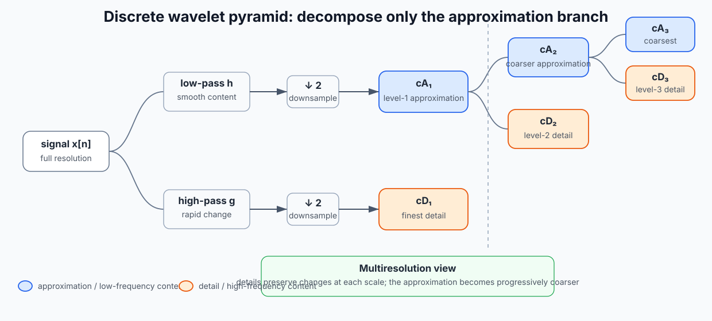
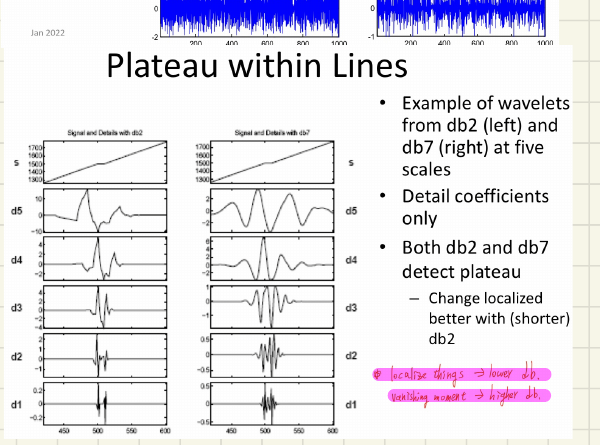
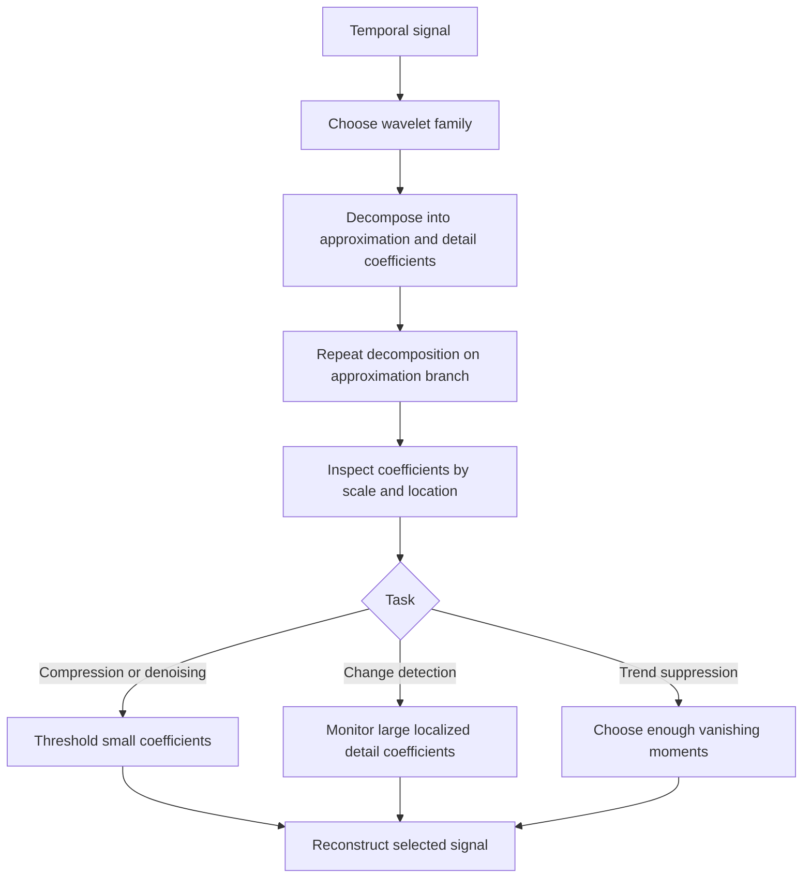

# Fourier Analysis and Wavelets

## 1. Chapter overview

This chapter introduces wavelets as a sparse, local, multiresolution
representation for temporal signals.

The course motivates wavelets through three limitations of a purely global
frequency representation:

1. a long signal may contain hundreds of observations and several traces;
2. a model often needs a compact representation rather than every raw point;
3. Fourier components describe which frequencies occur but can hide when
   those frequencies occur.

The wavelet approach represents a signal with:

- approximation or scaling coefficients for coarse structure;
- detail or wavelet coefficients for local changes;
- repeated decompositions at several scales.

The chapter then develops orthogonal reconstruction, the Haar transform,
the pyramid algorithm, wavelet-family properties, vanishing moments,
change detection, and coefficient thresholding.

**Sources:** CSE598MTL.pdf, pp. 20-32

---

## 2. Learning objectives

After this chapter, the reader should be able to:

1. explain why sparse representations are useful for long temporal signals;
2. contrast global Fourier components with local wavelet components;
3. describe scaling and wavelet functions;
4. represent a signal in an orthonormal basis;
5. interpret a wavelet coefficient as a match or correlation at a
   particular position and scale;
6. distinguish approximation and detail coefficients;
7. reconstruct a signal from selected coefficients;
8. perform the basic Haar pairwise decomposition and reconstruction;
9. explain the multiresolution pyramid algorithm;
10. compare wavelet families using support, symmetry, smoothness, and
    vanishing moments;
11. explain why polynomial trends can disappear from wavelet detail
    coefficients;
12. use wavelet details to localize discontinuities and anomalies;
13. distinguish hard and soft coefficient thresholding.

**Sources:** CSE598MTL.pdf, pp. 20-32

---

## 3. Why temporal signals need representations

The opening page describes time-series datasets as potentially large and
complex:

- hundreds of observations in each trace;
- possibly several time traces;
- model-relevant characteristics distributed across the trace.

The course therefore argues that feature selection or summarization is
needed to learn relationships efficiently.

The desired representation is described as **sparse**:

```text
Long signal
    -> many possible measurements
    -> a relatively small set of informative coefficients
```

**Source:** CSE598MTL.pdf, p. 20

---

## 4. Wavelet applications

The notes list wavelets for many signal-processing tasks:

- denoising;
- compression;
- detecting changes;
- suppressing trends;
- video and voice compression;
- turbulence, seismology, and tsunami modeling;
- scientific and engineering signals;
- image processing;
- feature extraction for pattern recognition.

A medical-image example on the page describes how coefficients at
different scales can indicate different structures:

- similar coefficient size across scales may indicate a jump;
- decreasing coefficients may indicate a fleeting change;
- coarse- and medium-scale information may be combined with
  high-scale coefficients to enhance an image.

The course uses this example to emphasize that different scales carry
different kinds of information.

**Source:** CSE598MTL.pdf, p. 20

---

## 5. Fourier analysis versus local wavelets

### 5.1 Fourier representation

The Fourier slide represents a signal as a sum of sine curves.

Each frequency component contributes across the complete time domain.

```text
Signal(t)
    =
low-frequency sine
    +
medium-frequency sine
    +
high-frequency sine
    + ...
```

The handwritten notes identify two practical disadvantages in this
course context:

1. the representation does not directly handle trend;
2. the data are treated as periodic.

**Source:** CSE598MTL.pdf, p. 22

### 5.2 Time localization problem

The page-20 note gives an intuitive example:

> If one hour of signal is transformed and an error occurs during only the
> final five minutes, the transform for the complete hour is affected.

The course interpretation is that Fourier analysis can reveal frequency
content while hiding when a local event occurred.

### 5.3 Wavelets as local models

Wavelets are finite or time-limited functions that can be moved and
rescaled.

They are presented as an alternative to Fourier analysis when the goal
requires both:

- scale or frequency information;
- temporal localization.

**Sources:** CSE598MTL.pdf, pp. 20 and 22

---

## 6. Discrete wavelet transform and multiresolution

The discrete wavelet transform (DWT) is introduced as a
multiresolution representation.

The page attributes the efficient dyadic decomposition algorithm to
Mallat (1989) and describes a signal length of the form:

```math
n=2^J.
```

The notes state that continuous wavelets can be useful for high-frequency
data, but the course focuses on discrete wavelet representations.

### Resolution language

The slide describes resolution as an indicator of wavelet frequency and
uses the phrase "mathematical microscope":

```text
Coarse resolution
    -> summary structure

Progressively finer resolution
    -> increasingly local detail
```

**Source:** CSE598MTL.pdf, p. 20

---

## 7. Core wavelet properties

The course lists the following properties.

### 7.1 Generated from one function

A wavelet system can be generated from a single function through scaling
and translation.

### 7.2 Exact reconstruction

The original signal can be reconstructed identically from the complete
set of wavelet coefficients.

This supports both:

- compact representation;
- local interpretation of signal characteristics.

### 7.3 Multiresolution

The system studies a signal at coarse resolution for summaries and at
finer resolutions for details.

### 7.4 Sensitivity to discontinuity and change

Intervals containing constant behavior can produce zero or small
coefficients, while local discontinuities produce larger coefficients.

> **Handwritten annotation:** This sensitivity to high-frequency change
> makes wavelets useful for anomaly detection.

### 7.5 Adaptable systems

Wavelet systems can be selected or developed for particular
applications and are described as easy to calculate.

**Source:** CSE598MTL.pdf, p. 21

---

## 8. Sparse temporal representation

The goal is for the coefficients to be more useful than the full signal.

The slide emphasizes:

- many coefficients decrease rapidly toward zero;
- an entire signal may be summarized by relatively few coefficients;
- a fault may be easier to detect in coefficient space;
- orthogonal basis functions isolate separate contributions;
- anomaly-detection methods can monitor the representation rather than
  every raw point.

### Clarification

Sparsity here does not mean that the signal itself contains many zeros.
It means that after transformation, only a small subset of coefficients
may be needed to represent the important structure.

**Source:** CSE598MTL.pdf, p. 21

---

## 9. Basis-function representation

A function can be represented using basis functions:

```math
f(t)=\sum_k b_k g_k(t).
```

For sampled data, write:

- the signal as a vector $\mathbf{y}$;
- each basis function $g_k(t)$ as a vector $\mathbf{w}_k$;
- the basis vectors as columns of a matrix $W$.

Then:

```math
\mathbf{y}=W\boldsymbol{\beta}.
```

The least-squares coefficient estimate is:

```math
\hat{\boldsymbol{\beta}}
=
(W^\top W)^{-1}W^\top\mathbf{y}.
```

For an orthonormal basis:

```math
W^\top W=I,
```

so:

```math
\hat{\boldsymbol{\beta}}=W^\top\mathbf{y}.
```

> **Handwritten example:** A signal with 1,000 points can be represented
> using 1,000 orthogonal basis vectors and 1,000 corresponding
> coefficients.

**Source:** CSE598MTL.pdf, p. 21

---

## 10. Scaling and wavelet functions

The course describes a wavelet system as containing:

- a scaling or approximation function $\phi$, also called the father
  function;
- a wavelet or detail function $\psi$, also called the mother function.

Scaled and translated copies produce basis functions at several
positions and resolutions.

A conceptual notation is:

```math
\phi_{j,k}(t)
\quad\text{and}\quad
\psi_{j,k}(t),
```

where $j$ indexes scale or resolution and $k$ indexes location.

The precise indexing convention varies across wavelet texts and also
varies across the course slides. The notes therefore preserve the
course's approximation/detail language instead of imposing one external
convention.

**Source:** CSE598MTL.pdf, p. 22

---

## 11. Wavelet families

The page displays continuous and discrete forms from several families:

- Haar;
- Daubechies;
- Symlets;
- Coiflets.

The handwritten note observes that a continuous wavelet transform is
still represented with discrete samples when calculated on a computer.

The family illustrations show that wavelets differ in:

- duration;
- smoothness;
- symmetry;
- number of nonzero discrete filter coefficients;
- number of vanishing moments.
<p align="center">
  <a href="../assets/clean_diagrams/wavelet_family_comparison.svg">
    
  </a>
</p>
<p align="center"><em>Clean schematic — Qualitative comparison of Haar, Daubechies, Symlet, and Coiflet scaling and wavelet characteristics.</em></p>
<p align="center"><sub>Original course figures: <a href="../assets/original_figures/p022_wavelet_families.png">page-22 source grid</a></sub></p>
**Source:** CSE598MTL.pdf, p. 22

---

## 12. Orthonormality

The page-23 db5 example shows shifted copies of a decomposition filter.

The dot-product row illustrates:

- the vector has dot product $1$ with itself;
- shifted orthogonal vectors have dot product $0$.

For orthonormal basis vectors:

```math
\mathbf{w}_i^\top\mathbf{w}_j
=
\begin{cases}
1, & i=j,\\
0, & i\neq j.
\end{cases}
```

This permits each coefficient to isolate one basis-vector contribution.

**Source:** CSE598MTL.pdf, p. 23

---

## 13. Coefficients as local matches

The slide describes wavelet coefficients as measuring the correlation
between:

- the signal;
- a wavelet at a selected location and scale.

A small coefficient appears when the local signal shape does not match the
wavelet. A larger coefficient appears when the local signal and wavelet
align more strongly.

The page illustrates coefficients approximately:

```math
C=0.0102
```

for a weak local match and:

```math
C=0.2247
```

for a stronger match.

### Interpretation

```text
Move and scale the wavelet
    -> compute its inner product with the signal
    -> large magnitude means a stronger local pattern match
```

**Source:** CSE598MTL.pdf, p. 23

---

## 14. Approximation and detail subspaces

The slide separates:

- approximation or scaling vectors at a selected level;
- detail or wavelet vectors at that and finer levels.

For a signal with $2^J$ points, the complete set of approximation and
detail basis vectors contains $2^J$ vectors.

The page uses two different level-counting conventions in adjacent
sections. One form writes the total schematically as:

```math
2^K+
\left(
2^K+2^{K+1}+\cdots+2^{J-1}
\right)
=
2^J.
```

A later form, for $N=2^M$, writes the selected approximation count as:

```math
2^{M-K}
```

and detail counts as:

```math
2^{M-1},2^{M-2},\ldots,2^{M-K}.
```

### Review note

Both displays communicate that the approximation plus all retained detail
subspaces span the original $2^M$-dimensional signal. Their level
indices point in opposite directions, so the notation should not be
combined without checking the convention used by the software.

**Source:** CSE598MTL.pdf, p. 23

---

## 15. Example coefficient counts

For a signal of length:

```math
|x|=512=2^9
```

and approximation level:

```math
K=5,
```

the slide gives:

```math
2^{9-5}=16
```

approximation vectors.

It then lists detail-vector counts:

| Level | 5 | 4 | 3 | 2 | 1 |
|---:|---:|---:|---:|---:|---:|
| Number of vectors | 16 | 32 | 64 | 128 | 256 |

The total is:

```math
16+16+32+64+128+256=512.
```

> **Handwritten annotation:** "Orthogonality within each level; no cross
> level."

### Review note

The intended meaning appears to be that the basis vectors used across the
decomposition are orthogonal. The exact phrase "no cross level" is
preserved as handwriting and requires clarification before being treated
as a formal claim.

**Source:** CSE598MTL.pdf, p. 24

---

## 16. Reconstruction from coefficients

A signal can be reconstructed from its approximation and detail
coefficients.

The complete transform gives exact reconstruction. A simplified
reconstruction can intentionally omit components by setting selected
coefficients to zero.

The slide lists two possible omissions:

- all high-resolution detail coefficients in some applications;
- coefficients whose magnitudes are below a selected threshold.

The CO2 example has:

- signal length $512$;
- threshold $5.0$;
- $51$ selected coefficients.

### Interpretation

```text
All coefficients
    -> exact reconstruction

Selected large/coarse coefficients
    -> approximate reconstruction

Small coefficients set to zero
    -> sparse or denoised representation
```

**Source:** CSE598MTL.pdf, p. 24

---

## 17. Multiscale CO2 example

The Haar example on page 25 shows:

- the final reconstructed CO2 trace;
- level-5 approximation coefficients;
- detail coefficients at several levels.

The plots demonstrate that:

- the approximation captures broad contour;
- fine-level details preserve rapid oscillations and localized changes;
- a major jump produces large detail coefficients near the event.

> **Handwritten interpretation:** Higher-level or coarser representations
> use fewer values and follow the large contour; finer representations use
> more values and preserve more detail.

The exact "higher/lower level" wording depends on the slide's level
convention, so the note uses **coarser** and **finer** where possible.

**Source:** CSE598MTL.pdf, p. 25

---

## 18. Edge behavior and db2 example

Page 26 applies a db2 wavelet to a signal with a large end change.

It displays:

- the original signal;
- scaling coefficients;
- detail coefficients.

The handwriting appears to note greater sensitivity to edge effects.

### Review note

Boundary handling is not explained on the page. The note preserves the
observed edge sensitivity but does not infer which extension mode or
padding rule was used.

**Source:** CSE598MTL.pdf, p. 26

---

## 19. Why scales change by a factor of two

The slide connects dyadic wavelet scaling to the sampling theorem.

If a signal's highest frequency is $F$ cycles per second, the page
states that exact reconstruction requires:

```math
2F
```

samples per second.

> **Handwritten annotation:** Sampling rate should be two times the
> highest frequency.

This motivates repeated halving or downsampling of the approximation
stream in the wavelet pyramid.

**Source:** CSE598MTL.pdf, p. 27

---

## 20. Efficient pyramid algorithm

At each stage, the current approximation is decomposed into:

- a new approximation;
- a detail component.

Only the approximation branch is decomposed again.

```text
Original signal S
├── cA1  -> decomposed again
│   ├── cA2 -> decomposed again
│   │   ├── cA3
│   │   └── cD3
│   └── cD2
└── cD1
```

The slide notes:

- the next level is computed from the previous approximation
  coefficients;
- this creates the multiresolution property;
- the finest detail is referred to as level 1 in the displayed
  convention.
<p align="center">
  <a href="../assets/clean_diagrams/wavelet_pyramid.svg">
    
  </a>
</p>
<p align="center"><em>Clean diagram — Wavelet pyramid with repeated decomposition of the approximation branch.</em></p>
<p align="center"><sub><a href="../assets/original_figures/p027_wavelet_pyramid.png">Open the original course figure</a></sub></p>
**Source:** CSE598MTL.pdf, p. 27

---

## 21. Haar wavelet computations

For time-ordered values:

```math
x_1,x_2,x_3,x_4,\ldots,
```

the Haar transform forms pairwise averages and differences.

### 21.1 First scale

```math
a_1=\frac{x_1+x_2}{\sqrt{2}},
\qquad
d_1=\frac{x_1-x_2}{\sqrt{2}},
```

```math
a_2=\frac{x_3+x_4}{\sqrt{2}},
\qquad
d_2=\frac{x_3-x_4}{\sqrt{2}}.
```

The process continues for all adjacent pairs.

### 21.2 Reconstruction

```math
x_1=\frac{a_1+d_1}{\sqrt{2}},
```

```math
x_2=\frac{a_1-d_1}{\sqrt{2}}.
```

The same inverse relation reconstructs each pair.

### 21.3 Second scale

The next-scale approximation and detail are computed from the previous
approximations:

```math
a_1^{(2)}
=
\frac{a_1^{(1)}+a_2^{(1)}}{\sqrt{2}}
=
\frac{x_1+x_2+x_3+x_4}{2},
```

```math
d_1^{(2)}
=
\frac{a_1^{(1)}-a_2^{(1)}}{\sqrt{2}}
=
\frac{x_1+x_2-x_3-x_4}{2}.
```

### 21.4 Third scale

For eight points:

```math
a_1^{(3)}
=
\frac{x_1+x_2+x_3+x_4+x_5+x_6+x_7+x_8}{\sqrt{8}},
```

```math
d_1^{(3)}
=
\frac{x_1+x_2+x_3+x_4-x_5-x_6-x_7-x_8}{\sqrt{8}}.
```

The coefficients summarize successively larger time intervals.

**Source:** CSE598MTL.pdf, p. 28

---

## 22. Haar exercise preserved from the page

The page gives approximation coefficients:

```math
[4.9,-1.4,7.1,1.4]
```

and asks for the first detail coefficient at the next higher level,
without simplifying the final numerical expression.

Using the Haar difference formula:

```math
d_1^{\text{next}}
=
\frac{4.9-(-1.4)}{\sqrt{2}}.
```

The handwritten work expresses the same operation through the displayed
$\sqrt{2}$-scaled terms.

**Source:** CSE598MTL.pdf, p. 28

---

## 23. Wavelet-family design properties

### 23.1 Support or duration

A wavelet may have finite or infinite support.

The slide states:

- small support localizes signals better;
- many popular wavelets have finite support;
- Gaussian, Mexican-hat, and Morlet wavelets are examples with infinite
  support.

### 23.2 Symmetry

The page states that orthogonal wavelets with compact support are not
symmetric.

It notes that symmetry is especially relevant for image processing.

### 23.3 Regularity

Regularity is related to the smoothness of the wavelet representation.

### 23.4 Vanishing moments

With $K$ zero or vanishing moments, polynomials up to degree $K-1$
produce zero wavelet coefficients.

The slide states:

```math
K \text{ zero moments}
\quad\Rightarrow\quad
\text{wavelet support at least }2K-1.
```

It identifies Daubechies wavelets as achieving the maximum number of
vanishing moments for a given compact support under the stated
orthonormal construction.

**Source:** CSE598MTL.pdf, p. 29

---

## 24. Daubechies wavelets

The page lists the Daubechies system as:

- asymmetric;
- finite support;
- orthogonal;
- increasingly smooth as $K$ in db $K$ increases;
- having $K$ vanishing moments;
- calculated numerically rather than through an explicit elementary
  formula.

The db5 table illustrates approximately zero moments for polynomial
degrees $0$ through $4$, followed by a nonzero degree $5$ moment.

**Source:** CSE598MTL.pdf, p. 29

---

## 25. Why vanishing moments expose change

The course makes two related claims:

1. constant intervals generate zero or small detail coefficients;
2. some wavelets also generate zero coefficients for linear, quadratic,
   or higher-order polynomial signals.

Therefore a smooth polynomial background can disappear from detail
coefficients while a rupture or discontinuity produces a large local
response.

```text
Smooth polynomial trend
    -> suppressed in detail coefficients

Unexpected discontinuity
    -> large localized detail coefficient
```

> **Handwritten question:** How are vanishing moments useful?

> **Handwritten interpretation:** Allow the trend to pass out of the
> detail representation so that higher-order or unexpected behavior can
> be captured.

The handwriting is conceptually consistent with the plotted examples,
though the exact wording is partially unclear.

**Sources:** CSE598MTL.pdf, pp. 29-30

---

## 26. Wavelet-family selection

The slide briefly lists basis-selection strategies:

- matching pursuit, described as greedy selection from a dictionary of
  many bases;
- basis pursuit, described on the slide as ridge-like optimization;
- lasso approaches.

The page marks these topics as beyond the course's immediate scope.

### Review note

The phrases "ridge-like" and the relation among the listed pursuit methods
are preserved as slide wording. No external optimization definitions have
been substituted.

**Source:** CSE598MTL.pdf, p. 30

---

## 27. Step and frequency-change examples

### 27.1 Step signal

The db2 example at five scales shows:

- raw signal;
- approximation reconstructions;
- detail reconstructions.

The step becomes sharply visible in the detail coefficients near the
change point.

The handwritten note indicates that a higher-resolution detail localizes
the change more precisely.

### 27.2 Frequency change

The db5 example switches from a slower oscillation to a faster
oscillation.

The approximation retains broad signal form, while the details show the
change in frequency around the transition.

The slide summarizes:

> Change visible in details.

**Source:** CSE598MTL.pdf, p. 30

---

## 28. Polynomial trend with white noise

The page applies db3 at four scales to a polynomial signal with white
noise.

It states:

- the top row is the raw signal;
- the remaining plots show detail coefficients;
- for db3, only the noise appears in the details;
- db3 suppresses a polynomial of degree $2$.

More generally, the page states:

```math
K>p
\quad\Rightarrow\quad
\text{a degree-}p\text{ polynomial is suppressed by db}K.
```

The comparison between db2 and db3 illustrates that enough vanishing
moments are required to remove the polynomial component from the details.

**Source:** CSE598MTL.pdf, p. 31

---

## 29. Localizing a plateau inside a trend

The page compares db2 and db7 detail coefficients for a line containing
a short plateau.

Both wavelets detect the plateau boundaries.

The slide states that the shorter db2 wavelet localizes the change better.

> **Handwritten summary:**
>
> - To localize features, use a lower-order/shorter-support db wavelet.
> - For more vanishing moments, use a higher-order db wavelet.

This captures an important design tradeoff:

| Goal | Course-page tendency |
|---|---|
| Sharper time localization | Shorter support, such as db2 |
| Suppress higher-degree polynomial background | More vanishing moments, such as higher db $K$ |
<p align="center">
  <a href="../assets/original_figures/p031_plateau_detection_db2_db7.png">
    
  </a>
</p>
<p align="center"><em>Source figure — db2 and db7 plateau-detail comparison. Select the image to open the full-size version.</em></p>
**Source:** CSE598MTL.pdf, p. 31

---

## 30. Wavelet thresholding

Coefficient shrinkage is used to create a sparse representation.

### 30.1 Hard thresholding

For threshold $\lambda$:

```math
H_\lambda(w)
=
\begin{cases}
w, & |w|>\lambda,\\
0, & |w|\leq\lambda.
\end{cases}
```

The slide describes this as leaving a sufficiently large coefficient
unchanged and setting a smaller one to zero.

### 30.2 Soft thresholding

The slide gives:

```math
S_\lambda(w)
=
\mathrm{sgn}(w)
\max(|w|-\lambda,0).
```

Soft thresholding both:

- sets sufficiently small coefficients to zero;
- shrinks retained magnitudes toward zero.

### Visual intuition

```text
Hard threshold:
small -> 0
large -> unchanged

Soft threshold:
small -> 0
large -> reduced by λ
```

**Source:** CSE598MTL.pdf, p. 32

---

## 31. Denoised wavelet coefficients

The scalegram example displays coefficient streams across several scales.

The slide emphasizes:

- sparse representations are preferable;
- denoising sets small coefficients to zero;
- the threshold may be based on model fit to the signal;
- each row can represent a data stream or batch at a selected level;
- the horizontal axis organizes coefficients across multiple scales.

### Clarification

The page does not give the precise threshold-selection rule for this
example. The note therefore records the effect, not an invented
estimation procedure.

**Source:** CSE598MTL.pdf, p. 32

---

## 32. Orthogonal polynomials and the representation hierarchy

The page briefly mentions discrete Chebyshev polynomials as orthogonal
polynomials and notes that they are not a time-frequency representation.

It then shows a hierarchy of time-series representations.

### Data-adaptive examples shown

- sorted coefficients;
- piecewise polynomial methods;
- singular-value decomposition;
- symbolic representations;
- trees.

### Non-data-adaptive examples shown

- wavelets;
- random mappings;
- spectral methods such as the discrete Fourier transform;
- piecewise aggregate approximation;
- discrete cosine transform.

Under wavelets, the diagram distinguishes orthonormal and biorthogonal
families and includes examples such as Haar, Daubechies, Coiflets, and
Symlets.

### Chapter-level interpretation

The diagram places wavelets within a broader design question:

```text
Choose a representation
    -> decide whether its basis is fixed or learned/adapted
    -> decide what local, spectral, symbolic, or low-rank structure to retain
```

**Source:** CSE598MTL.pdf, p. 32

---

## 33. End-to-end wavelet workflow



This diagram is synthesized from pages 21-32.

**Sources:** CSE598MTL.pdf, pp. 21-32

---

## 34. Key tradeoffs

| Design choice | Benefit | Cost or limitation emphasized by the pages |
|---|---|---|
| Coarse approximation | Compact global contour | Fine local behavior is removed |
| Fine detail | Localizes rapid change | More coefficients and possible noise |
| Short support | Better temporal localization | Fewer vanishing moments may be available |
| More vanishing moments | Suppresses higher-degree polynomial trends | Longer support and reduced localization |
| Hard threshold | Preserves large coefficients exactly | Discontinuous shrinkage rule |
| Soft threshold | Smoothly shrinks coefficients | Large coefficients are biased toward zero |
| Fourier basis | Clear global frequencies | Weak event-time localization |
| Wavelet basis | Local time-scale information | Family and boundary choices matter |

**Sources:** CSE598MTL.pdf, pp. 20-32

---

## 35. Common confusions

### Frequency versus scale

The course uses scale and resolution language rather than one single
frequency-axis convention. Coarser scale corresponds to broader temporal
structure; finer resolution corresponds to more localized detail.

### Approximation level numbering

Some slides number the finest detail as level 1, while other equations
index spaces in the opposite direction. Always check the software output
and coefficient lengths.

### A large coefficient is not automatically an anomaly

A coefficient means strong alignment with a local wavelet pattern. It may
represent a real transition, an expected edge, or noise.

### More vanishing moments are not always better

More vanishing moments can suppress a more complex polynomial background,
but the longer-support wavelet may localize a short event less precisely.

### Fourier and wavelets are not simply "global versus local frequencies"

The course's primary contrast is that Fourier components extend across the
whole signal, while wavelets are time-limited and translated. Both are
basis representations, but their localization properties differ.

### Detail coefficients are not necessarily noise

In the polynomial-plus-noise example, the chosen wavelet suppresses the
polynomial so details look like noise. In other signals, details contain
meaningful edges and rapid patterns.

**Sources:** CSE598MTL.pdf, pp. 20-32

---

## 36. Questions preserved for later discussion

1. Which boundary-extension method was used in the db2 edge example?
2. How does the course define increasing versus decreasing "wavelet level"
   in the software output?
3. How should the decomposition depth $K$ be selected?
4. How should a wavelet family be selected for anomaly detection?
5. What threshold rule produced the 51 selected CO2 coefficients?
6. When should hard thresholding be preferred to soft thresholding?
7. How does coefficient magnitude change with scale for the same type of
   discontinuity?
8. What is the intended formal relationship between matching pursuit,
   basis pursuit, ridge, and lasso in the page-30 bullet list?
9. How should edge coefficients be interpreted when the signal length is
   not a power of two?
10. How are wavelet features eventually used by the learning models later
    in the course?

These questions arise from the source pages and remain unresolved there.

---

## 37. Source map

| PDF page | Material reconstructed |
|---:|---|
| 20 | Representation motivation, applications, local wavelet models |
| 21 | Wavelet properties, sparsity, orthonormal coefficient calculation |
| 22 | Fourier comparison, scaling/detail functions, wavelet families |
| 23 | Orthonormality, coefficients as local matches, subspace counts |
| 24 | 512-point count example, reconstruction and thresholding |
| 25 | Multiscale Haar CO2 example |
| 26 | db2 signal and edge behavior |
| 27 | Sampling motivation and pyramid algorithm |
| 28 | Haar decomposition, reconstruction, multiscale equations |
| 29 | Support, symmetry, regularity, vanishing moments, Daubechies |
| 30 | Change sensitivity, family selection, step and frequency changes |
| 31 | Polynomial suppression, white noise, plateau localization |
| 32 | Hard/soft thresholds, denoising, representation hierarchy |

## Review status

- Main printed concepts: `[VERIFIED]`
- Orthonormal coefficient equations: `[VERIFIED]`
- Approximation/detail dimension counts: `[VERIFIED]` but notation varies
- Haar equations: `[VERIFIED]`
- Haar exercise expression: `[VERIFIED]`
- Page-24 "no cross level" handwriting: `[NEEDS REVIEW]`
- Page-26 edge-effect annotation: `[INTERPRETED]`
- Page-30 vanishing-moment handwriting: `[INTERPRETED]`
- Page-32 small handwritten hierarchy examples: `[NEEDS REVIEW]`
