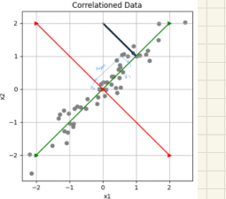
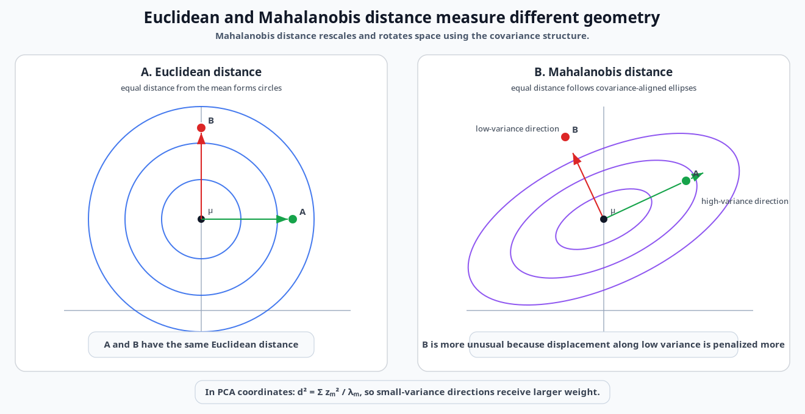
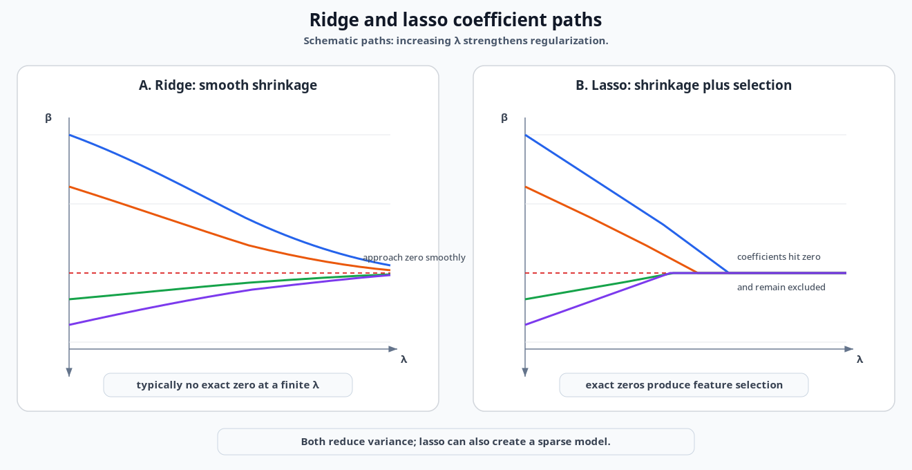
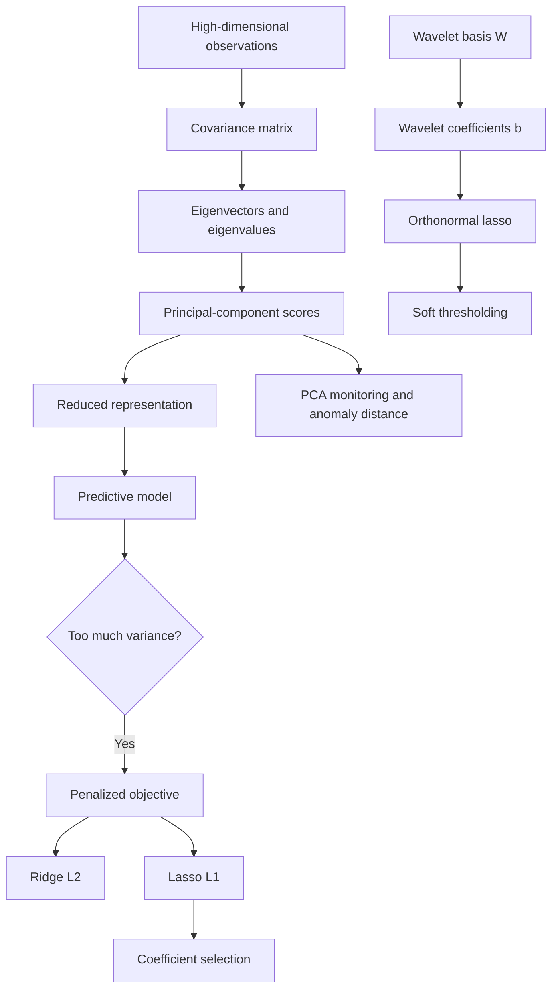

# PCA, Bias-Variance, and Regularization

## 1. Chapter overview

This chapter connects dimensionality reduction and model-complexity
control.

The first half introduces principal component analysis (PCA) as a way to
replace many correlated predictors with a smaller number of orthogonal
scores. The notes emphasize:

- covariance as a summary of linear relationships;
- eigenvectors as new directions;
- eigenvalues as variance along those directions;
- principal-component scores as latent variables;
- monitoring and anomaly detection through distance from a learned PCA
  subspace.

The second half introduces the bias-variance tradeoff and penalized
regression. Ridge and lasso are presented as ways to reduce variance by
shrinking coefficients. The final page connects lasso directly to soft
thresholding of wavelet coefficients when the design matrix is an
orthonormal wavelet basis.

```text
Correlated high-dimensional data
    -> PCA representation

High-variance predictive model
    -> coefficient regularization

Orthonormal wavelet representation
    + L1 regularization
    -> soft thresholding
```

**Sources:** CSE598MTL.pdf, pp. 33-44

---

## 2. Learning objectives

After this chapter, the reader should be able to:

1. explain why correlated predictors may lie near a lower-dimensional
   subspace;
2. define covariance, correlation, covariance matrices, loadings, and
   principal-component scores;
3. derive the first principal component as the maximum-variance linear
   combination;
4. explain the eigenvalue decomposition and its relationship to SVD;
5. select a number of components using explained variance and a scree
   plot;
6. use Euclidean and Mahalanobis distance for PCA-based monitoring;
7. identify limitations of PCA for temporal data and target prediction;
8. decompose expected squared error into variance and squared bias;
9. explain how increasing model complexity can reduce bias while
   increasing variance;
10. write general penalized-loss, ridge, and lasso objectives;
11. derive the closed-form ridge estimator;
12. compare ridge shrinkage with lasso shrinkage and variable selection;
13. explain why ridge shrinks low-variance directions more strongly;
14. derive soft wavelet thresholding from an orthonormal lasso problem.

**Sources:** CSE598MTL.pdf, pp. 33-44

---

## 3. Why use PCA for time-series representation?

The page opens with several motivations:

- time-series representation;
- latent variables;
- covariance-matrix and geometric interpretation;
- target and latent variables;
- anomaly detection.

The course starts from a common data pattern:

> Many observed predictors may respond to a small number of fundamental
> causes.

This creates correlation among the observed predictors.

### 3.1 Two predictors

For two strongly related predictors, the scatter plot tends to follow a
line.

### 3.2 Many predictors

For $M$ predictors, the observations may lie near a lower-dimensional
subspace of the $M$-dimensional predictor space.

The page gives an illustrative plane relation:

```math
2.4x_1+5.1x_2-x_3\approx0.
```

This suggests that fewer derived variables may summarize the original
predictors.

**Source:** CSE598MTL.pdf, p. 33

### 3.3 Handwritten temporal caution

The handwriting beside the stacked time-series plot appears to ask
whether the input consists of:

- several complete time series;
- segments taken from one or more time series.

It also sketches target labels such as:

```text
normal
abnormal / anomaly
```

### Clarification

PCA operates on a matrix of observations and predictors. For temporal
data, one must decide what constitutes a row and what constitutes a
column—for example, whole traces, channels, time positions, segments, or
engineered features. The page raises this representation question but
does not resolve it.

**Source:** CSE598MTL.pdf, p. 33

---

## 4. Covariance and correlation

For random variables $X_1,\ldots,X_M$, the page gives:

```math
\mathrm{Var}(X_1)=\sigma_1^2=\sigma_{11},
```

```math
\mathrm{Cov}(X_1,X_2)=\sigma_{12},
```

and:

```math
\mathrm{Corr}(X_1,X_2)
=
\rho_{12}
=
\frac{\sigma_{12}}{\sigma_1\sigma_2}.
```

The covariance matrix is:

```math
\Sigma
=
\begin{pmatrix}
\sigma_{11} & \cdots & \sigma_{1M}\\
\vdots & \ddots & \vdots\\
\sigma_{M1} & \cdots & \sigma_{MM}
\end{pmatrix}.
```

The slide states that the covariance matrix summarizes **linear**
relationships.

It also notes that nonlinear extensions such as kernel PCA can be used
when linear covariance is insufficient.

**Source:** CSE598MTL.pdf, p. 33

---

## 5. The first principal component

Consider a linear combination:

```math
z_1
=
w_1x_1+w_2x_2+\cdots+w_Mx_M.
```

In vector form:

```math
z_1=\mathbf{w}^\top\mathbf{x}.
```

The course imposes a unit-length condition:

```math
\mathbf{w}^\top\mathbf{w}=1.
```

The variance is:

```math
\mathrm{Var}(z_1)
=
\mathrm{Var}(\mathbf{w}^\top\mathbf{x})
=
\mathbf{w}^\top\Sigma\mathbf{w}.
```

The direction maximizing this variance is the eigenvector
$\mathbf{v}_1$ associated with the largest eigenvalue $\lambda_1$.

Therefore:

```math
z_1
=
\mathbf{v}_1^\top\mathbf{x}
=
\sum_{m=1}^{M}v_{1m}x_m.
```

The page calls:

- $\mathbf{v}_1$: the first principal-component axis or direction;
- $z_1$: the first principal-component score or value.

**Source:** CSE598MTL.pdf, p. 34

### 5.1 Handwritten interpretation

The handwriting describes the eigenvector as a weighted summary of the
original predictors and raises the issue that such a summary may be
difficult to interpret in time-series terms.

This is preserved as an interpretability concern rather than resolved
with an external example.

**Source:** CSE598MTL.pdf, p. 34

---

## 6. Eigenvalue decomposition

For the symmetric covariance matrix:

```math
\Sigma=VDV^\top,
```

where:

- $V$ is an $M\times M$ orthonormal matrix;
- $D$ is diagonal;
- the diagonal entries are:

```math
\lambda_1\geq\lambda_2\geq\cdots\geq\lambda_M\geq0.
```

The columns:

```math
\mathbf{v}_1,\mathbf{v}_2,\ldots,\mathbf{v}_M
```

are the eigenvectors of $\Sigma$.

**Source:** CSE598MTL.pdf, p. 34

---

## 7. Relationship to singular-value decomposition

For an $N\times M$ data matrix $X$, the page writes:

```math
X=UDV^\top.
```

The slide describes:

- $U$: an $N\times M$ matrix with orthonormal columns;
- $D$: an $M\times M$ diagonal matrix of singular values;
- $V$: an $M\times M$ orthonormal matrix.

The right singular vectors in $V$ provide the predictor-space
directions used by PCA.

### Review note

The exact scaling relationship between the singular values and covariance
eigenvalues depends on how $X$ is centered and normalized. The slide
connects them directly but does not specify the divisor used in the
sample covariance matrix. The note therefore preserves the structural
relationship without inserting an external scaling convention.

**Source:** CSE598MTL.pdf, p. 34

---

## 8. Later principal components

The next direction should have the greatest remaining variance while
being uncorrelated with the previous component.

The page states that, for a candidate direction $\mathbf{w}$, being
uncorrelated with $z_1$ implies orthogonality to
$\mathbf{v}_1$.

The second component is therefore based on $\mathbf{v}_2$:

```math
z_2
=
\mathbf{v}_2^\top\mathbf{x}
=
\sum_{m=1}^{M}v_{2m}x_m.
```

The process continues through the ordered eigenvectors.

**Source:** CSE598MTL.pdf, p. 34

---

## 9. Scores and loadings

Each eigenvector provides:

- a new axis in predictor space;
- a score obtained by projecting an observation onto that axis.

The page also calls $\mathbf{v}_m$ a vector of **loadings**.

Each loading describes how strongly an original predictor contributes to
a component score.

```text
Original observation x
    -> dot product with loading vector v_m
    -> principal-component score z_m
```

The notes emphasize that a few scores may summarize many predictors when
the data lie near a lower-dimensional subspace.

**Source:** CSE598MTL.pdf, p. 34

---

## 10. PCA as a coordinate rotation

The correlated-data plot shows two new perpendicular axes:

- one aligned with the long direction of the data cloud;
- one aligned with the short direction.


*Source figure — Correlated data and PCA directions from the course page.*

The first direction captures most of the variation. The second captures
the remaining orthogonal variation.

### Geometric view

```text
Original axes:
x1, x2

Rotate coordinates:
z1 = direction of largest spread
z2 = perpendicular remaining direction
```

PCA does not merely select one original predictor. It constructs new
linear combinations.

**Sources:** CSE598MTL.pdf, pp. 34-35

---

## 11. Sample PCA workflow

The slide recommends using the sample covariance matrix $S$ to estimate
$\Sigma$, usually after standardization.

It then replaces the original predictors with a subset of component
scores.

For an observation $\mathbf{x}_n$, a score is:

```math
z_{nm}
=
\mathbf{v}_m^\top\mathbf{x}_n.
```

The scores can be:

- used as predictors;
- interpreted as hidden or latent variables;
- retained in smaller number than the original predictors.

The page emphasizes that standardization is often important so that the
covariance matrix corresponds to a correlation-matrix analysis.

**Source:** CSE598MTL.pdf, p. 35

---

## 12. Selecting the number of components

For component $m$:

```math
\mathrm{Var}(z_m)=\lambda_m.
```

The total variance is:

```math
\sum_{m=1}^{M}\mathrm{Var}(z_m)
=
\mathrm{Trace}(\Sigma)
=
\sum_{m=1}^{M}\lambda_m.
```

The course suggests selecting the smallest $M_0$ such that:

```math
\lambda_1+\lambda_2+\cdots+\lambda_{M_0}
```

captures a chosen majority of total variability, for example 80%.

The selected eigenvectors are then used to calculate component scores.

**Source:** CSE598MTL.pdf, p. 35

### 12.1 Scree plot

The handwritten note on page 36 states:

> Select the number of principal components using the elbow of the rock
> or scree plot.

The scree plot places:

- component index on the horizontal axis;
- explained variance on the vertical axis.

The elbow indicates the point after which additional components contribute
much less variance.

**Source:** CSE598MTL.pdf, p. 36

---

## 13. Interpreting eigenvectors and score plots

Page 36 displays:

- several eigenvector shapes;
- pairwise score plots;
- class-colored score plots.

The handwritten labels interpret some eigenvectors as weighted contrasts
across the time-series positions, such as comparing early and late parts
of a trace.

### Clarification

An eigenvector over time-indexed columns can resemble a temporal pattern,
but PCA itself uses only the covariance geometry. The time ordering is not
built into the PCA objective.

The handwritten note explicitly contrasts:

```text
PCA:
time order does not directly affect the objective

ARIMA:
time order is critical
```

This is one of the main temporal limitations emphasized in the notes.

**Source:** CSE598MTL.pdf, p. 36

---

## 14. Nonlinear structure and kernel preview

The handwritten sketch on page 36 shows a circular relationship where:

```math
\mathrm{Corr}(x_1,x_2)=0
```

even though the variables are not independent.

It then sketches a nonlinear transformation involving squared terms and
mentions a kernel function.

### Source-faithful interpretation

Linear PCA may fail when the data lie on a nonlinear structure. A
nonlinear transformation or kernel can make that structure more suitable
for a linear method in the transformed space.

The course returns to kernel PCA later, so this page functions as a
preview rather than a full derivation.

**Source:** CSE598MTL.pdf, p. 36

---

## 15. PCA for monitoring and anomaly detection

The page states that PCA scores can be used to monitor systems.

New data are expected to fall near the PCA subspace learned from the
reference data.

### 15.1 Euclidean distance

The squared Euclidean distance from zero is:

```math
\|\mathbf{x}\|^2
=
x_1^2+x_2^2+\cdots+x_M^2
=
z_1^2+z_2^2+\cdots+z_M^2.
```

This equality follows from the orthonormal coordinate rotation.

### 15.2 Distance from the retained subspace

The page notes that one may emphasize directions associated with
deviation from the main subspace.

The handwritten sketches distinguish:

- an observation that lies far along a high-variance direction;
- an observation that lies off the learned low-dimensional structure.

The second may be more anomalous even if its ordinary Euclidean distance
is not largest.

**Source:** CSE598MTL.pdf, p. 37

---

## 16. Mahalanobis distance

The course defines a covariance-adjusted distance:

```math
d_M^2(\mathbf{x},\boldsymbol{\mu})
=
(\mathbf{x}-\boldsymbol{\mu})^\top
\Sigma^{-1}
(\mathbf{x}-\boldsymbol{\mu}).
```

In principal-component coordinates, this weights each squared score by
the inverse variance of its direction:

```math
d_M^2
=
\sum_{m=1}^{M}
\frac{z_m^2}{\lambda_m}.
```

The slide states that Mahalanobis distance is constant on ellipses in
$M$ dimensions.


*Redrawn course diagram — Euclidean circles versus covariance-aligned Mahalanobis ellipses and the stronger penalty along low-variance directions.*


*Original course figure: [page-37 contour source crop](../assets/original_figures/p037_mahalanobis_contours.png)*

A direction with lower variance receives a larger penalty for the same
absolute displacement.

**Source:** CSE598MTL.pdf, p. 37

### 16.1 Estimated covariance

When the mean and covariance are estimated from data, the page gives a
sample form:

```math
T^2
=
(\mathbf{x}-\bar{\mathbf{x}})^\top
S^{-1}
(\mathbf{x}-\bar{\mathbf{x}}).
```

The page also displays a chi-square relationship under distributional
assumptions.

### Review note

The exact finite-sample reference distribution and scaling are not
developed on the page. The note therefore preserves the $T^2$ statistic
and the stated chi-square idea without adding a specific external
threshold formula.

**Source:** CSE598MTL.pdf, p. 37

---

## 17. PCA limitations emphasized in the course

The page lists several limitations.

### 17.1 Actionability and interpretation

Every original predictor contributes to latent scores, so the scores may
be difficult to interpret or act on.

### 17.2 Scale sensitivity

Predictor scales are important. Without standardization, high-variance
units can dominate the components.

### 17.3 Sign ambiguity

Eigenvectors are unique only up to sign. Multiplying an eigenvector and
its scores by $-1$ represents the same component direction.

### 17.4 Rank deficiency

If the covariance matrix has rank $K<M$, then some eigenvalues are zero.
Directions in the zero-variance subspace are not uniquely determined.

### 17.5 Linearity

Latent variables are linear functions of the original predictors.

### 17.6 Time-index limitation

The index in time does not itself guide the PCA representation.

### 17.7 Unsupervised direction

The direction of greatest predictor variability may not be the most
useful direction for predicting a target.

### 17.8 Orthogonal and uncorrelated scores

For PCA, the component directions are orthogonal and the scores are
uncorrelated under the covariance model.

**Source:** CSE598MTL.pdf, p. 37

### 17.9 Handwritten covariance-dimension note

The page contains a red annotation about the dimension of a covariance
matrix. Its wording appears to involve the number of instances and the
trace length, but the exact statement is unclear and may be incorrect.

It is logged for review rather than included as a rule.

**Source:** CSE598MTL.pdf, p. 37

---

## 18. Representation, sparsity, and complexity

The chapter then shifts from representation size to predictive-model
complexity.

The slide states:

- a representation with many elements, such as many basis vectors, can
  increase model complexity;
- model complexity is a central issue in supervised learning;
- models should avoid underfitting and overfitting;
- different complexity controls include feature selection, dropout,
  regularization, information criteria, and minimum description length.

This links the preceding wavelet/PCA representations to the predictive
models that consume them.

**Source:** CSE598MTL.pdf, p. 38

---

## 19. Bias-variance decomposition

Let $\hat{f}(x)$ estimate $f(x)$. The course considers:

```math
E\left[
\left(
\hat{f}(x)-f(x)
\right)^2
\right].
```

Add and subtract $E[\hat{f}(x)]$:

```math
\hat{f}(x)-f(x)
=
\left(
\hat{f}(x)-E[\hat{f}(x)]
\right)
+
\left(
E[\hat{f}(x)]-f(x)
\right).
```

The slide gives the decomposition:

```math
E\left[
\left(
\hat{f}(x)-f(x)
\right)^2
\right]
=
E\left[
\left(
\hat{f}(x)-E[\hat{f}(x)]
\right)^2
\right]
+
\left(
E[\hat{f}(x)]-f(x)
\right)^2.
```

Therefore:

```math
\text{Expected squared error}
=
\mathrm{Var}(\hat{f}(x))
+
\mathrm{Bias}(\hat{f}(x))^2.
```

The course goal is a model with low bias and low variance, but it notes
that increasing complexity often:

- reduces bias;
- increases variance.

**Source:** CSE598MTL.pdf, p. 38

### 19.1 Handwritten estimator example

The handwriting gives the sample mean as an unbiased estimator:

```math
E[\bar{X}]=\mu,
```

with:

```math
\mathrm{Var}(\bar{X})
=
\frac{\sigma^2}{n}.
```

It notes that increasing $n$ makes the estimator concentrate closer to
$\mu$.

**Source:** CSE598MTL.pdf, p. 38

---

## 20. High-dimensional regression example

The first regression experiment uses:

- $M=29$ predictors;
- $N=30$ observations.

The fitted model is:

```math
y
=
\beta_0+
\sum_{m=1}^{M}\beta_mx_m+
e.
```

The true data-generating relation is:

```math
y=10+4x_1+e.
```

Only $x_1$ carries the true signal, while the fitted model includes many
additional predictors.

The page compares:

- one train/test realization;
- results across 100 replicated datasets.

### Interpretation

In one sample, the fit may look acceptable. Across repeated samples, the
estimated predictions vary dramatically.

This is the variance problem created by fitting nearly as many
coefficients as observations.

**Source:** CSE598MTL.pdf, p. 38

---

## 21. More extreme high-dimensional example

Page 39 describes a stronger version with:

- $M=999$ available predictors;
- $N=1000$ observations;
- a fitted model stated as using $M=99$.

The true relation remains:

```math
y=10+4x_1+e.
```

Across repeated datasets, test predictions show extremely large spread.

### Review note

The slide uses $M$ both for the full predictor count and for the fitted
model count, first stating $M=999$ and then "model fit with $M=99$."
The intended distinction appears to be available versus included
predictors, but it is not explicitly notated.

**Source:** CSE598MTL.pdf, p. 39

---

## 22. Penalized regression

The course presents regularization as a way to control complexity.

A more complex model may have:

- lower training error;
- higher variance;
- poorer generalization.

The desired tradeoff may accept a modest increase in bias for a
substantial reduction in variance.

```text
Underfit:
high bias

Overfit:
high variance

Regularized / appropriate fit:
controlled complexity
```

**Source:** CSE598MTL.pdf, p. 40

---

## 23. Penalized least squares

The slide gives:

```math
\mathrm{arg\,min}_{\beta_0,\boldsymbol{\beta}}
\left[
\sum_{i=1}^{n}
\left(
y_i-\beta_0-\beta_1x_{i1}-\cdots-\beta_Mx_{iM}
\right)^2
+
\lambda\sum_{m=1}^{M}\beta_m^2
\right].
```

Here:

- $\boldsymbol{\beta}=(\beta_1,\ldots,\beta_M)$;
- $\lambda\geq0$ is a hyperparameter.

The slide explains that the penalty:

- discourages large coefficients;
- can stabilize solutions when similar predictors would otherwise
  receive large coefficients with opposing signs.

Boundary cases:

- $\lambda=0$: ordinary least squares;
- $\lambda\rightarrow\infty$: penalized slope coefficients approach
  zero.

**Source:** CSE598MTL.pdf, p. 40

---

## 24. General regularized objective

The course generalizes the objective to:

```math
\min_{\beta_0,\boldsymbol{\beta}}
\quad
L\left(
\mathbf{y},
\hat{\mathbf{y}}(\beta_0,\boldsymbol{\beta})
\right)
+
\lambda\rho(\boldsymbol{\beta}),
```

where:

- $L$: data-fitting loss;
- $\rho$: penalty or regularizer;
- larger coefficient magnitudes produce a larger penalty.

For least squares:

```math
L
=
\|\mathbf{y}-X\boldsymbol{\beta}\|_2^2.
```

For ridge:

```math
\rho(\boldsymbol{\beta})
=
\|\boldsymbol{\beta}\|_2^2
=
\sum_{m=1}^{M}\beta_m^2.
```

For lasso:

```math
\rho(\boldsymbol{\beta})
=
\|\boldsymbol{\beta}\|_1
=
\sum_{m=1}^{M}|\beta_m|.
```

The page also mentions general $L_p$ penalties for $p>0$.

**Source:** CSE598MTL.pdf, p. 40

---

## 25. Ridge regression

After standardizing predictors and centering $y$, the intercept can be
set aside.

The ridge objective is:

```math
\mathrm{arg\,min}_{\boldsymbol{\beta}}
\quad
(\mathbf{y}-X\boldsymbol{\beta})^\top
(\mathbf{y}-X\boldsymbol{\beta})
+
\lambda\boldsymbol{\beta}^\top\boldsymbol{\beta}.
```

The solution is:

```math
\hat{\boldsymbol{\beta}}^{\text{ridge}}
=
(X^\top X+\lambda I)^{-1}X^\top\mathbf{y}.
```

The slide contrasts ordinary least squares:

```math
\hat{\boldsymbol{\beta}}^{\text{LS}}
=
(X^\top X)^{-1}X^\top\mathbf{y}.
```

A positive $\lambda$ makes the ridge matrix invertible even when
$X^\top X$ is singular, including cases where $M>N$.

**Source:** CSE598MTL.pdf, p. 41

---

## 26. Ridge regression example

The page repeats the $M=29$, $N=30$ regression experiment with:

```math
y=10+4x_1+e.
```

It reports a ridge model with approximately:

```math
\lambda\approx4.
```

Across 100 replicated datasets, the ridge predictions are much more
stable than the least-squares predictions.

The plots illustrate the intended bias-variance tradeoff:

- ridge predictions may not reproduce every training fluctuation;
- test prediction variance is greatly reduced.

**Source:** CSE598MTL.pdf, p. 41

---

## 27. Ridge coefficient paths

As $\lambda$ increases:

- coefficients begin at their least-squares values;
- their magnitudes shrink;
- the model gains bias;
- estimator variance decreases.

The handwritten response to the slide's question about
$\lambda\rightarrow\infty$ is:

> Variance approaches zero; the model becomes only the centered mean or
> intercept-level prediction.

### Clarification

With centered $y$ and no intercept in the displayed ridge objective, all
slope predictions approach zero as the slopes shrink.

**Source:** CSE598MTL.pdf, p. 42

### Possible source wording issue

The slide states that coefficients become zero for sufficiently large
finite $\lambda$. The displayed ridge formula implies continuous
shrinkage toward zero; unlike lasso, ridge generally does not set
coefficients exactly to zero at a finite $\lambda$.

This is logged as a possible source-level overstatement rather than
silently rewritten.

**Source:** CSE598MTL.pdf, p. 42

---

## 28. Ridge shrinkage directions

The page recalls:

```math
X=UDV^\top.
```

It then shows a shrinkage factor of the form:

```math
\frac{\lambda_m}{\lambda_m+\lambda}.
```

Directions with smaller covariance eigenvalues receive stronger
shrinkage.

The course interpretation is:

> Directions with low variability provide less information and are
> shrunk more strongly.

### Geometric interpretation

```text
High-variance PCA direction:
λ_m large
-> shrinkage factor closer to 1

Low-variance PCA direction:
λ_m small
-> shrinkage factor closer to 0
```

**Source:** CSE598MTL.pdf, p. 42

### Important notation review

The slide labels the displayed quantities as least-squares and ridge
"estimates" using $\beta$, but the formulas:

```math
UU^\top\mathbf{y}
```

and:

```math
\sum_m
\frac{\lambda_m}{\lambda_m+\lambda}
\mathbf{u}_m\mathbf{u}_m^\top\mathbf{y}
```

have the dimension and form of fitted response values, not coefficient
vectors.

The source notation is preserved in the review log. This chapter refers
to them as **fitted-value shrinkage expressions** to avoid a dimensional
contradiction.

**Source:** CSE598MTL.pdf, p. 42

---

## 29. Lasso regression

The lasso objective is:

```math
\min_{\boldsymbol{\beta}}
\quad
\|\mathbf{y}-X\boldsymbol{\beta}\|_2^2
+
\lambda\|\boldsymbol{\beta}\|_1,
```

where:

```math
\|\boldsymbol{\beta}\|_1
=
\sum_m|\beta_m|.
```

The slide states:

- lasso has no simple closed-form solution in the general design case;
- it is solved numerically to a global optimum;
- lasso provides both shrinkage and selection;
- the constraint tends to force some coefficients exactly to zero.

**Source:** CSE598MTL.pdf, p. 43

---

## 30. Ridge versus lasso coefficient paths

The plotted coefficient paths show:

- ridge coefficients decreasing smoothly but remaining nonzero over the
  displayed range;
- lasso coefficients reaching zero and remaining there.


*Redrawn course diagram — Schematic coefficient paths showing smooth ridge shrinkage and lasso coefficients reaching exact zero.*


*Original course figure: [page-43 coefficient-path source crop](../assets/original_figures/p043_ridge_lasso_paths.png)*
| Property | Ridge | Lasso |
|---|---|---|
| Penalty | $L_2$ squared norm | $L_1$ norm |
| Shrinkage | Smooth | Piecewise path |
| Exact zeros | Generally no finite $\lambda$ selection | Yes |
| Main course role | Variance reduction | Shrinkage plus feature selection |

**Source:** CSE598MTL.pdf, p. 43

### 30.1 Handwritten Lp geometry

The handwriting sketches a pointed $L_p$-style constraint region in the
$(\beta_1,\beta_2)$ plane and writes:

```math
L_p^p
=
|\beta_1|^p+|\beta_2|^p,
\qquad p<1.
```

This extends beyond the primary lasso $p=1$ slide and is preserved as a
handwritten side note.

**Source:** CSE598MTL.pdf, p. 43

---

## 31. Wavelet thresholds as an orthonormal lasso problem

The final page considers the special case:

```math
X=W,
```

where $W$ is an orthonormal wavelet basis.

Let the unregularized wavelet coefficients be:

```math
\mathbf{b}=W^\top\mathbf{y}.
```

The page reviews hard and soft thresholding.

### 31.1 Hard threshold

```math
b_j^*
=
\begin{cases}
b_j, & |b_j|>C,\\
0, & \text{otherwise}.
\end{cases}
```

### 31.2 Soft threshold

```math
b_j^*
=
\mathrm{sgn}(b_j)
\left(
|b_j|-C
\right)_+,
```

where:

```math
(x)_+
=
\begin{cases}
x, & x\geq0,\\
0, & \text{otherwise}.
\end{cases}
```

**Source:** CSE598MTL.pdf, p. 44

---

## 32. Deriving soft thresholding from lasso

The orthonormal penalized problem is:

```math
\min_{\boldsymbol{\beta}}
\quad
\|\mathbf{y}-W\boldsymbol{\beta}\|_2^2
+
\lambda\|\boldsymbol{\beta}\|_1.
```

The slide gives the coordinate-wise solution:

```math
\beta_j^*
=
\mathrm{sgn}(b_j)
\left(
|b_j|-\frac{\lambda}{2}
\right)_+.
```

This matches soft thresholding with:

```math
C=\frac{\lambda}{2}.
```

### Interpretation

When the design is an orthonormal basis, the lasso optimization separates
by coefficient. Each coefficient can be thresholded independently.

```text
Wavelet transform
    -> unregularized coefficient b_j

L1 penalty
    -> subtract λ/2 from magnitude

Magnitude below λ/2
    -> coefficient becomes zero
```

**Source:** CSE598MTL.pdf, p. 44

---

## 33. Universal-style noise threshold on the page

The slide gives a guideline based on $N$ white-noise variables with
variance $\sigma^2$.

It states that the expected maximum noise magnitude is approximately:

```math
C
=
\sigma\sqrt{2\log N}.
```

The course interpretation is:

- coefficients smaller than $C$ are treated as noise;
- those coefficients are thresholded.

### Review note

The page presents this as an approximate guideline. It does not discuss
noise-estimation methods, boundary effects, or adjustments for correlated
coefficients.

**Source:** CSE598MTL.pdf, p. 44

---

## 34. Chapter-wide relationship



This diagram is synthesized from pages 33-44.

**Sources:** CSE598MTL.pdf, pp. 33-44

---

## 35. Major comparisons

### 35.1 PCA versus regularization

| Dimension | PCA | Ridge/lasso |
|---|---|---|
| Primary purpose | Transform predictors | Control predictive-model complexity |
| Uses target $y$ | No | Yes |
| Main mathematical object | Covariance eigenvectors | Penalized loss |
| Dimensionality reduction | Retain fewer scores | Lasso can select coefficients; ridge generally retains all |
| Risk highlighted | High variance directions may not predict target | Bias introduced to reduce estimator variance |

### 35.2 Euclidean versus Mahalanobis distance

| Dimension | Euclidean | Mahalanobis |
|---|---|---|
| Treats directions equally | Yes | No |
| Uses covariance | No | Yes |
| Constant-distance contours | Circles/spheres | Ellipses/ellipsoids |
| Low-variance deviation | Not specially emphasized | Receives greater weight |

### 35.3 Ridge versus lasso

| Dimension | Ridge | Lasso |
|---|---|---|
| Penalty | $\sum\beta_m^2$ | $\sum|\beta_m|$ |
| Closed form shown | Yes | No general closed form |
| Exact feature selection | No | Yes |
| Direction behavior | Greater shrinkage in low-variance directions | Coefficients can hit zero |
| Wavelet connection | Not the threshold derived here | Soft threshold under orthonormal basis |

**Sources:** CSE598MTL.pdf, pp. 33-44

---

## 36. Common confusions

### PCA scores versus loadings

Loadings are the coefficients defining a direction. Scores are the
coordinates of observations along that direction.

### Orthogonal versus independent

PCA scores are orthogonal as directions and uncorrelated under the sample
covariance construction. This does not generally imply statistical
independence.

### Greatest variance versus best prediction

PCA optimizes predictor variance, not target-prediction performance.

### PCA anomaly score versus ordinary distance

A point far from the origin along a common high-variance direction may be
less unusual than a smaller displacement in a low-variance direction.

### Reducing predictors versus reducing coefficients

PCA creates new predictors and may discard low-variance components.
Ridge keeps the original coefficient system but shrinks it. Lasso may
set original coefficients to zero.

### Ridge shrinkage versus lasso selection

Ridge usually approaches zero smoothly. Lasso can create exact zeros.

### Wavelet hard threshold versus lasso

The displayed lasso derivation yields **soft** thresholding, not hard
thresholding.

**Sources:** CSE598MTL.pdf, pp. 33-44

---

## 37. Questions preserved for later discussion

1. What row/column construction was used when applying PCA to the temporal
   traces on page 33?
2. Were predictors standardized in every PCA example?
3. How were the class labels in the page-36 score plots generated?
4. Which distance or statistic was used for actual PCA anomaly detection?
5. What exact threshold distribution was intended for $T^2$?
6. Why is the direction of greatest variance useful when the target may
   depend on a low-variance direction?
7. Was page 39 intended to fit 99 of 999 predictors?
8. How was $\lambda\approx4$ chosen in the ridge example?
9. Did the course use cross-validation for ridge and lasso?
10. Is page 42 displaying fitted values while labeling them as
    coefficient estimates?
11. How is $\sigma$ estimated for the wavelet threshold
    $C=\sigma\sqrt{2\log N}$?
12. When should wavelet coefficients be thresholded before versus during
    supervised model fitting?

These questions are supported by ambiguities or open points in the source
pages.

---

## 38. Source map

| PDF page | Material reconstructed |
|---:|---|
| 33 | PCA motivation, covariance, correlation, temporal-representation question |
| 34 | Maximum-variance component, eigendecomposition, SVD, scores and loadings |
| 35 | PCA workflow, standardization, explained variance and component selection |
| 36 | Scree plot, eigenvector shapes, score plots, time-order limitation, kernel preview |
| 37 | PCA monitoring, Euclidean and Mahalanobis distance, limitations |
| 38 | Representation complexity, bias-variance decomposition, regression example |
| 39 | More extreme high-dimensional regression example |
| 40 | Penalized regression and general $L_p$ penalties |
| 41 | Ridge solution and stabilization example |
| 42 | Ridge coefficient paths and PCA-direction shrinkage |
| 43 | Lasso, coefficient selection and ridge/lasso paths |
| 44 | Wavelet hard/soft thresholds and orthonormal lasso derivation |

## Review status

- PCA covariance and eigenvector derivations: `[VERIFIED]`
- SVD-to-covariance scaling: `[NEEDS REVIEW]`
- Page-36 temporal interpretations of eigenvectors: `[INTERPRETED]`
- Page-37 handwritten covariance-dimension note: `[NEEDS REVIEW]`
- Bias-variance equation: `[VERIFIED]`
- Page-39 predictor-count notation: `[NEEDS REVIEW]`
- Ridge closed-form solution: `[VERIFIED]`
- Page-42 fitted-value versus coefficient notation: `[POSSIBLE SOURCE ERROR]`
- Lasso objective and path interpretation: `[VERIFIED]`
- Orthonormal soft-threshold derivation: `[VERIFIED]`
