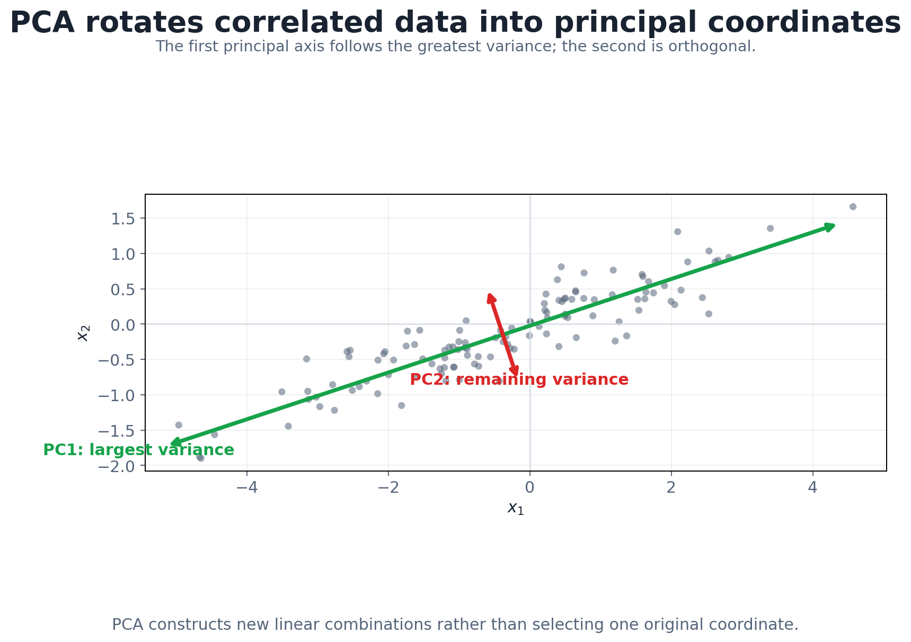
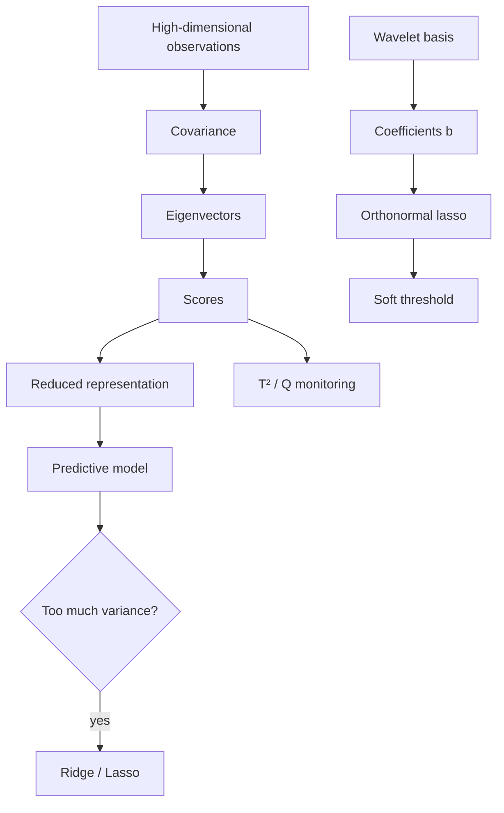

# 5. PCA, Bias–Variance, and Regularization

This chapter joins two ideas. **PCA** replaces many correlated predictors with a few uncorrelated scores, which is useful for representation, for monitoring, and for anomaly detection. **Regularization** keeps a predictive model from chasing noise when it has many coefficients. They meet at the end: lasso in an orthonormal wavelet basis *is* the soft-thresholding rule from Chapter 4.

```text
correlated high-dimensional data  → PCA scores
high-variance predictive model    → ridge / lasso
orthonormal wavelets + L1 penalty → soft thresholding
```

(For the derivation of PCA as variance maximization and its computation via SVD, see my [CSE 575 notes, Chapter 11](../../cse-575-statistical-machine-learning/docs/11_dimensionality_reduction_and_pca.md). This chapter focuses on what's specific to temporal data and monitoring.)

## 1. Why PCA for time series?

Many observed variables often respond to a few underlying causes, so they are correlated. With two predictors the scatter hugs a line; with $M$ predictors the data sit near a low-dimensional subspace, e.g. the plane $2.4x_1+5.1x_2-x_3\approx0$. A few derived variables can then summarize them all.

For temporal data, first decide **what a row and a column are**. Rows could be whole traces, fixed-length segments, or channels; columns could be time positions, channels, or engineered features. With rows = traces and columns = time positions, each principal direction is itself a *shape over time*, and the scores say how much of each shape a trace contains. Labels like normal/abnormal can then be studied in score space.

## 2. Covariance and correlation

```math
\sigma_{jj}=\mathrm{Var}(X_j),\qquad \sigma_{jk}=\mathrm{Cov}(X_j,X_k),\qquad \rho_{jk}=\frac{\sigma_{jk}}{\sigma_j\sigma_k},\qquad
\Sigma=\begin{pmatrix}\sigma_{11}&\cdots&\sigma_{1M}\\\vdots&\ddots&\vdots\\\sigma_{M1}&\cdots&\sigma_{MM}\end{pmatrix}.
```

Covariance only captures **linear** relationships. Two variables on a circle, $x_1^2+x_2^2=1$, have zero correlation but are completely dependent. Kernel PCA (Chapter 10) handles such structure.

## 3. Principal components

The first component is the unit direction of maximum variance:

```math
z_1=\mathbf w^\top\mathbf x,\quad \mathbf w^\top\mathbf w=1,\quad \mathrm{Var}(z_1)=\mathbf w^\top\Sigma\mathbf w\;\Rightarrow\;\mathbf w=\mathbf v_1,
```

the top eigenvector of $\Sigma$. The next component maximizes variance subject to being uncorrelated with the previous ones, which is equivalent to orthogonality of the directions, and gives $\mathbf v_2$, then $\mathbf v_3$, and so on. With the eigendecomposition $\Sigma=VDV^\top$ and $\lambda_1\ge\cdots\ge\lambda_M\ge0$:

- **loadings** $\mathbf v_m$: how much each original variable contributes to component $m$;
- **scores** $z_{nm}=\mathbf v_m^\top\mathbf x_n$: the coordinates of observation $n$ in the new axes.



*PCA rotates the axes to line up with the directions of greatest spread.*

**Via SVD.** For the centered $N\times M$ data matrix, $X=UDV^\top$. The right singular vectors $V$ are the principal directions, and with the sample covariance $S=X^\top X/(N-1)$ the eigenvalues are $\lambda_m=d_m^2/(N-1)$.

**In practice:** estimate $\Sigma$ by the sample covariance, usually after **standardizing** (which makes it PCA on the correlation matrix), and keep a subset of scores as new predictors or latent variables.

## 4. How many components?

```math
\mathrm{Var}(z_m)=\lambda_m,\qquad \sum_m\mathrm{Var}(z_m)=\mathrm{tr}(\Sigma)=\sum_m\lambda_m .
```

Keep the smallest $M_0$ whose eigenvalues explain enough of the total (e.g. 80%), or cut at the elbow of the **scree plot** (eigenvalue against index). If the scores feed a predictive model, choose $M_0$ by validation error instead.

## 5. Reading components of time series

With time positions as columns, eigenvectors often look like interpretable contrasts: $\mathbf v_1\approx$ overall level, $\mathbf v_2\approx$ early-versus-late, $\mathbf v_3\approx$ middle-versus-ends. Score plots colored by class show which of these separate normal from abnormal traces.

But PCA's objective ignores time order: permute the columns identically for every trace and you get the same components, permuted. That is the key contrast with ARIMA, where order is everything.

## 6. PCA for monitoring and anomaly detection

Fit PCA on normal reference data, then score new observations.

**Distance in score space.** An orthonormal rotation preserves length:

```math
\lVert\mathbf x\rVert^2=\sum_mx_m^2=\sum_mz_m^2 .
```

**Two kinds of unusual.** A point can be

- far out **along** a high-variance direction: big, but a kind of variation we've seen before; or
- **off** the learned subspace: small in size but a new *kind* of variation.

The second is usually the more worrying one.

## 7. Mahalanobis distance and Hotelling's $T^2$

```math
d_M^2(\mathbf x,\boldsymbol\mu)=(\mathbf x-\boldsymbol\mu)^\top\Sigma^{-1}(\mathbf x-\boldsymbol\mu)=\sum_{m=1}^{M}\frac{z_m^2}{\lambda_m}.
```

Each squared score is divided by its variance, so a unit step along a low-variance direction counts far more than along a high-variance one. Contours are ellipses aligned with the principal axes.


With estimated mean and covariance, this is **Hotelling's $T^2$**, $T^2=(\mathbf x-\bar{\mathbf x})^\top S^{-1}(\mathbf x-\bar{\mathbf x})$. For Gaussian data with known parameters, $T^2\sim\chi^2_M$. With parameters estimated from $N$ reference points, a new observation satisfies $T^2\sim\frac{M(N-1)(N+1)}{N(N-M)}F_{M,N-M}$, which gives a control limit.

> [!NOTE]
> **Beyond the lecture: the two PCA monitoring statistics**
>
> Industrial monitoring pairs $T^2$ computed on the **kept** components (unusual but familiar variation) with the **SPE / Q statistic**, $\lVert\mathbf x-\hat{\mathbf x}\rVert^2$, the squared reconstruction error from the kept components (variation outside the model). A sensor fault that breaks the usual correlations shows up in Q even when $T^2$ looks normal. That is the "off the subspace" case from §6.

## 8. PCA's limitations

- **Interpretability:** every score mixes all the variables.
- **Scale:** without standardization, high-variance units dominate.
- **Sign ambiguity:** $\mathbf v_m$ and $-\mathbf v_m$ are equally valid; don't read meaning into the sign.
- **Rank deficiency:** with $N\le M$ (fewer traces than time points, which is common) the covariance has rank at most $N-1$, the remaining eigenvalues are zero, and their directions are arbitrary.
- **Linear only.**
- **Ignores time order.**
- **Unsupervised:** the highest-variance direction needn't predict the target.
- **Uncorrelated ≠ independent:** scores are uncorrelated, not necessarily independent (ICA targets independence).

## 9. From representation to model complexity

A representation with many basis vectors (wavelets, PCA scores, lags) means a model with many coefficients. Complexity can be controlled by feature selection, dropout, penalties, information criteria (AIC/BIC) or minimum description length. The rest of this chapter is about penalties.

## 10. Bias–variance

For an estimator $\hat f(x)$ of $f(x)$:

```math
\mathbb E\big[(\hat f(x)-f(x))^2\big]=\underbrace{\mathbb E\big[(\hat f(x)-\mathbb E\hat f(x))^2\big]}_{\text{variance}}+\underbrace{\big(\mathbb E\hat f(x)-f(x)\big)^2}_{\text{bias}^2}.
```

For example, the sample mean is unbiased with variance $\sigma^2/n$, so more data shrinks its error. More model complexity usually lowers bias and raises variance. The full derivation, including the noise term, is in [CSE 575, Chapter 2](../../cse-575-statistical-machine-learning/docs/02_generalization_validation_bias_variance.md).

**Experiment.** The truth is $y=10+4x_1+e$, but we fit all $M=29$ predictors with only $N=30$ observations. One train/test split can look fine. Across 100 simulated datasets, though, the test predictions swing wildly: nearly as many coefficients as data points means huge variance. With 999 candidate predictors, $N=1000$ and 99 of them in the model, the spread is still large, because every irrelevant coefficient adds estimation noise.

## 11. Penalized least squares

Accept a little bias for a large drop in variance:

```math
\hat{\boldsymbol\beta}=\arg\min_{\beta_0,\boldsymbol\beta}\;\sum_i\big(y_i-\beta_0-\textstyle\sum_m\beta_mx_{im}\big)^2+\lambda\,\rho(\boldsymbol\beta),
```

with the penalty $\rho$ increasing in the coefficient sizes (the intercept isn't penalized). $\lambda=0$ gives ordinary least squares; $\lambda\to\infty$ drives the slopes to zero. Penalties also stabilize fits with correlated predictors, which otherwise get large coefficients of opposite sign.

| Penalty | $\rho(\boldsymbol\beta)$ | Name |
|---|---|---|
| $L_2^2$ | $\sum_m\beta_m^2$ | ridge |
| $L_1$ | $\sum_m\lvert\beta_m\rvert$ | lasso |
| $L_p^p$, $p<1$ | $\sum_m\lvert\beta_m\rvert^p$ | even sparser, but non-convex |

## 12. Ridge regression

After standardizing the predictors and centering $y$:

```math
\hat{\boldsymbol\beta}^{\text{ridge}}=(X^\top X+\lambda I)^{-1}X^\top\mathbf y\qquad\text{vs}\qquad \hat{\boldsymbol\beta}^{\text{LS}}=(X^\top X)^{-1}X^\top\mathbf y .
```

$X^\top X+\lambda I$ is invertible for any $\lambda>0$, even when $M>N$. Rerunning the $M=29$, $N=30$ experiment with a moderate $\lambda\approx4$ makes the predictions across the 100 datasets tight: a little bias, far less variance.

**Coefficient paths.** As $\lambda$ grows from 0, every coefficient shrinks smoothly toward zero. It approaches zero but is **never exactly zero** at finite $\lambda$, and the prediction tends to the mean of $y$ as $\lambda\to\infty$.

## 13. Ridge shrinks the low-variance directions most

Write $X=UDV^\top$ with singular values $d_1\ge d_2\ge\cdots$. The fitted values are

```math
X\hat{\boldsymbol\beta}^{\text{LS}}=UU^\top\mathbf y=\sum_m\mathbf u_m\mathbf u_m^\top\mathbf y,\qquad
X\hat{\boldsymbol\beta}^{\text{ridge}}=\sum_m\frac{d_m^2}{d_m^2+\lambda}\,\mathbf u_m\mathbf u_m^\top\mathbf y .
```

(These are *fitted values*, not coefficient vectors.) Each principal direction is shrunk by $d_m^2/(d_m^2+\lambda)$: close to 1 for high-variance directions and close to 0 for low-variance ones. Ridge is a **soft version of PCA regression**. Instead of keeping the top components and dropping the rest, it gradually down-weights the directions that carry little information about $\mathbf y$ and are the most unstable to estimate.

## 14. Lasso

```math
\min_{\boldsymbol\beta}\;\lVert\mathbf y-X\boldsymbol\beta\rVert_2^2+\lambda\lVert\boldsymbol\beta\rVert_1 .
```

There's no closed form in general, but the problem is convex, so coordinate descent, LARS or proximal gradient find the global optimum. Lasso does **shrinkage and selection**: its coefficient paths are piecewise linear and hit exactly zero, then stay there.


| | Ridge | Lasso |
|---|---|---|
| Penalty | $\sum\beta_m^2$ | $\sum\lvert\beta_m\rvert$ |
| Path | smooth | piecewise linear |
| Exact zeros | no | yes |
| Closed form | yes | no |
| Role | variance reduction | shrinkage + selection |

## 15. Lasso in a wavelet basis is soft thresholding

Take $X=W$, an **orthonormal** wavelet basis, and let $\mathbf b=W^\top\mathbf y$ be the plain wavelet coefficients. Because $W^\top W=I$,

```math
\lVert\mathbf y-W\boldsymbol\beta\rVert^2=\lVert\mathbf b-\boldsymbol\beta\rVert^2+\text{const},
```

so the lasso **separates into independent 1-D problems** $\min_{\beta_j}(b_j-\beta_j)^2+\lambda|\beta_j|$, each solved by

```math
\beta_j^\star=\mathrm{sgn}(b_j)\left(|b_j|-\tfrac{\lambda}{2}\right)_+ .
```

That is soft thresholding at $C=\lambda/2$. Hard thresholding, $b_j\mathbf 1\{|b_j|>C\}$, is instead the solution with an $\ell_0$ (count) penalty. **Wavelet denoising = lasso regression on wavelet features.**

A standard threshold comes from extreme-value reasoning: the largest of $N$ white-noise coefficients with standard deviation $\sigma$ is about $\sigma\sqrt{2\log N}$, so the universal threshold $C=\sigma\sqrt{2\log N}$ removes nearly all pure-noise coefficients. Estimate $\sigma$ from the finest-level details with the median absolute deviation: $\hat\sigma=\mathrm{median}(|cD_1|)/0.6745$.



## 16. Comparisons and confusions

| | PCA | Ridge / lasso |
|---|---|---|
| Uses the target? | no | yes |
| Object | covariance eigenvectors | penalized loss |
| Reduces dimension by | dropping low-variance scores | shrinking (ridge) or zeroing (lasso) coefficients |
| Main risk | high-variance direction may not predict $y$ | added bias |

- **Scores vs loadings:** coordinates of the observations vs coefficients of the directions.
- **Uncorrelated vs independent.**
- **Largest variance vs best prediction.**
- **Ridge shrinks; lasso selects.**
- **Lasso gives soft thresholding, not hard.**

## 17. Questions and answers

<details><summary>How should rows and columns be set up for PCA on temporal traces?</summary>

For "shape" analysis, rows = aligned traces or segments and columns = time positions (or channels × time). For relationships between sensors, rows = time points and columns = sensors, but then rows are autocorrelated, so treat the covariance estimate with care.
</details>

<details><summary>Why use the direction of greatest variance if the target might depend on a low-variance direction?</summary>

It's a bet that signal lives where variance is. When a target is available, check it: use partial least squares or supervised selection, or tune $M_0$ by validation error.
</details>

<details><summary>Which statistic should be used for PCA anomaly detection?</summary>

Both $T^2$ (inside the model) and Q/SPE (outside the model). They catch different failures.
</details>

<details><summary>How should λ for ridge or lasso be chosen?</summary>

By cross-validation, and for time series with forward-chaining folds. `RidgeCV` and `LassoCV` with `TimeSeriesSplit` do this. The "one-standard-error rule" picks the largest $\lambda$ within 1 SE of the best, for a simpler model.
</details>

<details><summary>Should wavelet coefficients be thresholded before or during supervised fitting?</summary>

Before, if the goal is denoising the input. During (a lasso on the wavelet features, with $\lambda$ tuned by CV) if the goal is prediction, so that the target decides which coefficients survive.
</details>

---

[← Previous: Wavelets](04_wavelets.md) · [Course map](../course_map.md) · [Next: Markov Models and HMMs →](06_markov_models_hmm_and_em.md)
