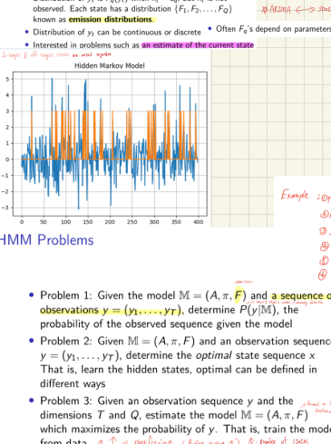
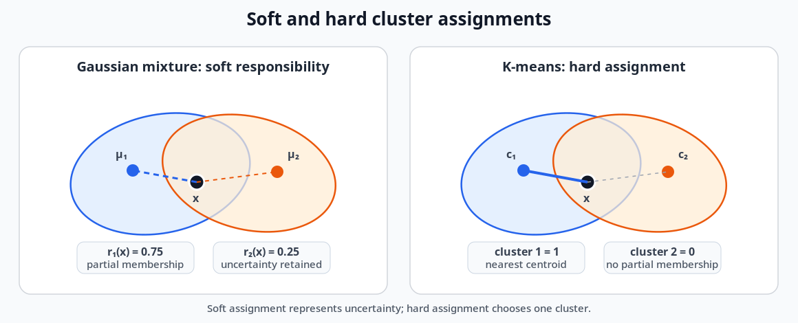
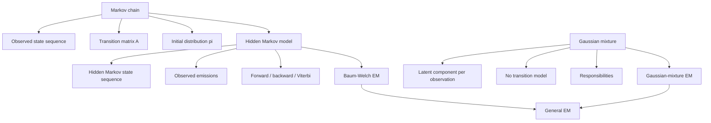

# Markov Chains, Hidden Markov Models, and EM

## 1. Chapter overview

This chapter introduces probabilistic models for sequences with discrete
states and possibly hidden state dynamics.

The progression is:

```text
Markov chain
    -> directly observed states

Hidden Markov model
    -> hidden states plus observed emissions

Forward and backward recursions
    -> efficient probability calculations

Viterbi
    -> most probable complete state sequence

Baum-Welch
    -> estimate HMM parameters

Gaussian mixture model
    -> latent component assignments without temporal transitions

General EM
    -> alternate expected latent assignments and parameter updates
```

The course also emphasizes that both Baum-Welch and Gaussian-mixture
training are expectation-maximization procedures. They improve the
likelihood iteratively but can converge to local rather than global
optima.

**Sources:** CSE598MTL.pdf, pp. 45-55

---

## 2. Learning objectives

After this chapter, the reader should be able to:

1. define a finite-state Markov chain;
2. state the Markov property and conditional-independence interpretation;
3. propagate a state distribution using powers of a transition matrix;
4. formulate and solve the gambler's-ruin probability recurrence shown in
   the notes;
5. distinguish hidden states from observed emissions in an HMM;
6. identify the three main HMM problems: evaluation, decoding, and
   learning;
7. calculate $P(\mathbf{y}\mid M)$ with the forward algorithm;
8. calculate posterior state probabilities with forward-backward
   recursions;
9. distinguish per-time posterior state estimates from the Viterbi
   sequence;
10. describe Gaussian, mixture, and multinomial emission distributions;
11. state the Baum-Welch expected-count updates;
12. explain recurrent, absorbing, and constrained HMM structures;
13. formulate Gaussian-mixture likelihood with latent assignment variables;
14. interpret EM responsibilities as soft assignments;
15. perform the Gaussian-mixture E-step and M-step;
16. describe the general EM objective, convergence behavior, and
   initialization limitations.

**Sources:** CSE598MTL.pdf, pp. 45-55

---

## 3. Model associations

The opening page places Markov-style models in a broader family of
dynamic systems.

Examples of associations listed in the notes include:

- Markov chains;
- hidden Markov models;
- Markov decision processes;
- dynamic programming;
- reinforcement learning;
- linear and particle filters;
- recurrent neural networks;
- LSTMs;
- dilation models;
- attention models.

The shared idea is a system that transitions between states over time.

The course notes that the state space may be:

- finite and discrete;
- continuous.

This chapter focuses primarily on finite-state Markov chains and HMMs.

**Source:** CSE598MTL.pdf, p. 45

---

## 4. Finite-state Markov chains

Let the state set be:

```math
S=\{s_1,s_2,\ldots,s_Q\}.
```

A Markov chain is defined by:

- an initial-state distribution:

```math
\boldsymbol{\pi}
=
(\pi_1,\pi_2,\ldots,\pi_Q);
```

- a transition matrix:

```math
A=(a_{ij});
```

- a sequence of states:

```math
x_1,x_2,\ldots,x_T.
```

The transition probabilities are assumed constant over time in the basic
model presented here.

The complete model is summarized as:

```math
(S,A,\boldsymbol{\pi}).
```

**Source:** CSE598MTL.pdf, p. 45

---

## 5. Markov property

The Markov property states that the next state depends only on the current
state, not the complete previous history:

```math
P(x_{t+1}\mid x_t,x_{t-1},\ldots,x_1)
=
P(x_{t+1}\mid x_t).
```

The slide also states that:

```math
x_{t+1}
```

is conditionally independent of:

```math
x_{t-1},\ldots,x_1
```

given $x_t$.

The transition-matrix entries are:

```math
a_{ij}
=
P(x_{t+1}=s_j\mid x_t=s_i).
```

> **Handwritten annotation:** The probability of the next state depends
> only on the previous/current state.

### Clarification

“Previous state” in the handwriting refers to the immediately preceding
state in the transition, not every earlier state.

**Source:** CSE598MTL.pdf, p. 45

---

## 6. State-probability propagation

The data are a sequence of states:

```math
x_1,x_2,\ldots,x_T.
```

Suppose the initial state-probability vector is:

```math
\boldsymbol{\pi}.
```

The probability distribution after one transition is:

```math
\boldsymbol{\pi}^\top A.
```

After $t$ transitions:

```math
\boldsymbol{\pi}^\top A^t.
```

The slide gives the state $j$ probability as:

```math
\pi_j(t)
=
\sum_{i=1}^{Q}\pi_i a_{ij}.
```

The handwritten matrix multiplication illustrates repeated multiplication
of the initial distribution by the transition matrix.

**Source:** CSE598MTL.pdf, p. 46

---

## 7. First-entry times

The page notes that other events of interest include:

- exits;
- entries;
- the first time a state is entered.

If $T$ is the first-entry time to state $s_q$, then the page writes an
event such as:

```math
P_\pi(T>t).
```

The source page introduces the concept but does not develop the general
first-passage-time formulas.

**Source:** CSE598MTL.pdf, p. 46

---

## 8. Gambler's-ruin example

A player:

- wins one unit with probability $p$;
- loses one unit with probability $q$;
- stops when reaching $0$ or $N$.

Let $P_i$ be the probability of eventually reaching $N$ when starting
with $i$ units.

The recurrence is:

```math
P_i
=
pP_{i+1}+qP_{i-1}.
```

The boundary conditions are:

```math
P_0=0,
\qquad
P_N=1.
```

The page gives the solution:

```math
P_i
=
\frac{
1-(q/p)^i
}{
1-(q/p)^N
},
\qquad p\neq q,
```

and for the fair case:

```math
p=q=0.5,
```

```math
P_i=\frac{i}{N}.
```

The plotted curves show that small changes in the win probability can
greatly alter the eventual probability of reaching $N$, especially as
the target $N$ becomes large.

**Source:** CSE598MTL.pdf, p. 46

---

## 9. Hidden Markov models

A hidden Markov model expands the Markov-chain model.

The hidden states are:

```math
x_t\in S,
```

but they are not directly observed.

Instead, at each time $t$, an observation or measurement:

```math
y_t
```

is generated from the current hidden state.

The HMM is summarized on the slide as:

```math
M=(A,\boldsymbol{\pi},F),
```

where $F$ denotes the emission distributions.

**Source:** CSE598MTL.pdf, p. 47

---

## 10. Emission distributions

If:

```math
x_t=s_q,
```

then the observation distribution is:

```math
F_q(y_t).
```

The states may have different emission distributions:

```math
F_1,F_2,\ldots,F_Q.
```

The page states that the emission parameters may depend on the state.

A key HMM assumption is that observations are conditionally independent
given the hidden states.

Conceptually:

```text
hidden state x_t
    -> generates observation y_t

given x_t,
y_t does not require the other hidden states or observations
for its emission probability
```

**Source:** CSE598MTL.pdf, p. 47

---

## 11. Hidden and observed sequences

The course figure shows a hidden state sequence and a noisy observed
sequence generated from it.


*Source figure — Hidden-state and observed-sequence example from the course page.*

The main inference interest listed is an estimate of the current hidden
state.

The handwritten example list includes possible applications such as:

- speech;
- biological or gene-sequence models;
- motion or behavioral state modeling;
- sequence segmentation.

Some small handwritten examples are difficult to verify exactly and are
logged separately.

**Source:** CSE598MTL.pdf, p. 47

---

## 12. The three HMM problems

The page organizes HMM work into three problems.

### Problem 1: evaluation

Given:

- model $M=(A,\boldsymbol{\pi},F)$;
- observations:

```math
\mathbf{y}=(y_1,\ldots,y_T),
```

calculate:

```math
P(\mathbf{y}\mid M).
```

This is the probability of the observed sequence under the model.

### Problem 2: decoding

Given $M$ and $\mathbf{y}$, estimate the hidden state sequence:

```math
\mathbf{x}=(x_1,\ldots,x_T).
```

The page notes that “optimal” can be defined in different ways.

### Problem 3: learning

Given:

- observations $\mathbf{y}$;
- state count $Q$;
- observation dimension $D$;

estimate:

```math
M=(A,\boldsymbol{\pi},F)
```

to maximize the probability of the observations.

**Source:** CSE598MTL.pdf, p. 47

---

## 13. Probability of a complete hidden and observed sequence

For a specified hidden-state sequence:

```math
\mathbf{x}=(x_1,\ldots,x_T),
```

the emission probability is:

```math
P(\mathbf{y}\mid\mathbf{x})
=
F_{x_1}(y_1)
F_{x_2}(y_2)
\cdots
F_{x_T}(y_T).
```

The hidden-state path probability is:

```math
P(\mathbf{x})
=
\pi_{x_1}
a_{x_1x_2}
\cdots
a_{x_{T-1}x_T}.
```

Therefore:

```math
P(\mathbf{x},\mathbf{y})
=
P(\mathbf{y}\mid\mathbf{x})P(\mathbf{x}).
```

**Source:** CSE598MTL.pdf, p. 48

---

## 14. Why direct enumeration is infeasible

The sequence likelihood is:

```math
P(\mathbf{y})
=
\sum_{\mathbf{x}}
P(\mathbf{y},\mathbf{x})
=
\sum_{\mathbf{x}}
P(\mathbf{y}\mid\mathbf{x})P(\mathbf{x}).
```

With $Q$ states and sequence length $T$, there are:

```math
Q^T
```

possible hidden-state sequences.

The slide gives:

- $Q=5$;
- $T=100$;

which would require summing over:

```math
5^{100}
```

state sequences.

This motivates dynamic programming.

**Source:** CSE598MTL.pdf, p. 48

---

## 15. Forward algorithm

Define the forward quantity:

```math
\alpha_t(i)
=
P(y_1,\ldots,y_t,x_t=s_i\mid M).
```

It is the probability of:

- observing the partial sequence through time $t$;
- ending in state $s_i$ at time $t$.

### 15.1 Initialization

```math
\alpha_1(i)
=
\pi_iF_i(y_1).
```

### 15.2 Recursion

For state $s_j$:

```math
\alpha_{t+1}(j)
=
\left[
\sum_{i=1}^{Q}
\alpha_t(i)a_{ij}
\right]
F_j(y_{t+1}).
```

The handwritten annotation identifies the three operations:

1. use the current forward probabilities;
2. transition from $s_i$ to $s_j$;
3. multiply by the probability of the new observation under state $s_j$.

### 15.3 Termination

```math
P(\mathbf{y}\mid M)
=
\sum_{i=1}^{Q}\alpha_T(i).
```

The slide states that for $Q=5$ and $T=100$, the forward method uses
only about 3,000 calculations rather than enumerating $5^{100}$ paths.

**Source:** CSE598MTL.pdf, p. 48

---

## 16. Backward algorithm

Define:

```math
\beta_t(i)
=
P(y_{t+1},\ldots,y_T\mid x_t=s_i,M).
```

This is the probability of the future observations after time $t$,
given state $s_i$ at time $t$.

### 16.1 Initialization

```math
\beta_T(i)=1.
```

### 16.2 Recursion

```math
\beta_t(i)
=
\sum_{j=1}^{Q}
a_{ij}
F_j(y_{t+1})
\beta_{t+1}(j).
```

The recursion combines:

- transition from $i$ to $j$;
- emission at $t+1$;
- probability of the remaining future observations.

**Source:** CSE598MTL.pdf, p. 49

---

## 17. Posterior state probabilities

The probability of state $s_i$ at time $t$, given all observations, is:

```math
\gamma_t(i)
=
P(x_t=s_i\mid\mathbf{y},M).
```

The page gives:

```math
\gamma_t(i)
=
\frac{
\alpha_t(i)\beta_t(i)
}{
P(\mathbf{y}\mid M)
}.
```

The probabilities are normalized:

```math
\sum_{i=1}^{Q}\gamma_t(i)=1.
```

A timewise state estimate is:

```math
\hat{x}_t
=
\mathrm{arg\,max}_{i}
\ \gamma_t(i).
```

**Source:** CSE598MTL.pdf, p. 49

---

## 18. Timewise posterior states versus Viterbi sequence

The page warns that selecting the largest $\gamma_t(i)$ independently at
each time may ignore the HMM's structural transition constraints.

For example, it could select a transition that has zero probability under
the model.

The globally optimal sequence is instead defined as:

```math
\mathbf{x}^*
=
\mathrm{arg\,max}_{\mathbf{x}}
\ P(\mathbf{x}\mid\mathbf{y}).
```

The slide identifies the solution as the **Viterbi algorithm**.

### Distinction

| Goal | Method in the notes |
|---|---|
| Most probable state at each separate time | Forward-backward posterior $\gamma_t(i)$ |
| Most probable complete valid state sequence | Viterbi algorithm |

The slide states that Viterbi uses recursion and is also called dynamic
programming.

**Source:** CSE598MTL.pdf, p. 49

---

## 19. Common emission distributions

### 19.1 Gaussian emissions

For state $s_j$:

```math
F_j(y)
=
N(y;\mu_j,\sigma_j^2).
```

The page shows equal-variance Gaussian distributions as an example.

### 19.2 Mixture-of-normal emissions

An emission distribution may itself be a mixture:

```math
F_j(y)
=
\sum_{k=1}^{K}
q_{jk}
N(y;\mu_{jk},\sigma_{jk}^2),
```

where:

```math
q_{jk}>0,
\qquad
\sum_{k=1}^{K}q_{jk}=1.
```

### 19.3 Multinomial emissions

For a discrete observation alphabet:

```math
y_t\in\{1,2,\ldots,K\},
```

each state has probabilities:

```math
p_j(k)
=
P(y_t=k\mid x_t=s_j).
```

These could represent symbols such as bases or categories.

**Source:** CSE598MTL.pdf, p. 49

---

## 20. Baum-Welch learning

The third HMM problem is parameter learning.

The slide states that no closed-form maximum-likelihood solution is
available for the full HMM parameter set.

Instead, it uses the Baum-Welch algorithm, described as a special case of
expectation-maximization.

The parameter set includes:

```math
\theta
=
(\boldsymbol{\pi},A,p_j(k))
```

for the multinomial-emission case shown.

**Source:** CSE598MTL.pdf, p. 50

---

## 21. Expected transition probabilities

Define:

```math
\psi_t(i,j)
=
P(x_t=s_i,x_{t+1}=s_j\mid\mathbf{y},M).
```

The page gives:

```math
\psi_t(i,j)
=
\frac{
\alpha_t(i)
a_{ij}
F_j(y_{t+1})
\beta_{t+1}(j)
}{
P(\mathbf{y}\mid M)
}.
```

The state posterior is:

```math
\gamma_t(i)
=
\sum_{j=1}^{Q}\psi_t(i,j).
```

The expected number of transitions from state $s_i$ is:

```math
\sum_{t=1}^{T-1}\gamma_t(i).
```

The expected number of transitions from $s_i$ to $s_j$ is:

```math
\sum_{t=1}^{T-1}\psi_t(i,j).
```

**Source:** CSE598MTL.pdf, p. 50

---

## 22. Baum-Welch parameter updates

The initial-state update is:

```math
\hat{\pi}_i=\gamma_1(i).
```

The transition update is:

```math
\hat{a}_{ij}
=
\frac{
\sum_{t=1}^{T-1}\psi_t(i,j)
}{
\sum_{t=1}^{T-1}\gamma_t(i)
}.
```

For multinomial emissions, the page gives:

```math
\hat{p}_i(k)
=
\frac{
\sum_{t=1}^{T}
\mathbf{1}(y_t=k)\gamma_t(i)
}{
\sum_{t=1}^{T}\gamma_t(i)
}.
```

These are expected-count ratios:

```text
new transition probability
    =
expected transitions i -> j
/
expected departures from i
```

The page states that each iteration increases the probability of the
observed data.

More carefully, the sequence likelihood is nondecreasing across EM
iterations; the source uses a strict inequality in its display.

**Source:** CSE598MTL.pdf, p. 50

---

## 23. HMM structures

The notes list several structural variations.

### 23.1 Recurrent state

The slide gives a recurrence-related condition for a state. The exact
display is small and uses $x_0$ and $x_t$; its intended meaning is that
the process can return to the state.

### 23.2 Absorbing state

An absorbing state is described as a state that is never left.

For an absorbing state $s_i$:

```text
once entered
    -> all later states remain s_i
```

### 23.3 Short-sequence issue

The page warns that short sequences can produce zero-probability
estimates for transitions or emissions that were not observed.

The handwritten notes discuss adding small values or using prior-like
adjustments so that unseen events do not become permanently impossible.

### 23.4 Constrained structures

The slide states that specialized formulas can be adapted for other HMM
structures.

**Source:** CSE598MTL.pdf, p. 51

---

## 24. Gaussian-mixture model

Expectation-maximization is next introduced through a Gaussian mixture.

Each observed vector $\mathbf{x}$ comes from one of $K$ normal
distributions:

```math
f(\mathbf{x}\mid\mu_k,\Sigma_k),
\qquad
k=1,\ldots,K,
```

with mixture probabilities:

```math
\pi_k.
```

The parameter set is:

```math
\theta
=
(\pi_1,\ldots,\pi_K,
\mu_1,\ldots,\mu_K,
\Sigma_1,\ldots,\Sigma_K).
```

The mixture density is:

```math
f(\mathbf{x}\mid\theta)
=
\sum_{k=1}^{K}
\pi_k
f(\mathbf{x}\mid\mu_k,\Sigma_k).
```

The page notes that the density is a weighted sum of the component
distributions.

**Source:** CSE598MTL.pdf, p. 52

---

## 25. Incomplete-data likelihood

For observations:

```math
\mathbf{x}_1,\ldots,\mathbf{x}_N,
```

the log likelihood is:

```math
L
=
\sum_{n=1}^{N}
\log
\left[
\sum_{k=1}^{K}
\pi_k
f(\mathbf{x}_n\mid\mu_k,\Sigma_k)
\right].
```

The slide calls this the **incomplete log likelihood** because the
component assignments are not observed.

The sum inside the logarithm makes direct maximization difficult.

**Source:** CSE598MTL.pdf, p. 52

---

## 26. Latent assignment variables

Introduce:

```math
z_{nk}
=
\begin{cases}
1, & \mathbf{x}_n \text{ belongs to component }k,\\
0, & \text{otherwise}.
\end{cases}
```

If the assignments were known, the complete likelihood would be:

```math
f(\mathbf{x},\mathbf{z}\mid\theta)
=
\prod_{n=1}^{N}
\prod_{k=1}^{K}
\left[
\pi_k
f(\mathbf{x}_n\mid\mu_k,\Sigma_k)
\right]^{z_{nk}}.
```

The complete log likelihood is:

```math
\log f(\mathbf{x},\mathbf{z}\mid\theta)
=
\sum_{n=1}^{N}
\sum_{k=1}^{K}
z_{nk}
\left[
\log\pi_k+
\log f(\mathbf{x}_n\mid\mu_k,\Sigma_k)
\right].
```

This form separates by component and is easier to maximize.

**Source:** CSE598MTL.pdf, p. 52

---

## 27. Responsibilities

The assignments $z_{nk}$ are unknown, so EM replaces them by expected
values under the current parameter estimates.

The responsibility is:

```math
E[z_{nk}]
=
\gamma(z_{nk})
=
\frac{
\pi_k
f(\mathbf{x}_n\mid\mu_k,\Sigma_k)
}{
\sum_{j=1}^{K}
\pi_j
f(\mathbf{x}_n\mid\mu_j,\Sigma_j)
}.
```

For each observation:

```math
\sum_{k=1}^{K}\gamma(z_{nk})=1.
```

The slide interprets these as probabilities that observation $n$
belongs to each group.

**Source:** CSE598MTL.pdf, p. 53

---

## 28. Soft assignments versus hard assignments

A fractional responsibility is a **soft assignment**.

For example:

```text
observation x_n

component 1 responsibility: 0.75
component 2 responsibility: 0.25
```

K-means instead assigns the observation completely to one nearest
centroid:

```text
component 1: 1
component 2: 0
```

The page calls this a hard assignment.

The handwritten diagrams compare overlapping component probabilities and
nearest-center decisions.


*Redrawn course diagram — Soft responsibilities preserve uncertainty, while K-means makes one hard assignment.*


*[Open the original course figure](../assets/original_figures/p053_em_soft_assignments.png)*
The slide also notes that, for Gaussian components, the responsibility
formula uses a covariance-adjusted or Mahalanobis-distance form.

**Source:** CSE598MTL.pdf, p. 53

---

## 29. Expected complete log likelihood

Replacing $z_{nk}$ with responsibilities gives the expected complete
log likelihood:

```math
\sum_{n=1}^{N}
\sum_{k=1}^{K}
\gamma(z_{nk})
\left[
\log\pi_k+
\log f(\mathbf{x}_n\mid\mu_k,\Sigma_k)
\right].
```

This is the quantity optimized in the M-step.

**Source:** CSE598MTL.pdf, p. 53

---

## 30. Gaussian-mixture M-step

Define the effective membership count:

```math
N_k
=
\sum_{n=1}^{N}\gamma(z_{nk}).
```

The mean update is:

```math
\mu_k
=
\frac{1}{N_k}
\sum_{n=1}^{N}
\gamma(z_{nk})\mathbf{x}_n.
```

The covariance update is:

```math
\Sigma_k
=
\frac{1}{N_k}
\sum_{n=1}^{N}
\gamma(z_{nk})
(\mathbf{x}_n-\mu_k)
(\mathbf{x}_n-\mu_k)^\top.
```

The mixture-probability update is:

```math
\pi_k=\frac{N_k}{N}.
```

The red annotation describes $N_k$ as the total responsibility assigned
to group $k$.

**Source:** CSE598MTL.pdf, p. 53

---

## 31. Gaussian-mixture EM steps

### Initialization

Choose initial parameters:

```math
\theta^{(0)}
=
\left\{
\pi_k^{(0)},
\mu_k^{(0)},
\Sigma_k^{(0)}
\right\}_{k=1}^{K}.
```

### E-step

Calculate responsibilities using the current parameters:

```math
\gamma^{(r)}(z_{nk})
=
\frac{
\pi_k^{(r)}
f(\mathbf{x}_n\mid\mu_k^{(r)},\Sigma_k^{(r)})
}{
\sum_{j=1}^{K}
\pi_j^{(r)}
f(\mathbf{x}_n\mid\mu_j^{(r)},\Sigma_j^{(r)})
}.
```

### M-step

Hold the responsibilities fixed and update:

```math
N_k^{(r)}
=
\sum_{n=1}^{N}\gamma^{(r)}(z_{nk}),
```

```math
\pi_k^{(r+1)}
=
\frac{N_k^{(r)}}{N},
```

```math
\mu_k^{(r+1)}
=
\frac{1}{N_k^{(r)}}
\sum_{n=1}^{N}
\gamma^{(r)}(z_{nk})\mathbf{x}_n,
```

```math
\Sigma_k^{(r+1)}
=
\frac{1}{N_k^{(r)}}
\sum_{n=1}^{N}
\gamma^{(r)}(z_{nk})
(\mathbf{x}_n-\mu_k^{(r+1)})
(\mathbf{x}_n-\mu_k^{(r+1)})^\top.
```

Repeat E- and M-steps until convergence.

**Source:** CSE598MTL.pdf, p. 54

---

## 32. General EM algorithm

Suppose:

- $\mathbf{x}$: observed variables;
- $\mathbf{z}$: latent variables;
- $\theta$: model parameters.

The goal is maximum-likelihood estimation of:

```math
f(\mathbf{x}\mid\theta).
```

Choose an initial value:

```math
\theta^{(0)}.
```

### E-step

Evaluate the conditional distribution:

```math
f(\mathbf{z}\mid\mathbf{x},\theta^{(0)})
```

and the expected complete log likelihood:

```math
Q(\theta^{(0)},\theta)
=
\int
f(\mathbf{z}\mid\mathbf{x},\theta^{(0)})
\log f(\mathbf{x},\mathbf{z}\mid\theta)
\,d\mathbf{z}.
```

### M-step

Evaluate:

```math
\theta^{(1)}
=
\mathrm{arg\,max}_{\theta}
\ Q(\theta^{(0)},\theta).
```

Then check convergence using:

- the likelihood;
- the parameters.

Repeat until convergence.

**Source:** CSE598MTL.pdf, p. 54

---

## 33. EM convergence and limitations

The concluding page states:

- the likelihood increases with each iteration;
- the algorithm often converges reasonably quickly, with a handwritten
  note of roughly 50 iterations;
- it converges to a local maximum rather than guaranteeing the global
  maximum;
- several starting values may be used;
- the number of groups $K$ must be specified in advance.

### Important interpretation

The first bullet is best read as:

```text
each iteration does not decrease the likelihood
```

not that each iteration already attains the final maximum.

**Source:** CSE598MTL.pdf, p. 55

---

## 34. Covariance simplifications

The full Gaussian mixture estimates one covariance matrix per component.

The page lists simplifications.

### Spherical covariance per component

```math
\Sigma_k
=
\sigma_k^2I.
```

Only one scalar variance is estimated for each cluster.

### Shared spherical covariance

```math
\sigma_k^2=\sigma^2
\quad \text{for all }k.
```

The complete covariance structure is reduced to one scalar parameter.

The page notes that this restriction can still be acceptable when the
groups are well separated.

**Source:** CSE598MTL.pdf, p. 55

---

## 35. Markov, HMM, and mixture-model relationship



This diagram is synthesized from pages 45-55.

**Sources:** CSE598MTL.pdf, pp. 45-55

---

## 36. Main method comparison

| Method | Hidden variables | Temporal transitions | Main task |
|---|---|---:|---|
| Markov chain | No, states are observed | Yes | Model state evolution |
| HMM forward | Hidden states | Yes | Compute observation-sequence likelihood |
| HMM forward-backward | Hidden states | Yes | Compute per-time posterior state probabilities |
| Viterbi | Hidden states | Yes | Find most probable complete state path |
| Baum-Welch | Hidden states and transitions | Yes | Estimate HMM parameters |
| Gaussian-mixture EM | Component labels | No | Estimate mixture parameters |
| K-means comparison | Cluster label | No | Hard nearest-centroid assignment |

**Sources:** CSE598MTL.pdf, pp. 45-55

---

## 37. Common confusions

### Markov chain versus HMM

A Markov chain directly observes the state sequence. An HMM observes
emissions generated from unobserved states.

### Forward probability versus state posterior

$\alpha_t(i)$ is a joint probability of the partial observation sequence
and state $i$. $\gamma_t(i)$ is a posterior probability conditioned on
the entire observation sequence.

### Timewise most likely states versus most likely sequence

Selecting $\mathrm{arg\,max}_i\gamma_t(i)$ at each time can create an invalid or
suboptimal state path. Viterbi optimizes the complete sequence jointly.

### Baum-Welch versus general EM

Baum-Welch is an EM algorithm specialized to HMM expected state and
transition counts.

### Gaussian mixture versus HMM

A Gaussian mixture assigns each observation to a component but has no
transition dependence between successive assignments. An HMM adds a state
transition process.

### Responsibility versus hard label

A responsibility is a fractional posterior assignment. K-means uses a
single hard cluster assignment.

### Increasing likelihood versus global optimum

EM produces nondecreasing likelihood values but may terminate at a local
maximum.

**Sources:** CSE598MTL.pdf, pp. 45-55

---

## 38. Questions preserved for later discussion

1. Which exact recurrent-state definition was intended on page 51?
2. What smoothing or prior was intended to prevent zero-probability HMM
   estimates for short sequences?
3. Which HMM applications in the handwritten list were emphasized by the
   professor?
4. Did the course implement scaling or log-space calculations for long
   forward-backward sequences?
5. How was the number of hidden states $Q$ selected?
6. How were Gaussian-emission covariance structures selected?
7. Which definition of “optimal state sequence” was used in assignments?
8. Did the Baum-Welch implementation use multiple random initializations?
9. How was $K$ selected for Gaussian mixtures?
10. Did the Gaussian-mixture implementation permit singular covariance
    matrices?
11. What convergence threshold was used for likelihood or parameters?
12. Does the strict likelihood inequality on page 50 allow equal
    likelihood at convergence?

These questions arise from the source pages and are not fully resolved
there.

---

## 39. Source map

| PDF page | Material reconstructed |
|---:|---|
| 45 | Model associations, finite-state Markov chains, Markov property |
| 46 | State-probability propagation, first-entry time, gambler's ruin |
| 47 | HMM definition, emissions, conditional independence, three problems |
| 48 | Sequence likelihood and forward algorithm |
| 49 | Backward recursion, posterior states, Viterbi, emission families |
| 50 | Baum-Welch expected transitions and parameter updates |
| 51 | Recurrent, absorbing, and constrained HMM structures |
| 52 | Gaussian mixtures, incomplete likelihood, latent variables |
| 53 | Responsibilities, soft assignments, Gaussian-mixture MLE updates |
| 54 | Gaussian-mixture and general EM algorithms |
| 55 | EM convergence, local optima, initialization, covariance simplification |

## Review status

- Markov definitions and matrix propagation: `[VERIFIED]`
- Gambler's-ruin recurrence and solution: `[VERIFIED]`
- HMM forward/backward equations: `[VERIFIED]`
- Small handwritten HMM application examples: `[NEEDS REVIEW]`
- Viterbi distinction: `[VERIFIED]`
- Baum-Welch updates: `[VERIFIED]`
- Recurrent-state wording on page 51: `[NEEDS REVIEW]`
- Gaussian-mixture responsibilities and M-step: `[VERIFIED]`
- General EM objective: `[VERIFIED]`
- Strict likelihood inequality: `[INTERPRETED AS NONDECREASING]`
