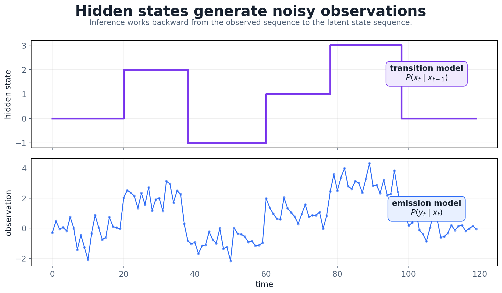

# 6. Markov Chains, Hidden Markov Models, and EM

This chapter models sequences through discrete states. A **Markov chain** observes its states directly. A **hidden Markov model** (HMM) only sees noisy emissions from states it can't observe. Three algorithms answer the three HMM questions: forward–backward for likelihood and posteriors, Viterbi for the best path, and Baum–Welch for learning. Baum–Welch is a case of expectation–maximization, the same EM that fits Gaussian mixtures.

```text
Markov chain → HMM → forward / backward → Viterbi → Baum–Welch (EM)
                                           Gaussian mixture → EM (no transitions)
```

Markov-type state models connect to much of the rest of the field: MDPs and reinforcement learning, dynamic programming, Kalman and particle filters, and RNNs/LSTMs, which are learned, continuous-state versions of the same "state evolves over time" idea.

## 1. Markov chains

States $S=\{s_1,\ldots,s_Q\}$, an initial distribution $\boldsymbol\pi$, and a time-invariant transition matrix

```math
A=(a_{ij}),\qquad a_{ij}=P(x_{t+1}=s_j\mid x_t=s_i),\qquad \textstyle\sum_ja_{ij}=1 .
```

**Markov property:** the next state depends only on the current one,

```math
P(x_{t+1}\mid x_t,x_{t-1},\ldots,x_1)=P(x_{t+1}\mid x_t),
```

that is, the future is conditionally independent of the past given the present.

**Propagating the distribution.** With $\boldsymbol\pi$ as a row vector, the distribution after one step is $\boldsymbol\pi^\top A$, with entries $\pi_j(1)=\sum_i\pi_ia_{ij}$, and after $t$ steps it is $\boldsymbol\pi^\top A^t$. For an irreducible aperiodic chain this converges to the **stationary distribution** $\boldsymbol\pi^\star=\boldsymbol\pi^{\star\top}A$ regardless of the starting point.

Other questions about a chain concern exits, entries and **first-entry times** $T$ into a state, e.g. $P_\pi(T>t)$.

## 2. Example: gambler's ruin

Win 1 with probability $p$, lose 1 with $q=1-p$, stop at $0$ or $N$. Let $P_i$ be the probability of reaching $N$ from $i$. Conditioning on the first bet,

```math
P_i=pP_{i+1}+qP_{i-1},\qquad P_0=0,\;P_N=1,
```

with solution

```math
P_i=\frac{1-(q/p)^i}{1-(q/p)^N}\;(p\ne q),\qquad P_i=\frac iN\;(p=q=\tfrac12).
```

A slightly unfair game is devastating over long horizons: with $p=0.49$, $i=50$ and $N=100$, $P_i\approx0.12$.

## 3. Hidden Markov models

The state sequence $x_t$ is a Markov chain we **don't observe**. At each step the current state emits an observation $y_t\sim F_{x_t}$. The model is $M=(A,\boldsymbol\pi,F)$, with two assumptions:

- the hidden states form a Markov chain;
- given its state, each observation is independent of all other states and observations.



*A piecewise-constant hidden state generates noisy observations.*

Applications: speech recognition (phonemes emitting acoustic frames), gene finding (coding/non-coding regions emitting bases), activity recognition from sensors, and regime switching in finance.

## 4. The three HMM problems

| Problem | Given | Want | Algorithm |
|---|---|---|---|
| Evaluation | $M$, $\mathbf y$ | $P(\mathbf y\mid M)$ | forward |
| Decoding | $M$, $\mathbf y$ | the hidden states | forward–backward (per step) or Viterbi (whole path) |
| Learning | $\mathbf y$, $Q$ | $M$ maximizing $P(\mathbf y\mid M)$ | Baum–Welch (EM) |

## 5. Why brute force fails

For a given path $\mathbf x$,

```math
P(\mathbf x)=\pi_{x_1}a_{x_1x_2}\cdots a_{x_{T-1}x_T},\qquad P(\mathbf y\mid\mathbf x)=\prod_tF_{x_t}(y_t),\qquad P(\mathbf y)=\sum_{\mathbf x}P(\mathbf y\mid\mathbf x)P(\mathbf x).
```

The sum has $Q^T$ paths; with $Q=5$ and $T=100$ that's $5^{100}\approx10^{70}$. Dynamic programming reuses shared prefixes and suffixes instead.

## 6. Forward algorithm

$\alpha_t(i)=P(y_1,\ldots,y_t,\,x_t=s_i\mid M)$ is the probability of the observations so far, ending in state $i$:

```math
\alpha_1(i)=\pi_iF_i(y_1),\qquad
\alpha_{t+1}(j)=\Big[\sum_i\alpha_t(i)a_{ij}\Big]F_j(y_{t+1}),\qquad
P(\mathbf y\mid M)=\sum_i\alpha_T(i).
```

The recursion reads: take every way of being in $i$ at time $t$, transition to $j$, and emit $y_{t+1}$. It costs $O(Q^2T)$, about 2,500 operations for the example above instead of $10^{70}$.

## 7. Backward algorithm

$\beta_t(i)=P(y_{t+1},\ldots,y_T\mid x_t=s_i,M)$ is the probability of the future observations given the state now:

```math
\beta_T(i)=1,\qquad \beta_t(i)=\sum_ja_{ij}F_j(y_{t+1})\beta_{t+1}(j).
```

## 8. Posterior states

Combining the two gives the probability of each state at each time given **all** the data:

```math
\gamma_t(i)=P(x_t=s_i\mid\mathbf y,M)=\frac{\alpha_t(i)\beta_t(i)}{P(\mathbf y\mid M)},\qquad\sum_i\gamma_t(i)=1 .
```

## 9. Viterbi: the most likely whole path

Picking $\arg\max_i\gamma_t(i)$ separately at each $t$ maximizes the expected number of correct states, but the resulting sequence may be impossible, e.g. it may use a transition with $a_{ij}=0$. For the single best **path**, $\mathbf x^\star=\arg\max_{\mathbf x}P(\mathbf x\mid\mathbf y)$, replace the forward sum with a max and remember where each max came from:

```math
\delta_1(i)=\pi_iF_i(y_1),\qquad
\delta_{t+1}(j)=\max_i\big[\delta_t(i)a_{ij}\big]\,F_j(y_{t+1}),\qquad
\psi_{t+1}(j)=\arg\max_i\,\delta_t(i)a_{ij}.
```

Finish with $x_T^\star=\arg\max_i\delta_T(i)$ and backtrack $x_t^\star=\psi_{t+1}(x_{t+1}^\star)$. The cost is again $O(Q^2T)$.

| Goal | Method |
|---|---|
| most probable state at each time | forward–backward, $\arg\max_i\gamma_t(i)$ |
| most probable valid path | Viterbi |

> [!WARNING]
> **Underflow**
>
> $\alpha_t$ is a product of $t$ probabilities and underflows to 0 for long sequences. Either rescale at every step, $\hat\alpha_t=\alpha_t/c_t$ with $c_t=\sum_i\alpha_t(i)$, which gives $\log P(\mathbf y)=\sum_t\log c_t$, or work in log space: Viterbi with sums of logs, forward with log-sum-exp.

## 10. Emission distributions

- **Gaussian:** $F_j(y)=\mathcal N(y;\mu_j,\sigma_j^2)$.
- **Mixture of Gaussians:** $F_j(y)=\sum_kq_{jk}\mathcal N(y;\mu_{jk},\sigma_{jk}^2)$, with $q_{jk}>0$ and $\sum_kq_{jk}=1$.
- **Multinomial (discrete symbols):** $p_j(k)=P(y_t=k\mid x_t=s_j)$, e.g. DNA bases.

## 11. Baum–Welch: learning an HMM

There's no closed-form MLE, because the states are hidden. Baum–Welch is EM. The E-step computes expected state and transition counts from the current model:

```math
\gamma_t(i)=\frac{\alpha_t(i)\beta_t(i)}{P(\mathbf y)},\qquad
\xi_t(i,j)=P(x_t=s_i,x_{t+1}=s_j\mid\mathbf y)=\frac{\alpha_t(i)\,a_{ij}F_j(y_{t+1})\,\beta_{t+1}(j)}{P(\mathbf y)} .
```

The M-step re-estimates the parameters as ratios of expected counts:

```math
\hat\pi_i=\gamma_1(i),\qquad
\hat a_{ij}=\frac{\sum_{t=1}^{T-1}\xi_t(i,j)}{\sum_{t=1}^{T-1}\gamma_t(i)},\qquad
\hat p_i(k)=\frac{\sum_{t=1}^{T}\mathbf 1(y_t=k)\,\gamma_t(i)}{\sum_{t=1}^{T}\gamma_t(i)} .
```

That is: expected $i\to j$ transitions divided by expected departures from $i$, and expected emissions of $k$ from $i$ divided by expected visits to $i$. Like all EM, each iteration **does not decrease** $P(\mathbf y\mid M)$ (it can stay equal at convergence), and the result is a local optimum.

## 12. HMM structures and practical issues

- **Recurrent state:** the chain returns to it with probability 1.
- **Absorbing state:** once entered, never left ($a_{ii}=1$).
- **Left-to-right (Bakis) HMMs:** transitions only move forward, as in speech models, where each word is a left-to-right chain.
- **Short sequences:** unseen transitions or emissions get probability 0 and can never recover. Add pseudo-counts (a Dirichlet prior) to the expected counts, the same fix as Laplace smoothing in Naive Bayes.

## 13. Gaussian mixtures and EM

A Gaussian mixture is the special case with **no transitions**: each observation independently picks a component $k$ with probability $\pi_k$:

```math
f(\mathbf x\mid\theta)=\sum_{k=1}^{K}\pi_k\,\mathcal N(\mathbf x\mid\mu_k,\Sigma_k),\qquad
L=\sum_n\log\sum_k\pi_k\mathcal N(\mathbf x_n\mid\mu_k,\Sigma_k).
```

This "incomplete" log-likelihood has a log of a sum. With indicators $z_{nk}$ the complete log-likelihood $\sum_n\sum_kz_{nk}[\log\pi_k+\log\mathcal N(\mathbf x_n\mid\mu_k,\Sigma_k)]$ separates, so EM replaces $z_{nk}$ by its expectation, the **responsibility**:

```math
\gamma(z_{nk})=\frac{\pi_k\mathcal N(\mathbf x_n\mid\mu_k,\Sigma_k)}{\sum_j\pi_j\mathcal N(\mathbf x_n\mid\mu_j,\Sigma_j)} .
```

The M-step then uses $N_k=\sum_n\gamma(z_{nk})$:

```math
\mu_k=\frac1{N_k}\sum_n\gamma(z_{nk})\mathbf x_n,\qquad
\Sigma_k=\frac1{N_k}\sum_n\gamma(z_{nk})(\mathbf x_n-\mu_k)(\mathbf x_n-\mu_k)^\top,\qquad
\pi_k=\frac{N_k}{N}.
```

Responsibilities are **soft** assignments, e.g. 0.75/0.25, while K-means makes **hard** ones (1/0). For Gaussian components the responsibility depends on a Mahalanobis distance to each center, not a Euclidean one.


The full derivation, including why EM never decreases the likelihood (the ELBO argument), is in [CSE 575, Chapter 10](../../cse-575-statistical-machine-learning/docs/10_gaussian_mixture_models_and_em.md).

## 14. General EM and practicalities

With observed $\mathbf x$, latent $\mathbf z$ and a current $\theta^{(r)}$:

```math
\text{E: } Q(\theta^{(r)},\theta)=\mathbb E_{\mathbf z\sim p(\cdot\mid\mathbf x,\theta^{(r)})}\big[\log f(\mathbf x,\mathbf z\mid\theta)\big],\qquad
\text{M: } \theta^{(r+1)}=\arg\max_\theta Q(\theta^{(r)},\theta).
```

- The likelihood is non-decreasing across iterations; the algorithm often converges in tens of iterations (around 50 is common).
- It finds a **local** maximum, so use several starts or initialize from K-means.
- $K$ (or $Q$ for an HMM) must be chosen: use BIC or held-out likelihood.
- Fewer covariance parameters: per-component spherical $\Sigma_k=\sigma_k^2I$, or one shared $\sigma^2I$. Fine when clusters are well separated, and with a shared spherical covariance shrinking to zero, EM becomes K-means.
- Guard against collapse: a component on a single point with $\Sigma_k\to0$ sends the likelihood to infinity. Add a small ridge to $\Sigma_k$.

## 15. Summary

| Method | Hidden variables | Transitions | Task |
|---|---|:---:|---|
| Markov chain | none | ✓ | model state evolution |
| Forward | hidden states | ✓ | sequence likelihood |
| Forward–backward | hidden states | ✓ | per-step posteriors |
| Viterbi | hidden states | ✓ | best whole path |
| Baum–Welch | hidden states | ✓ | learn $A,\boldsymbol\pi,F$ |
| GMM + EM | component labels | – | learn a mixture |
| K-means | cluster labels | – | hard clustering |

**Common confusions:** Markov chain (states observed) vs HMM (states hidden); $\alpha_t(i)$ (a joint probability) vs $\gamma_t(i)$ (a posterior); per-step argmax vs Viterbi path; GMM (independent draws) vs HMM (Markov-linked states); "EM increases likelihood" means non-decreasing to a local optimum.

## 16. Questions and answers

<details><summary>How do I choose the number of hidden states Q?</summary>

BIC or held-out log-likelihood over a range of $Q$, plus interpretability: states should mean something. Too many states overfit and split real regimes.
</details>

<details><summary>How are emission covariances chosen for Gaussian HMMs?</summary>

Full covariance when data are plentiful and features correlated; diagonal when dimensions are high or data are scarce; tied (shared) covariance as a middle ground. Compare with BIC.
</details>

<details><summary>Does Baum–Welch need multiple initializations?</summary>

Yes. Like all EM it finds local optima. Initialize from K-means on the observations and keep the run with the best likelihood.
</details>

<details><summary>What if a covariance becomes singular?</summary>

That is component collapse. Add a small diagonal term (`reg_covar`), use a prior, or drop and re-seed the component.
</details>

<details><summary>What should the convergence threshold be?</summary>

Stop when the relative change in log-likelihood falls below about $10^{-4}$–$10^{-6}$, with a maximum iteration cap.
</details>

---

[← Previous: PCA and Regularization](05_pca_and_regularization.md) · [Course map](../course_map.md) · [Next: Neural-Network Foundations →](07_neural_network_foundations.md)
