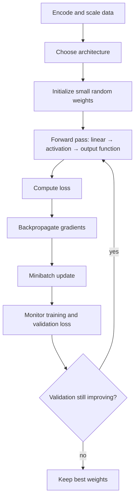

# 7. Neural-Network Foundations and Training

Before the temporal architectures (RNNs, TCNs, transformers) I need the plain feed-forward network and the recipe for training it. Everything in this chapter carries over: the forward equations, choosing the output and loss, cross-entropy as a likelihood, SGD and its variants, and the regularizers that keep a network with thousands of parameters from memorizing the training set.

```text
linear classifier → nonlinear activation → hidden layers
output function + loss ↔ likelihood
backpropagation → full-batch / stochastic / minibatch gradient descent
initialization, learning rate, early stopping, weight decay, dropout, momentum
```

The backpropagation derivation itself, with a numerical gradient check, is in [CSE 575, Chapter 12](../../cse-575-statistical-machine-learning/docs/12_neural_networks_and_backpropagation.md). This chapter focuses on the modeling and training choices.

## 1. Why nonlinearity is needed

A binary linear classifier is $f(\mathbf x)=\mathrm{sign}(w_0+\mathbf w^\top\mathbf x)$. Many patterns (XOR is the classic one) aren't linearly separable, and stacking linear layers doesn't help, since $W_2(W_1\mathbf x+\mathbf b_1)+\mathbf b_2$ is still linear. A nonlinear **activation** between layers is what makes depth useful.

| Activation | Formula | Range | Note |
|---|---|---|---|
| threshold | $\mathbf 1(u\ge0)$ | $\{0,1\}$ | zero gradient almost everywhere, so not trainable by gradient descent |
| sigmoid | $\sigma(u)=1/(1+e^{-u})$ | $(0,1)$ | $\sigma'=\sigma(1-\sigma)\le\tfrac14$ |
| tanh | $(e^u-e^{-u})/(e^u+e^{-u})$ | $(-1,1)$ | zero-centered; $\tanh'\le1$ |
| ReLU | $\max(0,u)$ | $[0,\infty)$ | gradient 1 when active, so it doesn't saturate for $u>0$ |

## 2. The one-hidden-layer network

For input $\mathbf x_i\in\mathbb R^M$, $Q$ hidden units and $K$ outputs:

```math
\mathbf h_i=\mathrm{act}(W_1\mathbf x_i+\mathbf b_1),\qquad
\mathbf o_i=W_2\mathbf h_i+\mathbf b_2,\qquad
\hat{\mathbf y}_i=\bar g(\mathbf o_i),\qquad
L=\sum_{i=1}^N\mathrm{Loss}(\mathbf y_i,\hat{\mathbf y}_i),
```

with $W_1\in\mathbb R^{Q\times M}$, $\mathbf b_1\in\mathbb R^{Q}$, $W_2\in\mathbb R^{K\times Q}$, $\mathbf b_2\in\mathbb R^{K}$, and $\theta=(W_1,\mathbf b_1,W_2,\mathbf b_2)$. (Row-vector code, `x @ W`, stores the transposes, $M\times Q$ and $Q\times K$. Same model.)

Three quantities to keep apart:

- $\mathbf h_i$: the **hidden representation**, never observed;
- $\mathbf o_i$: the **logits**, a linear function of $\mathbf h_i$;
- $\hat{\mathbf y}_i=\bar g(\mathbf o_i)$: the **prediction**, where $\bar g$ is identity, sigmoid or softmax.

**Softmax** turns $K$ logits into a probability vector:

```math
\bar g_k(\mathbf o_i)=\frac{e^{o_{ik}}}{\sum_{j=1}^Ke^{o_{ij}}},\qquad \bar g_k\ge0,\qquad \sum_k\bar g_k=1 .
```

Sigmoid squashes one scalar independently; softmax normalizes across the whole vector.

## 3. Deeper networks

A deep network is a composition $f(\mathbf x)=f^{(4)}(f^{(3)}(f^{(2)}(f^{(1)}(\mathbf x))))$, i.e. for $L$ hidden layers

```math
\mathbf h^{(1)}=\mathrm{act}(W_1\mathbf x+\mathbf b_1),\quad
\mathbf h^{(\ell)}=\mathrm{act}(W_\ell\mathbf h^{(\ell-1)}+\mathbf b_\ell),\quad
\mathbf o=W_{L+1}\mathbf h^{(L)}+\mathbf b_{L+1},\quad
\hat{\mathbf y}=\bar g(\mathbf o).
```


*Width is the number of units in a layer; depth is the number of successive transformations.*

### How expressive is one hidden layer?

- **Universal approximation** (Cybenko 1989; Hornik 1991): one hidden layer with a non-polynomial activation (sigmoid, tanh, ReLU…) can approximate any **continuous** function on a **compact** set to any accuracy, given enough hidden units.
- With **two** hidden layers it's easy to build localized "bumps" and combine them, so functions with jumps can be approximated too, in an average ($L^p$) sense rather than uniformly.

These are existence results. They don't say how many units are needed (possibly exponentially many), or that gradient descent will find the weights. In practice, depth buys the same accuracy with far fewer units.

## 4. Choosing outputs and losses

| Task | Output $\bar g$ | Loss |
|---|---|---|
| unbounded regression | identity, $\hat y=o$ | squared error |
| target in $[0,1]$, or binary | sigmoid | binary cross-entropy (Bernoulli NLL) |
| $K$ classes | softmax | categorical cross-entropy (multinomial NLL) |

For classification, encode the target **one-hot**: class 2 of 4 is $\mathbf y_i=(0,1,0,0)^\top$, and the predicted class is $\hat k_i=\arg\max_k\bar g_k(\mathbf o_i)$. The outputs are probabilities, not 0/1.

## 5. Cross-entropy is maximum likelihood

**Maximum likelihood.** For independent $y_1,\ldots,y_N$ with density $f(y;\theta)$,

```math
\hat\theta=\arg\max_\theta\prod_if(y_i;\theta)=\arg\min_\theta\Big[-\sum_i\log f(y_i;\theta)\Big].
```

**Bernoulli.** $f(y;p)=p^y(1-p)^{1-y}$, so the log-likelihood is $\sum_i[y_i\log p+(1-y_i)\log(1-p)]$. Setting its derivative $\sum_iy_i/p-\sum_i(1-y_i)/(1-p)$ to zero gives

```math
\hat p=\frac1N\sum_iy_i=\bar y,
```

the observed fraction of ones.

**Multinomial.** With one-hot $\mathbf y_i$ and class probabilities $p_{ik}$ (e.g. major delay / minor delay / no delay), $P(\mathbf y_i)=\prod_kp_{ik}^{y_{ik}}$. Letting the network supply $p_{ik}=\bar g_k(\mathbf x_i;\theta)$,

```math
-\log L(\theta)=-\sum_{i=1}^N\sum_{k=1}^Ky_{ik}\log\bar g_k(\mathbf x_i;\theta),
```

which is exactly the **cross-entropy** loss. Only the true class's term survives, so each example contributes $-\log(\text{probability given to the right answer})$.

> [!NOTE]
> **Beyond the lecture: the information-theory view**
>
> The cross-entropy between a target distribution $P$ and a model $Q$ is $H(P,Q)=-\sum_xP(x)\log Q(x)=H(P)+\mathrm{KL}(P\,\|\,Q)$: the average code length when data from $P$ is encoded with a code built for $Q$. The overhead over the ideal $H(P)$ is the KL divergence. With one-hot targets $H(P)=0$, so minimizing cross-entropy is minimizing KL to the labels. Use log base 2 for bits and natural log for nats.

**Worked example.** Four classes (red, orange, yellow, green), a green example $\mathbf y_i=(0,0,0,1)^\top$ and softmax output $(0.4,0.3,0.2,0.1)^\top$:

```math
L_i=-\log0.1\approx2.303\text{ nats}.
```

If the network had given green 0.9 instead, the loss would be $-\log0.9\approx0.105$. Confident mistakes are punished hard.

## 6. Gradient descent: full batch, stochastic, minibatch

**Backpropagation** (popularized by Rumelhart, Hinton and Williams, 1986) computes $\nabla_\theta L_i$ for every parameter at once by applying the chain rule backward through the layers and reusing shared intermediate terms. **Gradient descent** is what uses those gradients:

| Variant | Update | Behavior |
|---|---|---|
| full batch | $\theta^{(r+1)}=\theta^{(r)}-\eta_r\sum_{i=1}^N\nabla L_i(\theta^{(r)})$ | exact gradient, one update per pass |
| stochastic (SGD) | $\theta^{(r+1)}=\theta^{(r)}-\eta_r\nabla L_i(\theta^{(r)})$ | one example per update, noisy but cheap |
| minibatch | $\theta^{(r+1)}=\theta^{(r)}-\eta_r\sum_{i\in b}\nabla L_i(\theta^{(r)})$ | subset $b$ per update; the standard in practice |

Minibatches (typically 32–512) average out much of the SGD noise and map well onto GPU matrix multiplies. If the loss is an average instead of a sum, divide by $|b|$ and the learning rate means the same thing across batch sizes.

**Sigmoid example.** For $\sigma(\mathbf w^\top\mathbf x)$,

```math
\frac{\partial\sigma(\mathbf w^\top\mathbf x)}{\partial\mathbf w}=\sigma(\mathbf w^\top\mathbf x)\big[1-\sigma(\mathbf w^\top\mathbf x)\big]\,\mathbf x .
```

The scalar factor $\sigma(1-\sigma)$ lies in $(0,\tfrac14]$. The full gradient also carries $\mathbf x$, so its components are not bounded by 1. That $\tfrac14$ is important later: backpropagating through many sigmoid layers (or time steps, in [Chapter 8](08_rnn_lstm_gru_and_seq2seq.md)) multiplies many factors $\le\tfrac14$, and the gradient vanishes.

## 7. A training recipe

1. **Encode** inputs and targets (one-hot for categories).
2. **Scale** inputs to mean 0 / variance 1, or to $[0,1]$. All inputs share one learning rate, one initialization scale and one penalty, so unscaled features get treated very unequally.
3. **Architecture:** number of hidden layers and units per layer.
4. **Activation:** ReLU by default for hidden layers; sigmoid/tanh inside gates (Chapter 8).
5. **Output function** and matching **loss** (table above).
6. **Initialize** weights randomly and small, e.g. $U(-0.1,0.1)$. For deep nets, scale by fan-in: Glorot/Xavier $\mathrm{Var}=2/(n_{\text{in}}+n_{\text{out}})$ for tanh, He $\mathrm{Var}=2/n_{\text{in}}$ for ReLU, so activations neither blow up nor die with depth.
7. **Learning rate:** start around 0.1–0.3 for plain SGD (Adam: $10^{-3}$) and decay it, e.g. $\eta_r=\eta_0/r$ or cosine decay.
8. **Train** with minibatch SGD, monitoring validation loss.

### Initialization and nonconvexity

- With small weights, sigmoid units operate in their near-linear region, so training starts near a linear model and adds nonlinearity as the weights grow. That's a sensible starting point.
- **Weights must not all be equal.** Identical hidden units receive identical gradients and stay identical forever. Random initialization breaks the symmetry.
- The loss is **nonconvex**. Different starts reach different solutions, and there are no general convergence guarantees to a global minimum.
- SGD noise helps it move out of sharp minima and saddle points. That's an empirical tendency, not a guarantee.

## 8. Controlling overfitting

A small network already has thousands of parameters (Section 9), so regularization isn't optional.

**Early stopping.** Early in training the weights are small and the model is close to linear; complexity grows with iterations. Training loss keeps falling after validation loss bottoms out, so stop at the validation minimum (with some patience) and keep those weights.

**Weight decay.** Add an L2 penalty:

```math
L^*(\theta)=L(\theta)+\lambda\sum_jw_j^2,\qquad
\frac{\partial L^*}{\partial w_j}=\frac{\partial L}{\partial w_j}+2\lambda w_j ,
```

so every step also shrinks each weight by a factor $(1-2\eta\lambda)$. That's ridge regression from [Chapter 5](05_pca_and_regularization.md). Choose $\lambda$ on validation data, and usually leave biases unpenalized.

**Dropout.** During training, zero each hidden unit independently with probability $p$ (0.5 is classic for hidden layers). Each update trains a different thinned network, which discourages units from co-adapting. With "inverted" dropout the survivors are scaled by $1/(1-p)$ during training, so nothing changes at test time, when all units are kept.

**Multiple starts and averaging.** Train several networks from different initializations (or bootstrap samples, i.e. bagging) and average their predictions. The averaged ensemble has lower variance than any single member.

**Momentum.** Keep an exponentially weighted average of past gradients and step along it:

```math
\mathbf v_{r+1}=\beta\mathbf v_r+\nabla L(\theta_r),\qquad \theta_{r+1}=\theta_r-\eta\,\mathbf v_{r+1},\qquad \beta\approx0.9 .
```

That's the EWMA from [Chapter 3](03_filters_smoothing_and_decomposition.md) applied to gradients. It damps zig-zagging across narrow valleys and speeds up travel along them. Adam adds per-parameter scaling by a second EWMA of squared gradients.

**Label noise.** Mislabeled examples pull the network toward memorizing noise, and large networks can fit random labels perfectly. Remedies include early stopping, label smoothing (train toward $1-\varepsilon$ instead of 1), or cleaning labels.

| Control | Mechanism |
|---|---|
| early stopping | stop at the validation-loss minimum |
| weight decay | penalize $\sum w_j^2$ |
| dropout | randomly remove units per update |
| multiple starts / averaging | reduce dependence on one nonconvex solution |
| momentum | smooth the update direction |

## 9. How fast parameters add up

**Example.** 10,000 training instances; 50 numeric predictors; 10 categorical predictors with 3 levels each; 4 classes; hidden widths $(20,20,10)$.

The categorical predictors can be encoded two ways:

- **dummy (reference) coding**, $k-1=2$ columns each: $50+10\times2=70$ inputs;
- **full one-hot**, 3 columns each: $50+10\times3=80$ inputs.

With a bias in the first layer, the dummy version avoids a redundant column. Counting weights plus biases layer by layer:

| Layer | 70 inputs | 80 inputs |
|---|---:|---:|
| input → 20 | $70\cdot20+20=1420$ | $80\cdot20+20=1620$ |
| 20 → 20 | 420 | 420 |
| 20 → 10 | 210 | 210 |
| 10 → 4 | 44 | 44 |
| **total** | **2,094** | **2,294** |

About 2,100 parameters against 10,000 examples: roughly five examples per parameter, for a network most people would call tiny. That's why the regularizers above matter.

```python
def n_params(widths):                       # widths = [inputs, hidden..., outputs]
    return sum(a * b + b for a, b in zip(widths, widths[1:]))

print(n_params([70, 20, 20, 10, 4]), n_params([80, 20, 20, 10, 4]))   # 2094 2294
```

## 10. The whole loop



**Where this goes next.** CNNs share weights across positions, and [TCNs](09_temporal_convolutional_networks.md) apply that idea to time. RNNs, LSTMs and GRUs ([Chapter 8](08_rnn_lstm_gru_and_seq2seq.md)) share weights across time steps. Autoencoders ([Chapter 10](10_representation_learning.md)) and attention/transformers ([Chapter 11](11_transformers.md)) are built from the same blocks. Other extensions include line search and conjugate-gradient optimizers, graph neural networks, and GANs.

## 11. Common confusions

- **Backpropagation vs gradient descent:** backprop computes gradients; gradient descent uses them.
- **Logit vs prediction:** $\mathbf o$ is unconstrained; $\bar g(\mathbf o)$ is the probability.
- **Sigmoid vs softmax:** one independent squash vs normalization across classes. Multilabel problems use per-class sigmoids.
- **Training vs validation loss:** a lower training loss says nothing about generalization.
- **Weight decay vs momentum:** one shrinks the parameters, the other smooths the steps.

## 12. Questions and answers

<details><summary>Sum or average the loss over the batch?</summary>

Average, in practice (`reduction="mean"`). It makes the learning rate independent of batch size. With a sum, doubling the batch doubles the effective step.
</details>

<details><summary>Does the log base in cross-entropy matter?</summary>

Only by a constant factor, $\log_2x=\ln x/\ln2$, which rescales the gradient like a change of learning rate. Frameworks use natural logs.
</details>

<details><summary>How do I pick early-stopping patience?</summary>

Scale it to how noisy the validation curve is: a few epochs for smooth curves, 10–20 for noisy ones, always restoring the best checkpoint rather than the last one.
</details>

<details><summary>Should biases get weight decay?</summary>

Usually not. Biases shift the output rather than scale inputs, so penalizing them adds bias without reducing variance. The same goes for normalization-layer gains.
</details>

<details><summary>Why is $\eta_r = 1/r$ a classic schedule?</summary>

For SGD on convex problems, steps with $\sum\eta_r=\infty$ and $\sum\eta_r^2<\infty$ (Robbins–Monro conditions) guarantee convergence, and $1/r$ satisfies both. Deep-learning practice usually prefers warm-up followed by step or cosine decay.
</details>

<details><summary>What changes when inputs and outputs are sequences?</summary>

The network needs memory across time steps and weight sharing across positions, so we don't learn separate weights for $t=1$ and $t=50$. RNNs (Chapter 8), dilated convolutions (Chapter 9) and attention (Chapter 11) are three ways to get both.
</details>

---

[← Previous: Markov Models, HMMs and EM](06_markov_models_hmm_and_em.md) · [Course map](../course_map.md) · [Next: RNNs, LSTMs and Seq2Seq →](08_rnn_lstm_gru_and_seq2seq.md)
