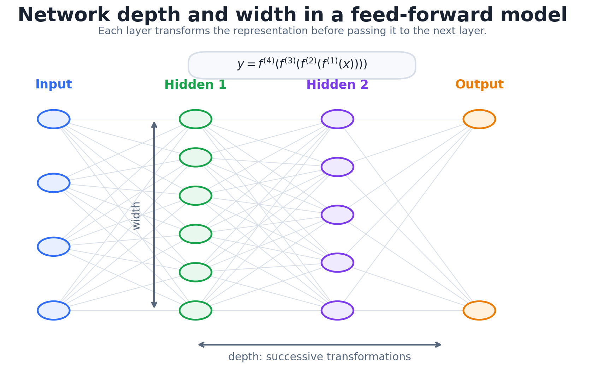
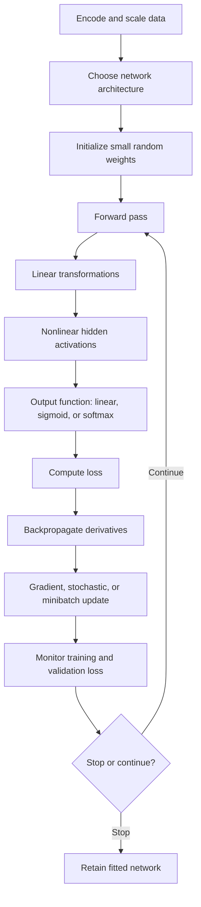

# Neural-Network Foundations and Training

## 1. Chapter overview

This chapter introduces feed-forward neural networks before the course
moves to explicitly temporal neural architectures.

The progression is:

```text
Linear classifier
    -> nonlinear activation
    -> one-hidden-layer network
    -> multilayer network

Regression or classification output
    -> suitable loss function
    -> likelihood interpretation

Backpropagation
    -> gradient descent
    -> stochastic or minibatch updates

Training choices
    -> initialization
    -> learning rate
    -> early stopping
    -> weight decay, dropout, momentum
```

The chapter also connects softmax cross-entropy to multinomial maximum
likelihood and uses a parameter-counting exercise to emphasize how quickly
network size grows.

**Sources:** CSE598MTL.pdf, pp. 56-65

---

## 2. Learning objectives

After this chapter, the reader should be able to:

1. explain why compositions of only linear functions remain linear;
2. describe threshold, sigmoid, tanh, and ReLU activation functions;
3. write the forward equations for a one-hidden-layer or multilayer
   feed-forward network;
4. distinguish hidden activations, output logits, output functions, and
   predictions;
5. choose basic regression and multiclass output encodings;
6. derive cross-entropy as the negative multinomial log likelihood;
7. derive the Bernoulli maximum-likelihood estimate shown in the notes;
8. distinguish full-batch, stochastic, and minibatch gradient descent;
9. apply the chain rule to the sigmoid example;
10. list the course's network-training setup steps;
11. explain the roles of initialization, learning rate, and nonconvexity;
12. describe early stopping, weight decay, dropout, repeated starts,
    averaging, momentum, and label noise;
13. count weight and bias parameters in a multilayer network;
14. compute one instance's cross-entropy contribution from a one-hot label
    and a softmax vector.

**Sources:** CSE598MTL.pdf, pp. 56-65

---

## 3. From linear classifiers to neural networks

The chapter begins with a binary linear classifier:

```math
f(\mathbf{x})
=
\mathrm{sign}
\left(
w_0+\mathbf{w}^\top\mathbf{x}
\right).
```

A threshold converts the score into one of two classes.

The slide notes that a single linear function cannot separate many
classification patterns.

Simply stacking linear functions does not solve this problem because a
composition of linear functions is still linear.

Therefore neural networks introduce nonlinear activation functions.

**Source:** CSE598MTL.pdf, p. 56

---

## 4. Activation functions

### 4.1 Threshold function

A simple nonlinear threshold is:

```math
h(u)
=
\begin{cases}
1, & u\geq0,\\
0, & u<0.
\end{cases}
```

### 4.2 Sigmoid

```math
\sigma(u)
=
\frac{1}{1+e^{-u}}
=
\frac{e^u}{1+e^u}.
```

The sigmoid produces values between zero and one.

### 4.3 Hyperbolic tangent

```math
\tanh(u)
=
\frac{e^u-e^{-u}}
{e^u+e^{-u}}.
```

### 4.4 Rectified linear unit

```math
\mathrm{ReLU}(u)
=
\max(0,u)
=
u_+.
```

The slide presents sigmoid, tanh, and ReLU as examples of nonlinear
activation functions that increase the expressive power of a network.

**Source:** CSE598MTL.pdf, p. 56

---

## 5. One-hidden-layer network

Consider:

- input vector $\mathbf{x}_i$;
- input-to-hidden weights $W_1$;
- hidden biases $\mathbf{b}_1$;
- hidden-to-output weights $W_2$;
- output biases $\mathbf{b}_2$.

The hidden representation is:

```math
\mathbf{h}_i
=
\mathrm{act}
\left(
W_1\mathbf{x}_i+\mathbf{b}_1
\right).
```

The pre-output values or logits are:

```math
\mathbf{o}_i
=
W_2\mathbf{h}_i+\mathbf{b}_2.
```

The prediction is:

```math
\hat{\mathbf{y}}_i
=
\bar{g}(\mathbf{o}_i).
```

The per-instance loss is:

```math
L_i
=
\mathrm{Loss}
\left(
\mathbf{y}_i,\hat{\mathbf{y}}_i
\right).
```

The total loss is:

```math
L
=
\sum_{i=1}^{N}L_i.
```

The slide notes that $\bar{g}$ may be:

- linear;
- sigmoid;
- softmax.

The hidden values are computed internally and are not directly observed.
The output-node values are transformed into model predictions.

**Source:** CSE598MTL.pdf, p. 56

---

## 6. Softmax output

For $K$ output classes, softmax converts the output logits into
probabilities:

```math
\bar{g}_k(\mathbf{o}_i)
=
\frac{
e^{o_{ik}}
}{
\sum_{j=1}^{K}e^{o_{ij}}
}.
```

Therefore:

```math
\bar{g}_k(\mathbf{o}_i)\geq0,
\qquad
\sum_{k=1}^{K}
\bar{g}_k(\mathbf{o}_i)=1.
```

This allows the network output to be interpreted as a class-probability
vector.

**Source:** CSE598MTL.pdf, p. 56

---

## 7. Multilayer feed-forward networks

The page represents a deep network as a composition:

```math
\mathbf{y}
=
f(\mathbf{x})
=
f^{(4)}
\left(
f^{(3)}
\left(
f^{(2)}
\left(
f^{(1)}(\mathbf{x})
\right)
\right)
\right).
```


*Redrawn course diagram — Network width counts units within a layer, while depth counts successive transformations.*

The diagram distinguishes:

- network **width**: the number of nodes in a layer;
- network **depth**: the number of successive layers.

**Source:** CSE598MTL.pdf, p. 57

---

## 8. Network dimensions and parameters

For a network with:

- $M$ inputs;
- $Q$ hidden nodes;
- $K$ outputs;

the page gives:

```math
W_1\in\mathbb{R}^{Q\times M},
```

```math
W_2\in\mathbb{R}^{K\times Q},
```

```math
\mathbf{b}_1\in\mathbb{R}^{Q\times1},
```

```math
\mathbf{b}_2\in\mathbb{R}^{K\times1}.
```

The parameter set is:

```math
\theta
=
(W_1,\mathbf{b}_1,W_2,\mathbf{b}_2).
```

### Review note

The prose line on the page appears to list $W_1$ as $M\times Q$ and
$W_2$ as $Q\times K$, while the forward equations use left
multiplication:

```math
W_1\mathbf{x}_i,
\qquad
W_2\mathbf{h}_i.
```

The equations require the dimensions written above. This likely reflects
a transpose convention or a slide-level dimension-order inconsistency.

**Source:** CSE598MTL.pdf, p. 57

---

## 9. L-hidden-layer network

For hidden layers $1,\ldots,L$:

```math
\mathbf{h}_i^{(1)}
=
\mathrm{act}
\left(
W_1\mathbf{x}_i+\mathbf{b}_1
\right),
```

```math
\mathbf{h}_i^{(2)}
=
\mathrm{act}
\left(
W_2\mathbf{h}_i^{(1)}+\mathbf{b}_2
\right),
```

```math
\cdots
```

```math
\mathbf{o}_i
=
W_{L+1}\mathbf{h}_i^{(L)}
+
\mathbf{b}_{L+1},
```

```math
\hat{\mathbf{y}}_i
=
\bar{g}(\mathbf{o}_i).
```

The loss is:

```math
L
=
\sum_{i=1}^{N}
\mathrm{Loss}
\left(
\mathbf{y}_i,\hat{\mathbf{y}}_i
\right).
```

**Source:** CSE598MTL.pdf, p. 57

---

## 10. Approximation statements on the slide

The page states two theoretical results:

1. every bounded continuous function can be approximated with arbitrarily
   small error by a network with one hidden layer and one output layer;
2. every function can be approximated with arbitrarily small error by a
   network with two hidden layers and one output layer.

It also warns that, in practice, many hidden nodes may be required.

### Source-faithful caution

The slide does not state the exact assumptions, domain, activation
conditions, or formal theorem names. The note preserves the claims at the
same level rather than replacing them with a more specific theorem.

**Source:** CSE598MTL.pdf, p. 57

---

## 11. Regression outputs

For regression, the slide states that output encoding is simple.

A common one-node output uses a linear output function:

```math
\hat{y}_i
=
\bar{g}(o_i)
=
o_i.
```

If a sigmoid output is used, the prediction is restricted to:

```math
0\leq\hat{y}_i\leq1.
```

The page lists squared-error loss as a common regression objective.

A generic regression prediction is:

```math
\hat{y}_i
=
\bar{g}
\left(
\mathbf{o}(\mathbf{x}_i;\theta)
\right).
```

**Source:** CSE598MTL.pdf, p. 58

---

## 12. Multiclass classification encoding

The course typically uses one output node per class.

For $K$ classes, the target is represented with one-hot or
one-of $K$ encoding.

For an observation in class 2 among four classes:

```math
\mathbf{y}_i
=
(0,1,0,0)^\top.
```

The predicted class is:

```math
\hat{k}_i
=
\mathrm{arg\,max}_{1\leq k\leq K}
\ \bar{g}_k(\mathbf{o}_i).
```

The output probabilities do not have to be exactly zero or one.

**Source:** CSE598MTL.pdf, p. 58

---

## 13. Cross-entropy loss

For one-hot targets, the slide gives the multiclass cross-entropy or
logistic-regression deviance:

```math
L(\theta)
=
-
\sum_{i=1}^{N}
\sum_{k=1}^{K}
y_{ik}
\log
\bar{g}_k
\left(
\mathbf{o}(\mathbf{x}_i;\theta)
\right).
```

The corresponding estimator is:

```math
\hat{\theta}
=
\mathrm{arg\,min}_{\theta}
\left[
-
\sum_{i=1}^{N}
\sum_{k=1}^{K}
y_{ik}
\log
\bar{g}_k
\left(
\mathbf{o}(\mathbf{x}_i;\theta)
\right)
\right].
```

Because one-hot encoding has only one $y_{ik}=1$, each observation
contributes the negative logarithm of the probability assigned to its
true class.

**Source:** CSE598MTL.pdf, p. 58

### 13.1 Pasted cross-entropy explanation

The bottom of page 58 includes pasted explanatory text that describes
cross-entropy between a target distribution $P$ and an approximation
$Q$:

```math
H(P,Q)
=
-
\sum_{x\in\mathcal{X}}
P(x)\log Q(x).
```

It interprets cross-entropy as the additional information needed when
using $Q$ instead of the true distribution $P$.

The pasted text mentions:

- base-2 logarithms producing bits;
- natural logarithms producing nats;
- the continuous analogue using an integral.

This section is preserved as pasted explanatory material rather than
attributed to the main slide bullets.

**Source:** CSE598MTL.pdf, p. 58

---

## 14. Maximum likelihood

Suppose:

```math
y_1,\ldots,y_N
```

are independent observations with probability mass or density function:

```math
f(y_i;\theta).
```

The likelihood is:

```math
L(\theta)
=
\prod_{i=1}^{N}
f(y_i;\theta).
```

The maximum-likelihood estimator is:

```math
\hat{\theta}
=
\mathrm{arg\,max}_{\theta}
\ L(\theta).
```

Because the logarithm is monotonic:

```math
\hat{\theta}
=
\mathrm{arg\,max}_{\theta}
\sum_{i=1}^{N}
\log f(y_i;\theta).
```

Equivalently:

```math
\hat{\theta}
=
\mathrm{arg\,min}_{\theta}
\left[
-
\sum_{i=1}^{N}
\log f(y_i;\theta)
\right].
```

The final expression is the negative log likelihood.

**Source:** CSE598MTL.pdf, p. 59

---

## 15. Bernoulli maximum-likelihood example

Let:

```math
y_i\in\{0,1\}
```

be independent Bernoulli observations.

The probability mass function is:

```math
f(y_i;p)
=
p^{y_i}(1-p)^{1-y_i}.
```

The likelihood is:

```math
L(p)
=
\prod_{i=1}^{N}
p^{y_i}(1-p)^{1-y_i}.
```

The log likelihood is:

```math
\sum_{i=1}^{N}
\left[
y_i\log p
+
(1-y_i)\log(1-p)
\right].
```

The page gives:

```math
\hat{p}
=
\frac{
\sum_{i=1}^{N}y_i
}{
N
}
=
\bar{y}.
```

Thus the MLE of a Bernoulli probability is the observed fraction of
positive outcomes.

**Source:** CSE598MTL.pdf, p. 59

---

## 16. Multinomial likelihood

A multinomial observation selects one of $K$ categories.

The page gives an example with three categories:

- major delay;
- minor delay;
- no delay.

Using one-hot encoding:

```math
\mathbf{y}_i
=
(y_{i1},\ldots,y_{iK}).
```

For class probabilities $p_{ik}$, the probability of one instance is:

```math
P(\mathbf{y}_i)
=
\prod_{k=1}^{K}
p_{ik}^{y_{ik}}.
```

For $N$ independent instances:

```math
L
=
\prod_{i=1}^{N}
\prod_{k=1}^{K}
p_{ik}^{y_{ik}}.
```

In the neural-network model:

```math
p_{ik}
=
\bar{g}_k
\left(
\mathbf{x}_i;\theta
\right).
```

Therefore:

```math
L(\theta)
=
\prod_{i=1}^{N}
\prod_{k=1}^{K}
\bar{g}_k
\left(
\mathbf{x}_i;\theta
\right)^{y_{ik}}.
```

The MLE minimizes:

```math
-
\sum_{i=1}^{N}
\sum_{k=1}^{K}
y_{ik}
\log
\bar{g}_k
\left(
\mathbf{x}_i;\theta
\right).
```

This is the cross-entropy loss.

**Source:** CSE598MTL.pdf, p. 60

---

## 17. Backpropagation and gradient descent

The slide describes the original network-training method as
backpropagation, essentially gradient descent.

It attributes the commonly cited network-training method to Rumelhart and
McClelland (1986).

Backpropagation calculates derivatives with respect to every parameter
while exploiting relationships shared across nodes and layers.

The objective shown is the negative cross-entropy loss:

```math
L(\theta)
=
-
\sum_{i=1}^{N}
\sum_{k=1}^{K}
y_{ik}
\log
\bar{g}_k
\left(
\mathbf{o}(\mathbf{x}_i;\theta)
\right).
```

The page also defines a per-instance contribution:

```math
L_i(\theta)
=
-
\sum_{k=1}^{K}
y_{ik}
\log
\bar{g}_k
\left(
\mathbf{o}(\mathbf{x}_i;\theta)
\right).
```

**Source:** CSE598MTL.pdf, p. 61

---

## 18. Full-batch gradient descent

The page writes separate updates for each weight and bias matrix.

A compact equivalent is:

```math
\theta^{(r+1)}
=
\theta^{(r)}
-
\eta_r
\sum_{i=1}^{N}
\nabla_\theta L_i
\left(
\theta^{(r)}
\right),
```

where:

- $r$: training iteration;
- $\eta_r$: learning rate.

The page's sketch shows a nonconvex objective with multiple minima and
notes that gradient descent may end at a local rather than global
minimum.

**Source:** CSE598MTL.pdf, p. 61

---

## 19. Stochastic gradient descent

The slide states that stochastic gradient descent typically updates after
each row or training instance $i$:

```math
\theta^{(r+1)}
=
\theta^{(r)}
-
\eta_r
\nabla_\theta L_i
\left(
\theta^{(r)}
\right).
```

The page writes this separately for:

- $W_1$;
- $W_2$;
- $\mathbf{b}_1$;
- $\mathbf{b}_2$.

### Interpretation

Full-batch gradient descent uses the complete training-gradient sum.
Stochastic gradient descent uses one observation at a time, creating a
noisier update direction.

**Source:** CSE598MTL.pdf, p. 61

---

## 20. Minibatch gradient descent

Alternatively, partition:

```math
i=1,\ldots,N
```

into minibatches:

```math
b=1,\ldots,B.
```

For the set of instances in minibatch $b$, the update is:

```math
\theta^{(r+1)}
=
\theta^{(r)}
-
\eta_r
\sum_{i\in b}
\nabla_\theta L_i
\left(
\theta^{(r)}
\right).
```

The slide again lists separate versions for the network weights and
biases.

```text
Full batch:
all N instances per update

Stochastic:
one instance per update

Minibatch:
a selected subset per update
```

**Source:** CSE598MTL.pdf, p. 62

---

## 21. Partial derivatives

The page reviews the derivative definition:

```math
\frac{\partial L(\theta)}{\partial\theta}
=
\lim_{\epsilon\rightarrow0}
\frac{
L(\theta+\epsilon)-L(\theta)
}{
\epsilon
}.
```

This provides the local slope used for gradient-based parameter updates.

**Source:** CSE598MTL.pdf, p. 62

---

## 22. Sigmoid derivative and chain rule

Let:

```math
\sigma(\mathbf{w}^\top\mathbf{x})
=
\frac{1}{
1+e^{-\mathbf{w}^\top\mathbf{x}}
}.
```

The derivative with respect to $\mathbf{w}$ is:

```math
\frac{
\partial
\sigma(\mathbf{w}^\top\mathbf{x})
}{
\partial\mathbf{w}
}
=
\mathbf{x}
\,
\sigma(\mathbf{w}^\top\mathbf{x})
\left[
1-
\sigma(\mathbf{w}^\top\mathbf{x})
\right].
```

The slide states that the chain rule is used to calculate derivatives for
network weights and biases.

**Source:** CSE598MTL.pdf, p. 62

### Possible source issue

The page then appears to state that the derivative lies between zero and
one because:

```math
0<\sigma(u)<1.
```

That bound applies to the scalar factor:

```math
\sigma(u)[1-\sigma(u)],
```

but the derivative with respect to $\mathbf{w}$ also contains
$\mathbf{x}$. Its components are not necessarily between zero and one.

The note preserves the slide's intended sigmoid-factor intuition while
logging the complete derivative-bound statement as a possible error.

**Source:** CSE598MTL.pdf, p. 62

---

## 23. Network-training setup

The page lists a practical training sequence.

### Step 1: encode inputs and targets

Examples include one-hot encoding.

### Step 2: scale attributes

Possible options:

- mean zero and unit variance;
- normalize to the interval $[0,1]$.

The slide says scaling matters because inputs are treated similarly in:

- weight updates;
- initial weights;
- regularization.

### Step 3: select architecture

Choose:

- number of hidden layers;
- number of hidden nodes in each layer.

### Step 4: select activation function

### Step 5: select output function

The page gives softmax as an example.

### Step 6: select loss

Examples:

- cross-entropy;
- squared error.

### Step 7: initialize weights

The page suggests small random values such as:

```math
(-0.1,0.1).
```

### Step 8: initialize the learning rate

The page gives an example:

```math
\eta_r=0.3.
```

### Step 9: train with stochastic descent

The slide suggests decreasing the learning rate with epochs, with an
example resembling:

```math
\eta_r=\frac{1}{r},
```

where $r$ is the training epoch.

**Source:** CSE598MTL.pdf, p. 63

---

## 24. Starting weights and nonconvex optimization

The page gives several observations.

### 24.1 Small weights

With small weights, sigmoid functions are approximately linear, so the
network begins near an approximately linear model.

The slide presents this as a potentially useful starting region.

### 24.2 Local minima

The optimization problem is nonconvex.

Different initial weights can produce different fitted solutions.

### 24.3 Convergence

The page states that convergence is not well understood.

### 24.4 Stochastic gradients

The slide says stochastic gradient descent is often considered an
advantage because it can move through local minima.

### Source-faithful caution

The page presents this as an intuition about noisy updates, not as a
formal guarantee that SGD escapes every local minimum or finds a global
solution.

**Source:** CSE598MTL.pdf, p. 63

---

## 25. Overfitting in neural networks

The page emphasizes that networks can contain many parameters and
therefore have substantial potential to overfit.

Several controls are listed.

**Source:** CSE598MTL.pdf, p. 64

---

## 26. Early stopping

The slide proposes stopping weight iterations before full convergence.

Its interpretation is:

- early iterations remain closer to a simpler or more nearly linear
  model;
- continued training increases model complexity;
- training loss may continue to decrease after validation performance has
  reached its best value.

The suggested procedure is:

```text
train model
    -> monitor validation loss
    -> stop near the validation-loss minimum
    -> avoid continuing only because training loss decreases
```

Cross-validation can help determine the stopping point.

**Source:** CSE598MTL.pdf, p. 64

---

## 27. Weight decay

Weight decay adds a squared-weight penalty:

```math
L^*(\theta)
=
L(\theta)
+
\lambda
\sum_j w_j^2.
```

The page illustrates the derivative:

```math
\frac{
\partial L^*(\theta)
}{
\partial w_j
}
=
\frac{
\partial L(\theta)
}{
\partial w_j
}
+
2\lambda w_j.
```

The negative-gradient update therefore includes a term that decreases the
magnitude of the weight at each iteration.

The slide notes that cross-validation can be used to estimate
$\lambda$.

**Source:** CSE598MTL.pdf, p. 64

---

## 28. Dropout, repeated starts, averaging, momentum, and label noise

### 28.1 Dropout

The page describes dropout as randomly omitting a node during a training
update, with an example probability:

```math
p=50\%.
```

### 28.2 Repeated initializations

Try several starting-weight configurations and select a good solution.

### 28.3 Prediction averaging

Average predictions from several fitted networks, possibly using bagging
or random-start ensembles.

### 28.4 Momentum

The slide states that momentum applies an exponentially weighted moving
average to weight changes to smooth the update process.

This connects back to the EWMA concept from Chapter 3.

### 28.5 Label noise

The page lists label noise as another concern affecting training and
generalization, but does not develop a method for handling it.

**Source:** CSE598MTL.pdf, p. 64

---

## 29. Neural-network enhancements

The final page lists many extensions:

### Alternative training methods

- line search;
- conjugate gradient.

### Training and regularization

- momentum;
- weight decay;
- dropout;
- weight sharing.

### Architectures

- convolutional neural networks;
- pooling and deep networks;
- recurrent neural networks, including RNN, LSTM, and GRU;
- sequence-to-sequence models;
- attention and transformers;
- autoencoders;
- graph neural networks and embeddings;
- generative adversarial networks.

These topics connect this foundation chapter to later course sections.

**Source:** CSE598MTL.pdf, p. 65

---

## 30. Parameter-counting example

The page gives:

- 10,000 training instances;
- 50 numerical predictors;
- 10 categorical predictors;
- three values per categorical predictor;
- four output classes;
- hidden-layer widths:

```math
(20,20,10).
```

One-hot encoding expands the input count to:

```math
50+10\times3=80.
```

### Review note

The slide's displayed answer says to encode to **70 input nodes**, and its
parameter calculation uses 70.

This conflicts with the written data description:

```math
50+10\times3=80.
```

The value 70 corresponds to **dummy (reference-category) encoding**, which
uses $k-1=2$ columns per three-level predictor: $50+10\times2=70$. Full
one-hot encoding gives 80. Both are valid; dummy coding avoids a redundant
column when the model has a bias term.

Using the slide's 70-node assumption, the parameter count is:

```math
(70\times20+20)
+
(20\times20+20)
+
(20\times10+10)
+
(10\times4+4).
```

This equals:

```math
1420+420+210+44
=
2094.
```

Therefore the slide's total of 2094 is arithmetically consistent with 70
inputs, but not with the stated 50 numerical plus ten three-level
categorical predictors under full one-hot encoding.

**Source:** CSE598MTL.pdf, p. 65

---

## 31. Cross-entropy exercise

The page asks about the previous network using:

```math
L(\theta)
=
-
\sum_{i=1}^{N}
\sum_{k=1}^{K}
y_{ik}
\log
\bar{g}_k
\left(
\mathbf{x}_i;\theta
\right).
```

The class encoding is:

- $y_1$: red;
- $y_2$: orange;
- $y_3$: yellow;
- $y_4$: green.

For a green instance:

```math
\mathbf{y}_i
=
(0,0,0,1)^\top.
```

The softmax output is:

```math
\bar{\mathbf{g}}(\mathbf{o}_i)
=
(0.4,0.3,0.2,0.1)^\top.
```

Only the true-class term contributes:

```math
L_i
=
-\log(0.1).
```

With natural logarithms:

```math
-\log(0.1)
\approx2.3026.
```

The numerical approximation is added for convenience; the page's core
answer is the symbolic value $-\log(0.1)$.

**Source:** CSE598MTL.pdf, p. 65

---

## 32. End-to-end feed-forward training workflow



This diagram is synthesized from pages 56–64.

**Sources:** CSE598MTL.pdf, pp. 56-64

---

## 33. Main method comparison

### 33.1 Output and loss selection

| Task | Output function emphasized | Loss emphasized |
|---|---|---|
| Unbounded regression | Linear | Squared error |
| Bounded binary-style output | Sigmoid | Likelihood-based loss |
| Multiclass classification | Softmax | Cross-entropy |

### 33.2 Gradient update styles

| Method | Instances per update | Update behavior |
|---|---:|---|
| Full batch | All $N$ | Stable aggregate gradient |
| Stochastic | One | Noisy frequent updates |
| Minibatch | Subset | Intermediate computational and variance behavior |

### 33.3 Overfitting controls

| Method | Mechanism in the notes |
|---|---|
| Early stopping | Stop near minimum validation loss |
| Weight decay | Penalize squared weights |
| Dropout | Randomly omit nodes during updates |
| Multiple starts | Search different nonconvex solutions |
| Prediction averaging | Combine fitted networks |
| Momentum | Smooth weight changes with EWMA-like memory |

**Sources:** CSE598MTL.pdf, pp. 58 and 61-64

---

## 34. Common confusions

### Hidden activation versus output logit versus prediction

$\mathbf{h}_i$ is the hidden representation.
$\mathbf{o}_i$ is the pre-output linear value.
$\hat{\mathbf{y}}_i=\bar{g}(\mathbf{o}_i)$ is the transformed prediction.

### Sigmoid versus softmax

Sigmoid transforms one scalar independently. Softmax normalizes a vector
across classes.

### Cross-entropy versus maximum likelihood

For the multinomial softmax model in these pages, minimizing
cross-entropy is equivalent to maximizing the multinomial likelihood.

### Backpropagation versus gradient descent

Backpropagation efficiently computes derivatives. Gradient descent uses
those derivatives to update parameters.

### Stochastic versus minibatch training

Stochastic uses one observation per update. Minibatch uses a subset.

### Training loss versus validation loss

Lower training loss does not guarantee better generalization. Page 64
uses validation loss to decide when to stop.

### Small initialization versus a linear network

Small sigmoid weights make the initial behavior approximately linear, but
the network remains nonlinear and can leave that region during training.

### Weight decay versus momentum

Weight decay penalizes large parameter values. Momentum smooths or
accumulates update directions.

**Sources:** CSE598MTL.pdf, pp. 56-65

---

## 35. Questions preserved for later discussion

1. Which output/loss combinations were actually used in the course code?
2. What exact theorem and assumptions support the approximation statements
   on page 57?
3. Does the course use averaged or summed losses over $N$?
4. Which logarithm base was used in implementations?
5. Did training use full-batch, stochastic, or minibatch updates?
6. What minibatch size was used?
7. Was the learning-rate schedule really $\eta_r=1/r$, or was that only
   an example?
8. What initialization distribution and scaling were used for deeper
   networks?
9. How was early stopping patience selected?
10. Were biases excluded from weight decay?
11. Was dropout rescaled during training or prediction?
12. How was momentum parameterized?
13. Why does the page-65 parameter example use 70 rather than 80 encoded
    inputs?
14. Were categorical predictors encoded with a reference category instead
    of full one-hot encoding?
15. How does this feed-forward setup change when the inputs and outputs are
    temporal sequences?

These questions come directly from open or inconsistent points in the
source pages.

---

## 36. Source map

| PDF page | Material reconstructed |
|---:|---|
| 56 | Linear classifier, nonlinear activations, one-hidden-layer network |
| 57 | Multilayer equations, dimensions, approximation statements |
| 58 | Regression/classification outputs, one-hot encoding, cross-entropy |
| 59 | Maximum likelihood and Bernoulli MLE |
| 60 | Multinomial likelihood and softmax cross-entropy |
| 61 | Backpropagation, batch gradient descent, stochastic gradient descent |
| 62 | Minibatches, derivative definition, sigmoid derivative, chain rule |
| 63 | Training setup, initialization, local minima and stochastic updates |
| 64 | Early stopping, weight decay, dropout, repeated starts, momentum |
| 65 | Network extensions, parameter count and cross-entropy exercise |

## Review status

- Activation and forward equations: `[VERIFIED]`
- Weight-matrix dimension prose: `[POSSIBLE TRANSPOSE INCONSISTENCY]`
- Approximation statements: `[VERIFIED AS SLIDE WORDING]`
- Cross-entropy and MLE relationship: `[VERIFIED]`
- SGD/minibatch equations: `[VERIFIED]`
- Page-62 derivative bound: `[POSSIBLE SOURCE ERROR]`
- Page-63 SGD/local-minimum statement: `[HEURISTIC]`
- Weight-decay equation: `[VERIFIED AT GENERIC LEVEL]`
- Page-65 encoded input count: `[SOURCE INCONSISTENCY]`
- Cross-entropy exercise: `[VERIFIED]`
