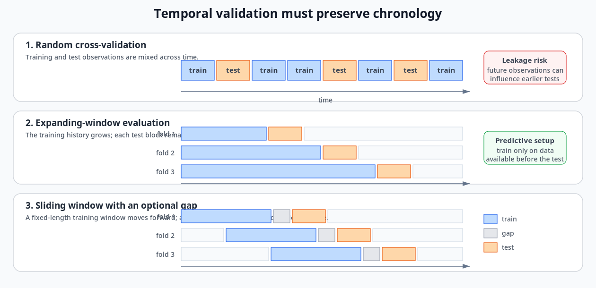
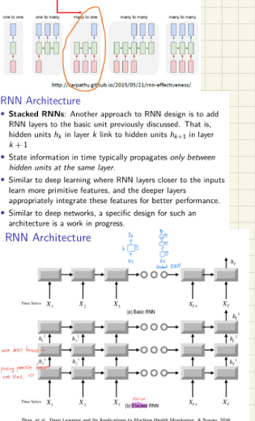
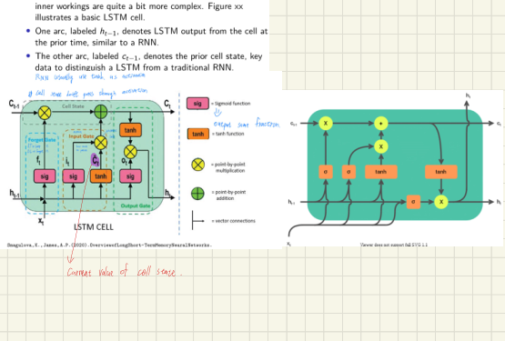
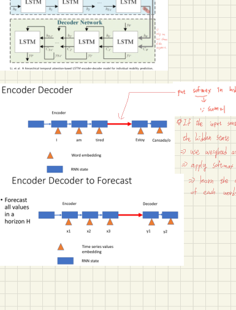
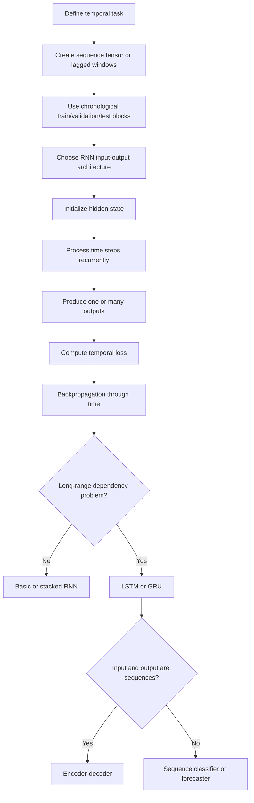

# RNNs, Stateful Training, LSTMs, GRUs, and Encoder-Decoder Models

## 1. Chapter overview

This chapter moves from ordinary feed-forward networks to neural models
that explicitly carry information through time.

The source pages cover four connected design problems:

1. how to organize temporal data into windows, tensors, inputs, targets,
   and validation blocks;
2. how a recurrent network updates a hidden state and produces one or
   several outputs;
3. how batching, long sequences, and stateful training affect the meaning
   of the hidden state;
4. how LSTM and GRU gates modify the recurrent update to preserve or
   discard information over longer intervals.

The final page introduces encoder-decoder designs for sequence-to-sequence
and multi-horizon forecasting tasks. A handwritten note then proposes a
weighted combination of encoder hidden states, anticipating the attention
mechanism developed later in the course.

```text
Temporal sequence
    -> window or sequence tensor
    -> recurrent hidden states
    -> output at one or many times

Long dependency problem
    -> gated recurrent state
    -> LSTM or GRU

Variable input/output sequence structure
    -> encoder-decoder model
```

**Sources:** CSE598MTL.pdf, pp. 66-78

---

## 2. Learning objectives

After this chapter, the reader should be able to:

1. distinguish sequence classification, sequence regression,
   sequence-to-sequence prediction, and multi-horizon forecasting;
2. explain why temporal order makes a task different from ordinary
   independent-row learning;
3. create lagged input-target windows from one time series;
4. explain why temporal validation must preserve chronology;
5. describe an RNN input tensor with sequence, time, and attribute
   dimensions;
6. write the recurrent hidden-state and output equations;
7. distinguish many-to-one, one-to-many, many-to-many, and
   many-to-few network structures;
8. explain backpropagation through time and truncated BPTT;
9. organize multiple sequences into batches;
10. create autoregressive windows from a long sequence and recursively
    forecast future values;
11. distinguish RNN state values from trainable weights;
12. compare stateless and stateful training;
13. explain vanishing and exploding gradients in the course's framing;
14. write the LSTM forget, input, candidate, output, cell, and hidden-state
    equations;
15. write the GRU reset, update, candidate, and hidden-state equations;
16. compare LSTM and GRU state structures;
17. explain the purpose of an encoder-decoder model;
18. identify the page-78 weighted-hidden-state annotation as an
    attention-style extension.

**Sources:** CSE598MTL.pdf, pp. 66-78

---

## 3. Temporal-learning task formulations

The opening page asks the reader to consider $N$ time series under
different output structures.

### 3.1 Continuous output per series

Each complete time series may be associated with one continuous target.
The task is to predict that output.

Examples at this structural level include:

- a scalar condition score;
- remaining lifetime;
- a future aggregate value.

### 3.2 Class label per series

Each complete series may instead have one class label, making the task
time-series classification.

### 3.3 Order sensitivity

The page asks how a neural-network classification solution would change
if the time indices of every series were permuted using the same
permutation.

It then asks what can be said about the uniqueness of the task.

### Source-faithful interpretation

Applying the same permutation to every sequence preserves a consistent
column layout across examples, but it destroys or rearranges the original
temporal meaning. A generic classifier might still learn a mapping from
the permuted representation, while a temporal model's interpretation
depends on chronological order.

The source poses this as a conceptual question rather than providing a
formal answer.

**Source:** CSE598MTL.pdf, p. 66

---

## 4. Forecasting over a horizon

The page next considers one time series and asks for a forecast over a
horizon of $H$ values.

Questions raised include:

- what assumptions are used;
- how the data should be organized for a neural-network model;
- what the model inputs and outputs should be.

A handwritten annotation distinguishes:

- **fixed-window forecasting**;
- **parallel or direct multi-output prediction**.

It also notes that a parallel method can avoid the need to wait until
every preceding future value has been observed before predicting the
later horizon positions.

### Clarification

The source does not specify one required forecasting strategy. It raises
the design choice between:

```text
Recursive forecast:
predict next value
-> feed it back
-> predict the following value

Direct/parallel horizon forecast:
use one input window
-> predict several future positions together
```

**Source:** CSE598MTL.pdf, p. 66

---

## 5. Autoregressive embedding

Given a series:

```math
y_1,y_2,\ldots,y_T,
```

create lagged blocks using $p$ previous values as inputs.

For horizon:

```math
H=1,
```

the examples on the page have the structure:

```math
(y_1,\ldots,y_p)
\longrightarrow
y_{p+1},
```

```math
(y_2,\ldots,y_{p+1})
\longrightarrow
y_{p+2},
```

```math
\cdots
```

```math
(y_{T-p},\ldots,y_{T-1})
\longrightarrow
y_T.
```

In matrix form:

```math
X_t
=
(y_{t-p},\ldots,y_{t-1}),
\qquad
Y_t=y_t.
```

The page notes that train/test splitting should be performed with
**blocks** and lists several approaches:

- probability-based;
- predictive;
- sequential;
- cross-validation.

**Source:** CSE598MTL.pdf, p. 66

---

## 6. Cross-validation with temporal blocks

Ordinary random cross-validation can train on observations that occur
after observations placed in the test set.

The page therefore displays blocked alternatives.


*Redrawn course diagram — Random, expanding-window, and sliding-window temporal validation.*


*[Open the original course figure](../assets/original_figures/p067_blocked_cross_validation.png)*
The upper figure contrasts approaches labeled approximately as:

- cross-validation;
- out-of-sample evaluation;
- non-dependent cross-validation.

The lower figure shows prequential block variants using:

- a growing training window;
- a sliding training window;
- an optional gap between training and test blocks.

### Core temporal rule

```text
Training period
    must occur before
test period
```

The handwritten annotation marks ordinary random cross-validation as
potentially non-predictive because it can mix later information into an
earlier evaluation period.

### Review note

The page reproduces a figure from another source, but the complete
bibliographic reference is too small to recover reliably from the page.
The visual structure is preserved without inventing the citation.

**Source:** CSE598MTL.pdf, p. 67

---

## 7. RNN data structure

Recurrent models use the order within sequences to detect relationships
and predict targets.

The course represents the input as a three-dimensional tensor, similar to
a channel-style image tensor.

The dimensions are:

- **rows**: sequences or instances, such as patients;
- **columns**: time steps, such as days;
- **depth**: attributes measured at each time, such as temperature,
  sensor 1, sensor 2, and sensor 3.

A generic shape is:

```math
N\times T\times M,
```

where:

- $N$: number of sequences;
- $T$: number of time steps;
- $M$: number of input attributes per time step.

If there is only one input attribute:

```math
N\times T\times1.
```

**Source:** CSE598MTL.pdf, p. 68

---

## 8. Recurrent state model

A recurrent model is compared with a dynamical or state-space model.

Let:

- $\mathbf{s}_t$: system state at time $t$;
- $\mathbf{x}_t$: input at time $t$;
- $\theta$: model parameters.

A general state update is:

```math
\mathbf{s}_t
=
f(
\mathbf{s}_{t-1},
\mathbf{x}_t;
\theta
).
```

The new state depends on:

- the previous state;
- the current input;
- shared parameters.

**Source:** CSE598MTL.pdf, p. 68

---

## 9. RNN hidden state

The RNN uses a hidden-state vector:

```math
\mathbf{h}_t.
```

The conceptual recurrence is:

```math
\mathbf{h}_t
=
f(
\mathbf{h}_{t-1},
\mathbf{x}_t;
\theta
).
```

The basic one-layer RNN equation shown is:

```math
\mathbf{h}_t
=
\phi
\left(
U\mathbf{h}_{t-1}
+
W_1\mathbf{x}_t
+
\mathbf{b}_1
\right),
```

where:

- $U$: hidden-to-hidden weight matrix;
- $W_1$: input-to-hidden weight matrix;
- $\mathbf{b}_1$: bias;
- $\phi$: activation function, such as ReLU.

The same weights are reused at every time step.

### Handwritten interpretation

The notes call the hidden state a kind of evolving "state of the
sequence" and note that hidden units capture salient information.

**Source:** CSE598MTL.pdf, p. 68

---

## 10. Basic RNN connectivity

The RNN-basics figure emphasizes:

- hidden units at time $t-1$ connect to hidden units at time $t$;
- other connections can be designed, but the basic recurrent connection
  carries temporal information;
- a cycle in the compact network diagram becomes a chain when unrolled
  through time.

```text
x[t] ------> h[t] ------> output[t]
              ^
              |
            h[t-1]
```

**Source:** CSE598MTL.pdf, p. 68

---

## 11. RNN output equation

The page lists output units separately from the recurrent hidden update.

The pre-output value is:

```math
\mathbf{o}_t
=
W_2\mathbf{h}_t+\mathbf{b}_2.
```

The prediction is:

```math
\hat{\mathbf{y}}_t
=
g(\mathbf{o}_t),
```

where $g$ may be a selected output function such as softmax.

A standard feed-forward output layer is therefore attached to the
recurrent hidden state.

**Source:** CSE598MTL.pdf, p. 69

---

## 12. Loss over time

When a target is available at every time step:

```math
L
=
\sum_{t=1}^{T}
L(
\mathbf{y}_t,
\hat{\mathbf{y}}_t
).
```

In other applications, only one target is associated with the entire
input sequence.

If the only output occurs at the final time $T$:

```math
L=L_T.
```

The page distinguishes:

- output at every time;
- one output for the complete sequence.

**Source:** CSE598MTL.pdf, p. 69

---

## 13. RNN task examples

### 13.1 Many-to-one sequence classification

A manufacturing example observes intermediate sensor measurements but
produces only one final label:

```text
satisfactory
or
not satisfactory
```

The loss is computed for the single final output.

Other examples on the page include:

- predicting the likelihood that patients use emergency services in the
  next month from a previous year of data;
- predicting the sentiment of a paragraph from its word sequence.

### 13.2 Many-to-many sequence prediction

An output may be produced at every time step.

Examples include:

- labeling every word with a part of speech;
- predicting monthly sales, where every $\mathbf{y}_t$ is a continuous
  measurement.

The output may be:

- categorical;
- continuous;
- vector-valued.

**Source:** CSE598MTL.pdf, p. 69

---

## 14. Sequential RNN computation

The page lists a detailed one-layer RNN procedure.

### Step 1

Select an initial hidden state:

```math
\mathbf{h}_0.
```

### Step 2

Input $\mathbf{x}_1$ and compute:

```math
\mathbf{h}_1
=
\phi(
U\mathbf{h}_0+
W_1\mathbf{x}_1+
\mathbf{b}_1
).
```

### Step 3

Compute the output:

```math
\mathbf{o}_1
=
W_2\mathbf{h}_1+\mathbf{b}_2,
```

```math
\hat{\mathbf{y}}_1=g(\mathbf{o}_1).
```

### Step 4

Compute:

```math
L_1
=
\mathrm{Loss}
(
\mathbf{y}_1,
\hat{\mathbf{y}}_1
)
```

when a target is available.

### Step 5 onward

Input $\mathbf{x}_2$, compute $\mathbf{h}_2$, compute the output and
loss, and continue through $\mathbf{x}_T$.

The total loss is:

```math
L
=
\sum_{t=1}^{T}L_t.
```

**Source:** CSE598MTL.pdf, p. 70

---

## 15. Backpropagation through time

The course states that RNN training adapts gradient descent to shared
weights used repeatedly through time.

This is called:

```math
\text{backpropagation through time (BPTT)}.
```

The page expands the hidden state recursively to show that:

```math
\mathbf{h}_t
```

contains repeated applications of the same recurrent weight matrix $U$.

Conceptually:

```math
\mathbf{h}_t
=
\phi
\left(
U\phi
\left(
U\mathbf{h}_{t-2}
+
W_1\mathbf{x}_{t-1}
+
\mathbf{b}_1
\right)
+
W_1\mathbf{x}_t
+
\mathbf{b}_1
\right).
```

BPTT accounts for the repeated dependence of the current loss on earlier
hidden states and shared weights.

**Source:** CSE598MTL.pdf, p. 70

---

## 16. Truncated BPTT

The slide states that truncated BPTT:

- simplifies gradient calculations;
- helps with vanishing-gradient problems in RNNs;
- limits how far backward the derivative chain is followed.

### Tradeoff

```text
Shorter truncation:
less computation
shorter gradient chain

But:
distant temporal dependencies may not influence the update
```

The exact truncation length used in the course is not stated.

**Source:** CSE598MTL.pdf, p. 70

---

## 17. Why not use only the previous output?

The page asks why the output:

```math
\mathbf{o}_{t-1}
\quad\text{or}\quad
\hat{\mathbf{y}}_{t-1}
```

is not used to pass temporal information forward instead of the hidden
state.

Its answer is that an output layer may not provide a sufficiently rich
summary of the previous temporal history.

A high-dimensional hidden state is designed to retain more internal
sequence information than the task-specific output.

**Source:** CSE598MTL.pdf, p. 70

---

## 18. RNN input-output architectures

The pages show several structural patterns.

### One-to-one

One input produces one output. This is the ordinary feed-forward case.

### One-to-many

One input initiates several outputs.

### Many-to-one

Several input time steps produce one final output.

Examples:

- sequence classification;
- paragraph sentiment;
- final manufacturing quality.

### Many-to-many

Inputs and outputs are available at every or corresponding time steps.

Examples:

- sequence labeling;
- time-aligned prediction.

### Many-to-few

Several inputs produce outputs at only some positions.

The page uses these diagrams to show that recurrent architecture should
match the application's input-output structure.

**Sources:** CSE598MTL.pdf, pp. 70-71

---

## 19. Stacked RNNs

A stacked RNN adds recurrent layers.

Hidden unit $h_{k,t}$ in layer $k$ connects:

- across time within layer $k$;
- upward to layer $k+1$ at the same time.

The page states:

> State information in time typically propagates only between hidden
> units at the same layer.

Lower layers may learn more primitive features, while deeper layers
integrate those features.


*Source figure — Basic and stacked RNN architectures from the course page.*

The slide notes that architecture selection remains a work in progress,
similar to other deep-network design choices.

**Source:** CSE598MTL.pdf, p. 71

---

## 20. RNN training details

The page emphasizes that RNN use requires clarity about:

- how data are input;
- what outputs are produced;
- when training weights are updated.

Use cases requiring special treatment include:

- multiple sequences;
- long sequences;
- stateful training;
- software differences between training and prediction.

A handwritten note also sketches a leaky-ReLU-type activation and a small
chain-rule calculation. The exact derivative details are too small to
transcribe reliably and are logged for review.

**Source:** CSE598MTL.pdf, p. 71

---

## 21. Training with multiple sequences

As with ordinary neural networks, multiple sequences can be divided into
batches.

Let:

```math
\mathcal{B}
```

denote a batch of sequences.

The batch loss is:

```math
L^{\mathcal{B}}
=
\sum_{b\in\mathcal{B}}
L^{(b)}.
```

BPTT is applied to the total batch loss before the weights are updated.

The page states that typically:

- batch size $B$ is the number of sequences in the batch;
- sequences in one batch use a common time length $T$;
- after all $N$ sequences are processed, one training epoch is complete.

**Source:** CSE598MTL.pdf, p. 72

---

## 22. Handwritten practical setup notes

The top of page 72 contains a handwritten checklist for organizing RNN
data. Legible items include:

- sequence length;
- scale;
- horizon;
- standardization;
- using a larger batch size for more independence across sequences;
- linear smoothing or batch size affecting gradient smoothness;
- usually predicting the next few points.

### Review note

Several words and arrows are difficult to read. These points are preserved
as rough practical annotations rather than formal rules.

**Source:** CSE598MTL.pdf, p. 72

---

## 23. Long sequences

Sometimes the data consist of:

- one very long sequence;
- a small number of long sequences.

Examples on the page include:

- genomic sequences with tens or hundreds of thousands of values;
- weekly product demand over several years;
- applications where distant history has little or no effect.

The page proposes splitting a long sequence into many shorter training
examples.

**Source:** CSE598MTL.pdf, p. 72

---

## 24. Long-sequence training windows

Let the original sequence be:

```math
x_1,x_2,\ldots,x_T.
```

Construct input windows:

```math
X_t
=
(
x_t,
x_{t+1},
\ldots,
x_{t+q-1}
),
```

with targets:

```math
y_t=x_{t+q}.
```

The page then builds an RNN using the windows and targets:

```math
y_{t+1}
=
r(
x_{t+q+1},
x_{t+q+2},
\ldots,
x_{t+q+q},
y_t
),
```

in its recursive forecasting discussion.

### Source-faithful interpretation

The notation near the bottom of the page is compressed, but the stated
workflow is clear:

1. create fixed-length input subsequences;
2. predict the next value;
3. move the window;
4. when forecasting beyond observed data, use previous predicted values
   in the model input.

**Source:** CSE598MTL.pdf, p. 72

---

## 25. RNN state versus model weights

Stateful-training decisions require a clear distinction.

The hidden state at time $t$ is:

```math
\mathbf{h}_t.
```

The trainable matrices and biases are model parameters.

The page emphasizes:

> State values are not weights.

The initial hidden state:

```math
\mathbf{h}_0
```

is often initialized to zeros for all hidden units.

The weights are updated and retained by the optimizer; the state values
represent sequence-specific temporal information.

**Source:** CSE598MTL.pdf, p. 73

---

## 26. Passing state between sequence chunks

For sequences placed consecutively in the same batch structure, the final
state of one chunk may initialize the next chunk.

The page writes:

```math
\mathbf{h}_0^{(i+1)}
\leftarrow
\mathbf{h}_T^{(i)}
```

when sequence chunks $i$ and $i+1$ are corresponding consecutive
parts.

This passes temporal context across chunks without treating the hidden
state as a trainable parameter.

### Ordering restriction

The page warns not to randomize or shuffle sequence chunks within a batch
when they hand state information to one another.

**Source:** CSE598MTL.pdf, p. 73

---

## 27. Stateless training

When:

```math
\text{stateful}=\text{False},
```

the state values are reset, typically to zero, at the start of each batch.

Therefore:

- no state information is shared between batches;
- states may still pass between time steps or consecutive chunks inside
  one batch;
- this is the default in most software according to the page.

The slide says this aligns more closely with an independence assumption
between batches.

**Source:** CSE598MTL.pdf, p. 73

---

## 28. Stateful training

When:

```math
\text{stateful}=\text{True},
```

the state is shared between batches.

The page describes a strict ordering requirement.

For batch size $B$, sequence $i$ in one batch must correspond to the
proper continuation of sequence $i$ in the next batch.

For the first batch of an epoch:

- initialize state, usually to zero.

For later batches:

- initialize from the corresponding sequence's state in the previous
  batch.

After an epoch:

- reset the state to its initial value, usually zero.

The slide warns that batches should not be randomly reordered between
epochs when state is passed from one batch to the next.

### Practical caution

The page states that stateful training rules remain a work in progress
and software behavior should be checked carefully.

**Source:** CSE598MTL.pdf, p. 73

---

## 29. Long-range dependency problem

The next section lists a practical RNN issue:

> An RNN may not effectively learn long-range dependencies between events
> in a sequence.

In theory, early inputs can influence a later loss through many recurrent
steps.

During BPTT, however, gradients are repeatedly multiplied through the
chain.

The page identifies two possible problems:

- gradients become very small: **vanishing gradients**;
- gradients grow very large: **exploding gradients**.

Consequently, early weights may update poorly.

**Source:** CSE598MTL.pdf, p. 74

---

## 30. Truncation tradeoff revisited

Truncated BPTT reduces the number of backward steps.

This can make training more stable or manageable, but it also means that
very distant inputs may not influence the current weight update.

The page summarizes the tension:

```text
Long sequence:
need distant memory

Long derivative chain:
vanishing/exploding gradient risk

Truncated chain:
easier training
but loses distant dependency information
```

**Source:** CSE598MTL.pdf, p. 74

---

## 31. LSTM motivation and state structure

The long short-term memory network is introduced as a modified RNN.

For long sequences, the slide says it is important to:

- focus on some information;
- forget at least some other information;
- preserve useful information from earlier in the sequence.

The LSTM contains:

- a cell state $\mathbf{c}_t$;
- a hidden/output state $\mathbf{h}_t$;
- several gates controlling information flow.

The page labels:

- $\mathbf{h}_{t-1}$: previous LSTM output;
- $\mathbf{c}_{t-1}$: previous cell state.

The inner structure is more complex than a basic RNN, even though the
external network use is similar.


*Source figure — LSTM cell diagrams from the course page.*

**Source:** CSE598MTL.pdf, p. 74

---

## 32. LSTM cell state

The page describes cell-state data as being updated to:

- forget information;
- add current information;
- pass the result to the next cell.

The cell state uses a simpler path than the ordinary hidden-state
transformation and is presented as an important mechanism for long memory.

The slide names three gate types:

- forget gate;
- input gate;
- output gate.

**Source:** CSE598MTL.pdf, p. 75

---

## 33. Gate interpretation

A gate produces values that multiply another vector element by element.

The gate is used to:

- reduce the importance of selected elements;
- preserve other elements;
- increase or decrease information flow through learned weights.

A pasted explanation on page 75 contrasts gates with activation
functions and says gates transmit information without distortion from
nonlinear transformations.

### Clarification of the source's intended distinction

The gate value itself is computed with a sigmoid, which is nonlinear.
The intended distinction appears to be:

```text
candidate activation:
creates transformed content

gate:
multiplicatively controls how much content passes
```

The source wording that a gate “does not apply a nonlinear
transformation” is therefore logged as potentially misleading if read
literally.

**Source:** CSE598MTL.pdf, p. 75

---

## 34. LSTM forget gate

Concatenate the current input and previous hidden state:

```math
\begin{bmatrix}
\mathbf{x}_t\\
\mathbf{h}_{t-1}
\end{bmatrix}.
```

The forget gate is:

```math
\mathbf{f}_t
=
\sigma
\left(
W_f
\begin{bmatrix}
\mathbf{x}_t\\
\mathbf{h}_{t-1}
\end{bmatrix}
+
\mathbf{b}_f
\right).
```

It modifies the previous cell state:

```math
\mathbf{f}_t
\odot
\mathbf{c}_{t-1},
```

where $\odot$ denotes element-wise multiplication.

If an element of $\mathbf{f}_t$ is small, less of the corresponding
cell-state information is retained.

The page notes that the name "forget" may feel backward because a small
gate value removes more information.

**Source:** CSE598MTL.pdf, p. 75

---

## 35. LSTM input gate and candidate state

The input gate is:

```math
\mathbf{i}_t
=
\sigma
\left(
W_i
\begin{bmatrix}
\mathbf{x}_t\\
\mathbf{h}_{t-1}
\end{bmatrix}
+
\mathbf{b}_i
\right).
```

A candidate cell-state vector is:

```math
\tilde{\mathbf{c}}_t
=
\phi
\left(
W_c
\begin{bmatrix}
\mathbf{x}_t\\
\mathbf{h}_{t-1}
\end{bmatrix}
+
\mathbf{b}_c
\right).
```

The candidate is weighted by the input gate:

```math
\mathbf{i}_t
\odot
\tilde{\mathbf{c}}_t.
```

The updated cell state combines retained old information and selected new
information:

```math
\mathbf{c}_t
=
\mathbf{f}_t
\odot
\mathbf{c}_{t-1}
+
\mathbf{i}_t
\odot
\tilde{\mathbf{c}}_t.
```

**Sources:** CSE598MTL.pdf, pp. 75-76

---

## 36. LSTM output gate

The output gate is:

```math
\mathbf{o}_t
=
\sigma
\left(
W_o
\begin{bmatrix}
\mathbf{x}_t\\
\mathbf{h}_{t-1}
\end{bmatrix}
+
\mathbf{b}_o
\right).
```

The new hidden state is:

```math
\mathbf{h}_t
=
\mathbf{o}_t
\odot
\phi(\mathbf{c}_t).
```

The page uses a tanh-style activation for the normalized cell-state
content.

Both:

```math
\mathbf{h}_t
\quad\text{and}\quad
\mathbf{c}_t
```

propagate to the next time step.

**Source:** CSE598MTL.pdf, p. 76

---

## 37. LSTM equation summary

The page groups the complete update:

```math
\mathbf{i}_t
=
\sigma
\left(
W_i
\begin{bmatrix}
\mathbf{x}_t\\
\mathbf{h}_{t-1}
\end{bmatrix}
+
\mathbf{b}_i
\right),
```

```math
\mathbf{o}_t
=
\sigma
\left(
W_o
\begin{bmatrix}
\mathbf{x}_t\\
\mathbf{h}_{t-1}
\end{bmatrix}
+
\mathbf{b}_o
\right),
```

```math
\mathbf{f}_t
=
\sigma
\left(
W_f
\begin{bmatrix}
\mathbf{x}_t\\
\mathbf{h}_{t-1}
\end{bmatrix}
+
\mathbf{b}_f
\right),
```

```math
\tilde{\mathbf{c}}_t
=
\phi
\left(
W_c
\begin{bmatrix}
\mathbf{x}_t\\
\mathbf{h}_{t-1}
\end{bmatrix}
+
\mathbf{b}_c
\right),
```

```math
\mathbf{c}_t
=
\mathbf{f}_t\odot\mathbf{c}_{t-1}
+
\mathbf{i}_t\odot\tilde{\mathbf{c}}_t,
```

```math
\mathbf{h}_t
=
\mathbf{o}_t\odot\phi(\mathbf{c}_t).
```

**Source:** CSE598MTL.pdf, p. 76

---

## 38. GRU motivation

The gated recurrent unit is introduced as a modified, simpler version of
an LSTM.

The page states that the GRU:

- merges the hidden and cell states;
- uses fewer gates;
- combines the previous hidden state and a candidate hidden state.

The LSTM cell update has two separate gates controlling:

- candidate input;
- previous cell state.

The GRU uses one update gate to combine its two hidden-state sources.

**Source:** CSE598MTL.pdf, p. 77

---

## 39. GRU reset gate and candidate state

The reset gate is:

```math
\mathbf{r}_t
=
\sigma
\left(
W_r
\begin{bmatrix}
\mathbf{x}_t\\
\mathbf{h}_{t-1}
\end{bmatrix}
+
\mathbf{b}_r
\right).
```

The candidate hidden state is:

```math
\tilde{\mathbf{h}}_t
=
\phi
\left(
W
\begin{bmatrix}
\mathbf{x}_t\\
\mathbf{r}_t\odot\mathbf{h}_{t-1}
\end{bmatrix}
+
\mathbf{b}
\right).
```

The reset gate changes how strongly the previous hidden state enters the
candidate computation.

**Source:** CSE598MTL.pdf, p. 77

---

## 40. GRU update gate

The update gate is:

```math
\mathbf{z}_t
=
\sigma
\left(
W_z
\begin{bmatrix}
\mathbf{x}_t\\
\mathbf{h}_{t-1}
\end{bmatrix}
+
\mathbf{b}_z
\right).
```

The propagated hidden state is:

```math
\mathbf{h}_t
=
(1-\mathbf{z}_t)
\odot
\mathbf{h}_{t-1}
+
\mathbf{z}_t
\odot
\tilde{\mathbf{h}}_t.
```

This is a learned element-wise weighted average between:

- the previous hidden state;
- the candidate hidden state.

The slide notes that LSTM and GRU often produce similarly good
performance, though the simpler architecture has fewer components.

**Source:** CSE598MTL.pdf, p. 77

---

## 41. LSTM versus GRU

| Dimension | LSTM | GRU |
|---|---|---|
| Main propagated states | Hidden state and cell state | One hidden state |
| Gates shown | Forget, input, output | Reset, update |
| Candidate | Candidate cell state | Candidate hidden state |
| Final mixture | Old cell + candidate, then output gate | Old hidden + candidate hidden |
| Course characterization | More complex | Modified simpler version |
| Performance statement | Often good | Often similarly good |

**Sources:** CSE598MTL.pdf, pp. 74-77

---

## 42. Encoder-decoder models

The page states that LSTMs and GRUs are used in several network designs.

Encoder-decoder designs were especially popular for
sequence-to-sequence models.

The encoder reads the input sequence and produces an internal
representation.

The decoder uses that representation to produce an output sequence.


*Source figure — Encoder-decoder sequence and forecast diagrams from the course page.*

**Source:** CSE598MTL.pdf, p. 78

---

## 43. Sequence-to-sequence example

The diagram shows an input word sequence entering an encoder and an output
word sequence generated by a decoder.

A compact interpretation is:

```text
Input sequence:
I am tired

Encoder:
processes source tokens into recurrent state

Decoder:
generates target sequence
Estoy cansado/a
```

The page uses word embeddings and recurrent states in the diagram.

**Source:** CSE598MTL.pdf, p. 78

---

## 44. Encoder-decoder forecasting

The forecasting diagram uses observed time-series values:

```math
x_1,x_2,x_3
```

as encoder inputs and predicts several horizon values:

```math
y_1,y_2,\ldots
```

with the decoder.

The page describes the goal as:

> Forecast all values in a horizon $H$.

This is a direct sequence-output alternative to repeatedly fitting
independent one-step models.

**Source:** CSE598MTL.pdf, p. 78

---

## 45. Handwritten attention-style extension

The handwriting beside the encoder-decoder diagrams raises a limitation:

> If the input sequence is too long, summarizing the entire sequence in
> one hidden state may cause early information to be lost.

It then proposes:

1. retain encoder hidden states:

   ```math
   \mathbf{h}_1,\mathbf{h}_2,\ldots;
   ```

2. compute a weighted average over them;
3. apply softmax to obtain weights;
4. learn weights that reflect the importance of each input word or time
   step.

### Interpretation

This is an attention-style idea:

```math
\mathbf{c}
=
\sum_t
\alpha_t\mathbf{h}_t,
\qquad
\sum_t\alpha_t=1.
```

The exact attention equation is not written on page 78; the equation above
is a compact representation of the handwritten weighted-average idea and
is labeled as interpretation rather than original slide notation.

**Source:** CSE598MTL.pdf, p. 78

---

## 46. End-to-end recurrent workflow



This diagram is synthesized from pages 66-78.

**Sources:** CSE598MTL.pdf, pp. 66-78

---

## 47. Major comparisons

### 47.1 Windowed feed-forward data versus recurrent sequence data

| Dimension | Lagged windows | RNN tensor |
|---|---|---|
| Basic structure | One row per input window | Sequence × time × attributes |
| Temporal information | Fixed lags encoded as columns | Hidden state propagated through time |
| Variable-length handling | Requires explicit window design | Architecture can process a sequence recurrently |
| Typical output | Next value or fixed horizon | One or many outputs |

### 47.2 Stateless versus stateful training

| Dimension | Stateless | Stateful |
|---|---|---|
| State at new batch | Reset | Carried from previous batch |
| State shared across batches | No | Yes |
| Batch order restriction | Lower | Strict sequence alignment |
| Shuffling | May be possible by sequence | Not when chunks pass state |
| Reset at epoch | State already batch-reset | Explicitly reset after epoch |

### 47.3 Basic RNN versus LSTM versus GRU

| Dimension | Basic RNN | LSTM | GRU |
|---|---|---|---|
| State structure | Hidden state | Hidden + cell state | Hidden state |
| Information control | Activation and recurrent weights | Forget/input/output gates | Reset/update gates |
| Long-memory motivation | Weakness identified | Primary design purpose | Simpler gated alternative |
| Equation complexity | Lowest | Highest | Intermediate |

### 47.4 Final-state encoder versus weighted hidden-state summary

| Dimension | Single final state | Weighted hidden states |
|---|---|---|
| Summary | One encoder state | Combination of all encoder states |
| Early-input risk in handwriting | Can lose information | Can retain selected earlier information |
| Weighting | None | Learned, softmax-style |
| Later course connection | Basic encoder-decoder | Attention |

**Sources:** CSE598MTL.pdf, pp. 66-78

---

## 48. Common confusions

### Temporal order versus shared permutation

Using the same permutation for every sequence preserves a consistent
feature layout but does not preserve the original temporal process.

### Hidden state versus network weights

The hidden state changes by sequence and time. The weights are learned
parameters shared across examples and time steps.

### Output versus hidden state

The output is task-specific. The hidden state is an internal temporal
representation and may be higher-dimensional.

### BPTT versus truncated BPTT

BPTT propagates derivatives through the unrolled recurrence. Truncated
BPTT limits the backward span.

### Sequence batch versus one long sequence

A batch may contain several independent sequences. A long sequence may be
split into consecutive chunks that require careful state handling.

### Stateful does not mean weights are reset or carried differently

Stateful changes hidden-state handling across batches. Weight updates are
still optimizer operations.

### LSTM cell state versus hidden state

The cell state carries gated memory. The hidden state is the exposed
output representation of the cell.

### Gate versus activation

A gate value is computed with a nonlinear function, but its role is to
multiplicatively control information. Candidate activations construct
content.

### GRU reset versus update gate

The reset gate controls how previous state enters the candidate. The
update gate mixes the previous state with the candidate.

### Encoder-decoder versus attention

The basic encoder-decoder may use one final encoder representation.
Attention constructs a learned weighted summary of several encoder
states.

**Sources:** CSE598MTL.pdf, pp. 66-78

---

## 49. Questions preserved for later discussion

1. What formal answer was intended for the page-66 permutation and
   uniqueness question?
2. Which direct versus recursive multi-horizon strategy was implemented?
3. What exact blocked-validation method was used in assignments?
4. Was a gap placed between temporal training and test blocks?
5. Did the RNN tensor use fixed $T$, padding, masking, or variable
   sequence lengths?
6. Which activation function was used in the basic RNN examples?
7. What truncation length was used for BPTT?
8. How was exploding-gradient behavior handled?
9. Were gradients clipped?
10. How were long-sequence windows constructed at the dataset boundaries?
11. Which framework's definition of `stateful=True` is represented on
    page 73?
12. Were states detached from the gradient graph between batches?
13. Were LSTM and GRU gates implemented with concatenated matrices or
    separate input/recurrent matrices?
14. Which activation function is denoted by $\phi$ in the LSTM and GRU
    candidate equations?
15. How were encoder and decoder states initialized?
16. Did the page-78 handwritten weighted-state idea correspond to an
    implemented attention model?

These questions come from open or framework-dependent points in the source
pages.

---

## 50. Source map

| PDF page | Material reconstructed |
|---:|---|
| 66 | Temporal task types, order question, forecast horizon, lagged embedding |
| 67 | Blocked and prequential temporal validation |
| 68 | RNN tensor structure, state-space analogy, hidden-state recurrence |
| 69 | Output equation, temporal loss, many-to-one and many-to-many examples |
| 70 | Sequential RNN steps, BPTT, truncation, architecture types |
| 71 | One/many structures, stacked RNNs, training details |
| 72 | Multiple-sequence batching, long-sequence windows and recursive forecasts |
| 73 | Hidden state versus weights, stateless and stateful batching |
| 74 | Long-range dependency problem and LSTM motivation |
| 75 | LSTM cell state, gate interpretation, forget and input updates |
| 76 | Output gate and complete LSTM equations |
| 77 | GRU reset/update gates and hidden-state mixture |
| 78 | LSTM/GRU uses, encoder-decoder models and attention-style handwriting |

## Review status

- Lagged-window structure: `[VERIFIED]`
- Page-66 permutation question: `[OPEN COURSE QUESTION]`
- Blocked-validation figure: `[VERIFIED VISUALLY]`
- Basic RNN equations: `[VERIFIED]`
- Dense handwritten BPTT notes: `[INTERPRETED]`
- Page-72 practical checklist: `[NEEDS REVIEW]`
- Stateful-training rules: `[VERIFIED AS SLIDE WORDING]`
- LSTM equations: `[VERIFIED]`
- Page-75 gate/activation pasted explanation: `[POTENTIALLY MISLEADING]`
- GRU equations: `[VERIFIED]`
- Page-78 attention-style extension: `[INTERPRETED FROM HANDWRITING]`
