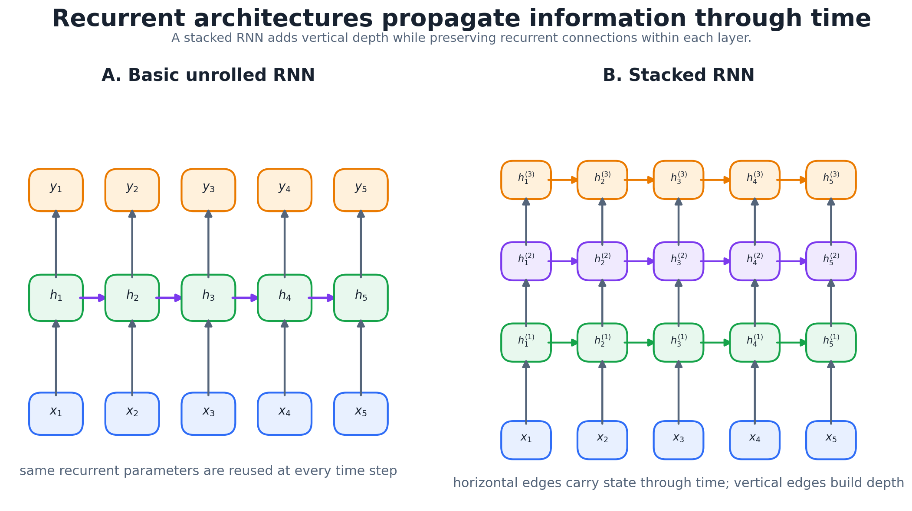
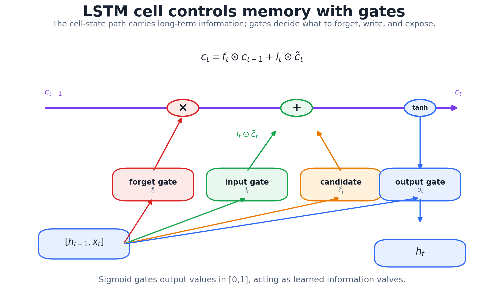
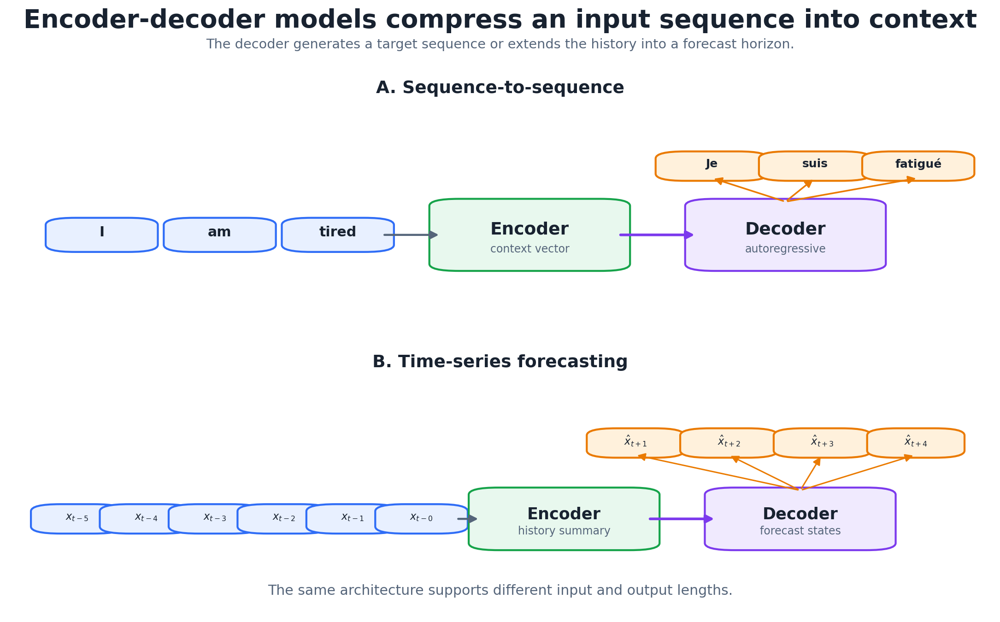
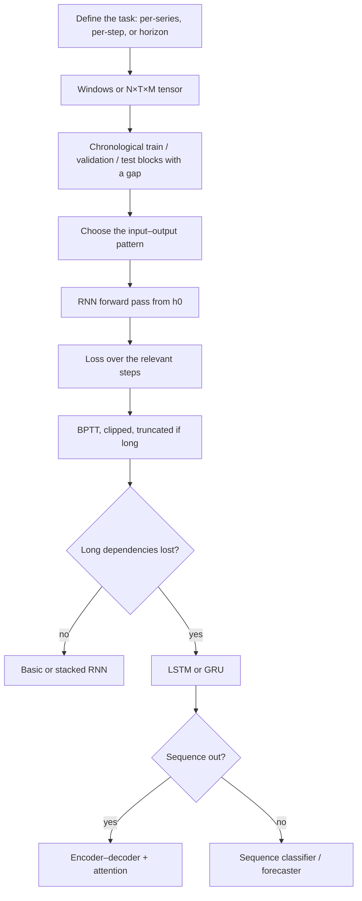

# 8. RNNs, LSTMs, GRUs and Encoder–Decoder Models

Feed-forward networks treat each input as an unordered bag of columns. This chapter covers networks that carry a **state** through time. There are four design problems:

1. organizing temporal data into windows, tensors and chronological validation blocks;
2. the recurrent update: a hidden state that summarizes the past;
3. batching, long sequences and stateful training, i.e. what the hidden state means across batches;
4. gates (LSTM, GRU) that let the state keep information over long intervals.

The chapter ends with encoder–decoder models for sequence-to-sequence and multi-horizon forecasting, and with the limitation that leads straight to attention.

```text
sequence → windows / tensor → recurrent hidden state → one or many outputs
long dependencies → gated state (LSTM, GRU)
sequence in, sequence out → encoder–decoder → attention (Chapter 11)
```

## 1. Framing temporal tasks

Given $N$ time series, the target can be:

- **one number per series** (sequence regression): remaining useful life, a condition score;
- **one label per series** (sequence classification): faulty vs healthy, a sentiment;
- **a value at every step** (sequence labeling): part-of-speech tags, monthly sales;
- **the next $H$ values** (multi-horizon forecasting).

**Does order matter to an ordinary network?** Suppose we permute the time indices of every series with the *same* permutation. For a fully connected network the task is unchanged: it's the same set of input columns in a different order, and the first layer can learn the permuted weights. That's the problem. An MLP gets **no benefit** from temporal order, so it has to learn separately that $x_{17}$ and $x_{18}$ are neighbors. RNNs, convolutions and positional encodings build that structure in, and permuting time would change their task.

### Multi-horizon strategies

| Strategy | How | Trade-off |
|---|---|---|
| recursive | one-step model, feed each prediction back as input | one model; errors compound over the horizon |
| direct | a separate model per horizon $h=1..H$ | no feedback errors; $H$ models, horizons inconsistent |
| multi-output (MIMO) | one model outputs all $H$ values at once | one model, no feedback; needs enough data to learn $H$ outputs |

The multi-output version predicts all later positions in parallel instead of waiting for (or guessing) the earlier ones. The encoder–decoder in Section 9 is a structured version of it.

## 2. From one series to training examples

**Autoregressive embedding.** With $p$ lags and horizon $H$,

```math
X_t=(y_{t-p},\ldots,y_{t-1}),\qquad Y_t=(y_t,\ldots,y_{t+H-1}),
```

so for $H=1$: $(y_1..y_p)\to y_{p+1}$, $(y_2..y_{p+1})\to y_{p+2}$, and so on.

```python
import numpy as np

def make_windows(y, p, H=1):
    X = np.stack([y[t-p:t]   for t in range(p, len(y) - H + 1)])
    Y = np.stack([y[t:t+H]   for t in range(p, len(y) - H + 1)])
    return X, Y

X, Y = make_windows(np.arange(1, 9), p=3, H=2)
print(X.shape, Y.shape, X[0], Y[0])   # (4, 3) (4, 2) [1 2 3] [4 5]
```

**Validation must respect time.** Random K-fold puts future windows in the training set and past windows in the test set, and overlapping windows leak almost-identical rows across the split. Use blocked schemes:


*Random, expanding-window and sliding-window validation.*

- **expanding window:** train on everything up to $t$, test on the next block, grow;
- **sliding window:** fixed-length training window, useful when old data is stale;
- **gap:** skip at least $p+H-1$ steps between train and test so no window straddles the boundary.

The rule: the training period is always before the test period.

## 3. The RNN

**Data shape.** Recurrent layers take an $N\times T\times M$ tensor: $N$ sequences (patients), $T$ time steps (days), $M$ attributes per step (temperature, sensors 1–3). A univariate series is $N\times T\times1$.

**State.** Like a state-space model $\mathbf s_t=f(\mathbf s_{t-1},\mathbf x_t;\theta)$, an RNN keeps a hidden state that summarizes everything seen so far:

```math
\mathbf h_t=\phi(U\mathbf h_{t-1}+W_1\mathbf x_t+\mathbf b_1),\qquad
\mathbf o_t=W_2\mathbf h_t+\mathbf b_2,\qquad
\hat{\mathbf y}_t=g(\mathbf o_t),
```

with $U$ (hidden→hidden), $W_1$ (input→hidden), $W_2$ (hidden→output), activation $\phi$ (tanh classically) and output function $g$ (identity, sigmoid, softmax). **The same weights are used at every time step.** That's what lets one model handle any sequence length. Unrolled, the cycle in the compact diagram becomes a chain.



*Left: the recurrence unrolled through time. Right: a stacked RNN, where state flows in time within each layer and upward between layers.*

**Forward pass.** Set $\mathbf h_0$ (usually zeros). Then for $t=1..T$: compute $\mathbf h_t$, then $\mathbf o_t$ and $\hat{\mathbf y}_t$, then $L_t$ if a target exists. The loss is $L=\sum_tL_t$ for sequence labeling, or only $L=L_T$ for many-to-one tasks.

**Why pass $\mathbf h_{t-1}$ and not the previous output?** The output is a low-dimensional, task-specific summary (maybe one number). The hidden state can be much wider and keeps whatever the network finds useful about the history, whether or not it's the target.

### Input–output patterns

| Pattern | Example |
|---|---|
| one-to-one | an ordinary feed-forward net |
| one-to-many | generating a sequence from one input (image captioning) |
| many-to-one | quality label at the end of a manufacturing run; next-month ER use from a year of records; sentiment of a paragraph |
| many-to-many (aligned) | part-of-speech tagging, per-step forecasting |
| many-to-few / seq2seq | translation; an $H$-step forecast from a history window |

**Stacked RNNs.** Unit $h_{k,t}$ in layer $k$ receives $h_{k,t-1}$ (same layer, previous time) and $h_{k-1,t}$ (layer below, same time). State propagates in time only within a layer. Lower layers tend to learn local features and higher layers longer-range patterns; two or three layers is typical.

## 4. Backpropagation through time

Because $U$ is reused, $\mathbf h_t=\phi(U\,\phi(U\mathbf h_{t-2}+W_1\mathbf x_{t-1}+\mathbf b_1)+W_1\mathbf x_t+\mathbf b_1)$ and so on. The loss depends on $U$ through every step. **BPTT** unrolls the network over $T$ steps, backpropagates through the resulting deep feed-forward graph, and **sums** the gradient contributions to each shared weight.

The problem is the Jacobian chain. With $\mathbf a_t$ the pre-activation,

```math
\frac{\partial\mathbf h_t}{\partial\mathbf h_k}=\prod_{j=k+1}^{t}\mathrm{diag}\big(\phi'(\mathbf a_j)\big)\,U,
\qquad
\Big\|\frac{\partial\mathbf h_t}{\partial\mathbf h_k}\Big\|\le\big(\gamma\,\|U\|\big)^{t-k},
```

where $\gamma$ bounds $|\phi'|$. If $\gamma\|U\|<1$ the gradient from step $k$ **vanishes** geometrically ($0.9^{50}\approx0.005$). If the largest singular value is large it can **explode** ($1.1^{50}\approx117$). Either way, the weights barely learn from dependencies many steps back.

| Fix | For |
|---|---|
| gradient clipping (rescale if $\|\mathbf g\|>c$) | exploding gradients |
| truncated BPTT: backprop only $k$ steps | cost, and some stability; can't learn dependencies longer than $k$ |
| gated cells (LSTM, GRU) | vanishing gradients |
| orthogonal init of $U$, ReLU + careful init | both, partially |

Truncation trades distant memory for cheaper, more stable updates. The forward pass still carries state further than $k$ steps, but no gradient flows back that far.

## 5. Batches, long sequences and state

**The key distinction: state values are not weights.** Weights are learned and shared across all sequences. The hidden state is a per-sequence, per-time activation that gets recomputed every forward pass, usually from $\mathbf h_0=\mathbf 0$.

**Many sequences.** Batch $B$ sequences of common length $T$ (pad and mask shorter ones), compute $L^{\mathcal B}=\sum_{b\in\mathcal B}L^{(b)}$, run BPTT on the batch loss, update. An epoch has passed once all $N$ sequences have been seen.

**One long sequence** (a genome with $10^5$ bases, years of weekly demand, cases where distant history barely matters): cut it into windows $X_t=(x_t,\ldots,x_{t+q-1})$ with target $x_{t+q}$ and train on those. To forecast beyond the data, feed predictions back in (recursive strategy).

**Stateless vs stateful.** Chunks of a long sequence can pass state forward, $\mathbf h_0^{(i+1)}\leftarrow\mathbf h_T^{(i)}$, giving the model context longer than a chunk.

| | Stateless (default) | Stateful |
|---|---|---|
| state at the start of a batch | reset to 0 | carried over from the previous batch |
| assumption | batches independent | batch $j$, row $i$ continues batch $j{-}1$, row $i$ |
| shuffling | fine | **not allowed** between or within batches |
| reset | every batch | at the end of each epoch |

In PyTorch, "stateful" means keeping `h` between calls and doing `h = h.detach()` at every batch boundary. Detaching is truncated BPTT: the value flows forward, the gradient stops. Without it, the graph (and memory use) grows across the whole epoch.

### A practical checklist

- **Sequence length / lags $p$:** long enough to cover the dynamics (seasonal period, response time).
- **Scale:** standardize each input channel using statistics from the training period only.
- **Horizon:** one-step or $H$-step, which fixes the output layer and strategy.
- **Batch size:** larger batches mix more independent sequences and give smoother gradients.
- **Target:** predicting the next few points is usually more stable than one far-off point.

## 6. LSTM

The LSTM (Hochreiter & Schmidhuber, 1997) adds a **cell state** $\mathbf c_t$, a memory line that is updated **additively**, alongside the hidden state $\mathbf h_t$ that the rest of the network sees. Three sigmoid gates, each a vector in $(0,1)$ that multiplies another vector element-wise, decide what to forget, what to write and what to expose. With $[\mathbf x_t;\mathbf h_{t-1}]$ the concatenated input:

```math
\begin{aligned}
\mathbf f_t&=\sigma(W_f[\mathbf x_t;\mathbf h_{t-1}]+\mathbf b_f) &&\text{forget: how much of }\mathbf c_{t-1}\text{ to keep}\\
\mathbf i_t&=\sigma(W_i[\mathbf x_t;\mathbf h_{t-1}]+\mathbf b_i) &&\text{input: how much new content to write}\\
\tilde{\mathbf c}_t&=\tanh(W_c[\mathbf x_t;\mathbf h_{t-1}]+\mathbf b_c) &&\text{candidate content}\\
\mathbf c_t&=\mathbf f_t\odot\mathbf c_{t-1}+\mathbf i_t\odot\tilde{\mathbf c}_t &&\text{cell update}\\
\mathbf o_t&=\sigma(W_o[\mathbf x_t;\mathbf h_{t-1}]+\mathbf b_o) &&\text{output: how much to expose}\\
\mathbf h_t&=\mathbf o_t\odot\tanh(\mathbf c_t)
\end{aligned}
```



*The cell-state line along the top is only scaled by $\mathbf f_t$ and added to. The tanh is applied only on the branch that produces $\mathbf h_t$.*

**Why it fixes vanishing gradients.** Along the cell path, $\partial\mathbf c_t/\partial\mathbf c_{t-1}=\mathrm{diag}(\mathbf f_t)$ (plus smaller terms through the gates). There's no repeated multiplication by a weight matrix and no squashing derivative. When the forget gate is near 1, gradient and information pass through many steps almost unchanged. That's why the forget-gate bias is often initialized to 1.

**Gates vs activations.** Gates are computed with a sigmoid, so they're nonlinear. Their *role* is different, though: a gate doesn't create content, it scales how much of an existing vector gets through. The candidate $\tilde{\mathbf c}_t$ creates content. And "forget gate" is named backward from its values: $f=1$ means **keep**, $f=0$ means forget.

## 7. GRU

The GRU (Cho et al., 2014) merges the cell and hidden state and uses two gates:

```math
\begin{aligned}
\mathbf r_t&=\sigma(W_r[\mathbf x_t;\mathbf h_{t-1}]+\mathbf b_r) &&\text{reset: how much past enters the candidate}\\
\mathbf z_t&=\sigma(W_z[\mathbf x_t;\mathbf h_{t-1}]+\mathbf b_z) &&\text{update: how much to replace}\\
\tilde{\mathbf h}_t&=\tanh(W[\mathbf x_t;\,\mathbf r_t\odot\mathbf h_{t-1}]+\mathbf b)\\
\mathbf h_t&=(1-\mathbf z_t)\odot\mathbf h_{t-1}+\mathbf z_t\odot\tilde{\mathbf h}_t
\end{aligned}
```

The last line is a learned, per-unit EWMA between the old state and the candidate, the same form as simple exponential smoothing in [Chapter 3](03_filters_smoothing_and_decomposition.md) but with a data-dependent weight. One update gate plays the roles of both the LSTM's forget and input gates, tied as $1-z$ and $z$.

> [!WARNING]
> **Convention check**
>
> PyTorch's `nn.GRU` writes $\mathbf h_t=(1-\mathbf z_t)\odot\tilde{\mathbf h}_t+\mathbf z_t\odot\mathbf h_{t-1}$, the roles of $z$ and $1-z$ swapped. The model class is the same; just don't mix the two conventions when reading gate values.

| | LSTM | GRU |
|---|---|---|
| states carried | $\mathbf h_t$ and $\mathbf c_t$ | $\mathbf h_t$ only |
| gates | forget, input, output | reset, update |
| parameters per layer | $4(d_h(d_h+d_x)+d_h)$ | $3(\ldots)$, about 25% fewer |
| performance | usually similar; neither dominates across tasks | |

## 8. Encoder–decoder (seq2seq)

When input and output are both sequences, possibly of different lengths, an **encoder** RNN reads the input into a representation and a **decoder** RNN generates the output from it (Sutskever et al., 2014).



*Top: translation ("I am tired" → "Estoy cansado/a"). Bottom: the same structure for forecasting, a history window in and all $H$ horizon values out.*

- **Translation:** word embeddings in, the encoder's final state initializes the decoder, and the decoder emits one token at a time, feeding each back in.
- **Forecasting:** the encoder reads $x_1,\ldots,x_T$ and the decoder produces $\hat y_{T+1},\ldots,\hat y_{T+H}$. Future-known covariates (calendar, promotions) can be decoder inputs.
- **Training:** *teacher forcing* feeds the true previous output to the decoder, which is fast and stable. At inference the decoder only has its own predictions, a train–test mismatch (exposure bias) that scheduled sampling eases.

### The bottleneck, and the fix

A long input squeezed into **one** final hidden state loses early information. The fix is to keep all encoder states $\mathbf h_1,\ldots,\mathbf h_T$ and, at each decoder step $t$, build a fresh weighted summary:

```math
e_{t,j}=\mathrm{score}(\mathbf s_{t-1},\mathbf h_j),\qquad
\alpha_{t,j}=\frac{\exp e_{t,j}}{\sum_k\exp e_{t,k}},\qquad
\mathbf c_t=\sum_j\alpha_{t,j}\mathbf h_j ,
```

where $\mathbf s_{t-1}$ is the decoder state and the score is a small learned network (Bahdanau et al., 2015) or a dot product (Luong et al., 2015). The softmax weights say which input steps matter for the current output. This is **attention**. [Chapter 11](11_transformers.md) drops the recurrence entirely and builds the whole model out of it.

## 9. The whole workflow



## 10. Common confusions

- **Hidden state vs weights:** state changes per sequence and per step; weights are shared and learned.
- **Output vs hidden state:** the output is task-specific; the hidden state is a richer internal summary.
- **Stateful ≠ different weight handling:** it only changes where each batch's $\mathbf h_0$ comes from.
- **BPTT vs truncated BPTT:** full unrolled gradient vs gradient cut after $k$ steps (the forward state still flows).
- **LSTM $\mathbf c_t$ vs $\mathbf h_t$:** long-term memory line vs the exposed output.
- **GRU reset vs update:** reset shapes the candidate; update mixes old state and candidate.
- **Encoder–decoder vs attention:** one fixed summary vs a new weighted summary at every output step.

## 11. Questions and answers

<details><summary>How should I handle sequences of different lengths?</summary>

Pad to a common length and pass a mask so padded steps don't contribute to the loss or the state (`pack_padded_sequence` in PyTorch). Alternatively, bucket sequences of similar length into the same batch to reduce padding.
</details>

<details><summary>What truncation length should I use?</summary>

At least as long as the longest dependency you expect the model to learn, e.g. one seasonal period. Common values are 50–200 steps. Check by increasing it until validation loss stops improving.
</details>

<details><summary>How do I detect and handle exploding gradients?</summary>

Log the global gradient norm. Spikes, and NaN losses, are the symptom. Clip it (`clip_grad_norm_` with max norm around 1–5), and lower the learning rate if spikes persist.
</details>

<details><summary>Are the gates implemented as one big matrix?</summary>

Usually yes. Frameworks stack the four LSTM (three GRU) weight blocks into one matrix, split into input and recurrent parts, $W_{ih}\mathbf x_t+W_{hh}\mathbf h_{t-1}$, and compute all gates in one matmul. The math is the same as concatenating $[\mathbf x_t;\mathbf h_{t-1}]$.
</details>

<details><summary>How is the decoder initialized?</summary>

Classically with the encoder's final state ($\mathbf h_T$, and $\mathbf c_T$ for an LSTM), passed through a linear layer if the sizes differ. With attention, the initial state matters less because every step reads the encoder states directly.
</details>

<details><summary>When would I still pick an RNN over a transformer?</summary>

For streaming or online inference (constant memory per step), small datasets, very long sequences where $O(T^2)$ attention is expensive, or on-device deployment. Modern state-space models (S4, Mamba) revive this recurrent, linear-time idea.
</details>

---

[← Previous: Neural-Network Foundations](07_neural_network_foundations.md) · [Course map](../course_map.md) · [Next: Temporal Convolutional Networks →](09_temporal_convolutional_networks.md)
