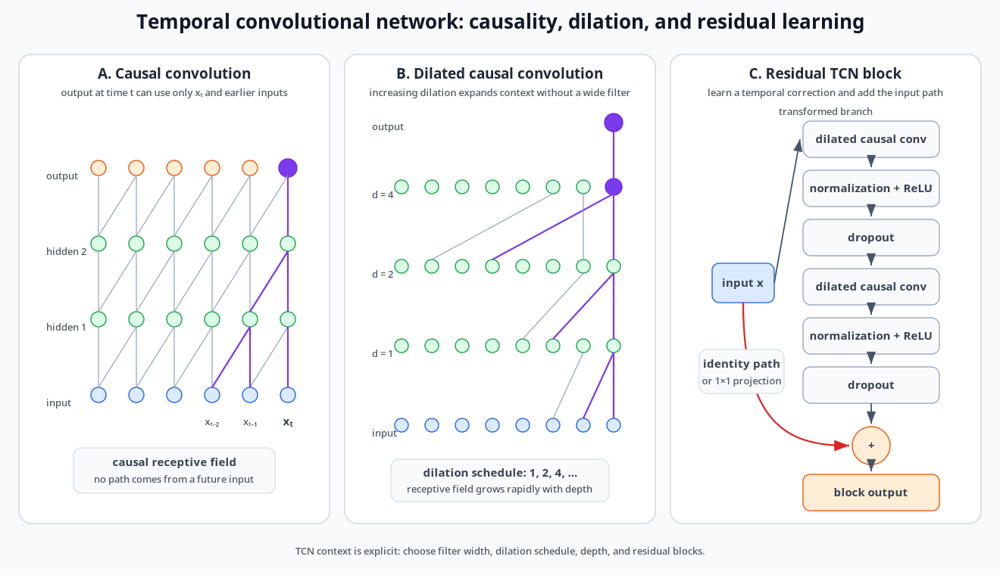
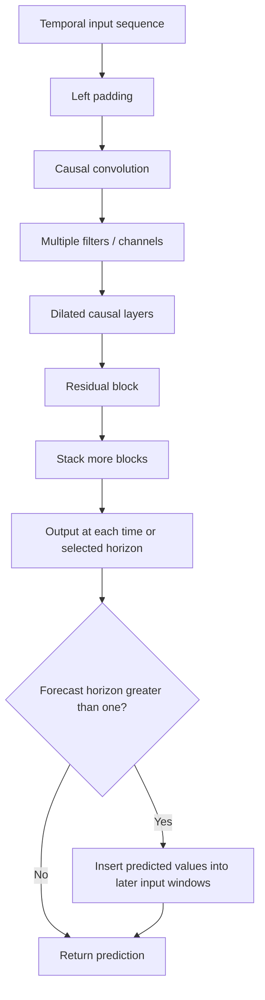

# Temporal Convolutional Networks

## 1. Chapter overview

Temporal convolutional networks (TCNs) adapt one-dimensional
fully-convolutional neural networks to ordered temporal data.

The course emphasizes three defining ideas:

1. **causality**: an output at time $t$ uses only present and past inputs;
2. **dilation**: convolution skips inputs at controlled intervals to
   expand temporal coverage;
3. **residual blocks**: deep stacks use residual connections and common
   neural-network regularization methods.

The main motivation is to obtain a large receptive field without the
strictly sequential computation of an RNN.

```text
Ordinary causal convolution
    -> local past context

Stacked causal convolution
    -> linearly growing receptive field

Exponentially increasing dilation
    -> rapidly growing receptive field

Residual TCN stack
    -> deep trainable temporal model
```

**Sources:** CSE598MTL.pdf, pp. 79-82

---

## 2. Learning objectives

After this chapter, the reader should be able to:

1. describe a TCN as a one-dimensional fully-convolutional network;
2. explain why zero padding is used in a length-preserving TCN;
3. define causal convolution for a temporal sequence;
4. explain local connectivity and weight sharing;
5. distinguish filters, channels, layers, and receptive fields;
6. calculate the receptive-field size of an ordinary causal stack using
   the course formula;
7. define dilation as skipped time steps between filter inputs;
8. write the dilated causal-convolution equation;
9. explain why exponentially increasing dilation expands the receptive
   field efficiently;
10. describe a TCN residual block;
11. explain why TCN computations can be parallelized more easily than RNN
    hidden-state calculations;
12. describe recursive forecasting beyond horizon one;
13. identify the course's practical methods for enlarging a TCN receptive
    field.

**Sources:** CSE598MTL.pdf, pp. 79-82

---

## 3. What is a TCN?

The page defines TCNs as using more traditional neural-network models than
RNNs.

A TCN is described as a:

- one-dimensional network;
- fully-convolutional network;
- model with hidden layers having the same length as the input layer.

Zero padding is added to maintain sequence length.

The slide lists several claimed benefits:

- design closer to traditional neural networks;
- flexible models;
- more parallel computation;
- good empirical performance.

It then states:

> Without recurrent connections, TCNs train faster than RNNs, especially
> when the time-series length $T$ is large.

This is preserved as the course's motivation statement.

**Source:** CSE598MTL.pdf, p. 79

---

## 4. Ordinary temporal convolution

The page recalls convolution and filtering from the earlier chapter.

A general convolution is shown as:

```math
F(t)
=
(x*f)(t)
=
\sum_{i=-K}^{K}
f(i)x_{t+i}.
```

The slide describes this form as using a filter of size:

```math
2K+1.
```

Because both positive and negative offsets are included, this operation
may use observations from both before and after $t$.

**Source:** CSE598MTL.pdf, p. 79

---

## 5. Causal constraint

For time-series prediction, the page states that:

```math
y_{t+1}
```

should depend only on previous or currently available inputs:

```math
x_0,x_1,\ldots,x_t.
```

A causal convolution is written:

```math
F(t)
=
(x*f)(t)
=
\sum_{i=0}^{K}
f(i)x_{t-i}.
```

This uses:

- the current value $x_t$;
- lagged values $x_{t-1},x_{t-2},\ldots$;
- no future value $x_{t+1}$.

The slide summarizes:

> Causal convolutions maintain sequential ordering commonly used for time
> series.

**Source:** CSE598MTL.pdf, p. 79

---

## 6. Local connectivity and weight sharing

The example filter is:

```math
[0.1,-0.8,0.3].
```

It is applied at successive temporal positions with stride one.

The page emphasizes two convolutional properties.

### 6.1 Local connectivity

Each output depends on a local input neighborhood rather than the whole
sequence.

### 6.2 Weight sharing

The same filter values are reused at every time position.

> **Handwritten annotation:** Within one layer, CNN filters share the same
> weights.

This differs from a fully connected layer, where each connection may have
its own independent weight.

**Source:** CSE598MTL.pdf, p. 79

### Notation review

The page first uses $2K+1$ or $K+1$ as a filter-size expression, then
describes the three-element example as having "size $K=3$."

The source therefore uses $K$ both as:

- a maximum offset;
- the number of filter elements.

This chapter uses **filter width** when the distinction matters.

**Source:** CSE598MTL.pdf, p. 79

---

## 7. Length-preserving causal layers

A TCN keeps hidden-layer sequence length equal to input length by padding
the left side of the input.

Conceptually, for a width-three causal filter:

```text
padded past       observed input
0   0   x1   x2   x3   x4   ...

        apply same filter at each position

output
y1  y2  y3  y4  ...
```

Padding allows an output to exist near the beginning of the series even
when a complete historical filter window is not yet available.

The source page describes padding as necessary to maintain layer length
but does not discuss alternative padding conventions.

**Source:** CSE598MTL.pdf, p. 79

---

## 8. Multiple filters and channels

The handwritten note states:

> We can use multiple filters in one layer.

Each filter produces its own output feature map or channel.

```text
One input sequence
    -> filter 1 -> feature channel 1
    -> filter 2 -> feature channel 2
    -> ...
```

The next layer can convolve across these channels, adding another network
dimension beyond time.

The page-80 table illustrates two filters being applied at each position.

**Sources:** CSE598MTL.pdf, pp. 79-80

---

## 9. Stacking causal convolutional layers

Stacking causal layers allows deeper outputs to depend on a larger portion
of the input history.


*Redrawn course diagram — TCN causality, exponentially increasing dilation, and residual-block structure.*


The page labels:

- input layer;
- hidden layers;
- output.

Every path points from earlier or current input positions toward later
hidden and output nodes without using future input.

**Source:** CSE598MTL.pdf, p. 80

---

## 10. Receptive field

The receptive field is defined on the page as the length of input history
that can influence an output.

For ordinary stacked convolutions with:

- $L$ layers;
- filter size $K$;

the page gives:

```math
R=L+K-1.
```

It describes this as linear growth in the number of layers.

### Possible formula issue

For stride-one convolution with the same width $K$ filter at every
layer, the handwritten calculation and standard layer-by-layer counting
on the page indicate:

```math
R=1+L(K-1).
```

The printed expression:

```math
R=L+K-1
```

matches only special cases and is inconsistent with the handwritten
examples such as repeated width-two growth.

This chapter preserves the printed formula but logs it as a likely source
error. The intended course message is unambiguous:

> Without dilation, a large receptive field requires many layers or large
> filters.

**Source:** CSE598MTL.pdf, p. 80

---

## 11. Why ordinary stacks can become expensive

The page states that long-term dependencies require a large receptive
field.

For ordinary convolutions, increasing temporal coverage requires:

- more layers;
- wider filters.

Either choice increases model complexity.

This motivates dilated causal convolution.

**Source:** CSE598MTL.pdf, p. 80

---

## 12. Dilated convolution

A dilated convolution skips time steps when applying a filter.

The page states that it is equivalent to a filter with zero weights at
the skipped positions.

The dilation factor $d$ is defined as the number of time steps between
the filter inputs.

The slide states:

- dilation factor $1$: ordinary convolution;
- common layer sequence:

```math
d=1,2,4,8,\ldots
```

**Source:** CSE598MTL.pdf, p. 81

---

## 13. Dilated causal-convolution equation

For dilation $d$, the page writes:

```math
F(t)
=
(x*_d f)(t)
=
\sum_{i=0}^{K}
f(i)x_{t-di}.
```

The input locations are:

```math
t,\ t-d,\ t-2d,\ldots
```

rather than consecutive time positions.

For example, with $d=4$:

```text
filter taps:
x[t], x[t-4], x[t-8], ...
```

**Source:** CSE598MTL.pdf, p. 81

---

## 14. Exponentially increasing dilation

The course states that increasing dilation exponentially with depth
generates a similar increase in receptive-field size.

Its example uses dilations:

```math
1,2,4,\ldots,512=2^9.
```

The page states that these layers produce a receptive field of:

```math
1024=2^{10}.
```

This is described as more efficient and nonlinear than using one very
wide:

```math
1\times1024
```

convolution.

### Interpretation

A wide single filter directly learns one transformation over the full
window.

A dilation stack:

- composes several nonlinear layers;
- covers long history;
- uses smaller local filters in each layer.

**Source:** CSE598MTL.pdf, p. 81

---

## 15. Dilated causal stack

The diagram shows successive hidden layers using increasing dilation.

The handwritten note states:

> If I want to have 50 inputs for each receptive field size, I could
> increase the number of inputs.

The exact sentence is difficult to interpret. It appears to concern
adjusting dilation, layer count, or filter width to achieve a desired
receptive field and is logged for review.

Another handwritten note describes a dilation sequence of roughly:

```math
1,2,4,8,\ldots
```

and says this increases the receptive field rapidly.

**Source:** CSE598MTL.pdf, p. 81

---

## 16. Stacking dilation blocks

The page states that blocks can be stacked to increase receptive-field
size further.

This creates two hierarchy levels:

```text
within one block:
several dilation layers

whole TCN:
several residual/dilation blocks
```

The page identifies causal convolution and dilation as key elements of
TCNs.

**Source:** CSE598MTL.pdf, p. 81

---

## 17. Training and forecasting

The slide states that TCN design and training are similar to traditional
neural networks.

It lists:

- backpropagation;
- ResNets or residual alternatives;
- dropout and other regularization.

For forecast horizon:

```math
H>1,
```

the page says to substitute predicted values as inputs to reach the full
horizon.

This describes recursive forecasting:

```text
predict y[t+1]
    -> add prediction to the next input window
    -> predict y[t+2]
    -> continue through horizon H
```

**Source:** CSE598MTL.pdf, p. 81

---

## 18. TCN residual block

The architecture page shows a residual block parameterized by a filter
width $k$ and dilation $d$.

The main branch contains repeated operations resembling:

1. dilated causal convolution;
2. weight normalization;
3. ReLU;
4. dropout;
5. another dilated causal convolution;
6. weight normalization;
7. ReLU;
8. dropout.

An optional:

```math
1\times1
```

convolution aligns dimensions on the residual or identity path.

The block output adds:

- the transformed branch;
- the identity or projected input.

**Source:** CSE598MTL.pdf, p. 82

---

## 19. Why use residual connections?

The page does not provide a mathematical derivation of residual training,
but its diagram shows the intended structure:

```math
\text{block output}
=
\text{transformed input}
+
\text{identity-mapped input}.
```

This allows a deep block to learn a correction to the input rather than
reconstructing the complete mapping from scratch.

The optional $1\times1$ convolution is used when the identity path must
change channel dimension.

**Source:** CSE598MTL.pdf, p. 82

---

## 20. TCN performance figures

The page reproduces performance plots for:

- sequential MNIST;
- permuted MNIST.

The curves compare TCNs with recurrent alternatives including RNN- and
LSTM-style models.

The slide's summary says:

> Good performance: often better than RNN, LSTM.

### Source-faithful caution

The page provides benchmark curves and a qualitative conclusion, but the
small legend and experimental details are not sufficient to reconstruct
every model configuration or numerical result reliably.

**Source:** CSE598MTL.pdf, p. 82

---

## 21. Parallel computation

The slide contrasts TCN and RNN computation.

For an RNN, the prediction at time $t$ requires calculations from earlier
times:

```math
t'<t.
```

This creates a sequential dependency chain.

For a TCN, convolutions across positions in a layer can be calculated in
parallel once the layer input is available.

The page states that:

- fixed-length inputs can be calculated in parallel;
- long input sequences can be processed in parallel.

### Clarification

TCN layers still execute sequentially by depth, but positions within one
layer do not require recurrent state propagation from the immediately
previous position.

**Source:** CSE598MTL.pdf, p. 82

---

## 22. Modifying the receptive field

The page lists three straightforward ways to increase the receptive field:

1. stack more dilation layers;
2. increase the dilation factor;
3. increase filter size.

This flexibility is presented as a practical TCN advantage.

**Source:** CSE598MTL.pdf, p. 82

---

## 23. Practical course comments

The concluding bullets state:

- TCNs are similar enough to ordinary neural networks that many familiar
  training methods apply;
- design guidance remains a work in progress;
- empirical performance is often strong;
- the receptive field is easier to control than recurrent memory.

These are course-level design comments, not universal guarantees.

**Source:** CSE598MTL.pdf, p. 82

---

## 24. End-to-end TCN workflow



This diagram is synthesized from pages 79-82.

**Sources:** CSE598MTL.pdf, pp. 79-82

---

## 25. Major comparisons

### 25.1 Ordinary versus causal convolution

| Dimension | Ordinary temporal convolution | Causal convolution |
|---|---|---|
| Uses future offsets | May | No |
| Ordering guarantee | None by itself | Preserves forecasting order |
| Course equation | $x_{t+i}$ terms | $x_{t-i}$ terms |
| Main use in chapter | Filter reminder | TCN foundation |

### 25.2 Ordinary versus dilated causal stack

| Dimension | Ordinary stack | Dilated stack |
|---|---|---|
| Input spacing per filter | Consecutive | Skipped by factor $d$ |
| Receptive-field growth | Linear with depth | Rapid with exponential dilation |
| Large-history requirement | Many layers or wide filters | Small filters over spaced inputs |
| Key hyperparameters | Width and layers | Width, layers, dilation schedule |

### 25.3 RNN versus TCN

| Dimension | RNN | TCN |
|---|---|---|
| Temporal mechanism | Recurrent hidden state | Causal convolution |
| Computation across positions | Sequential | Parallel within a layer |
| Long context | Learned recurrent memory | Explicit receptive field |
| Main training issue emphasized earlier | BPTT and gradients | Deep convolutional design |
| Regularization in notes | Dropout and recurrent methods | Dropout and residual blocks |

### 25.4 Wide single filter versus dilation stack

| Dimension | One very wide convolution | Dilated stack |
|---|---|---|
| Temporal coverage | Direct wide window | Composed across layers |
| Nonlinear depth | One transformation | Multiple nonlinear transformations |
| Filter width | Very large | Small per layer |
| Course characterization | Less efficient example | More efficient and nonlinear |

**Sources:** CSE598MTL.pdf, pp. 79-82

---

## 26. Common confusions

### Causality versus padding

Causality restricts which time positions are used. Padding preserves
output length near the beginning of the sequence. They solve different
problems.

### Filter size versus maximum lag notation

The page uses $K$ both as a maximum summation offset and as the number of
filter elements. Always verify the intended convention.

### Receptive field versus number of parameters

A large receptive field means a large temporal input range can influence
an output. It does not directly equal the number of learned parameters.

### Dilation versus stride

Dilation spaces filter taps while preserving an output at each time
position. Stride skips output positions.

### Parallel computation versus one-layer execution

Positions within a convolutional layer can be computed in parallel, but
later layers still depend on earlier layers.

### Recursive TCN forecast versus parallel horizon output

Page 81 describes feeding predicted values back for $H>1$. A separate
TCN could instead be designed to output several horizon values directly,
but that alternative is not developed in these four pages.

### Residual connection versus recurrent connection

A residual connection skips layers by adding an earlier representation.
It is not a hidden state passed through time.

**Sources:** CSE598MTL.pdf, pp. 79-82

---

## 27. Questions preserved for later discussion

1. Which exact TCN paper or implementation supplied the architecture
   figures?
2. What padding convention was used at the beginning of each sequence?
3. Does the model trim padded outputs before calculating loss?
4. Which filter-width convention should replace the conflicting uses of
   $K$ on page 79?
5. Is the page-80 printed formula $R=L+K-1$ a typo for
   $R=1+L(K-1)$?
6. What receptive-field formula was used for stacked dilation blocks?
7. Did dilation reset at the beginning of each residual block?
8. What channel counts were used in each block?
9. Was weight normalization used in the course implementation?
10. What dropout rate was used?
11. Were predictions for $H>1$ generated recursively or in parallel in
    assignments?
12. Were gradients or activations affected by long left-padding regions?
13. Which Sequential MNIST and P-MNIST numerical results were considered
    most important?
14. Under what datasets did the course observe TCN performance better than
    RNN or LSTM?
15. How should receptive field be selected relative to the actual
    dependency length in the data?

These questions arise from source ambiguities or omitted implementation
details.

---

## 28. Source map

| PDF page | Material reconstructed |
|---:|---|
| 79 | TCN definition, causal constraint, local convolution and weight sharing |
| 80 | Multiple filters, stacked causal layers and ordinary receptive field |
| 81 | Dilated causal convolution, exponential dilation, training and recursive horizon |
| 82 | Residual block, benchmark plots, parallel computation and design comments |

## Review status

- TCN definition and causal equation: `[VERIFIED]`
- Filter-width notation $K$: `[INCONSISTENT SOURCE NOTATION]`
- Multiple-filter interpretation: `[VERIFIED FROM HANDWRITING]`
- Page-80 printed receptive-field formula: `[LIKELY SOURCE ERROR]`
- Dilated-convolution equation: `[VERIFIED]`
- Dilation/receptive-field handwritten example: `[INTERPRETED]`
- Residual-block architecture: `[VERIFIED VISUALLY]`
- Benchmark numerical details: `[NEEDS ORIGINAL PAPER OR CLEARER LEGEND]`
