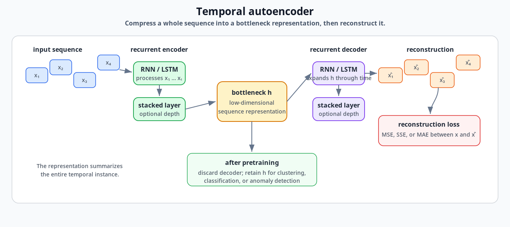
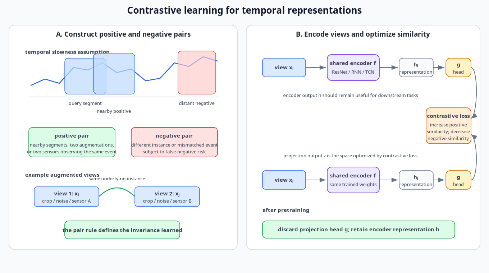
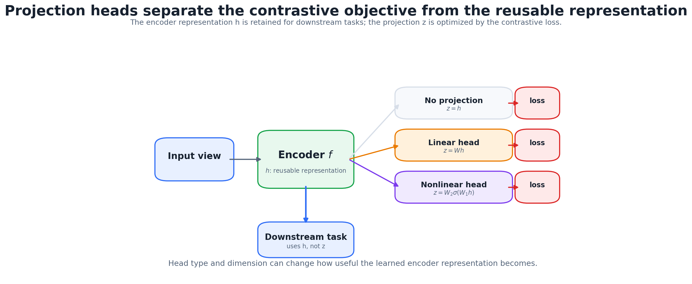
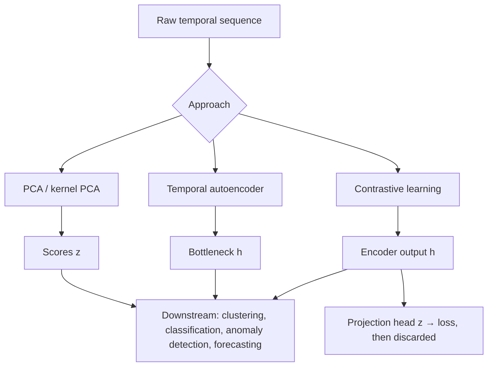

# 10. Temporal Representation and Contrastive Learning

A time series with thousands of points often carries only a few dozen numbers' worth of information. This chapter is about learning that compact **representation**: an embedding $\mathbf h$ that's small, and useful for clustering, anomaly detection, classification or forecasting. It goes from linear to learned to self-supervised:

```text
PCA → kernel PCA → autoencoder / temporal autoencoder → contrastive learning
raw series x → encoder → representation h → downstream task
```

One problem runs through the whole chapter: **there's no single metric for a good representation.** A representation can reconstruct its input perfectly and still be useless for the task you care about.

## 1. Why learn representations?

Temporal data are redundant: idle periods, stable operating conditions, and sampling much faster than the system actually changes. Temporal representation learning (TRL) maps each series to a low-dimensional vector (thousands of points → tens of numbers) so we can:

- cluster series without computing distances in a huge raw space;
- flag anomalous series;
- compress;
- feed encoder–decoder models and downstream supervised tasks, often with few labels.

**Evaluating representations.** Supervised models have ROC, accuracy and loss. Representations are judged **indirectly**: train a simple model (a linear probe or k-NN) on $\mathbf h$ for a downstream task, or measure clustering quality. The answer depends on the task, the probe, the number of labels and $\dim\mathbf h$, so compare representations under the *same* protocol.

**Two perspectives:**

- **Generative:** $\mathbf z$ is good if it can regenerate the data, i.e. model $p(\mathbf x\mid\mathbf z)$. Autoencoders take this view.
- **Discriminative:** $\mathbf z$ is good if it can tell things apart: predict a label, or tell which examples belong together. Contrastive learning takes this view.

## 2. PCA as a representation

Treat each series $\mathbf x_i\in\mathbb R^T$ as one vector. Project it onto the top covariance eigenvectors ([Chapter 5](05_pca_and_regularization.md)):

```math
z_{im}=\mathbf v_m^\top\mathbf x_i,\qquad \mathbf z_i=(z_{i1},\ldots,z_{iK}),\qquad K\ll T .
```

The scores are **latent variables**: a few hidden factors that explain most of the variation. PCA is the natural baseline, and any fancier method (LSTM autoencoder, contrastive encoder) should be compared against it under the same downstream evaluation.

## 3. Kernel PCA

PCA is linear. To capture nonlinear structure, map the data into a bigger feature space $\phi(\mathbf x)$ (e.g. all degree-2 products) and do PCA **there**. Doing that explicitly is expensive, and the kernel trick avoids it.

**Step 1: PCA only needs inner products.** For centered $X\in\mathbb R^{N\times M}$, $X^\top X$ ($M\times M$) and the Gram matrix $XX^\top$ ($N\times N$) have the **same nonzero eigenvalues**. If $X^\top X\mathbf v=\lambda\mathbf v$ then $XX^\top(X\mathbf v)=\lambda(X\mathbf v)$. The entries of $XX^\top$ are inner products $\mathbf x_i^\top\mathbf x_j$, so PCA can be done from those alone.

**Step 2: replace inner products by a kernel.** $K(\mathbf x_i,\mathbf x_j)=\phi(\mathbf x_i)^\top\phi(\mathbf x_j)$ computes the inner product in feature space without ever building $\phi$. Eigendecompose the **centered** kernel matrix $\tilde K=K-\mathbf 1_NK-K\mathbf 1_N+\mathbf 1_NK\mathbf 1_N$ (where $\mathbf 1_N$ is the matrix with every entry $1/N$). The kernel-PC scores are the eigenvectors scaled by $\sqrt{\lambda}$.

| Kernel | $K(\mathbf x_i,\mathbf x_j)$ | Hyperparameters |
|---|---|---|
| polynomial | $(1+\mathbf x_i^\top\mathbf x_j)^d$ | degree $d$ |
| Gaussian / RBF | $\exp(-\gamma\|\mathbf x_i-\mathbf x_j\|^2)=\exp\!\big(-\|\mathbf x_i-\mathbf x_j\|^2/2\sigma^2\big)$ | $\gamma=1/(2\sigma^2)$ |
| tanh (sigmoid) | $\tanh(\beta\,\mathbf x_i^\top\mathbf x_j-\delta)$ | $\beta,\delta$ (not always positive semidefinite) |

**How big is the feature space?** With 50 inputs, degree 2 gives 50 linear terms, 50 squares and $\binom{50}{2}=1225$ cross products: **1,325 features** (1,326 with the constant). The kernel computes the inner product with one 50-dimensional dot product. The Gaussian kernel is the extreme case: its Taylor expansion contains monomials of **every** degree, so its feature space is **infinite-dimensional**, and it can only be used through the kernel. The same kernel trick powers SVMs ([CSE 575, Chapter 8](../../cse-575-statistical-machine-learning/docs/08_support_vector_machines_and_kernels.md)).

## 4. Autoencoders

An autoencoder learns to reproduce its input through a **bottleneck**:

```math
\mathbf h_i=\phi(W_1\mathbf x_i+\mathbf b_1),\qquad
\hat{\mathbf x}_i=g(W_2\mathbf h_i+\mathbf b_2),\qquad
\dim\mathbf h_i<\dim\mathbf x_i,\qquad
L=\sum_i\|\mathbf x_i-\hat{\mathbf x}_i\|_2^2 .
```

Because the bottleneck is narrow, the network can't just copy. It has to find a compact code.

**Linear autoencoders and PCA.** With identity activations and no biases, $\hat{\mathbf x}=W_2W_1\mathbf x$ is a rank-$K$ linear map. The minimum squared error is achieved when $W_2W_1$ projects onto the top-$K$ principal subspace (Baldi & Hornik, 1989), so the optimal linear autoencoder **spans the same subspace as PCA**. But $W_1$ is only determined up to an invertible $K\times K$ transform: the learned code is a rotated and scaled version of the PC scores, not the orthonormal, variance-ordered components themselves. Nonlinear activations and depth are what take autoencoders beyond PCA.

### Temporal autoencoders

To respect time, build the encoder and decoder from RNN/LSTM layers ([Chapter 8](08_rnn_lstm_gru_and_seq2seq.md)):

```text
stacked LSTM encoder → final hidden state h (the representation) → stacked LSTM decoder → reconstructed series
```

The loss is MSE/SSE/MAE between the series and its reconstruction.



*Train the encoder–bottleneck–decoder, then discard the decoder and reuse $\mathbf h$ downstream.*

**Using it:** train the full model, **discard the decoder**, compute $\mathbf h_i$ for every series (old and new), and cluster, classify or measure distances. For anomaly detection, train on normal reference data only, then flag new series whose $\mathbf h$ is far from the reference embeddings, or whose reconstruction error is high.

**Example: ECG beats.** Heartbeats sampled at hundreds of Hz are segmented and aligned into about 300-point vectors, one per beat. A temporal autoencoder with a 2-D bottleneck maps each beat to a point, and in the scatter plot the beat types fall into visibly separate groups, with no labels used in training.

### Limitations

- **Reconstruction error is a blunt metric in high dimensions.** MSE, MAE and other distances can rank the same reconstructions differently, and a small error spread over 300 points can hide a large error at the one point that matters.
- **Good reconstruction ≠ useful features.** The code spends capacity on whatever dominates the squared error (baseline wander, noise), which may be irrelevant downstream. Rare anomalies barely move the average loss.
- **Localized anomalies in long series.** One global embedding blurs a short anomalous interval. Slide a window, score each window's reconstruction error, and report *where* the error spikes.

## 5. Self-supervised and contrastive learning

**Self-supervised** learning invents a supervised task (a *pretext task*) from unlabeled data, so the targets come from the data itself. **Contrastive** learning is the most successful family. Instead of reconstructing $\mathbf x$, it learns an embedding in which:

- **similar** (positive) pairs are close;
- **dissimilar** (negative) pairs are far apart.

Pretraining this way and then fine-tuning or probing with a few labels often beats training the supervised model from scratch, especially when labels are scarce. That's an empirical pattern, not a guarantee.

**Defining "similar" is both the strength and the weakness.** The representation becomes **invariant** to whatever transformation you declare harmless. That's great when the downstream task really should ignore it, and harmful when it shouldn't. Color-invariance helps object recognition and ruins a ripe-vs-unripe fruit classifier.

### Making pairs

| Domain | Positive pairs | Negatives |
|---|---|---|
| images | two augmentations of one image: crop, color jitter, grayscale, blur, rotation, noise; a patch and its full image | other images in the batch |
| multimodal | image and audio of the same clip, each through its own encoder (CLIP applies the same idea to image–text) | mismatched pairs |
| time series | nearby / overlapping segments of one series; small jitter, scaling or noise; two sensors observing the same event | segments from other series, or far away in time |



*Positive and negative temporal pairs, a shared encoder, a projection head and the contrastive loss.*

For time series the default is the **slowness assumption**: nearby segments share the same underlying state. It fails in two ways:

- **fast regime changes:** adjacent segments can straddle a transition;
- **cycles:** segments a day, or a period, apart can be the *same* state, so calling them negatives teaches the model to separate identical things (**false negatives**). Choose negatives with the known periodicity in mind.

### Architecture: encoder, head, loss

```math
\mathbf h_i=f(\mathbf x_i)\;\;(\text{encoder, e.g. a ResNet or TCN}),\qquad
\mathbf z_i=g(\mathbf h_i)\;\;(\text{projection head: small MLP}),
```

and the loss is applied to $\mathbf z$. In SimCLR (Chen et al., 2020), each minibatch of $K$ examples is augmented twice to give $2K$ views. For a positive pair $(i,j)$ the other $2K-2$ views are negatives, and the task is **"given view $i$, pick its partner $j$ out of the batch"**. That's a $(2K-1)$-way softmax classification, the **NT-Xent / InfoNCE** loss:

```math
\ell_{i,j}=-\log\frac{\exp\big(\mathrm{sim}(\mathbf z_i,\mathbf z_j)/\tau\big)}{\sum_{k=1}^{2K}\mathbf 1_{[k\ne i]}\exp\big(\mathrm{sim}(\mathbf z_i,\mathbf z_k)/\tau\big)},\qquad
\mathrm{sim}(\mathbf u,\mathbf v)=\frac{\mathbf u^\top\mathbf v}{\|\mathbf u\|\|\mathbf v\|}.
```

Cosine similarity compares directions only, so the model can't cheat by inflating norms. The indicator stops $i$ from matching itself. The batch loss averages $\ell_{i,j}$ over all $2K$ ordered positive pairs.

```python
import numpy as np

def nt_xent(z, tau=0.5):
    """z: (2K, d) projections; rows 2k and 2k+1 are two views of instance k."""
    z = z / np.linalg.norm(z, axis=1, keepdims=True)      # cosine similarity
    sim = z @ z.T / tau
    np.fill_diagonal(sim, -np.inf)                        # 1[k != i]: never match yourself
    pos = np.arange(len(z)) ^ 1                           # partner index: 0<->1, 2<->3, ...
    log_prob = sim[np.arange(len(z)), pos] - np.log(np.exp(sim).sum(axis=1))
    return -log_prob.mean()

rng = np.random.default_rng(0)
base = rng.normal(size=(4, 8))
views = np.repeat(base, 2, axis=0) + 0.05 * rng.normal(size=(8, 8))   # matched pairs
print(round(nt_xent(views), 3), round(nt_xent(rng.normal(size=(8, 8))), 3))   # 0.621 2.158
```

Matched views give a low loss. Random vectors give about $\log(2K-1)=\log7\approx1.95$, i.e. chance.

### Temperature

$\tau$ controls how sharp the softmax is. For similarities $(2.3,1.6,-1.2)$:

| $\tau$ | 0.1 | 0.5 | 1 | 10 |
|---|---|---|---|---|
| probabilities | (0.999, 0.001, 0.000) | (0.80, 0.20, 0.00) | (0.66, 0.33, 0.02) | (0.38, 0.35, 0.27) |

- **Small $\tau$** approaches a hard argmax. The loss concentrates on the **hardest negatives**, which gives strong separation but is sensitive to false negatives.
- **Large $\tau$** approaches uniform. Every negative counts about equally and the signal is weak.

Typical values are 0.05–0.5. Temperature changes the *shape of the loss*; the learning rate changes the *size of the step*. They're different knobs.

### Why the projection head, and why throw it away?

The loss forces $\mathbf z$ to be invariant to the augmentations, so color, orientation and so on are removed from $\mathbf z$. If the loss acted directly on $\mathbf h$, that information would be stripped from $\mathbf h$ too, even if a later task needs it. With a head $g$ in between, **$g$ absorbs the invariance** and $\mathbf h$ keeps more. SimCLR's ablation showed exactly this: with a 2048-dimensional ResNet-50 representation $\mathbf h$, linear-probe accuracy on $\mathbf h$ was best with a **nonlinear** head, next with a linear head, and worst with none. So after pretraining we **discard $g$ and keep the encoder** $f$.



*The head shapes the contrastive objective. The representation before it is what gets reused.*

### Other losses and design choices

**Margin triplet loss.** For anchor $\mathbf u$, positive $\mathbf v^+$ and negative $\mathbf v^-$ (unit vectors):

```math
\ell=\max\big(0,\;\mathbf u^\top\mathbf v^- -\mathbf u^\top\mathbf v^+ + m\big),\qquad
\nabla_{\mathbf u}\ell=\mathbf v^- -\mathbf v^+\;\text{ when the margin is violated}.
```

Gradient descent moves $\mathbf u$ toward $\mathbf v^+$ and away from $\mathbf v^-$. Unlike NT-Xent it looks at one negative at a time, with no softmax weighting, so it needs **hard-negative mining** to work well.

**Batch design matters as much as the loss.** The batch decides which pairs are positive, which are negative, how hard the discrimination is and which invariances get learned. Larger batches mean more negatives and usually better representations (SimCLR used batches of thousands); memory banks and momentum encoders (MoCo) get many negatives without huge batches.

In the SimCLR paper, a linear probe on a 4×-wide ResNet-50 reached about 76.5% top-1 on ImageNet, matching a fully supervised standard ResNet-50. That result made contrastive pretraining a mainstream approach. It's most useful where labels are expensive: medical signals, industrial sensors.

### The mutual-information view

Contrastive learning can be read as maximizing the **mutual information** between two views' representations:

```math
I(X;Y)=H(X)-H(X\mid Y)=H(Y)-H(Y\mid X)=H(X)+H(Y)-H(X,Y)\;\ge0,\qquad H(X)=-\sum_xp(x)\log p(x).
```

MI measures how much knowing one variable reduces uncertainty about the other. The InfoNCE loss with $N$ candidates gives a lower bound, $I(\mathbf z_i;\mathbf z_j)\ge\log N-\mathcal L_{\text{InfoNCE}}$ (van den Oord et al., 2018), which is another reason large batches help. The bound is loose, though, and tighter MI estimates don't always give better features. The MI story is a useful lens, not the full explanation.

## 6. Artificial contrasts for anomaly detection

A related trick turns unsupervised anomaly detection into classification:

1. Generate **artificial** series from a reference distribution: shuffle time points, sample each feature independently, or sample uniformly over the data's range.
2. Label the real series $y=0$ and the artificial ones $y=1$.
3. Train any classifier to tell them apart.
4. Score a new series by **$P(y=1\mid\mathbf x)=1-P(y=0\mid\mathbf x)$**.

Why it works: with balanced classes, the classifier estimates $P(y=0\mid\mathbf x)=\dfrac{p_{\text{real}}(\mathbf x)}{p_{\text{real}}(\mathbf x)+p_{\text{ref}}(\mathbf x)}$. A **high** real-class probability means $\mathbf x$ looks like normal data. Anomalies are where real data are rare relative to the reference, so the anomaly score is the artificial-class probability, or equivalently one minus the real-class probability. The choice of reference matters: it should differ from real data only in the structure you care about (shuffling time, for example, destroys only temporal dependence).

## 7. Choosing a method



| | PCA | Kernel PCA | Autoencoder | Contrastive |
|---|---|---|---|---|
| mapping | linear | nonlinear via kernel | learned neural | learned neural |
| objective | preserve variance | variance in feature space | reconstruct $\mathbf x$ | pick the positive among negatives |
| temporal structure | none (a vector) | none | RNN/LSTM/TCN encoder | encoder + temporal pairs |
| invariances | none by design | none | none by design | exactly those in the pair rule |
| main risk | misses nonlinearity | kernel and bandwidth choice, $O(N^2)$ | reconstructs irrelevant detail | pair rule discards useful info; false negatives |

## 8. Common confusions

- **Low reconstruction error vs useful representation:** not the same thing.
- **Kernel PCA vs explicit features:** only inner products are computed, and for RBF the features can't even be listed.
- **Self-supervised ≠ no targets:** targets are generated from the data.
- **Positive pair ≠ same class:** it's whatever the pair rule says.
- **$\mathbf h$ vs $\mathbf z$:** keep the encoder output, discard the head output.
- **Temperature vs learning rate:** loss sharpness vs step size.
- **Nearby ≠ similar, far ≠ different:** check for regime changes and cycles.

## 9. Questions and answers

<details><summary>How do I choose the kernel bandwidth for kernel PCA?</summary>

Start with the median heuristic, $\sigma=$ median pairwise distance, then tune on the downstream metric. Too small a $\sigma$ makes every point its own cluster; too large makes the kernel nearly linear.
</details>

<details><summary>How do I pick the temperature and batch size?</summary>

$\tau\in[0.05,0.5]$ with the largest batch that fits. Check with a linear probe on a small labeled set: probe accuracy is the metric, not the contrastive loss value.
</details>

<details><summary>What augmentations are safe for time series?</summary>

Jitter (small noise), scaling, window cropping and slicing, and mild time warping are usually safe. Permuting segments or flipping time are only safe if order truly doesn't matter for the task. Validate each augmentation by checking the probe accuracy with and without it.
</details>

<details><summary>How do I handle cyclic series where distant segments are the same state?</summary>

Don't use "far apart" as the negative rule. Draw negatives from other series, or exclude segments at multiples of the known period, or use a method with no negatives at all (BYOL, SimSiam, VICReg).
</details>

<details><summary>Should I normalize representations before cosine similarity?</summary>

Cosine similarity normalizes by definition. For downstream k-NN or clustering on $\mathbf h$, L2-normalizing usually helps too, because the training geometry was angular.
</details>

---

[← Previous: Temporal Convolutional Networks](09_temporal_convolutional_networks.md) · [Course map](../course_map.md) · [Next: Transformers →](11_transformers.md)
