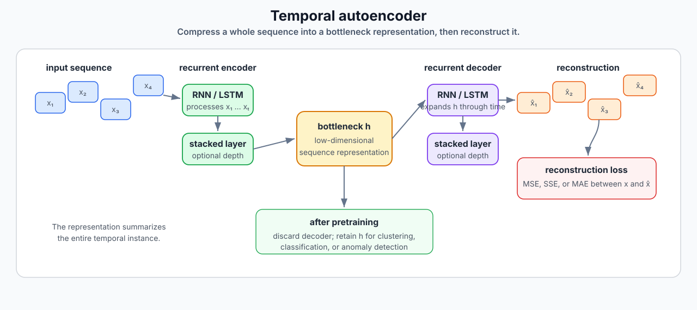
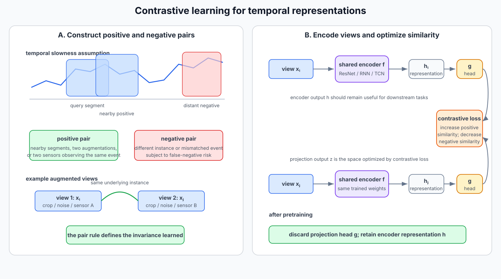
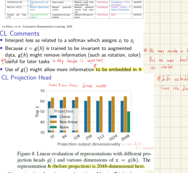
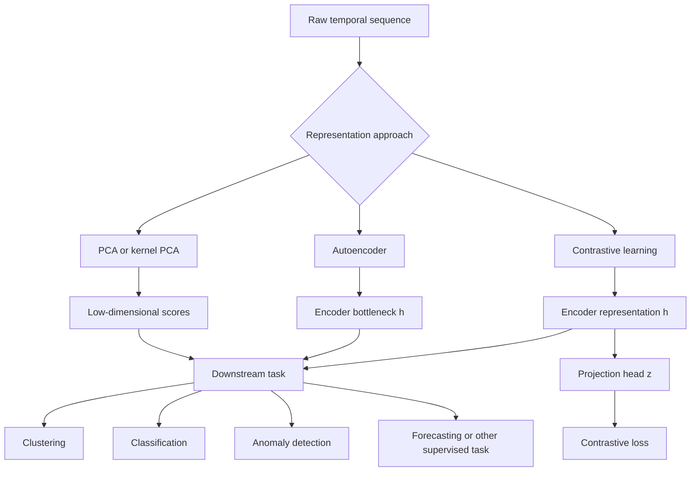

# Temporal Representation and Contrastive Learning

## 1. Chapter overview

This chapter studies how to convert a long or high-dimensional temporal
object into a smaller representation that remains useful for later tasks.

The pages progress through:

1. temporal representation learning as a general problem;
2. PCA as a simple linear representation;
3. kernel PCA as a nonlinear extension using inner products;
4. autoencoders and temporal autoencoders;
5. self-supervised and contrastive learning;
6. positive/negative pair construction;
7. encoder and projection-head design;
8. contrastive softmax-style losses and temperature;
9. mutual-information motivation;
10. artificial contrasts for anomaly detection.

A central difficulty noted repeatedly is evaluation:

> A representation may reconstruct the input well while still being poor
> for a downstream task.

```text
Raw temporal sequence x
    -> encoder or transformation
    -> representation h or z
    -> clustering, anomaly detection, classification, or forecasting
```

**Sources:** CSE598MTL.pdf, pp. 83-91

---

## 2. Learning objectives

After this chapter, the reader should be able to:

1. explain why temporal data may contain substantial redundancy;
2. define a learned low-dimensional representation or embedding;
3. distinguish generative and discriminative representation-learning
   perspectives at the level presented in the notes;
4. describe PCA scores as a simple representation;
5. explain the kernel trick used by kernel PCA;
6. write the common polynomial, RBF, and hyperbolic-tangent kernels shown
   on the page;
7. describe an autoencoder's encoder, bottleneck, decoder, and
   reconstruction loss;
8. explain how a temporal autoencoder uses RNN or LSTM components;
9. identify weaknesses of reconstruction loss as a representation metric;
10. distinguish supervised, self-supervised, and contrastive learning;
11. define similar and dissimilar pairs;
12. describe temporal positive-pair construction using nearby segments,
    perturbations, or multiple sensors;
13. distinguish an encoder representation $h$ from a projection-head
    output $z$;
14. describe the minibatch contrastive task and cosine similarity;
15. interpret the temperature parameter in a softmax-style contrastive
    loss;
16. explain why the projection head may be discarded after pretraining;
17. describe the mutual-information motivation shown in the notes;
18. explain the artificial-contrast anomaly-detection procedure and
    identify the label/score ambiguity on page 91.

**Sources:** CSE598MTL.pdf, pp. 83-91

---

## 3. Why learn temporal representations?

The opening page says time series often contain redundant information due
to:

- idle periods;
- stable environments;
- measurement frequency much greater than the system dynamics.

Temporal representation learning (TRL) maps a time series into a
lower-dimensional vector space or embedding.

The objective may reduce:

```text
thousands of time points
    -> tens of representation values
    or fewer
```

The representation can support:

- clustering time series without relying directly on distances in very
  high-dimensional raw space;
- detecting anomalous series;
- data compression;
- encoder-decoder models;
- downstream supervised tasks.

**Source:** CSE598MTL.pdf, p. 83

---

## 4. Representation quality is difficult to measure

The page contrasts representation learning with ordinary supervised
learning.

For supervised models, performance can often be measured with metrics
such as:

- ROC;
- accuracy;
- prediction loss.

For representations, success criteria may instead depend on less direct
outcomes such as clustering quality or downstream performance.

> **Handwritten annotation:** It is difficult to measure the performance
> of representation learning.

### Clarification

A representation can be evaluated indirectly by asking whether it helps
a later task, but that result depends on:

- the later task;
- the model fitted on the representation;
- the amount of labeled data;
- the representation dimension.

The source raises this issue without defining one universal metric.

**Source:** CSE598MTL.pdf, p. 83

---

## 5. Generative and discriminative perspectives

Suppose:

```math
\mathbf{z}
```

is learned to represent:

```math
\mathbf{x}.
```

### Generative perspective

The page states that a generative method models the original object from
the representation.

If $\mathbf{z}$ can generate or reconstruct $\mathbf{x}$, it may be a
useful representation.

### Discriminative perspective

A discriminative method learns a representation based on its usefulness
for predicting a target or distinguishing examples.

### Source notation review

The probability notation in the two bullets is very small and compressed.
The conceptual distinction above is clear, but the exact conditional
probability factorization is not transcribed because it cannot be
verified reliably from the page.

**Source:** CSE598MTL.pdf, p. 83

---

## 6. PCA as a simple representation

The page returns to PCA as a basic representation-learning method.

For a time-series instance $\mathbf{x}_i$, principal-component scores
are:

```math
z_{im}
=
\mathbf{v}_m^\top\mathbf{x}_i,
```

where:

```math
\mathbf{v}_1,\mathbf{v}_2,\ldots
```

are covariance eigenvectors.

Retain:

```math
z_{i1},z_{i2},\ldots,z_{iK},
\qquad K\ll T,
```

as the representation.

The page calls these scores:

- fundamental variables;
- hidden variables;
- latent variables.

The representation may contain far fewer scores than the original number
of time positions.

**Source:** CSE598MTL.pdf, p. 83

### Handwritten evaluation note

The handwriting mentions comparing methods such as PCA and LSTM-based
representations and asks how a selected representation should be judged.

This reinforces the chapter's downstream-evaluation problem.

**Source:** CSE598MTL.pdf, p. 83

---

## 7. Kernel PCA motivation

Ordinary PCA is linear in the original input variables.

Kernel PCA expands the inputs into a larger feature space:

```math
\phi(\mathbf{x}_i),
```

possibly containing polynomial or other nonlinear features.

A linear method in the transformed features can represent a nonlinear
relationship in the original variables.

The page's handwritten summary is:

```text
1. map or upscale to a higher-dimensional feature space
2. apply PCA there
```

**Source:** CSE598MTL.pdf, p. 84

---

## 8. Kernel PCA through inner products

The page assumes the data are scaled to:

- zero mean;
- unit standard deviation.

Ordinary PCA may use the covariance-like matrix:

```math
S=X^\top X,
```

where:

```math
X\in\mathbb{R}^{N\times M}.
```

The slide notes that the nonzero eigenvalues of:

```math
X^\top X
```

and:

```math
XX^\top
```

are the same, although the matrices have different dimensions and
therefore different numbers of zero eigenvalues.

The elements of $XX^\top$ are instance-to-instance inner products.

Therefore PCA calculations can be reformulated using only inner products
between instances.

**Source:** CSE598MTL.pdf, p. 84

---

## 9. Kernel trick

A kernel function is defined as:

```math
K(\mathbf{x}_i,\mathbf{x}_j)
=
\phi(\mathbf{x}_i)^\top
\phi(\mathbf{x}_j).
```

It calculates an inner product in the transformed feature space without
explicitly constructing every transformed feature.

The page emphasizes:

- no need to calculate transformed vectors explicitly;
- only transformed-space inner products are needed;
- kernel PCA scores can then be used as a representation.

**Source:** CSE598MTL.pdf, p. 84

---

## 10. Kernel functions shown in the notes

### 10.1 Polynomial kernel

For degree $d$:

```math
K(\mathbf{x}_i,\mathbf{x}_j)
=
\left(
1+\mathbf{x}_i^\top\mathbf{x}_j
\right)^d.
```

### 10.2 Gaussian or radial-basis kernel

```math
K(\mathbf{x}_i,\mathbf{x}_j)
=
\exp
\left(
-\gamma
\|\mathbf{x}_i-\mathbf{x}_j\|^2
\right).
```

The page also writes:

```math
K(\mathbf{x}_i,\mathbf{x}_j)
=
\exp
\left(
-
\frac{
\|\mathbf{x}_i-\mathbf{x}_j\|^2
}{
2\sigma^2
}
\right).
```

### 10.3 Hyperbolic-tangent kernel

```math
K(\mathbf{x}_i,\mathbf{x}_j)
=
\tanh
\left(
\beta\mathbf{x}_i^\top\mathbf{x}_j-\delta
\right).
```

The slide lists hyperparameters including:

- $d$;
- $\gamma$ or $\sigma^2$;
- $\beta$;
- $\delta$.

**Source:** CSE598MTL.pdf, p. 84

---

## 11. Polynomial feature-count example

The page states that with:

- 50 inputs;
- a degree-2 polynomial expansion;

the transformed space contains:

```math
1325
```

terms.

The kernel function makes computation in such enlarged spaces feasible
without explicitly listing all terms.

The slide then asks how many polynomial terms correspond to a Gaussian
kernel.

This is preserved as an open conceptual question. The page does not state
a numerical answer.

**Source:** CSE598MTL.pdf, p. 84

---

## 12. Autoencoders

An autoencoder is designed to reproduce its input at the output.

It contains:

- an encoder;
- a bottleneck layer;
- a decoder;
- a reconstructed output.

For instance $\mathbf{x}_i$, the bottleneck representation is:

```math
\mathbf{h}_i,
```

with:

```math
\dim(\mathbf{h}_i)
<
\dim(\mathbf{x}_i).
```

A common loss is the sum of squared reconstruction errors:

```math
L
=
\mathrm{SSE}
=
\sum_{i=1}^{N}
\|
\mathbf{x}_i-\hat{\mathbf{x}}_i
\|_2^2.
```

The network is trained to minimize this loss.

**Source:** CSE598MTL.pdf, p. 85

---

## 13. One-hidden-layer autoencoder

The encoder is:

```math
\mathbf{h}_i
=
\phi
\left(
W_1\mathbf{x}_i+\mathbf{b}_1
\right).
```

The decoder is:

```math
\hat{\mathbf{x}}_i
=
g
\left(
W_2\mathbf{h}_i+\mathbf{b}_2
\right).
```

If:

- $\phi$ and $g$ are identity functions;
- $\mathbf{b}_1=\mathbf{b}_2=\mathbf{0}$;

then:

```math
\hat{\mathbf{x}}_i
=
W_2W_1\mathbf{x}_i.
```

The objective learns a low-dimensional linear representation from which
the decoder reconstructs the input.

The page marks this case as having been seen previously in relation to
linear dimensional reduction.

### Source-faithful caution

The page suggests a relationship to PCA, but it does not state all
constraints required for an exact equivalence. The note therefore calls
it a **linear dimensional-reduction relationship**, rather than silently
claiming every linear autoencoder solution equals PCA.

**Source:** CSE598MTL.pdf, p. 85

---

## 14. Temporal autoencoders

To capture temporal relationships, the page proposes using:

- RNNs;
- LSTMs.

A temporal autoencoder may use:

```text
stacked recurrent encoder
    -> low-dimensional bottleneck state
    -> stacked recurrent decoder
    -> reconstructed time series
```

The final hidden state of the last encoder layer is used as the
low-dimensional representation.

The loss may be:

- MSE;
- SSE;
- MAE;

between the original and reconstructed time series.
<p align="center">
  <a href="../assets/clean_diagrams/temporal_autoencoder.svg">
    
  </a>
</p>
<p align="center"><em>Clean diagram — Temporal encoder-bottleneck-decoder architecture and downstream reuse of the learned representation.</em></p>
<p align="center"><sub>Original course figures: <a href="../assets/original_figures/p086_temporal_autoencoder_example.png">page-86 architecture and ECG example</a></sub></p>
**Source:** CSE598MTL.pdf, p. 86

---

## 15. Using a trained temporal encoder

For a downstream task:

1. train the complete encoder-decoder model;
2. discard the decoder;
3. retain the encoder;
4. calculate $\mathbf{h}_i$ for current or new time series;
5. use the embeddings for clustering, anomaly detection, or another task.

For anomaly detection, the page suggests:

- train on reference or usual data;
- represent a new unusual series;
- monitor its distance from the reference representations.

Other measures besides distance can also be applied to
$\mathbf{h}_i$.

**Source:** CSE598MTL.pdf, p. 86

---

## 16. ECG autoencoder example

The example contains:

- ECG heart beats;
- hundreds of measurements per second;
- approximately 300 attributes;
- segmented and aligned heart beats;
- a two-dimensional learned representation;
- one point per heartbeat instance.

The two-dimensional scatter plot visually separates several groups of
beats.

The page uses this as an example of a temporal autoencoder embedding that
can be inspected in low-dimensional space.

**Source:** CSE598MTL.pdf, p. 86

---

## 17. Autoencoder concerns

The page lists two concerns.

### 17.1 Reconstruction loss in high dimensions

MSE, SSE, or MAE may be difficult to interpret across many output
dimensions.

> **Handwritten annotation:** Different distance measures may produce
> different conclusions.

### 17.2 Downstream usefulness

Embeddings that reconstruct reference instances well may not translate
effectively to downstream tasks.

The handwriting adds that a reconstruction objective may not be sensitive
enough to rare anomalies.

### Long-series anomaly question

The page asks how to detect an anomaly occurring only during one interval
of a long time series.

The handwriting appears to suggest splitting the series or monitoring
local reconstruction error, but the exact method is not fully legible.

**Source:** CSE598MTL.pdf, p. 86

---

## 18. Self-supervised learning

The page says self-supervised learning has been used more recently for
representation learning.

It:

- does not use externally supplied labels;
- creates a discriminative learning problem from the data itself.

The handwritten note appears to summarize this as creating an artificial
label or task from unlabeled data.

Contrastive learning is presented as a widely successful
self-supervised method.

The page asks:

> How?

Its answer is:

> Careful design of pretext tasks.

**Source:** CSE598MTL.pdf, p. 87

---

## 19. Pretraining and downstream tasks

The page states that in some cases:

- pretraining with contrastive learning;
- followed by a downstream supervised task;

performs better than training the supervised model directly.

This is presented as an empirical possibility, not as a guarantee for
every dataset.

**Source:** CSE598MTL.pdf, p. 87

---

## 20. Contrastive-learning goal

Contrastive learning begins with a high-dimensional input space
$\mathcal{X}$, such as:

- audio;
- images;
- videos;
- text;
- tensors.

It does not require ordinary class labels.

Instead, it creates pairs and trains a representation so that:

- similar instances are near;
- dissimilar instances are far.

The definition of “similar” and “dissimilar” is both:

- the main advantage;
- a major disadvantage.

The result depends on domain assumptions and pair-construction choices.

**Source:** CSE598MTL.pdf, p. 87

---

## 21. Image-pair examples

The page lists ways to create a similar pair from one image:

- brightness change;
- color distortion;
- crop;
- padding;
- noise;
- blur;
- rotation.

Other pairing strategies include:

- a patch and its full image;
- the same object measured by two sensors;
- different objects as dissimilar pairs.

The page displays common image augmentations, including crops, grayscale,
blur, and color changes.

### Handwritten caution

The handwriting notes that the learned representation becomes invariant
to whichever transformations are declared similar.

This is useful only when those transformations should truly be ignored by
the downstream task.

**Source:** CSE598MTL.pdf, p. 87

---

## 22. Multimodal contrastive pairs

The page-88 figure illustrates two modalities, such as:

- image;
- audio.

Each modality has its own encoder.

Representations associated with the same source are treated as positive
pairs, while mismatched sources are negative pairs.
<p align="center">
  <a href="../assets/clean_diagrams/contrastive_temporal_pipeline.svg">
    
  </a>
</p>
<p align="center"><em>Clean diagram — Temporal positive and negative pair construction, shared encoder, projection head, and contrastive loss.</em></p>
<p align="center"><sub>Original course figures: <a href="../assets/original_figures/p088_contrastive_pairing_slowness.png">page-88 pairing and slowness crop</a> · <a href="../assets/original_figures/p089_contrastive_encoder_head.png">page-89 encoder and head crop</a></sub></p>
**Source:** CSE598MTL.pdf, p. 88

---

## 23. Temporal positive and negative pairs

For time series, the page suggests:

- contiguous or nearby segments as similar pairs;
- distant segments as dissimilar pairs;
- a small amount of noise as a similar transformation.

This is called the **slowness assumption**:

> Nearby temporal segments are more likely to have similar underlying
> representations.

The page also shows a local-versus-global view in which segments from the
same long time series are treated as similar.

### Handwritten caution

The handwriting warns that “far apart” does not always mean dissimilar.
For cyclical or repeated temporal behavior, distant segments may represent
the same state.

The pair rule therefore depends on the system and sampling design.

**Source:** CSE598MTL.pdf, p. 88

---

## 24. Contrastive-learning architecture

The page identifies three components:

1. encoder;
2. head;
3. loss function.

The encoder learns the representation:

```math
\mathbf{h}_i
=
f(\mathbf{x}_i).
```

The head transforms it:

```math
\mathbf{z}_i
=
g(\mathbf{h}_i).
```

The head is usually:

- lower-dimensional than $\mathbf{h}_i$;
- a small neural network, possibly with one hidden layer.

The contrastive loss is applied to the head output
$\mathbf{z}_i$, not necessarily directly to
$\mathbf{h}_i$.

**Source:** CSE598MTL.pdf, p. 88

---

## 25. Contrastive model and augmentations

The page gives an example encoder:

```math
\mathbf{h}_i
=
\mathrm{ResNet}(\mathbf{x}_i).
```

The projection head is:

```math
\mathbf{z}_i
=
g(\mathbf{h}_i),
```

where $g$ may be:

- identity;
- linear;
- nonlinear.

For a minibatch of $K$ original instances:

```math
\{\mathbf{x}_k\},
```

augment each instance to obtain:

```math
2K
```

transformed instances.

Two augmentations from the same original instance form a positive pair.

For one positive pair:

```math
(\mathbf{x}_i,\mathbf{x}_j),
```

the other transformed instances in the minibatch are treated as
negatives.
<p align="center"><sub>Original course figure: <a href="../assets/original_figures/p089_contrastive_encoder_head.png">page-89 encoder/head source crop</a></sub></p>
**Source:** CSE598MTL.pdf, p. 89

---

## 26. Contrastive prediction task

The slide describes the task as:

> Given $\mathbf{x}_i$, identify its matching
> $\mathbf{x}_j$ in the minibatch.

The loss operates on positive and negative pairs and compares distances
or similarities between their projection-head outputs.

Training should:

- increase similarity for positive pairs;
- decrease similarity for negative pairs.

**Source:** CSE598MTL.pdf, p. 89

---

## 27. Cosine similarity

One similarity measure shown is:

```math
\mathrm{sim}(\mathbf{u},\mathbf{v})
=
\frac{
\mathbf{u}^\top\mathbf{v}
}{
\|\mathbf{u}\|\|\mathbf{v}\|
}.
```

This is cosine similarity.

It depends on the direction of the representation vectors rather than
their raw magnitudes.

**Source:** CSE598MTL.pdf, p. 89

---

## 28. Softmax-style contrastive loss

For anchor $i$ and its positive partner $j$, the page gives a
softmax-style loss of the form:

```math
\ell_i
=
-\log
\frac{
\exp
\left(
\mathrm{sim}(\mathbf{z}_i,\mathbf{z}_j)/\tau
\right)
}{
\sum_{k}
\mathbf{1}_{[k\neq i]}
\exp
\left(
\mathrm{sim}(\mathbf{z}_i,\mathbf{z}_k)/\tau
\right)
}.
```

The denominator compares the positive partner with other minibatch
instances.

The indicator excludes the anchor from matching itself.

The page describes the task as similar to a softmax choice in which the
model must select the correct positive representation.

**Source:** CSE598MTL.pdf, p. 89

---

## 29. Temperature

The parameter:

```math
\tau
```

is the temperature.

The page says it regularizes or controls the softmax.

The plotted example uses logits approximately:

```math
[2.3,1.6,-1.2].
```

### Smaller temperature

A small $\tau$ sharpens the distribution:

- the largest similarity receives probability close to one;
- smaller similarities receive probabilities close to zero.

### Larger temperature

A large $\tau$ flattens the distribution:

- output probabilities become more similar;
- in the large-temperature limit they approach a uniform distribution.

The handwritten notes express these limiting behaviors.

**Source:** CSE598MTL.pdf, p. 89

---

## 30. Training and downstream use

The minibatch losses are summed to obtain the training loss.

Weights are updated to:

- reduce contrastive loss;
- improve representation quality.

After training:

- discard the projection head;
- retain the encoder;
- use $\mathbf{h}_i$ for downstream tasks.

The page presents the projection head as a training device rather than
the final representation necessarily consumed by later models.

**Source:** CSE598MTL.pdf, p. 89

---

## 31. Contrastive-learning accuracy table

Page 90 reproduces results from a contrastive-learning paper using
ResNet-style architectures.

The table compares methods and reports:

- architecture;
- parameter count;
- top-1 accuracy;
- top-5 accuracy.

Highlighted SimCLR rows show strong results relative to several other
self-supervised methods.

### Source-faithful limitation

The complete experimental protocol and every table citation cannot be
reconstructed from this page alone. The chapter preserves the page's
main lesson:

> Contrastive pretraining can produce representations that perform well
> under later supervised evaluation.

**Source:** CSE598MTL.pdf, p. 90

---

## 32. Why use a projection head?

The page asks how to interpret the loss when:

```math
\mathbf{z}_i
=
g(\mathbf{h}_i).
```

Because the contrastive objective encourages invariance, applying it
directly to $\mathbf{h}_i$ might remove information such as:

- rotation;
- color;
- another augmentation detail.

That information may still be useful in a future task.

The course's interpretation is:

- the projection head $\mathbf{z}$ can absorb the invariance demanded
  by the contrastive loss;
- the encoder representation $\mathbf{h}$ may preserve more
  information for downstream use.

The handwritten notes emphasize that $\mathbf{h}$ is especially
important because $\mathbf{z}$ is discarded after pretraining.

**Source:** CSE598MTL.pdf, p. 90

---

## 33. Projection-head comparison

The page shows linear evaluation of representations produced with
different projection-head dimensions and types.

The figure caption states that the encoder representation before the
projection head is:

```math
2048
```

dimensional.

It compares:

- no projection;
- linear projection;
- nonlinear projection.
<p align="center">
  <a href="../assets/original_figures/p090_projection_head_results.png">
    
  </a>
</p>
<p align="center"><em>Source figure — Projection-head comparison from the course page. Select the image to open the full-size version.</em></p>
The page's conclusion is that the projection-head choice can affect
downstream representation quality.

**Source:** CSE598MTL.pdf, p. 90

---

## 34. Margin triplet loss

An alternative loss shown is a margin triplet form:

```math
\max
\left(
\mathbf{u}^\top\mathbf{v}^{-}
-
\mathbf{u}^\top\mathbf{v}^{+}
+
m,
0
\right),
```

where:

- $\mathbf{u}$: anchor;
- $\mathbf{v}^{+}$: positive;
- $\mathbf{v}^{-}$: negative;
- $m$: margin hyperparameter.

When the margin is violated, the displayed gradient direction is:

```math
\mathbf{v}^{-}-\mathbf{v}^{+}.
```

The page notes that this loss does not relatively weight all negative
examples in the same softmax-like way.

**Source:** CSE598MTL.pdf, p. 90

---

## 35. Minibatch design matters

The page states that loss-function designs have evolved over several
years and continue to change.

It also emphasizes:

> Minibatch design—how instances are augmented and paired—is important as
> loss-function design.

This follows because the batch determines:

- which examples are positives;
- which examples are negatives;
- how difficult the discrimination task is;
- what invariances are learned.

**Source:** CSE598MTL.pdf, p. 90

---

## 36. Labeled-data motivation

The page states that contrastive learning has been used successfully in
domains where labeled data are scarce.

It may allow tasks to be automated with less human labeling effort.

Research continues on the individual components of contrastive learning,
including pair construction, architecture, loss, and evaluation.

**Source:** CSE598MTL.pdf, p. 91

---

## 37. Mutual-information motivation

The page describes an ongoing relationship between contrastive learning
and maximizing mutual information between latent representations.

For random variables $X$ and $Y$:

```math
I(X;Y)\geq0.
```

The identities shown are:

```math
I(X;Y)
=
H(X)-H(X\mid Y),
```

```math
I(X;Y)
=
H(Y)-H(Y\mid X),
```

```math
I(X;Y)
=
H(X)+H(Y)-H(X,Y).
```

Entropy is written:

```math
H(X)
=
-
\sum_x
p(x)\log p(x).
```

### Interpretation

Mutual information measures how much knowing one variable reduces
uncertainty about the other.

The page presents this as a conceptual relationship under active
research, not as a complete derivation of the contrastive loss.

**Source:** CSE598MTL.pdf, p. 91

---

## 38. Artificial contrasts for anomaly detection

The final section presents a related procedure.

### Step 1: create artificial series

Generate artificial time series that resemble the real data in selected
ways.

### Step 2: assign labels

The slide states:

```math
y=0
```

for actual series and:

```math
y=1
```

for artificial series.

### Step 3: train a supervised classifier

Train a model to distinguish the two classes.

### Step 4: score a test series

The slide states:

> Compute the class-probability estimate of class 0 as a measure of
> anomaly.

**Source:** CSE598MTL.pdf, p. 91

### Important source inconsistency

Given the displayed labels:

```text
class 0 = actual
class 1 = artificial
```

a high class-0 probability would naturally indicate similarity to actual
training data, which is more directly a normality score than an anomaly
score.

Possible intended anomaly scores could include:

- class-1 probability;
- $1-P(y=0\mid x)$;
- a reversed label definition.

The source does not resolve this. The chapter preserves the slide wording
and logs the scoring direction as an internal inconsistency.

---

## 39. End-to-end representation-learning workflow



This diagram is synthesized from pages 83-91.

**Sources:** CSE598MTL.pdf, pp. 83-91

---

## 40. Major comparisons

### 40.1 PCA versus kernel PCA versus autoencoder

| Dimension | PCA | Kernel PCA | Autoencoder |
|---|---|---|---|
| Mapping | Linear | Nonlinear through kernel feature space | Learned neural encoder |
| Objective | Preserve variance | Preserve variance in kernel space | Reconstruct input |
| Explicit transformed features | Yes for ordinary predictors | Not required | Hidden activations |
| Decoder | No | No | Yes during training |
| Temporal modeling | Not explicit | Not explicit | RNN/LSTM possible |

### 40.2 Reconstruction learning versus contrastive learning

| Dimension | Autoencoder | Contrastive |
|---|---|---|
| Training target | Original input | Positive partner among negatives |
| Main loss | MSE/SSE/MAE | Similarity-based contrastive loss |
| Desired invariance | Not explicitly defined | Defined by positive-pair construction |
| Downstream representation | Bottleneck $h$ | Encoder $h$, often before head |
| Main concern in notes | Reconstruction may not help downstream task | Pair rules may discard useful information |

### 40.3 Supervised versus self-supervised versus contrastive

| Method | Human labels | Training signal |
|---|---:|---|
| Supervised | Required | Target labels |
| Self-supervised | Not externally supplied | Pretext task created from data |
| Contrastive | Not ordinary class labels | Similar and dissimilar pairs |

### 40.4 Local temporal pairs versus distant pairs

| Pair type | Course assumption | Risk |
|---|---|---|
| Nearby/contiguous segments | Similar under slowness assumption | Rapid state changes can violate assumption |
| Distant segments | Dissimilar | Cycles can make distant segments similar |
| Noisy transformation | Similar | Noise level may alter semantic state |
| Different sensors, same event | Similar | Sensor views may not align perfectly |

### 40.5 Encoder representation versus projection-head output

| Dimension | $h$ | $z=g(h)$ |
|---|---|---|
| Produced by | Encoder | Projection head |
| Contrastive loss applied directly | Not always | Yes in the page's architecture |
| Retained downstream | Yes | Usually discarded |
| Intended role | General representation | Training-specific contrastive space |

**Sources:** CSE598MTL.pdf, pp. 83-91

---

## 41. Common confusions

### Low reconstruction error versus useful representation

An autoencoder can reconstruct details irrelevant to the later task.
Reconstruction quality is not sufficient evidence of downstream value.

### Kernel PCA versus explicitly generating polynomial features

Kernel PCA computes transformed-space inner products without necessarily
constructing every transformed feature.

### Self-supervised does not mean no targets

The targets are created from the data through a pretext task rather than
provided as human class labels.

### Positive pair does not mean same ordinary class label

A positive pair is defined by the chosen contrastive rule, such as two
augmentations of one instance.

### Augmentation invariance can remove useful information

Color or rotation invariance may help one task and hurt another.

### Encoder versus head

The encoder produces the representation intended for reuse. The head is
often optimized specifically for the contrastive objective.

### Temperature versus learning rate

Temperature changes softmax sharpness inside the contrastive loss.
Learning rate controls parameter-update size.

### Nearby segments are not always semantically similar

The slowness assumption depends on temporal dynamics and periodicity.

### Mutual information is not itself the complete training algorithm

The page presents it as a theoretical relationship under study.

### Class-0 probability on page 91

Under the displayed labels, class-0 probability appears to measure
actual-data similarity rather than anomaly directly.

**Sources:** CSE598MTL.pdf, pp. 83-91

---

## 42. Questions preserved for later discussion

1. What downstream metric was used to compare PCA, LSTM, and other
   temporal representations?
2. What exact generative/discriminative probability factorization was
   intended on page 83?
3. Were kernel matrices centered before kernel PCA?
4. How was the kernel bandwidth selected?
5. Was the autoencoder bottleneck deterministic?
6. How were variable-length temporal sequences reconstructed?
7. Was anomaly detection based on latent distance, reconstruction error,
   or both?
8. How was local anomaly timing recovered from one global embedding?
9. Which transformations were valid positive-pair augmentations for the
   course's time-series datasets?
10. How were cyclic processes handled under the slowness assumption?
11. Were false negatives present when different series had the same
    underlying state?
12. Which encoder and projection-head dimensions were used?
13. What temperature value was used?
14. Did the loss use all other augmented instances as negatives?
15. Were representations normalized before cosine similarity?
16. Why did the projection head improve the retained encoder
    representation?
17. Was mutual information estimated explicitly?
18. Should the page-91 anomaly score use class-1 probability rather than
    class-0 probability?
19. How were artificial time series generated for the anomaly classifier?

These questions follow directly from omitted details or ambiguities in the
source pages.

---

## 43. Source map

| PDF page | Material reconstructed |
|---:|---|
| 83 | Temporal representation motivation, evaluation difficulty, generative/discriminative views, PCA scores |
| 84 | Kernel PCA, inner products, kernel trick and common kernels |
| 85 | Autoencoder architecture, bottleneck, reconstruction loss and linear case |
| 86 | Temporal autoencoder, ECG example, downstream use and limitations |
| 87 | Self-supervised learning, contrastive-learning goal and image augmentations |
| 88 | Multimodal pairs, temporal slowness assumption, encoder/head/loss design |
| 89 | Minibatch contrastive model, cosine similarity, softmax loss and temperature |
| 90 | Accuracy examples, projection head, triplet margin loss and minibatch design |
| 91 | Labeled-data motivation, mutual information and artificial contrasts |

## Review status

- TRL motivation and PCA representation: `[VERIFIED]`
- Page-83 probability-factorization notation: `[NEEDS REVIEW]`
- Kernel PCA equations: `[VERIFIED]`
- Linear-autoencoder/PCA relationship: `[PRESERVED WITH CAVEAT]`
- Temporal-autoencoder workflow: `[VERIFIED]`
- Page-86 local-anomaly handwriting: `[NEEDS REVIEW]`
- Contrastive pair definitions: `[VERIFIED]`
- Slowness-assumption handwriting: `[INTERPRETED]`
- Contrastive loss and temperature: `[VERIFIED]`
- Projection-head interpretation: `[VERIFIED]`
- Mutual-information identities: `[VERIFIED]`
- Page-91 anomaly-score direction: `[SOURCE INCONSISTENCY]`
