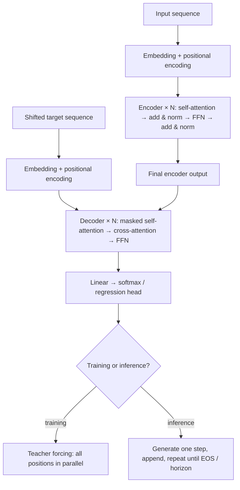

# 11. Transformers and Temporal Applications

[Chapter 8](08_rnn_lstm_gru_and_seq2seq.md) ended with attention as a patch on top of an RNN encoder–decoder. The transformer (Vaswani et al., 2017, "Attention Is All You Need") removes the recurrence and builds the whole model from attention plus position-wise feed-forward layers. There are two reasons:

- **long-range dependencies:** in an RNN, information from step 1 reaches step 500 through 499 multiplications (Chapter 8, §4). In self-attention, any two positions are connected directly, in one layer;
- **parallelism:** an RNN must compute $\mathbf h_{t-1}$ before $\mathbf h_t$. Attention computes all positions of a layer at once, which suits GPUs.

```text
RNN:          information moves step by step through a hidden state
Transformer:  every element attends directly to every relevant element, in one layer
```

The price is $O(T^2)$ cost in sequence length, which matters a lot for long time series (§8).

## 1. The architecture


*Encoder stack (left) and decoder stack (right). Every decoder block cross-attends to the output of the final encoder block.*

- The **encoder** maps the embedded input $X=(\mathbf x_1,\ldots,\mathbf x_T)$ to representations $Z=(\mathbf z_1,\ldots,\mathbf z_T)$ through $N$ identical blocks ($N=6$ in the original). Each block has **multi-head self-attention** and a **position-wise feed-forward network**, each wrapped in a residual connection and layer normalization.
- The **decoder** produces $R=(\mathbf r_1,\ldots,\mathbf r_{T'})$ through $N$ blocks of **masked self-attention**, **cross-attention** to the encoder output, and a feed-forward network, again each with residual + norm. A final linear layer and softmax give output probabilities.

Every decoder block receives the **final** encoder output, not the output of the encoder block at the same depth.

## 2. Self-attention

Each element $\mathbf x_i$ gets three learned projections:

```math
\mathbf q_i=W_Q\mathbf x_i,\qquad\mathbf k_i=W_K\mathbf x_i,\qquad\mathbf v_i=W_V\mathbf x_i,\qquad d_q=d_k .
```

Think of it as information retrieval:

- **query:** what position $i$ is looking for;
- **key:** what each position $j$ advertises about itself;
- **value:** the content $j$ hands over if it's attended to.

Score every key against the query, normalize with softmax, and average the values:

```math
s_{ij}=\frac{\mathbf q_i^\top\mathbf k_j}{\sqrt{d_k}},\qquad
w_{ij}=\frac{\exp s_{ij}}{\sum_{\ell=1}^T\exp s_{i\ell}},\qquad
\mathbf z_i=\sum_{j=1}^Tw_{ij}\mathbf v_j .
```

For each query the weights are non-negative and sum to 1, so $\mathbf z_i$ is a **convex combination of values**: a content-dependent weighted average over the whole sequence. In matrix form, $Z=\mathrm{softmax}(QK^\top/\sqrt{d_k})\,V$.

**Why divide by $\sqrt{d_k}$?** If the components of $\mathbf q$ and $\mathbf k$ are independent with mean 0 and variance 1, then $\mathbf q^\top\mathbf k$ has variance $d_k$. At $d_k=512$ raw scores have standard deviation about 23, so softmax saturates to one-hot and its gradients vanish. Dividing by $\sqrt{d_k}$ brings the standard deviation back to 1 (I checked this numerically: 22.6 before scaling, 1.0 after).

```python
import numpy as np

def attention(Q, K, V, causal=False):
    d_k = Q.shape[-1]
    S = Q @ K.T / np.sqrt(d_k)                      # (T_q, T_k) scaled scores
    if causal:                                      # position i may see j <= i only
        S = np.where(np.tril(np.ones_like(S)) == 1, S, -np.inf)
    W = np.exp(S - S.max(axis=1, keepdims=True))
    W /= W.sum(axis=1, keepdims=True)               # softmax over keys: rows sum to 1
    return W @ V, W

rng = np.random.default_rng(0)
T, d_model, d_k = 5, 16, 8
X = rng.normal(size=(T, d_model))
W_Q, W_K, W_V = (rng.normal(size=(d_model, d_k)) / np.sqrt(d_model) for _ in range(3))
Z, W = attention(X @ W_Q, X @ W_K, X @ W_V, causal=True)
print(Z.shape, W.sum(axis=1).round(6), np.triu(W, 1).max())   # (5, 8) [1. 1. 1. 1. 1.] 0.0
```

**Example.** In "The animal didn't cross the street because it was too tired," a trained model's attention from **it** puts high weight on **animal** and less on **street**. Change "tired" to "wide" and the weight shifts to **street**. The same weights $W_Q,W_K$ produce different attention patterns depending on content.

## 3. Multi-head attention

One set of $W_Q,W_K,W_V$ gives one notion of relevance. With $H$ heads, each with its own projections into a smaller space ($d_k=d_v=d_{\text{model}}/H$), attention runs in parallel:

```math
\boldsymbol\zeta_i^{(h)}=\sum_jw_{ij}^{(h)}\mathbf v_j^{(h)},\qquad
w_{ij}^{(h)}=\mathrm{softmax}_j\!\left(\frac{\mathbf q_i^{(h)\top}\mathbf k_j^{(h)}}{\sqrt{d_k}}\right),\qquad
\mathbf z_i=W_O\,\mathrm{Concat}\big(\boldsymbol\zeta_i^{(1)},\ldots,\boldsymbol\zeta_i^{(H)}\big).
```

The original model used $d_{\text{model}}=512$ and $H=8$, so $d_k=64$. Splitting keeps the total cost about the same as one full-width head. $W_O\in\mathbb R^{d_{\text{model}}\times Hd_v}$ mixes the heads back to $d_{\text{model}}$. All of $W_Q^{(h)},W_K^{(h)},W_V^{(h)},W_O$ are learned. Different heads tend to specialize (one tracks the previous token, one links pronouns to nouns, one follows syntax), though they aren't forced to.


*Left: attention from "it" in the example sentence. Right: $H$ parallel query/key/value projections, concatenated and projected by $W_O$.*

**Weight sharing.** $W_Q,W_K,W_V$ are the same for every position in a sequence (like a convolution filter, or an RNN's weights shared over time) but differ between heads and layers. That's why one model handles any length $T$.

## 4. Feed-forward, residuals and normalization

After attention, every position goes through the same two-layer MLP independently:

```math
\mathrm{FFN}(\mathbf x)=W_2\,\mathrm{ReLU}(W_1\mathbf x+\mathbf b_1)+\mathbf b_2,\qquad d_{\text{model}}=512,\;d_{\text{ff}}=2048 .
```

**Attention mixes information across positions; the FFN transforms each position on its own.** Per encoder layer that's about $4d^2\approx1.05$M attention parameters and $2d\,d_{\text{ff}}\approx2.10$M FFN parameters, so most of the weights are in the FFN.

Each sublayer is wrapped as

```math
\mathbf x\leftarrow\mathrm{LayerNorm}\big(\mathbf x+\mathrm{Sublayer}(\mathbf x)\big)
```

("post-LN", as in the original). Most modern models use **pre-LN**, $\mathbf x+\mathrm{Sublayer}(\mathrm{LayerNorm}(\mathbf x))$, which trains more stably in deep stacks without a learning-rate warm-up.


*A residual block outputs $\mathcal F(\mathbf x)+\mathbf x$.*

**Why residuals?** He et al. (2016) argued it's easier to learn a *correction* $\mathcal F(\mathbf x)=\mathcal H(\mathbf x)-\mathbf x$ than the full mapping $\mathcal H$. If the best thing a layer can do is nothing, it only has to push $\mathcal F$ to zero. The identity path also carries information and gradients unchanged through dozens of layers, the same role the LSTM cell line plays across time.

## 5. The decoder

Each decoder block has three sublayers:

1. **Masked self-attention** over the decoder's own sequence. Position $i$ may attend to positions $\le i$ only. Scores for $j>i$ are set to $-\infty$ before the softmax, so their weights are exactly 0.
2. **Cross-attention** (encoder–decoder attention): **queries from the decoder**, **keys and values from the final encoder output**. This is Bahdanau attention (Chapter 8, §8) without the RNN. Each output step looks at the input positions it needs.
3. **Feed-forward network**, as in the encoder.


*Masked self-attention, cross-attention to the encoder and autoregressive generation.*

| Layer | Queries | Keys / values | Can see |
|---|---|---|---|
| encoder self-attention | encoder positions | encoder positions | the whole input |
| decoder masked self-attention | decoder positions | decoder positions $\le i$ | only the past outputs |
| cross-attention | decoder positions | final encoder output | the whole input |

**Output.** A linear layer maps each $\mathbf r_j$ to $V$ logits (the vocabulary size) and a softmax gives $P(y_j\mid y_{<j},X)$. For multivariate forecasting the output layer instead has one unit per target variable (or per distribution parameter), with no softmax.

**Shifted inputs and indexing.** The decoder input is the target sequence **shifted right** by one, with $\langle\mathrm{BOS}\rangle$ prepended: $(\langle\mathrm{BOS}\rangle,y_1,\ldots,y_{T'-1})$. Position $j$ reads $y_{<j}$ and predicts $y_j$. The mask lets position $j$ see its own input (which is $y_{j-1}$) but nothing later.

### Training vs inference

| | Training (teacher forcing) | Inference (autoregressive) |
|---|---|---|
| decoder input | the true target sequence, shifted | the model's own previous outputs |
| positions | all computed **in parallel**, the mask enforces causality | generated **one at a time** until $\langle\mathrm{EOS}\rangle$ |
| risk | never sees its own mistakes during training | errors compound (exposure bias) |

Teacher forcing makes training fast and stable. Its downside is that train–test mismatch, which scheduled sampling or sequence-level fine-tuning can reduce. At inference, a **KV cache** stores the keys and values of already-generated positions, so each new step only computes one new query row instead of re-running the whole prefix.

## 6. Embeddings and positional encoding

**Embeddings.** Tokens map to $d_{\text{model}}=512$ vectors through a learned $V\times512$ matrix (the original used a shared byte-pair vocabulary of about 37K tokens for English–German and a 32K word-piece vocabulary for English–French). The same matrix was **tied** across the encoder input, the decoder input and the pre-softmax output layer. For time series, the "embedding" is usually a linear layer applied to each time step's feature vector, or to a patch of steps.

**Position.** Attention is **permutation-equivariant**: shuffle the inputs and the outputs shuffle the same way. On its own it has no idea of order. A positional encoding with the same shape as the embeddings is **added** to them. The original used fixed sinusoids,

```math
\mathrm{PE}(pos,2i)=\sin\!\big(pos/10000^{2i/d_{\text{model}}}\big),\qquad
\mathrm{PE}(pos,2i+1)=\cos\!\big(pos/10000^{2i/d_{\text{model}}}\big),
```

a bank of frequencies from fast to slow. A fixed offset $k$ becomes a linear transformation of the encoding, so relative positions are easy to learn. Alternatives: **learned** position embeddings, **relative** or rotary encodings (RoPE), and for time series **timestamp encodings** (hour-of-day, day-of-week, holiday flags) that carry calendar meaning.

## 7. BERT

**BERT** (Devlin et al., 2019) is an **encoder-only** transformer pretrained on unlabeled text, then fine-tuned. It reads the whole sentence at once, so each word's representation uses context on **both** sides. Pretraining had two tasks:

1. **Masked language modeling:** select 15% of tokens and predict them. Of the selected tokens, 80% are replaced by `[MASK]`, 10% by a random token and 10% left unchanged, so the model can't rely on seeing `[MASK]`, which never appears at fine-tuning time.
2. **Next-sentence prediction:** does sentence B actually follow sentence A?

Later work (RoBERTa, 2019) found next-sentence prediction adds little and dropped it. The idea that stayed is **pretrain with a self-supervised task, then fine-tune**, the same pattern as contrastive pretraining in [Chapter 10](10_representation_learning.md). GPT-style models are the other branch: **decoder-only** with causal masking, trained to predict the next token.

## 8. Transformers for time series


*Time-series transformers vary by positional encoding, attention module and architecture, and are applied to forecasting, anomaly detection and classification.*

Surveys such as Wen et al.'s "Transformers in Time Series" organize the field along two axes:

- **network modifications:** positional encoding (vanilla, learnable, timestamp), the attention module (sparse, low-rank, frequency-domain), and architecture-level changes (hierarchical, patching);
- **applications:** forecasting (univariate, spatio-temporal, event), anomaly detection, classification.

Two problems drive most of the modifications:

- **Cost.** Full attention is $O(T^2)$ in time and memory. A year of hourly data is $T=8{,}760$, so $\sim7.7\times10^7$ scores per head per layer. **Low-rank** attention (Linformer projects keys and values to $k\ll T$ rows) and **sparse** attention (Informer's ProbSparse, $O(T\log T)$) cut this down.
- **Multiple time scales.** **Hierarchical / multiresolution** designs (Pyraformer's pyramidal attention; Autoformer and FEDformer's trend–seasonal decomposition) process the series at several resolutions. It's the same idea as the wavelet pyramid in [Chapter 4](04_wavelets.md) and the growing receptive field of a [TCN](09_temporal_convolutional_networks.md). **Patching** (PatchTST) treats a window of, say, 16 steps as one token, which cuts $T$ by 16× and gives each token local context.

> [!WARNING]
> **Check the simple baseline first**
>
> Zeng et al. (2023), "Are Transformers Effective for Time Series Forecasting?", showed that a one-layer linear model on a trend/remainder decomposition (DLinear) matched or beat several specialized forecasting transformers on standard long-horizon benchmarks. Permutation-equivariant attention can lose the ordering information that matters most in forecasting. Always compare against ARIMA/ETS ([Chapters 2–3](02_classical_time_series_models.md)), a linear model and a TCN before claiming a transformer helps.

## 9. The whole pipeline



| | RNN / LSTM / GRU | TCN | Transformer |
|---|---|---|---|
| how time enters | recurrent state | causal convolution | attention + positional encoding |
| path length between two steps | $O(T)$ | $O(\log T)$ with dilation | $O(1)$ |
| parallel over positions | no | yes | yes |
| cost per layer | $O(Td^2)$ | $O(Tkd^2)$ | $O(T^2d+Td^2)$ |
| data appetite | moderate | moderate | high |

## 10. Common confusions

- **Self- vs cross-attention:** same-sequence Q/K/V vs decoder queries against encoder keys/values.
- **Attention weight vs value:** a scalar coefficient vs the vector being averaged.
- **Masking vs positional encoding:** "what may I look at" vs "where am I".
- **Heads vs layers:** heads run in parallel inside one layer; layers are stacked.
- **Parallel training vs sequential generation:** teacher forcing parallelizes; inference doesn't.
- **Attention vs FFN:** mixes across positions vs transforms each position.
- **BERT vs the original transformer:** encoder-only and bidirectional vs a full encoder–decoder for translation.

## 11. Questions and answers

<details><summary>Encoder-only, decoder-only or encoder–decoder for forecasting?</summary>

Encoder-only with a linear head that outputs all $H$ steps at once (PatchTST-style) is the simplest and currently strong. Encoder–decoder fits when future-known covariates should feed the decoder. Decoder-only (GPT-style) suits foundation models that forecast by continuing the sequence.
</details>

<details><summary>What value is used for masked positions?</summary>

$-\infty$ (in practice a large negative number like $-10^9$, or the dtype's minimum) added to the scores before the softmax, so $e^{-\infty}=0$. Using 0 instead would not mask anything.
</details>

<details><summary>How do transformers handle missing values and irregular timestamps?</summary>

Add a mask channel (observed or not) to the input and use continuous-time encodings of the actual timestamps instead of integer positions. Attention doesn't need equally spaced inputs, which is one real advantage over RNNs and TCNs here.
</details>

<details><summary>Post-LN or pre-LN?</summary>

Pre-LN is the default for deep models because it trains without careful warm-up. Post-LN can reach slightly better final quality when it trains stably.
</details>

<details><summary>How do I choose which efficient attention to use?</summary>

First ask whether you need long raw context at all. Patching or downsampling often solves the length problem. If you do, use sparse or local attention for local structure, low-rank when the attention matrix is smooth, and FlashAttention (exact, memory-efficient) when $T$ is in the low thousands.
</details>

---

[← Previous: Representation Learning](10_representation_learning.md) · [Course map](../course_map.md) · [Next: Derivations Appendix →](12_handwritten_appendix.md)
