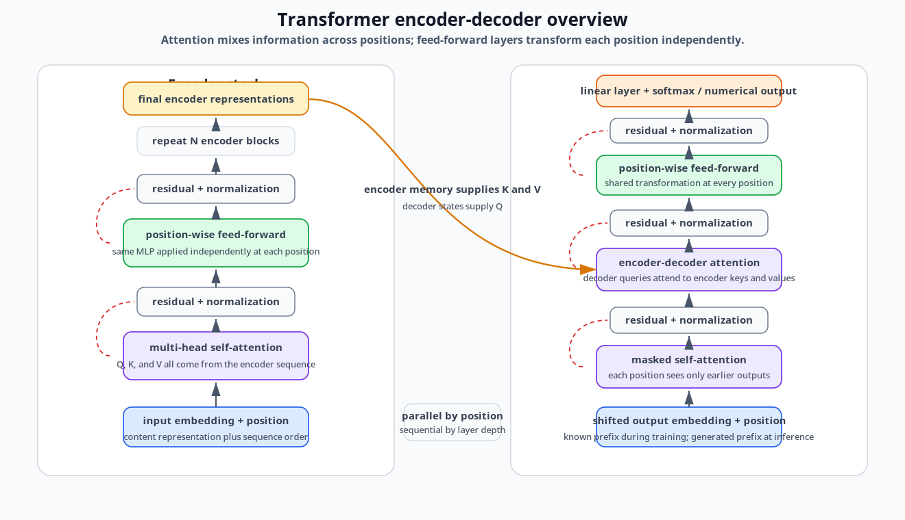
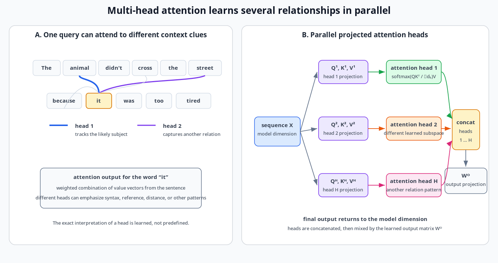
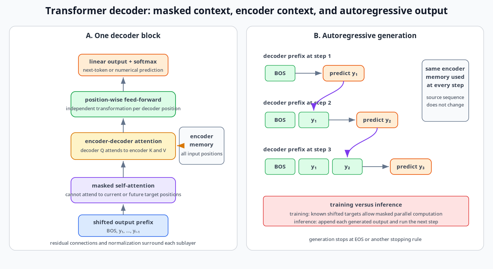
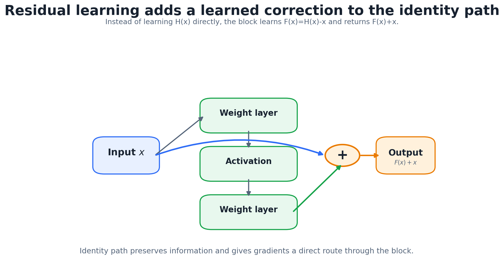
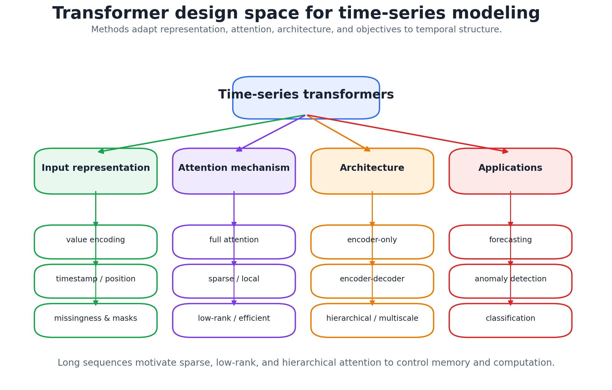
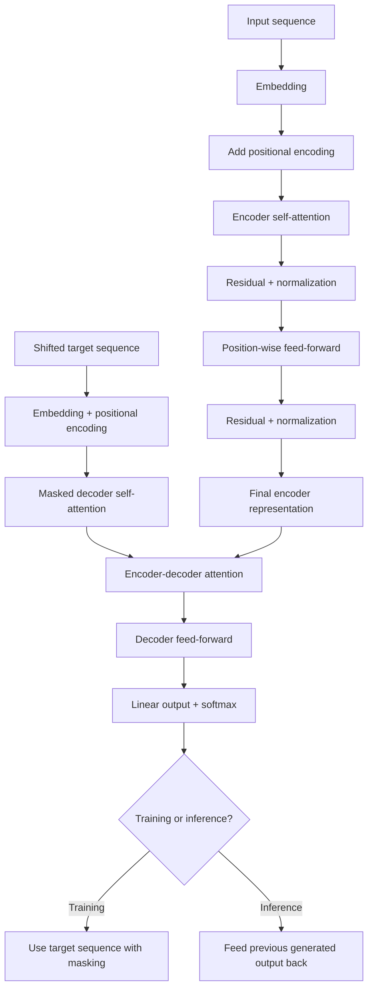

# Transformers and Temporal Applications

## 1. Chapter overview

This chapter introduces the transformer as a sequence model built around
attention rather than recurrent hidden-state updates.

The course emphasizes:

- encoder and decoder stacks;
- self-attention;
- query, key, and value transformations;
- scaled dot-product attention;
- multi-head attention;
- feed-forward sublayers;
- masked decoder attention;
- encoder-decoder attention;
- autoregressive decoding;
- embeddings and positional encoding;
- residual connections and normalization;
- parallel training;
- teacher forcing;
- BERT and time-series adaptations.

The central design shift is:

```text
RNN:
information moves sequentially through hidden states

Transformer:
every sequence element can attend directly to other relevant elements
within one attention layer
```

**Sources:** CSE598MTL.pdf, pp. 92-100

---

## 2. Learning objectives

After this chapter, the reader should be able to:

1. explain why transformers were designed for ordered sequence data;
2. describe the encoder-decoder transformer stack;
3. distinguish self-attention from encoder-decoder attention;
4. define query, key, and value vectors;
5. write scaled dot-product attention;
6. explain why softmax attention weights sum to one;
7. describe multi-head attention;
8. explain the role of the output projection $W_O$;
9. write the transformer feed-forward network;
10. describe the encoder block;
11. explain masked decoder self-attention;
12. explain decoder cross-attention to encoder outputs;
13. describe autoregressive decoder operation using start- and end-of-sequence tokens;
14. distinguish training mode from test/inference mode;
15. explain teacher forcing as presented on page 98;
16. describe token embeddings and positional encoding;
17. explain residual and normalization sublayers;
18. summarize BERT pretraining at the level presented in the notes;
19. identify common transformer modifications for time-series data;
20. explain why low-rank and hierarchical attention are considered for long temporal sequences.

**Sources:** CSE598MTL.pdf, pp. 92-100

---

## 3. Why transformers?

The introduction states that transformers were originally designed for
sequential data, especially sequence-to-sequence models.

Sequences are ordered lists of elements, such as tokens in natural
language processing.

The page gives several motivations:

- improve limitations of RNN and LSTM models;
- address long-term dependencies;
- allow non-parallel training limitations of recurrent models to be reduced;
- support performance across sequential tasks;
- provide relatively new opportunities for simplification, reduced
  computation, and improved performance.

A handwritten note beside the page says long-range information may not
propagate well through many recurrent steps.

**Source:** CSE598MTL.pdf, p. 92

---

## 4. Transformer stack

The transformer contains multiple encoder and decoder blocks, with the
page giving an example of six blocks each.

The final encoder output becomes input information available to the
decoder stack.

Each encoder contains:

- a multi-head self-attention layer;
- a feed-forward layer;
- support layers such as residual connections and normalization.

For an input sequence:

```math
X=(x_1,x_2,\ldots,x_T),
```

each element is embedded as:

```math
\mathbf{x}_i.
```

The encoder transforms:

```math
X
\longrightarrow
Z=(z_1,z_2,\ldots,z_T).
```

The decoder transforms the encoder representation into an output
sequence:

```math
R=(r_1,r_2,\ldots,r_{T'}).
```

The page states that computations within a layer can be completed in
parallel.

**Source:** CSE598MTL.pdf, p. 92

---

## 5. Encoder-decoder information flow

The stack diagram shows:

- an input sequence entering the bottom encoder;
- encoder outputs flowing upward through the encoder stack;
- the final encoder block supplying information to all decoder blocks;
- decoder outputs generated sequentially.

```text
Input embeddings
    -> encoder 1
    -> encoder 2
    -> ...
    -> final encoder representation

Shifted output embeddings
    -> decoder 1
    -> decoder 2
    -> ...
    -> output probabilities
```

The handwritten note indicates that decoder blocks receive information
from the final encoder output, not only from the corresponding encoder
depth.

**Source:** CSE598MTL.pdf, p. 92

---

## 6. Transformer architecture


*Redrawn course diagram — Simplified transformer encoder-decoder stack with self-attention, masked attention, cross-attention, feed-forward layers, and residual normalization.*


The architecture includes:

### Encoder side

- input embedding;
- positional encoding;
- multi-head self-attention;
- add and normalize;
- feed-forward network;
- add and normalize;
- repeated $N$ times.

### Decoder side

- shifted output embedding;
- positional encoding;
- masked multi-head self-attention;
- add and normalize;
- encoder-decoder multi-head attention;
- add and normalize;
- feed-forward network;
- add and normalize;
- repeated $N$ times;
- linear output layer;
- softmax probabilities.

The page cites the original “Attention Is All You Need” architecture.

**Source:** CSE598MTL.pdf, p. 93

---

## 7. Self-attention

For every sequence element, self-attention learns which other elements in
the sequence are most relevant.

For each transformed sequence element $\mathbf{x}_i$, construct:

- query:

```math
\mathbf{q}_i;
```

- key:

```math
\mathbf{k}_i;
```

- value:

```math
\mathbf{v}_i.
```

The page states that these have dimensions:

```math
d_q,\ d_k,\ d_v,
```

with the common setup:

```math
d_q=d_k.
```

**Source:** CSE598MTL.pdf, p. 93

---

## 8. Query, key, and value transformations

For one attention head:

```math
\mathbf{q}_i=W_Q\mathbf{x}_i,
```

```math
\mathbf{k}_i=W_K\mathbf{x}_i,
```

```math
\mathbf{v}_i=W_V\mathbf{x}_i.
```

The matrices:

```math
W_Q,\ W_K,\ W_V
```

are learned.

The handwritten interpretation uses an information-retrieval analogy:

```text
query:
what the current element is looking for

key:
what each candidate element offers or identifies

value:
the information retrieved if that candidate receives attention
```

This is an explanatory analogy rather than a separate equation.

**Sources:** CSE598MTL.pdf, pp. 93-95

---

## 9. Scaled dot-product similarity

The similarity between query $\mathbf{q}_i$ and key
$\mathbf{k}_j$ is:

```math
s_{ij}
=
\frac{
\mathbf{q}_i^\top\mathbf{k}_j
}{
\sqrt{d_k}
}.
```

The page explains that the square-root scaling normalizes the magnitude
of the dot product.

The handwritten notes connect a larger query-key dot product with a
stronger attention relationship.

**Source:** CSE598MTL.pdf, p. 93

---

## 10. Attention weights

Apply softmax over the candidate keys:

```math
w_{ij}
=
\frac{
\exp(s_{ij})
}{
\sum_{\ell=1}^{T}
\exp(s_{i\ell})
}.
```

Equivalently, the page writes:

```math
w_{ij}
=
\mathrm{softmax}
\left(
\frac{
\mathbf{q}_i^\top\mathbf{k}_j
}{
\sqrt{d_k}
}
\right),
\qquad
j=1,\ldots,T.
```

For one query $i$:

```math
w_{ij}\geq0,
```

and:

```math
\sum_{j=1}^{T}w_{ij}=1.
```

The weights therefore form a normalized distribution over sequence
elements.

**Source:** CSE598MTL.pdf, p. 93

---

## 11. Attention output

The hidden output for sequence element $i$ is the weighted average of
the value vectors:

```math
\mathbf{z}_i
=
\sum_{j=1}^{T}
w_{ij}\mathbf{v}_j.
```

The page describes $\mathbf{z}_i$ as the similarity-weighted average of
the values.

Each output representation can therefore combine information from
multiple sequence positions.

The attention score for every sequence element can be calculated in
parallel.

**Source:** CSE598MTL.pdf, p. 93

---

## 12. Attention interpretation example

Page 94 displays the phrase:

```text
The animal didn't cross the street because it was too tired.
```

Attention lines connect the word **it** with earlier words such as:

- animal;
- street.

The page uses this example to illustrate that attention can identify which
earlier element is relevant to the current word.

The handwritten interpretation says different attention heads may focus
on different linguistic relationships.


*Redrawn course diagram — Sentence-level attention interpretation and parallel multi-head query-key-value projections.*


**Source:** CSE598MTL.pdf, p. 94

---

## 13. Why multiple heads?

A single set of query, key, and value matrices may not capture every
important relationship.

The page therefore constructs:

```math
H
```

different attention heads.

For head $h$:

```math
\mathbf{q}_i^{(h)}
=
W_Q^{(h)}\mathbf{x}_i,
```

```math
\mathbf{k}_i^{(h)}
=
W_K^{(h)}\mathbf{x}_i,
```

```math
\mathbf{v}_i^{(h)}
=
W_V^{(h)}\mathbf{x}_i.
```

Each head can learn a different representation subspace or relationship.

The page gives a typical example:

```math
H=8.
```

**Source:** CSE598MTL.pdf, p. 94

---

## 14. Per-head attention

For head $h$, compute:

```math
w_{ij}^{(h)}
=
\mathrm{softmax}
\left(
\frac{
\left(\mathbf{q}_i^{(h)}\right)^\top
\mathbf{k}_j^{(h)}
}{
\sqrt{d_k}
}
\right).
```

Then:

```math
\boldsymbol{\zeta}_i^{(h)}
=
\sum_{j=1}^{T}
w_{ij}^{(h)}
\mathbf{v}_j^{(h)}.
```

The page uses $\boldsymbol{\zeta}$ or a similar symbol for the per-head
result.

### Notation review

The page alternates among:

- $d_q,d_k,d_v$;
- $d_{q/h}$-style per-head dimensions;
- $d_{\text{model}}/H$.

The conceptual point is clear: each head uses a lower-dimensional query,
key, and value space, and the head results are concatenated. The exact
symbol convention should be standardized before implementation.

**Source:** CSE598MTL.pdf, p. 94

---

## 15. Concatenation and output projection

Concatenate the outputs of all heads:

```math
\boldsymbol{\zeta}_i
=
\mathrm{Concat}
\left(
\boldsymbol{\zeta}_i^{(1)},
\boldsymbol{\zeta}_i^{(2)},
\ldots,
\boldsymbol{\zeta}_i^{(H)}
\right).
```

Apply an output matrix:

```math
\mathbf{z}_i
=
W_O
\boldsymbol{\zeta}_i.
```

The output is returned to the model dimension:

```math
d_{\text{model}},
```

with the page giving:

```math
d_{\text{model}}=512
```

as the original transformer example.

The page emphasizes that:

```math
W_Q^{(h)},W_K^{(h)},W_V^{(h)},W_O
```

are all trained.

**Sources:** CSE598MTL.pdf, pp. 94-95

---

## 16. Matrix form of multi-head attention

The diagram on page 95 shows:

```text
Q -> linear projection
K -> linear projection
V -> linear projection
       |
scaled dot-product attention
       |
multiple heads
       |
concatenate
       |
linear output projection
```

The handwritten notes emphasize that:

- every word or time point obtains query, key, and value vectors;
- each query compares against all keys;
- the weighted values form a new representation;
- query and key dimensions must be compatible.

**Source:** CSE598MTL.pdf, p. 95

---

## 17. Weight sharing through sequence positions

The page states that the transformation matrices:

```math
W_Q,\ W_K,\ W_V
```

are the same for all sequence elements.

Their values are shared through the sequence but trained separately by
layer and head.

Similarly, the feed-forward layer uses the same transformation for all
sequence positions within one block.

This gives:

- position-wise shared computation;
- different trained weights across layers.

**Source:** CSE598MTL.pdf, p. 95

---

## 18. Feed-forward layer

After multi-head attention, each encoder position is sent through a
position-wise feed-forward network.

The page gives:

```math
\mathrm{FFN}(\mathbf{x})
=
W_2
\mathrm{ReLU}
\left(
W_1\mathbf{x}+\mathbf{b}_1
\right)
+
\mathbf{b}_2.
```

For the original transformer example:

```math
d_{\text{model}}=512,
```

and the hidden feed-forward dimension is:

```math
d_{\text{ff}}=2048.
```

The same feed-forward transformation is applied independently to every
sequence element.

Each output is then sent to the next encoder block.

**Source:** CSE598MTL.pdf, p. 95

---

## 19. Encoder block

An encoder block consists conceptually of:

```text
input representations
    -> multi-head self-attention
    -> residual + normalization
    -> position-wise feed-forward
    -> residual + normalization
    -> next encoder block
```

The page's diagram shows the model dimension remaining:

```math
d_{\text{model}}=512
```

across the block.

The attention operation mixes information across sequence positions.
The feed-forward layer transforms each position independently.

**Source:** CSE598MTL.pdf, p. 95

---

## 20. Decoder overview

Decoder operation is described as similar to the encoder, but each decoder
block contains:

1. masked multi-head self-attention;
2. multi-head attention over encoder outputs;
3. feed-forward layer.

The masked self-attention attends only to previous decoder outputs.

The encoder-decoder attention attends to the final encoder-stack outputs.


*Redrawn course diagram — Transformer decoder block with masked self-attention, encoder-decoder attention, and autoregressive generation.*


**Source:** CSE598MTL.pdf, p. 96

---

## 21. Autoregressive decoder operation

All decoder blocks receive information from the final encoder block.

The decoder begins with:

- information from the last encoder block;
- a beginning-of-sequence token, written approximately as:

```math
\langle BOS\rangle.
```

For each output element $i$, the previous decoder output:

```math
\hat{y}_{i-1}
```

is input to the bottom decoder layer.

The decoder continues until an end-of-sequence token:

```math
\langle EOS\rangle
```

is produced.

The page's translation example uses:

```text
Estoy
Cansada/o
```

as decoder outputs.

**Source:** CSE598MTL.pdf, p. 96

---

## 22. Masked decoder self-attention

To estimate output step $i$, the decoder's masked attention uses only:

```math
\hat{y}_1,\hat{y}_2,\ldots,\hat{y}_{i-1}.
```

Future target positions are masked.

The page states that query, key, and value transformations are constructed
from the available decoder sequence, similarly to encoder self-attention.

### Purpose of masking

```text
training:
prevent target token i from attending to itself or later target tokens

inference:
later tokens do not yet exist
```

The slide says train/test operation differences are postponed to the next
section.

**Source:** CSE598MTL.pdf, p. 96

---

## 23. Encoder-decoder attention

The decoder contains a second multi-head attention layer.

For decoder block $b$:

- queries come from the masked decoder self-attention output;
- keys and values come from the final encoder block.

The page writes a form such as:

```math
\mathbf{q}_i^{(h)}
=
W_Q^{(h)}
\mathbf{z}_i^{(\text{decoder})},
```

```math
\mathbf{k}_j^{(h)}
=
W_K^{(h)}
\mathbf{r}_j^{(\text{encoder})},
```

```math
\mathbf{v}_j^{(h)}
=
W_V^{(h)}
\mathbf{r}_j^{(\text{encoder})}.
```

The exact superscripts vary on the page, but the source relationship is
clear:

```text
decoder query
    attends to
encoder keys and values
```

This lets each decoder output focus on important encoder positions.

**Source:** CSE598MTL.pdf, p. 97

---

## 24. Decoder feed-forward layer

After encoder-decoder attention, the decoder applies a feed-forward
network similar to the encoder's position-wise layer.

Each decoder element is transformed independently with shared weights
within that block.

The page describes the sequence of representations as:

```text
masked self-attention output
    -> encoder-decoder attention output
    -> feed-forward output
    -> next decoder block
```

Operations inside one layer can be computed in parallel across currently
available positions.

**Source:** CSE598MTL.pdf, p. 97

---

## 25. Decoder output block

The final decoder representation is transformed with an element-wise
linear layer:

```math
\mathbf{o}_j
=
W_O\mathbf{r}_j+\mathbf{b}_O.
```

The output dimension depends on the application.

For NLP, it is often:

```math
V,
```

the vocabulary size.

Apply softmax to obtain probabilities over output tokens.

The predicted token is:

```math
\hat{y}_j
=
\mathrm{arg\,max}
\left[
\mathrm{softmax}(\mathbf{o}_{j-1})
\right]
```

in the slide's indexing.

### Indexing review

The page's $\mathbf{o}_{j-1}$ indexing reflects prediction from previous
decoder information, but the exact output-position convention should be
checked when implementing.

For multivariate time series, the output dimension can instead equal the
number of target attributes.

**Source:** CSE598MTL.pdf, p. 97

---

## 26. Original transformer embeddings

The original NLP transformer used element-wise input dimensions of:

```math
512.
```

The page gives vocabulary sizes such as:

```math
V=32K
```

and:

```math
V=37K.
```

Embedding matrices transform:

- source tokens;
- target tokens;
- decoder output tokens.

The learned embedding matrices have dimensions approximately:

```math
512\times V.
```

The page states that tied embeddings were used, sharing these matrices.

The feed-forward hidden layer uses dimension:

```math
2048.
```

**Source:** CSE598MTL.pdf, p. 98

---

## 27. Parallel computation

The page states:

- encoder positions are computed in parallel within a layer;
- encoder layers execute sequentially by depth;
- decoder positions can be computed in parallel during training when the
  complete target sequence is known and masked appropriately;
- decoder layers execute sequentially by depth.

A pasted TensorFlow note adds an inference optimization:

- a model can produce next-token distributions for all positions in one
  pass;
- during inference, only the last prediction is needed for the next
  generated token;
- calculating only the final prediction can reduce redundant inference
  computation.

This is preserved as pasted implementation commentary.

**Source:** CSE598MTL.pdf, p. 98

---

## 28. Training mode and teacher forcing

The page distinguishes test mode from training mode.

### Test mode

The decoder output from step:

```math
j-1
```

is used as the input at step:

```math
j.
```

Generation is sequential.

### Training mode

The target sequence, not the model-generated output sequence, is input to
the decoder.

Because the target values are known:

- masked attention prevents use of later target positions;
- decoder calculations within one layer can be parallelized.

The page calls the use of the target sequence:

> teacher forcing.

A handwritten note adds:

> with some pluses and minuses.

The source does not enumerate those advantages and disadvantages here.

**Source:** CSE598MTL.pdf, p. 98

---

## 29. Positional encoding

Attention alone does not inherently encode sequence order.

The page states that positional encoding represents the order of sequence
elements.

For input sequence:

```math
x_1,\ldots,x_T,
```

with embedding matrix:

```math
X,
```

a positional-encoding matrix of the same shape is added.

The combined input is then normalized and passed through residual-style
layers.

The page notes that:

- positional encodings may be fixed;
- positional encodings may be learned.

### Handwritten interpretation

The handwriting says positional encodings put positions into the same
embedding dimension and add them to the token or time-point embedding.

**Source:** CSE598MTL.pdf, p. 99

---

## 30. Residual and normalization layers

The original transformer used residual sublayers described on the page as:

```math
\mathrm{LayerNorm}
\left(
\mathbf{x}
+
\mathrm{Sublayer}(\mathbf{x})
\right).
```

The page states:

- sublayer $\mathbf{x}$ is the output of the multi-head attention or
  feed-forward sublayer;
- the residual adds the original mapping;
- the result is normalized.

The residual-learning illustration motivates learning:

```math
\mathcal{F}(\mathbf{x})
```

and returning:

```math
\mathcal{F}(\mathbf{x})+\mathbf{x}.
```


*Redrawn course diagram — A residual block adds the learned correction $F(x)$ to the identity path $x$.*

**Source:** CSE598MTL.pdf, p. 99

---

## 31. Residual-learning interpretation

The page quotes the residual-learning hypothesis:

> It is easier to optimize the residual mapping than the original
> unreferenced mapping.

If the optimal mapping were the identity, setting the residual to zero
would leave:

```math
\mathbf{x}.
```

The handwritten note asks whether residual connections help carry
important information into deeper layers.

The course presents this as the intuition for residual sublayers in the
transformer.

**Source:** CSE598MTL.pdf, p. 99

---

## 32. NLP applications

The page states that the best-known transformer applications are in NLP.

It introduces:

> Bidirectional Encoder Representations from Transformers (BERT).

The page describes BERT pretraining with two tasks:

1. randomly mask approximately:

```math
15\%
```

of tokens and predict the masked token;
2. predict whether one sentence is likely to follow another.

It also states that BERT learns words in context and can be refined for a
language or domain.

### Scope caveat

This chapter preserves the course's description of the original BERT
pretraining setup. It does not use outside material to discuss later BERT
variants that omit next-sentence prediction.

**Source:** CSE598MTL.pdf, p. 100

---

## 33. Transformers in time series

The page reproduces a taxonomy of time-series transformer research.

The taxonomy organizes work by:

### Network modifications

- positional encoding;
- attention module;
- architecture level.

Examples shown include:

- vanilla encoding;
- learnable encoding;
- timestamp encoding;
- sparse or modified attention;
- structural architecture changes.

### Application domains

- forecasting;
- anomaly detection;
- classification.

The application branch further includes examples such as:

- time-series forecasting;
- spatial-temporal forecasting;
- event forecasting.


*Redrawn course diagram — Time-series transformers vary in representation, attention, architecture, and application.*

**Source:** CSE598MTL.pdf, p. 100

---

## 34. Time-series architecture modifications

The page says recent research modifies the original transformer for time
series.

Two specific directions are highlighted.

### 34.1 Low-rank attention approximation

Approximate attention matrices with lower-rank structure.

The motivation is especially relevant for long time series, where a full
attention matrix grows quadratically with sequence length.

The handwritten note says this is intended for large time-series lengths.

### 34.2 Hierarchical multiresolution architecture

Use hierarchical structures to model multiple temporal resolutions.

The handwritten note compares this idea with temporal convolutional
networks and wavelets.

This connects transformer adaptation to earlier course topics:

- wavelet multiresolution;
- TCN receptive-field hierarchy.

**Source:** CSE598MTL.pdf, p. 100

---

## 35. End-to-end transformer workflow



This diagram is synthesized from pages 92-99.

**Sources:** CSE598MTL.pdf, pp. 92-99

---

## 36. Main comparisons

### 36.1 RNN versus transformer

| Dimension | RNN/LSTM/GRU | Transformer |
|---|---|---|
| Temporal information | Recurrent hidden state | Attention plus positional encoding |
| Position computation | Sequential | Parallel within a layer |
| Long-range path | Many recurrent steps | Direct attention connection |
| Main training issue in notes | BPTT and gradient propagation | Attention cost and sequence order |
| Memory structure | Hidden/cell state | Query-key-value interactions |

### 36.2 Encoder self-attention versus decoder masked attention versus cross-attention

| Layer | Queries | Keys/values | Visibility |
|---|---|---|---|
| Encoder self-attention | Encoder positions | Encoder positions | Entire input sequence |
| Decoder masked self-attention | Decoder positions | Earlier decoder positions | No future output positions |
| Encoder-decoder attention | Decoder states | Final encoder representations | Entire encoded input |

### 36.3 One attention head versus multiple heads

| Dimension | Single head | Multi-head |
|---|---|---|
| Learned subspaces | One | Several |
| Query/key/value matrices | One set | One set per head |
| Output | One weighted value sum | Concatenate head outputs then project |
| Intended benefit | One relationship pattern | Multiple relationship patterns |

### 36.4 Training versus inference decoding

| Dimension | Training | Inference |
|---|---|---|
| Decoder input | Known target sequence | Previous generated outputs |
| Parallel across target positions | Yes with masking | No, generation is sequential |
| Name in notes | Teacher forcing | Test mode/autoregressive decoding |
| Exposure to own mistakes | Limited during training | Errors can propagate |

The last row is an inference from the training/test distinction; the page
does not explicitly use the phrase “error propagation” here.

### 36.5 Full attention versus low-rank/hierarchical time-series designs

| Dimension | Original full attention | Time-series modification |
|---|---|---|
| Attention matrix | Dense | Low-rank or sparse approximation |
| Long-sequence cost | High | Reduced target cost |
| Temporal scales | One architecture level | Hierarchical multiresolution |
| Course connection | Original transformer | Wavelet/TCN-style temporal hierarchy |

**Sources:** CSE598MTL.pdf, pp. 92-100

---

## 37. Common confusions

### Self-attention versus cross-attention

Self-attention obtains queries, keys, and values from the same sequence.
Cross-attention obtains decoder queries but encoder keys and values.

### Attention weight versus value vector

The weight is a scalar similarity-derived coefficient.
The value is the information vector being combined.

### Masking versus positional encoding

Masking prevents access to future outputs.
Positional encoding tells the model where elements occur in the sequence.

### Multi-head attention versus multiple transformer layers

Heads operate in parallel within one attention layer.
Layers are stacked sequentially by depth.

### Parallel training versus parallel generation

Decoder positions can be parallelized during teacher-forced training.
Autoregressive inference generates outputs one step at a time.

### Feed-forward layer versus attention

Attention mixes information across positions.
The feed-forward sublayer transforms each position independently with
shared weights.

### Residual connection versus attention connection

Residual connections skip network sublayers.
Attention connects sequence elements according to learned weights.

### Token embeddings versus positional encodings

Token or input embeddings represent content.
Positional encodings represent order.

### BERT versus the encoder-decoder transformer

The page presents BERT as an NLP application based on bidirectional
encoder representations, not as the original full translation
encoder-decoder architecture.

**Sources:** CSE598MTL.pdf, pp. 92-100

---

## 38. Questions preserved for later discussion

1. Which exact transformer variant was implemented in the course?
2. Was attention normalized by $\sqrt{d_k}$ in all code examples?
3. How were query, key, and value dimensions divided across heads?
4. Does page 94 use $d_k=d_v=d_{\text{model}}/H$, or different
   dimensions?
5. Were encoder and decoder weights shared anywhere besides embeddings?
6. Was layer normalization applied before or after each sublayer?
7. What masking value was used before softmax?
8. Did decoder cross-attention use every encoder block or only the final
   block?
9. How was sequence termination handled for numerical time-series output?
10. Was teacher forcing used with a schedule or always applied?
11. Which positional encoding—fixed sinusoidal, learned, or timestamp
    encoding—was used for time series?
12. Were embeddings tied in the course implementation?
13. How was inference caching handled?
14. Did the time-series transformer use an encoder-only, decoder-only, or
    encoder-decoder architecture?
15. Which low-rank attention approximation was intended on page 100?
16. What multiresolution hierarchy was used for long time series?
17. How were missing values and irregular timestamps represented?
18. Which BERT pretraining details were included only as historical
    context versus used in assignments?

These questions arise from implementation details or notation not fully
specified in the source pages.

---

## 39. Source map

| PDF page | Material reconstructed |
|---:|---|
| 92 | Transformer motivation, encoder-decoder stack and parallel computation |
| 93 | Original architecture, self-attention, queries, keys, values and scaled weights |
| 94 | Attention example, multi-head transformations, concatenation and output |
| 95 | Trained attention matrices, feed-forward layer and encoder block |
| 96 | Decoder block, autoregressive operation and masked self-attention |
| 97 | Encoder-decoder attention, decoder feed-forward and output block |
| 98 | Embeddings, parallel training, test mode and teacher forcing |
| 99 | Positional encoding, residual layers and normalization |
| 100 | BERT, time-series taxonomy, low-rank and hierarchical modifications |

## Review status

- Transformer-stack description: `[VERIFIED]`
- Scaled dot-product attention: `[VERIFIED]`
- Page-94 per-head dimension notation: `[INCONSISTENT SYMBOLS]`
- Feed-forward equation: `[VERIFIED]`
- Decoder masked-attention behavior: `[VERIFIED]`
- Cross-attention source roles: `[VERIFIED]`
- Decoder output indexing: `[NEEDS IMPLEMENTATION CHECK]`
- Teacher forcing: `[VERIFIED AS SLIDE WORDING]`
- Positional-encoding form: `[CONCEPT VERIFIED, EXACT FORM NOT GIVEN]`
- Residual/normalization order: `[VERIFIED AS PAGE DESCRIPTION]`
- BERT pretraining summary: `[VERIFIED AS ORIGINAL COURSE DESCRIPTION]`
- Time-series transformer modifications: `[VERIFIED AT HIGH LEVEL]`
