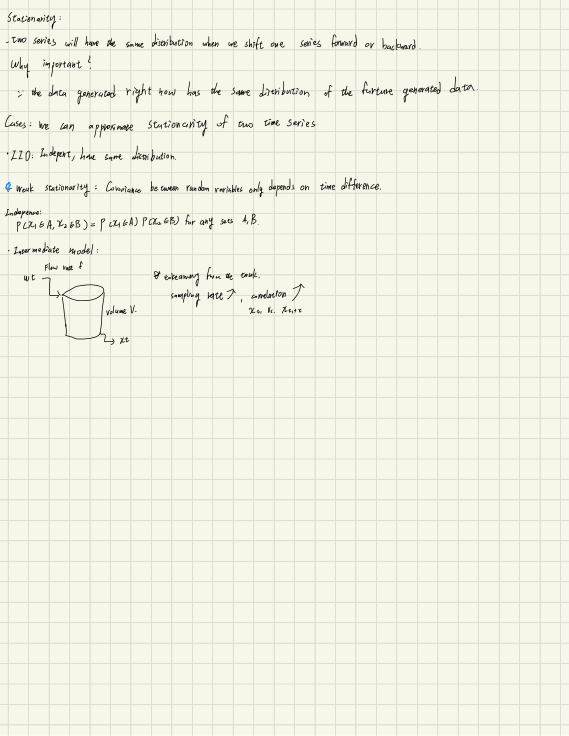
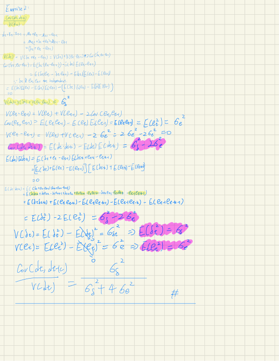

# Handwritten Appendix: Stationarity and Covariance Exercise

## 1. Appendix overview

The final three PDF pages contain:

- a handwritten recap of stationarity and independence on page 101;
- a blank page on page 102;
- a handwritten variance/covariance exercise on page 103.

Page 101 reinforces concepts introduced in Chapter 2. Page 103 returns to
the local-level or integrated model:

```math
x_t=\mu_t+e_t,
\qquad
\mu_t=\mu_{t-1}+\delta_t,
```

and studies the first difference:

```math
d_t=x_t-x_{t-1}.
```

The covariance derivation on page 103 contains several internally
inconsistent substitutions. This appendix therefore separates:

1. what is visibly written in the source;
2. uncertainties and inconsistencies;
3. a clearly labeled algebraic consistency check.

**Sources:** CSE598MTL.pdf, pp. 101-103

---

## 2. Handwritten stationarity recap
<p align="center">
  <a href="../assets/original_figures/p101_handwritten_stationarity.png">
    
  </a>
</p>
<p align="center"><em>Source figure — Full handwritten stationarity page. Select the image to open the full-size version.</em></p>
The page begins:

> **Handwritten note:** Two series will have the same distribution when
> one series is shifted forward or backward.

This restates time-shift invariance as the intuition behind stationarity.

**Source:** CSE598MTL.pdf, p. 101

---

## 3. Why stationarity matters

The page asks:

> Why important?

It answers approximately:

> The data generated right now has the same distribution as future
> generated data.

### Source-faithful interpretation

A stationary assumption allows observations from the current or past
period to inform the future because the generating distribution is
assumed not to change under a time shift.

The note does not claim that the actual observed values are identical.
It concerns the distribution that generates them.

**Source:** CSE598MTL.pdf, p. 101

---

## 4. Cases used to approximate stationarity

The page writes:

> Cases: we can approximate stationarity of two time series.

It then lists two cases.

### 4.1 IID case

> Independent, have same distribution.

This is the strongest simplified case shown on the page:

- observations share the same distribution;
- observations are independent.

### 4.2 Weak stationarity

> Covariance between random variables only depends on time difference.

In notation:

```math
\mathrm{Cov}(X_t,X_{t+k})
```

depends on lag $k$, rather than on the absolute time $t$.

The page does not restate the constant-mean and constant-variance
conditions here, but those conditions appeared earlier on page 5.

**Sources:** CSE598MTL.pdf, pp. 5 and 101

---

## 5. Independence definition

The page gives the set-based definition:

```math
P(X_1\in A,\ X_2\in B)
=
P(X_1\in A)
P(X_2\in B)
```

for any sets $A$ and $B$.

This is a full independence statement, not merely zero covariance.

### Reminder from the earlier chapter

The course previously distinguishes:

```text
independence
    -> factorization of joint probabilities

uncorrelated
    -> covariance equals zero
```

Independence generally implies zero covariance when the relevant moments
exist, but zero covariance alone does not establish independence.

**Sources:** CSE598MTL.pdf, pp. 5 and 101

---

## 6. Intermediate stirred-tank model

The page labels the tank example:

> Intermediate model.

The sketch contains:

- inflow concentration $w_t$;
- flow rate $f$;
- tank volume $V$;
- output concentration $x_t$.

The handwritten observation says approximately:

> By observing from the example, sampling rate increases, correlation
> increases.

This repeats the page-6 result that observations sampled at shorter
intervals relative to the tank time constant are more strongly
correlated.

For the earlier model:

```math
\rho=e^{-\Delta t/T}.
```

A higher sampling rate means a smaller $\Delta t$, which makes
$\rho$ larger.

**Sources:** CSE598MTL.pdf, pp. 6 and 101

---

## 7. Page 102

Page 102 is blank and contains no academic content.

**Source:** CSE598MTL.pdf, p. 102

---

## 8. Covariance exercise: source setup
<p align="center">
  <a href="../assets/original_figures/p103_handwritten_covariance_exercise.png">
    
  </a>
</p>
<p align="center"><em>Source figure — Full handwritten covariance exercise. Select the image to open the full-size version.</em></p>
The page is labeled:

> Exercise 2

and appears to seek an autocorrelation-like ratio:

```math
\frac{
\mathrm{Cov}(d_t,d_{t+k})
}{
\mathrm{Var}(d_t)
}.
```

The exact lag notation in the highlighted heading is small, but
$d_{t+k}$ is used in the later expansion.

**Source:** CSE598MTL.pdf, p. 103

---

## 9. Local-level model and first difference

The derivation starts from the local-level structure used earlier:

```math
x_t=\mu_t+e_t,
```

```math
\mu_t=\mu_{t-1}+\delta_t.
```

The first difference is expanded:

```math
\begin{aligned}
d_t
&=
x_t-x_{t-1}\\
&=
\mu_t+e_t-\mu_{t-1}-e_{t-1}\\
&=
\delta_t+e_t-e_{t-1}.
\end{aligned}
```

This part of the page is clear.

**Sources:** CSE598MTL.pdf, pp. 9 and 103

---

## 10. Source variance decomposition

The page writes the variance decomposition:

```math
\mathrm{Var}(d_t)
=
\mathrm{Var}(\delta_t)
+
\mathrm{Var}(e_t-e_{t-1})
+
2\mathrm{Cov}
\left(
\delta_t,
e_t-e_{t-1}
\right).
```

It then expands:

```math
\mathrm{Cov}
\left(
\delta_t,
e_t-e_{t-1}
\right)
=
E[
\delta_t(e_t-e_{t-1})
]
-
E[\delta_t]E[e_t-e_{t-1}].
```

The handwriting marks this cross-covariance as zero because
$\delta_t$, $e_t$, and $e_{t-1}$ are treated as independent.

**Source:** CSE598MTL.pdf, p. 103

---

## 11. Source calculation for the error difference

The page next writes:

```math
\mathrm{Var}(e_t-e_{t-1})
=
\mathrm{Var}(e_t)
+
\mathrm{Var}(e_{t-1})
-
2\mathrm{Cov}(e_t,e_{t-1}).
```

It then appears to substitute:

```math
\mathrm{Cov}(e_t,e_{t-1})
=
E[e_te_{t-1}]
=
E[e_t^2]
=
\sigma_e^2,
```

and consequently writes a zero variance for
$e_t-e_{t-1}$.

### Internal inconsistency

This substitution conflicts with the earlier independence statement.
Under independence and zero means:

```math
E[e_te_{t-1}]=0,
```

not:

```math
E[e_t^2].
```

The source calculation is therefore preserved but not adopted as a valid
result.

**Source:** CSE598MTL.pdf, p. 103

---

## 12. Source covariance expansion

The page expands:

```math
E[d_td_{t+k}]
=
E[
(\delta_t+e_t-e_{t-1})
(\delta_{t+k}+e_{t+k}-e_{t+k-1})
].
```

Several cross terms are written and removed using zero expectations or
independence.

The working then appears to produce an expression resembling:

```math
\sigma_\delta^2-2\sigma_e^2,
```

while the final line uses a numerator that appears to be:

```math
\sigma_\delta^2.
```

The lag $k$ is not fixed when the derivation converts lagged products to
same-time squared terms.

**Source:** CSE598MTL.pdf, p. 103

---

## 13. Final fraction written on the page

The final line appears to state:

```math
\frac{
\mathrm{Cov}(d_t,d_{t+k})
}{
\mathrm{Var}(d_t)
}
=
\frac{
\sigma_\delta^2
}{
\sigma_\delta^2+4\sigma_e^2
}.
```

### Internal consistency problems

This result does not follow from the preceding displayed assumptions and
working:

1. the body appears to use a different numerator;
2. the body earlier appears to reduce
   $\mathrm{Var}(e_t-e_{t-1})$ to zero;
3. the denominator later contains $4\sigma_e^2$;
4. the lag $k$ is not specified when lagged terms are replaced by
   same-time squares;
5. independence is invoked and then contradicted.

The final fraction is therefore recorded as **source transcription
requiring correction**, not as a verified formula.

**Source:** CSE598MTL.pdf, p. 103

---

## 14. Added algebraic consistency check

> **Clarification - not transcribed from the handwritten page**

Assume the model written on the page and the standard assumptions it
appears to intend:

```math
E[\delta_t]=0,
\qquad
E[e_t]=0,
```

```math
\mathrm{Var}(\delta_t)=\sigma_\delta^2,
\qquad
\mathrm{Var}(e_t)=\sigma_e^2,
```

with:

- $\delta_t$ independent across time;
- $e_t$ independent across time;
- the $\delta$ and $e$ processes mutually independent.

Because:

```math
d_t=\delta_t+e_t-e_{t-1},
```

the variance is:

```math
\begin{aligned}
\mathrm{Var}(d_t)
&=
\mathrm{Var}(\delta_t)
+
\mathrm{Var}(e_t)
+
\mathrm{Var}(e_{t-1})\\
&=
\sigma_\delta^2+2\sigma_e^2.
\end{aligned}
```

At lag one:

```math
d_{t+1}
=
\delta_{t+1}
+
e_{t+1}
-
e_t.
```

The only shared random variable is $e_t$, with opposite signs:

```math
\mathrm{Cov}(d_t,d_{t+1})
=
-\sigma_e^2.
```

For:

```math
k\geq2,
```

the two differences share no noise term under the stated assumptions:

```math
\mathrm{Cov}(d_t,d_{t+k})=0.
```

Therefore:

```math
\rho_1
=
-
\frac{
\sigma_e^2
}{
\sigma_\delta^2+2\sigma_e^2
},
```

and:

```math
\rho_k=0,
\qquad
k\geq2.
```

This produces an MA(1)-type autocovariance pattern for the differenced
series.

**Sources for model setup:** CSE598MTL.pdf, pp. 9 and 103  
**Status of calculation:** Added algebraic consistency check

---

## 15. Connection to the integrated model

Chapter 2 introduced:

```math
x_t=\mu_t+e_t,
```

```math
\mu_t=\mu_{t-1}+\delta_t.
```

The first difference:

```math
d_t=x_t-x_{t-1}
```

removes the evolving level and leaves a short-memory process formed from:

- the level innovation $\delta_t$;
- the current observation error $e_t$;
- the previous observation error $-e_{t-1}$.

The page-103 exercise appears intended to show that differencing creates a
stationary short-memory series even when the original level series is
nonstationary.

**Sources:** CSE598MTL.pdf, pp. 9 and 103

---

## 16. Common confusions

### Stationary does not mean constant

A stationary process can fluctuate. Its distributional properties remain
stable under time shifts.

### IID is stronger than weak stationarity

IID requires independence and a common distribution. Weak stationarity
constrains mean, variance, and lag covariance but permits temporal
dependence.

### Independent is not the same as uncorrelated

The page-103 derivation illustrates why these assumptions must be used
consistently.

### First difference versus level innovation

```math
d_t
```

is the observed first difference. It contains both the level innovation
$\delta_t$ and differences of observation errors.

### Source derivation versus corrected clarification

The highlighted page-103 fraction is part of the source record. The
lag-one calculation in Section 14 is an added consistency check and must
not be presented as though it were written on the page.

**Sources:** CSE598MTL.pdf, pp. 101 and 103

---

## 17. Questions preserved for later discussion

1. Was page 103 intended to calculate lag-one autocorrelation only, or a
   general lag $k$ autocorrelation?
2. Were $e_t$ and $e_{t-1}$ intended to be independent?
3. Is the covariance substitution
   $E[e_te_{t-1}]=E[e_t^2]$ a transcription mistake made during class?
4. Why does the final denominator contain $4\sigma_e^2$?
5. Was the numerator intended to be
   $-\sigma_e^2$, $\sigma_\delta^2$, or
   $\sigma_\delta^2-2\sigma_e^2$?
6. Was the exercise intended to derive the MA(1) autocorrelation of the
   differenced local-level model?
7. Did the instructor correct this exercise verbally after the handwritten
   derivation?
8. What exact lag notation is written in the highlighted heading?

These questions cannot be resolved from the PDF alone.

---

## 18. Source map

| PDF page | Material reconstructed |
|---:|---|
| 101 | Time-shift stationarity intuition, IID, weak stationarity, independence and tank-model reminder |
| 102 | Blank page |
| 103 | Local-level first difference and handwritten covariance/autocorrelation exercise |

## Review status

- Page-101 stationarity wording: `[VERIFIED]`
- Page-101 reason for importance: `[VERIFIED WITH LIGHT GRAMMATICAL RECONSTRUCTION]`
- Independence formula: `[VERIFIED]`
- Stirred-tank reminder: `[VERIFIED]`
- Page-103 first-difference expansion: `[VERIFIED]`
- Page-103 variance/covariance working: `[SOURCE INCONSISTENT]`
- Page-103 final correlation fraction: `[VISIBLE BUT NOT DERIVED CONSISTENTLY]`
- Section-14 corrected algebra: `[ADDED CLARIFICATION]`
