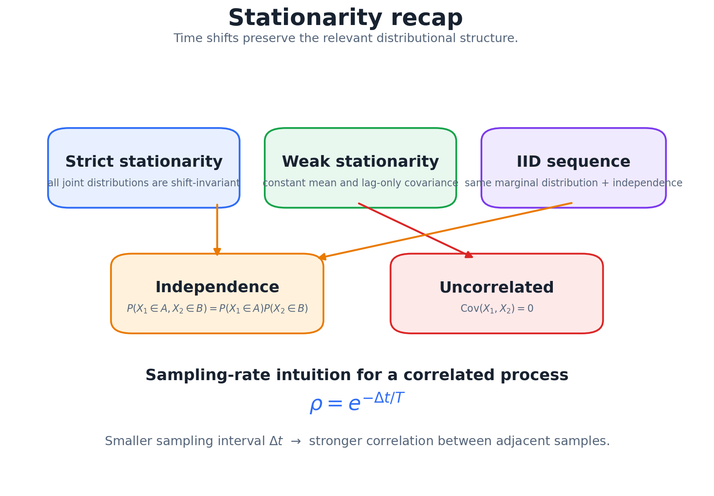
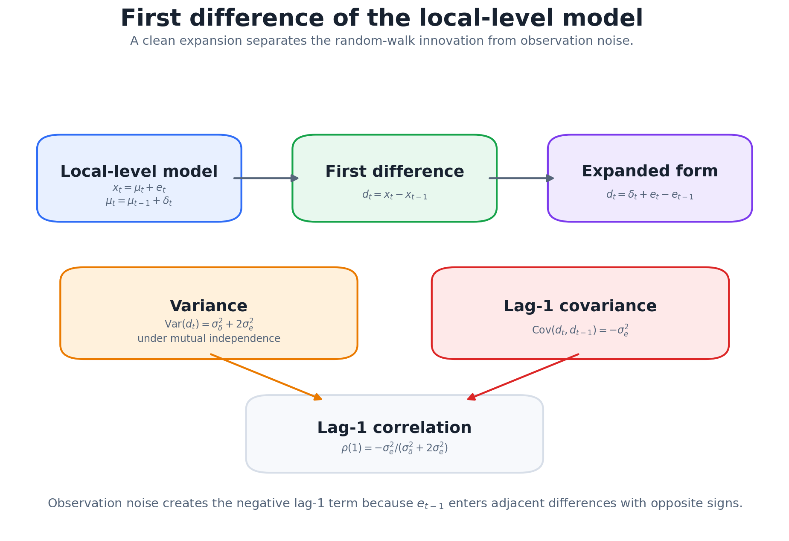

# 12. Appendix: Stationarity Recap and the Differenced Local-Level Model

This appendix collects two pieces of hand-worked material. The first is a one-page recap of what stationarity means and why it matters. The second is a full derivation of the claim in [Chapter 2](02_classical_time_series_models.md) that the **first difference of a local-level model is MA(1)**, including the exact MA coefficient and its link to exponential smoothing.

## 1. Stationarity recap



*Strict stationarity, weak stationarity, IID and the sampling-rate intuition on one page.*

**The idea in one sentence:** a series is stationary if shifting it forward or backward in time doesn't change its distribution.

**Why it matters:** if the process generating data now is the same one that will generate data later, then what we learn from the past applies to the future. The claim is about the *distribution*, not the values; a stationary series still fluctuates.

**Ways to get (or approximate) stationarity:**

- **IID:** independent and identically distributed. The strongest, simplest case, with no temporal dependence at all.
- **Weak stationarity:** constant mean, constant variance, and $\mathrm{Cov}(X_t,X_{t+k})$ depending only on the lag $k$, not on $t$. Dependence is allowed, as long as it's the same at every point in time.

**Independence vs uncorrelated.** $X_1$ and $X_2$ are independent if $P(X_1\in A,X_2\in B)=P(X_1\in A)\,P(X_2\in B)$ for **all** sets $A,B$. That implies zero covariance (when the moments exist), but not the other way around: $X\sim N(0,1)$ and $X^2$ are uncorrelated yet completely dependent.

**Sampling rate.** In the stirred-tank model (Chapter 2, §3) the lag-1 correlation is $\rho=e^{-\Delta t/T}$. Sampling faster (smaller $\Delta t$) **increases** the correlation between neighbors, since the system has less time to change between samples.

## 2. The model

The local-level model has a latent level that follows a random walk, observed with noise:

```math
x_t=\mu_t+e_t,\qquad \mu_t=\mu_{t-1}+\delta_t ,
```

with assumptions:

- $e_t$ i.i.d., mean 0, variance $\sigma_e^2$ (observation noise);
- $\delta_t$ i.i.d., mean 0, variance $\sigma_\delta^2$ (level innovations);
- the two noise sequences are independent of each other.

$x_t$ is **not** stationary: $\mathrm{Var}(\mu_t)$ grows linearly with $t$. The question is what the first difference looks like.

## 3. The first difference

```math
d_t=x_t-x_{t-1}=(\mu_t-\mu_{t-1})+e_t-e_{t-1}=\delta_t+e_t-e_{t-1}.
```

The level has disappeared. What's left is a finite combination of noise terms, which is stationary.



*Consecutive differences share exactly one noise term, $e_t$, with opposite signs.*

**Variance.** The three terms are independent, so their variances add:

```math
\mathrm{Var}(d_t)=\sigma_\delta^2+\sigma_e^2+\sigma_e^2=\sigma_\delta^2+2\sigma_e^2 .
```

(The cross-covariance $\mathrm{Cov}(\delta_t,e_t-e_{t-1})$ is 0 by independence.)

**Lag 1.** $d_{t+1}=\delta_{t+1}+e_{t+1}-e_t$. The only variable shared with $d_t=\delta_t+e_t-e_{t-1}$ is $e_t$, appearing as $+e_t$ in $d_t$ and $-e_t$ in $d_{t+1}$:

```math
\mathrm{Cov}(d_t,d_{t+1})=\mathrm{Cov}(e_t,-e_t)=-\sigma_e^2 .
```

**Lag $k\ge2$.** $d_t$ involves $\{\delta_t,e_t,e_{t-1}\}$ and $d_{t+k}$ involves $\{\delta_{t+k},e_{t+k},e_{t+k-1}\}$. For $k\ge2$ these sets don't overlap, so the covariance is 0.

**Autocorrelation:**

```math
\rho_1=-\frac{\sigma_e^2}{\sigma_\delta^2+2\sigma_e^2},\qquad \rho_k=0\;\;(k\ge2).
```

An ACF that is nonzero at lag 1 and zero after is exactly the signature of an **MA(1)** process, so $x_t$ is **IMA(1,1)**.

> [!WARNING]
> **Two easy slips in this derivation**
>
> 1. Writing $\mathrm{Cov}(e_t,e_{t-1})=E[e_te_{t-1}]=E[e_t^2]=\sigma_e^2$. Under independence, $E[e_te_{t-1}]=E[e_t]E[e_{t-1}]=0$. The slip makes $\mathrm{Var}(e_t-e_{t-1})$ come out as 0 instead of $2\sigma_e^2$.
> 2. Expanding $E[d_td_{t+k}]$ for general $k$ and then replacing lagged products by same-time squares. Which terms match depends on $k$, so do $k=1$ and $k\ge2$ separately.

**Sanity checks:**

- $\sigma_\delta^2=0$ (a constant level): $\rho_1=-\tfrac12$, the ACF of differenced white noise, the classic over-differencing signature from Chapter 2.
- $\sigma_e^2=0$ (a pure random walk): $\rho_1=0$, since the differences are just $\delta_t$, i.e. white noise.
- In general $-\tfrac12\le\rho_1\le0$.

A simulation with $\sigma_\delta=1,\sigma_e=2$ (400,000 steps) gives $\mathrm{Var}(d_t)=8.998$ (theory 9), $\hat\rho_1=-0.447$ (theory $-4/9=-0.444$) and $\hat\rho_2=0.003$ (theory 0).

```python
import numpy as np
rng = np.random.default_rng(1)
n, s_d, s_e = 400_000, 1.0, 2.0
x = np.cumsum(rng.normal(0, s_d, n)) + rng.normal(0, s_e, n)
d = np.diff(x)
r = lambda k: np.corrcoef(d[:-k], d[k:])[0, 1]
print(d.var(), r(1), r(2))     # ≈ 9.0, -0.447, 0.003
```

## 4. Finding the MA coefficient, and why EWMA is optimal here

Write the differenced series as $d_t=\epsilon_t-\theta\epsilon_{t-1}$ with white noise $\epsilon_t$. The MA(1) autocorrelation is $\rho_1=-\theta/(1+\theta^2)$. Setting it equal to the result above, with signal-to-noise ratio $q=\sigma_\delta^2/\sigma_e^2$:

```math
\frac{\theta}{1+\theta^2}=\frac{1}{q+2}
\;\Longrightarrow\;
\theta^2-(q+2)\theta+1=0
\;\Longrightarrow\;
\theta=\frac{(q+2)-\sqrt{q^2+4q}}{2},
```

taking the root with $|\theta|<1$ (the invertible one). For $q=\tfrac14$ (the simulation above), $\theta\approx0.610$.

This connects three chapters:

- The IMA(1,1) one-step forecast is exactly an **EWMA** with smoothing weight $\lambda=1-\theta$ ([Chapter 3](03_filters_smoothing_and_decomposition.md)). So EWMA is the optimal linear forecaster for a noisy random-walk level.
- **Noisy data** (small $q$) gives $\theta$ near 1 and a small $\lambda$: average over a long history.
- **Fast-moving level** (large $q$) gives $\theta$ near 0 and $\lambda$ near 1: trust the latest observation.

The same trade-off is what the Kalman filter's steady-state gain encodes.

## 5. Common confusions

- **Stationary ≠ constant:** the distribution is stable; the values still move.
- **IID ⊂ weakly stationary:** weak stationarity allows dependence, IID doesn't.
- **Independent ⇒ uncorrelated, not the converse.** In the derivation above this is exactly what sets $E[e_te_{t-1}]=0$.
- **$d_t$ vs $\delta_t$:** the observed difference includes the level innovation **plus** a difference of observation noises. Only when $\sigma_e=0$ are they equal.

---

[← Previous: Transformers](11_transformers.md) · [Course map](../course_map.md) · [Reference: Equations →](../reference/equations.md)
