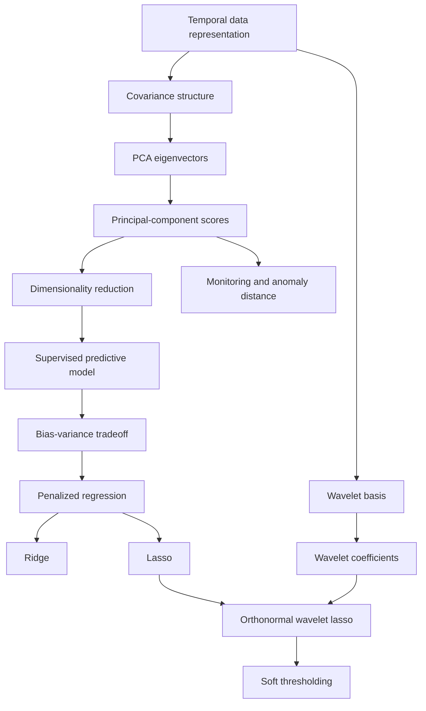
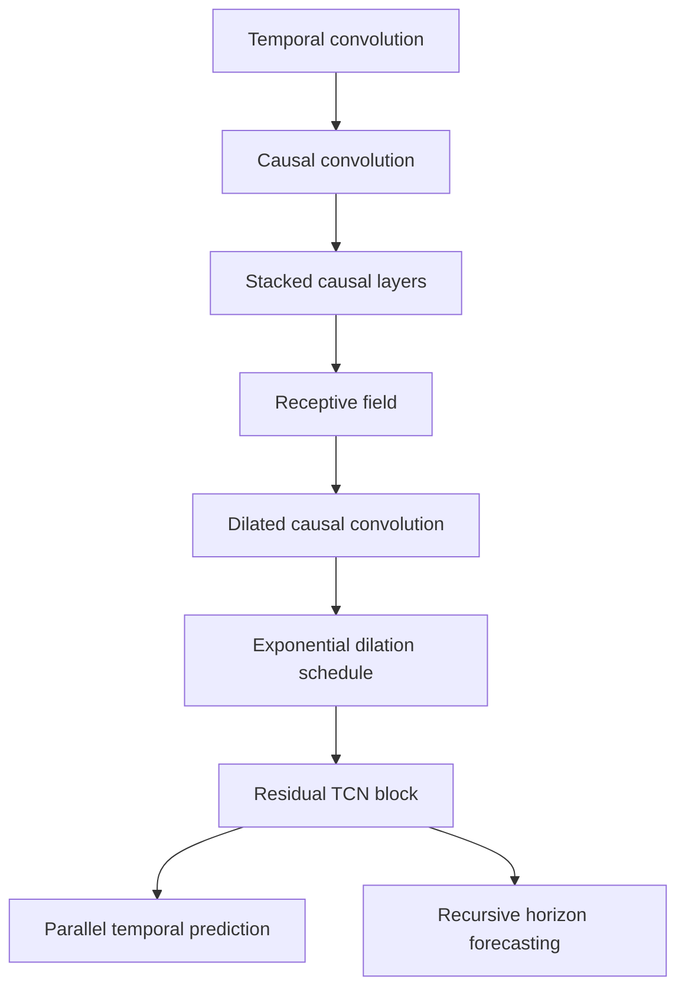
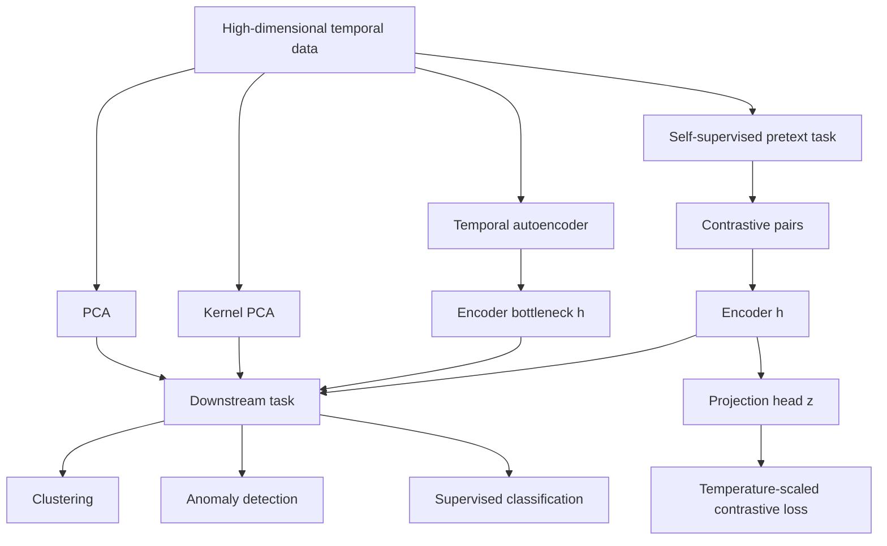
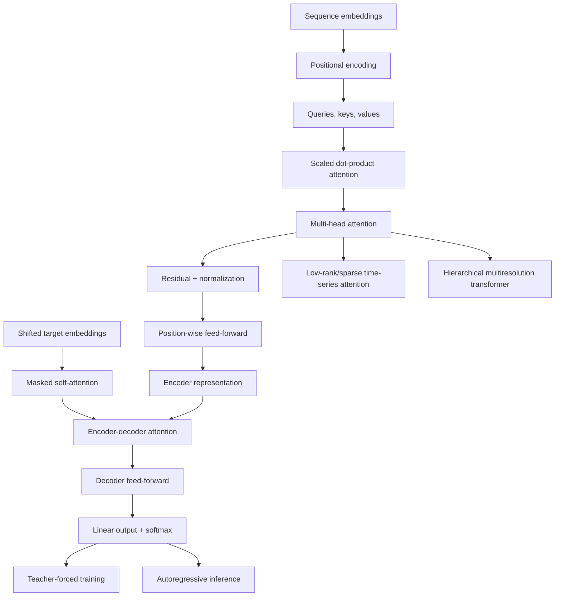

# Concept Dependencies

## Key dependency notes

- Covariance and eigendecomposition are prerequisites for PCA.
- PCA scores can reduce representation size before supervised learning.
- Bias-variance motivates regularization.
- Ridge and lasso differ through their penalty geometry.
- Soft wavelet thresholding is derived from lasso only in the orthonormal
  basis case shown on page 44.

**Sources:** CSE598MTL.pdf, pp. 21-44

## Temporal-convolution branch

## Representation-learning branch

## Transformer branch

