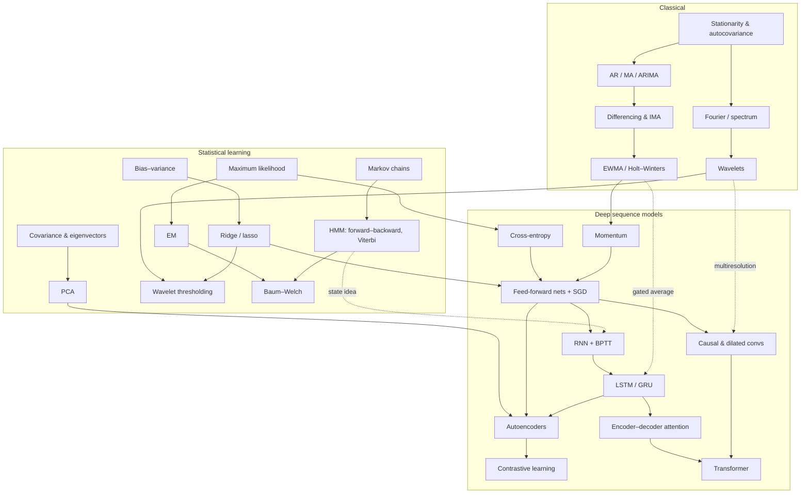
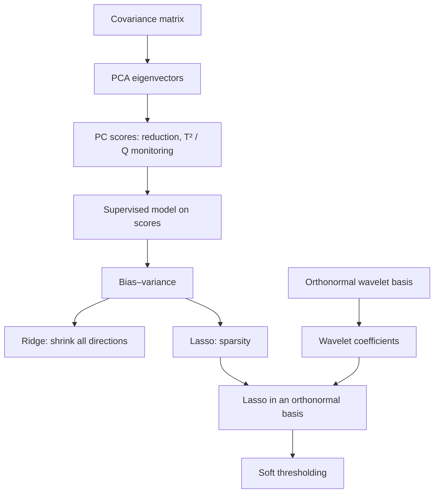
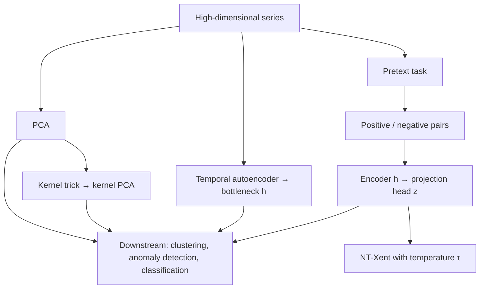
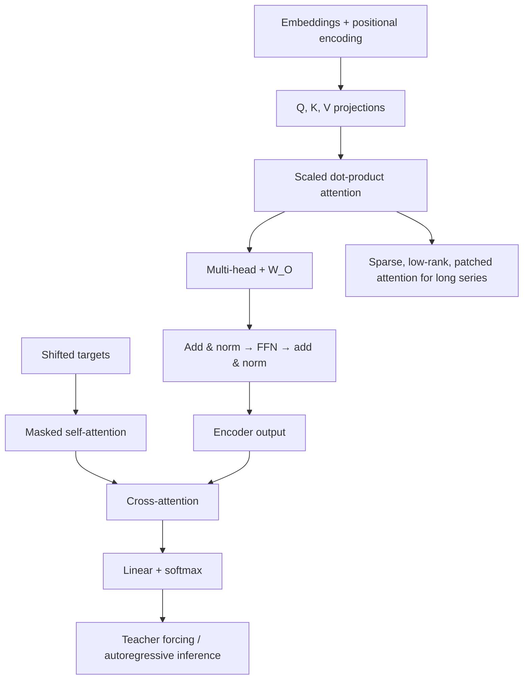

# Concept Dependencies

What to understand before what. An arrow $A\to B$ means "$B$ uses $A$." If a chapter feels hard, walk its arrows backward.

## The whole course



## Branch details

### Filters, regularization and wavelets (Chapters 3–5)



Soft thresholding *equals* the lasso solution only when the basis is orthonormal, as with Haar or Daubechies wavelets. In a general basis the lasso has no closed form.

### Recurrent and convolutional (Chapters 8–9)

```mermaid
flowchart TD
    A[Shared weights over time] --> B[RNN hidden state]
    B --> C[BPTT]
    C --> D[Vanishing / exploding gradients]
    D --> E[Clipping, truncation]
    D --> F[Additive cell path: LSTM / GRU]
    F --> G[Encoder–decoder]
    G --> H[Bottleneck → attention]
    I[Causal convolution] --> J[Receptive field 1 + L(k−1)]
    J --> K[Dilation: 1 + (k−1)Σd]
    K --> L[Residual TCN block]
```

### Representation learning (Chapter 10)



### Transformer (Chapter 11)


