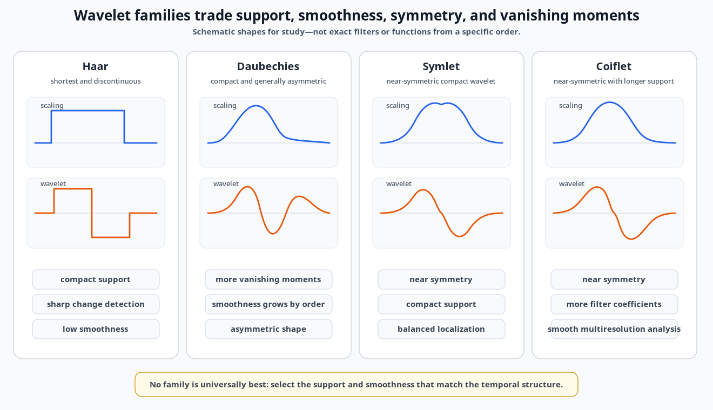
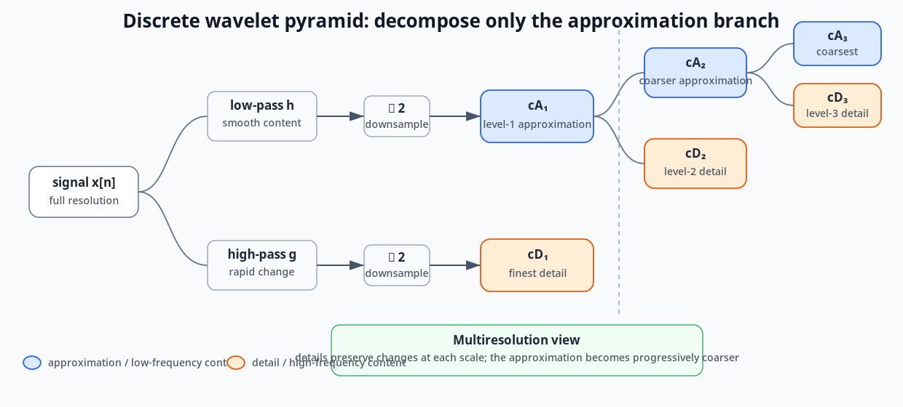

# Visual Index

This page is generated from the final chapter files.

Redrawn diagrams provide stable, reader-friendly explanations in the same
style used throughout the repository. Source figures are retained only when
they preserve exact results, handwriting, taxonomies, or details that should
not be simplified.

## Fourier Analysis and Wavelets

[Open chapter](../notes/04_wavelets.md)

*Redrawn course diagram — Qualitative comparison of Haar, Daubechies, Symlet, and Coiflet scaling and wavelet characteristics.*

*Redrawn course diagram — Wavelet pyramid with repeated decomposition of the approximation branch.*

*Source figure — db2 and db7 plateau-detail comparison.*

## PCA, Bias-Variance, and Regularization

[Open chapter](../notes/05_pca_and_regularization.md)

*Source figure — Correlated data and PCA directions from the course page.*

*Redrawn course diagram — Euclidean circles versus covariance-aligned Mahalanobis ellipses and the stronger penalty along low-variance directions.*

*Redrawn course diagram — Schematic coefficient paths showing smooth ridge shrinkage and lasso coefficients reaching exact zero.*

## Markov Chains, Hidden Markov Models, and EM

[Open chapter](../notes/06_markov_models_hmm_and_em.md)

*Source figure — Hidden-state and observed-sequence example from the course page.*

*Redrawn course diagram — Soft responsibilities preserve uncertainty, while K-means makes one hard assignment.*

## Neural-Network Foundations and Training

[Open chapter](../notes/07_neural_network_foundations.md)

*Source figure — Multilayer feed-forward network from the course page.*

## RNNs, Stateful Training, LSTMs, GRUs, and Encoder-Decoder Models

[Open chapter](../notes/08_rnn_lstm_gru_and_seq2seq.md)

*Redrawn course diagram — Random, expanding-window, and sliding-window temporal validation.*

*Source figure — Basic and stacked RNN architectures from the course page.*

*Source figure — LSTM cell diagrams from the course page.*

*Source figure — Encoder-decoder sequence and forecast diagrams from the course page.*

## Temporal Convolutional Networks

[Open chapter](../notes/09_temporal_convolutional_networks.md)

*Redrawn course diagram — TCN causality, exponentially increasing dilation, and residual-block structure.*

## Temporal Representation and Contrastive Learning

[Open chapter](../notes/10_representation_learning.md)

*Redrawn course diagram — Temporal encoder-bottleneck-decoder architecture and downstream reuse of the learned representation.*

*Redrawn course diagram — Temporal positive and negative pair construction, shared encoder, projection head, and contrastive loss.*

*Source figure — Projection-head comparison from the course page.*

## Transformers and Temporal Applications

[Open chapter](../notes/11_transformers.md)

*Redrawn course diagram — Simplified transformer encoder-decoder stack with self-attention, masked attention, cross-attention, feed-forward layers, and residual normalization.*

*Redrawn course diagram — Sentence-level attention interpretation and parallel multi-head query-key-value projections.*

*Redrawn course diagram — Transformer decoder block with masked self-attention, encoder-decoder attention, and autoregressive generation.*

*Source figure — Residual learning block from the course page.*

*Source figure — Taxonomy of transformer methods for time-series modeling.*

## Handwritten Appendix: Stationarity and Covariance Exercise

[Open chapter](../notes/12_handwritten_appendix.md)

*Source figure — Full handwritten stationarity page.*

*Source figure — Full handwritten covariance exercise.*

