# Visual Index

This page is generated from the final chapter files.

Clean diagrams are simplified study visuals. Source figures preserve
exact results, handwriting, taxonomies, or details that should not be
redrawn.

## Fourier Analysis and Wavelets

[Open chapter](../notes/04_wavelets.md)

  

<em>Clean diagram — Qualitative comparison of Haar, Daubechies, Symlet, and Coiflet scaling and wavelet characteristics.</em>

  

<em>Clean diagram — Wavelet pyramid with repeated decomposition of the approximation branch.</em>

  

<em>Source figure — db2 and db7 plateau-detail comparison.</em>

## PCA, Bias-Variance, and Regularization

[Open chapter](../notes/05_pca_and_regularization.md)

  

<em>Source figure — Correlated data and PCA directions from the course page.</em>

  <a href="../assets/clean_diagrams/mahalanobis_geometry.svg">
    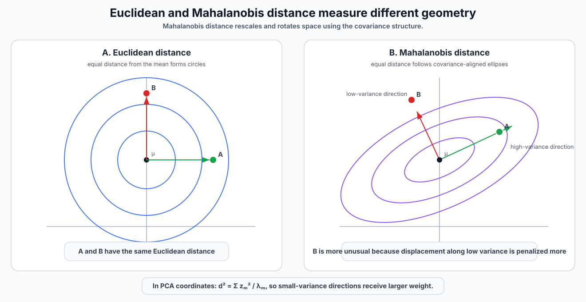
  </a>

<em>Clean diagram — Euclidean circles versus covariance-aligned Mahalanobis ellipses and the stronger penalty along low-variance directions.</em>

  <a href="../assets/clean_diagrams/ridge_lasso_paths.svg">
    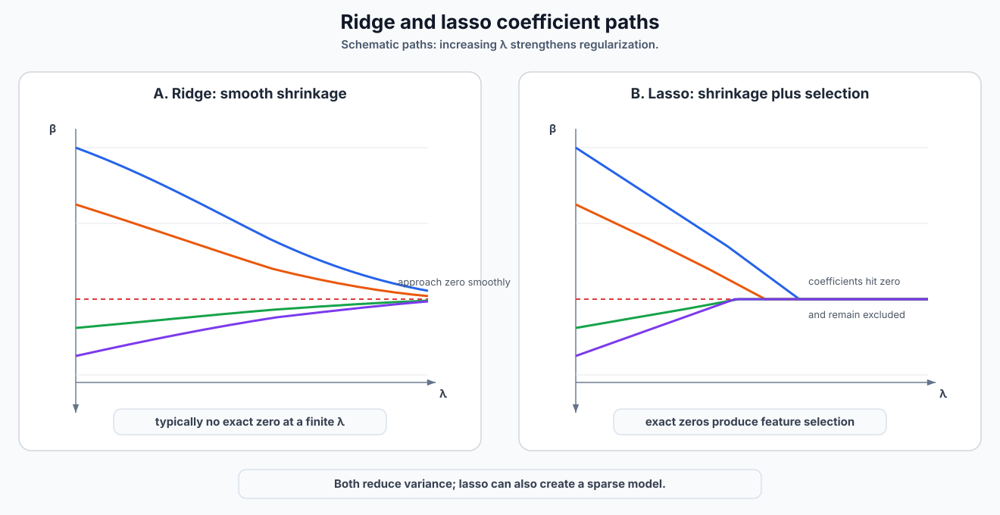
  </a>

<em>Clean diagram — Schematic coefficient paths showing smooth ridge shrinkage and lasso coefficients reaching exact zero.</em>

## Markov Chains, Hidden Markov Models, and EM

[Open chapter](../notes/06_markov_models_hmm_and_em.md)

  

<em>Source figure — Hidden-state and observed-sequence example from the course page.</em>

  <a href="../assets/clean_diagrams/em_soft_vs_hard_assignments.svg">
    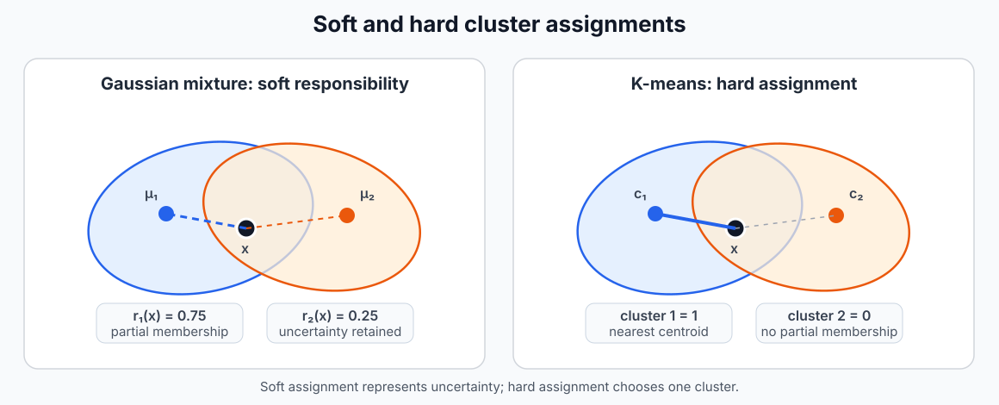
  </a>

<em>Clean diagram — Soft responsibilities preserve uncertainty, while K-means makes one hard assignment.</em>

## Neural-Network Foundations and Training

[Open chapter](../notes/07_neural_network_foundations.md)

  <a href="../assets/original_figures/p057_multilayer_network_architecture.png">
    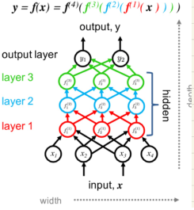
  </a>

<em>Source figure — Multilayer feed-forward network from the course page.</em>

## RNNs, Stateful Training, LSTMs, GRUs, and Encoder-Decoder Models

[Open chapter](../notes/08_rnn_lstm_gru_and_seq2seq.md)

  <a href="../assets/clean_diagrams/temporal_cross_validation.svg">
    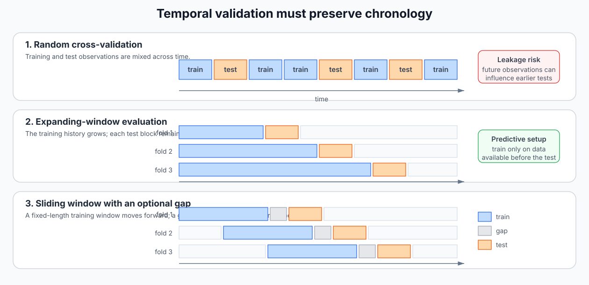
  </a>

<em>Clean diagram — Random, expanding-window, and sliding-window temporal validation.</em>

  

<em>Source figure — Basic and stacked RNN architectures from the course page.</em>

  

<em>Source figure — LSTM cell diagrams from the course page.</em>

  

<em>Source figure — Encoder-decoder sequence and forecast diagrams from the course page.</em>

## Temporal Convolutional Networks

[Open chapter](../notes/09_temporal_convolutional_networks.md)

  <a href="../assets/clean_diagrams/tcn_overview.svg">
    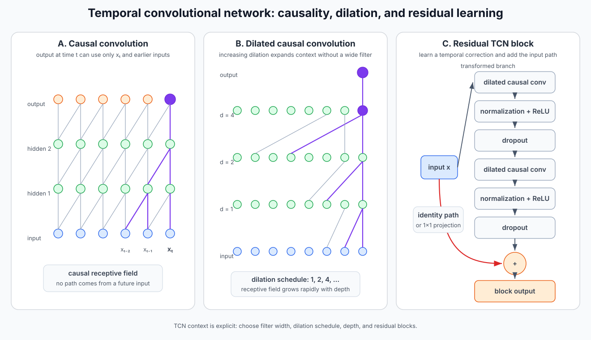
  </a>

<em>Clean diagram — TCN causality, exponentially increasing dilation, and residual-block structure.</em>

## Temporal Representation and Contrastive Learning

[Open chapter](../notes/10_representation_learning.md)

  

<em>Clean diagram — Temporal encoder-bottleneck-decoder architecture and downstream reuse of the learned representation.</em>

  

<em>Clean diagram — Temporal positive and negative pair construction, shared encoder, projection head, and contrastive loss.</em>

  

<em>Source figure — Projection-head comparison from the course page.</em>

## Transformers and Temporal Applications

[Open chapter](../notes/11_transformers.md)

  <a href="../assets/clean_diagrams/transformer_overview.svg">
    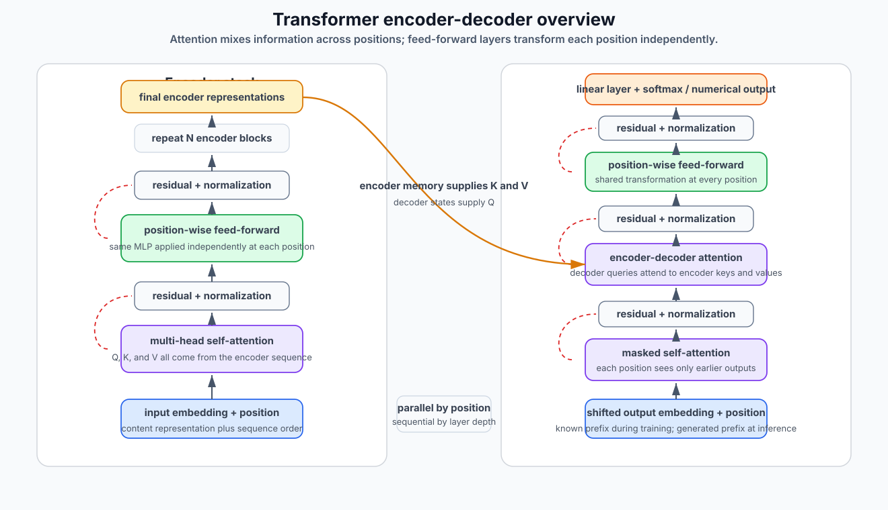
  </a>

<em>Clean diagram — Simplified transformer encoder-decoder stack with self-attention, masked attention, cross-attention, feed-forward layers, and residual normalization.</em>

  <a href="../assets/clean_diagrams/multihead_attention.svg">
    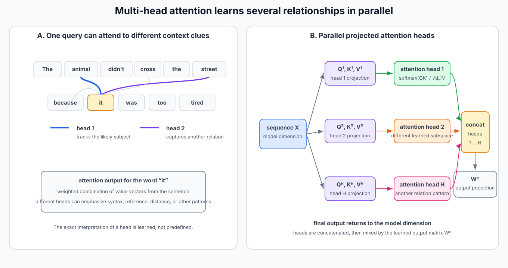
  </a>

<em>Clean diagram — Sentence-level attention interpretation and parallel multi-head query-key-value projections.</em>

  <a href="../assets/clean_diagrams/transformer_decoder_generation.svg">
    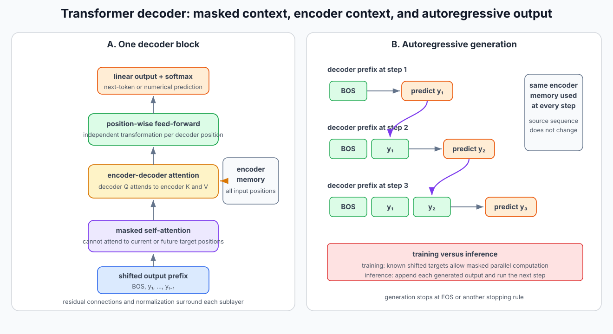
  </a>

<em>Clean diagram — Transformer decoder block with masked self-attention, encoder-decoder attention, and autoregressive generation.</em>

  <a href="../assets/original_figures/p099_residual_learning_block.png">
    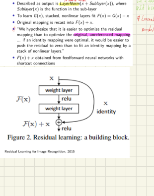
  </a>

<em>Source figure — Residual learning block from the course page.</em>

  <a href="../assets/original_figures/p100_time_series_transformer_taxonomy.png">
    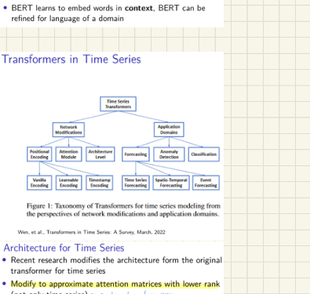
  </a>

<em>Source figure — Taxonomy of transformer methods for time-series modeling.</em>

## Handwritten Appendix: Stationarity and Covariance Exercise

[Open chapter](../notes/12_handwritten_appendix.md)

  

<em>Source figure — Full handwritten stationarity page.</em>

  

<em>Source figure — Full handwritten covariance exercise.</em>

