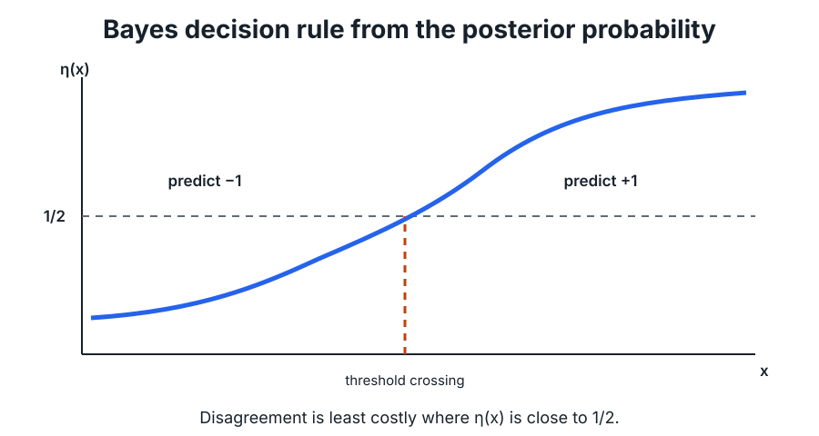

# Probabilistic Prediction and Bayes Classification

**Source:** 598SLT.pdf, pp. 2-6.

## 1. Prediction as a probabilistic problem

A prediction problem uses an input $x\in\mathcal{X}$ to predict an output $y\in\mathcal{Y}$. A prediction function has the form

$$f:\mathcal{X}\to\mathcal{Y}.$$

The training sample is

$$\mathcal{D}_{n}=\{(X_{1},Y_{1}),\ldots,(X_{n},Y_{n})\},$$

where the pairs are drawn independently from a joint distribution $P$ over $\mathcal{X}\times\mathcal{Y}$.

A loss function

$$\ell:\mathcal{Y}\times\mathcal{Y}\to\mathbb{R}$$

measures the cost of predicting $\widehat{y}=f(x)$ when the true output is $y$.

The population risk of $f$ is

$$R(f)=\mathbb{E}_{(X,Y)\sim P}\left[\ell(f(X),Y)\right].$$

The goal is to construct a prediction function whose risk is small.

!!! important "The learned predictor is random"
    The training sample is random. Because the learned function depends on the training sample, the output of the learning algorithm is also random. Statistical learning theory therefore asks for guarantees that hold with high probability over the draw of the training data.

## 2. Classification and regression losses

For classification, the course introduces the zero-one loss. It equals one when the prediction is wrong and zero when it is correct:

$$\ell(\widehat{y},y)=\mathbf{1}_{\{\widehat{y}\neq y\}}.$$

More explicitly,

$$\ell(\widehat{y},y)=1 \quad \text{when } \widehat{y}\neq y,$$

and

$$\ell(\widehat{y},y)=0 \quad \text{when } \widehat{y}=y.$$

Under this loss,

$$R(f)=\mathbb{E}\left[\mathbf{1}_{\{f(X)\neq Y\}}\right]=P\left(f(X)\neq Y\right).$$

Thus, the risk is the probability of misclassification.

For regression with $\mathcal{Y}=\mathbb{R}$, a common choice is the quadratic loss

$$\ell(\widehat{y},y)=(\widehat{y}-y)^{2}.$$

## 3. Binary classification and the posterior probability

Assume

$$\mathcal{Y}=\{-1,1\}.$$

Define the conditional class probability

$$\eta(x)=P(Y=1\mid X=x).$$

Conditioning on $X$, the risk of a classifier $f$ can be written in three steps:

$$R(f)=\mathbb{E}\left[\ell(f(X),Y)\right].$$

$$R(f)=\mathbb{E}_{X}\left[\mathbb{E}\left[\ell(f(X),Y)\mid X\right]\right].$$

$$R(f)=\mathbb{E}_{X}\left[\mathbf{1}_{\{f(X)\neq 1\}}\eta(X)+\mathbf{1}_{\{f(X)\neq -1\}}\left(1-\eta(X)\right)\right].$$

Because a binary classifier predicts either $1$ or $-1$,

$$\mathbf{1}_{\{f(X)\neq -1\}}=1-\mathbf{1}_{\{f(X)\neq 1\}}.$$

Therefore,

$$R(f)=\mathbb{E}_{X}\left[\mathbf{1}_{\{f(X)\neq 1\}}\left(2\eta(X)-1\right)+1-\eta(X)\right].$$

This expression shows that the best prediction at a fixed input $x$ depends on whether $\eta(x)$ lies above or below $1/2$.

## 4. Bayes decision function and Bayes risk

The Bayes decision function predicts

$$f^{\star}(x)=1 \quad \text{when } \eta(x)\geq \frac{1}{2},$$

and

$$f^{\star}(x)=-1 \quad \text{when } \eta(x)<\frac{1}{2}.$$

The Bayes risk is

$$R^{\star}=\inf_{f}R(f).$$

The course states that $f^{\star}$ achieves this smallest possible risk.

### Theorem 1: Excess-risk identity

For any classifier $f:\mathcal{X}\to\{-1,1\}$,

$$R(f)-R(f^{\star})=\mathbb{E}\left[\mathbf{1}_{\{f(X)\neq f^{\star}(X)\}}\left\lvert 2\eta(X)-1\right\rvert\right].$$

### Proof strategy

Starting from the risk expression above,

$$R(f)-R(f^{\star})=\mathbb{E}\left[\left(\mathbf{1}_{\{f(X)\neq 1\}}-\mathbf{1}_{\{f^{\star}(X)\neq 1\}}\right)\left(2\eta(X)-1\right)\right].$$

Consider a fixed value of $X$.

- When $f(X)=f^{\star}(X)$, the difference of indicators is zero.
- When $f(X)\neq f^{\star}(X)$ and $2\eta(X)-1\geq 0$, the Bayes rule predicts $1$, and the product equals $2\eta(X)-1$.
- When $f(X)\neq f^{\star}(X)$ and $2\eta(X)-1<0$, the Bayes rule predicts $-1$, and the product equals $-(2\eta(X)-1)$.

Hence the integrand equals

$$\mathbf{1}_{\{f(X)\neq f^{\star}(X)\}}\left\lvert 2\eta(X)-1\right\rvert,$$

which proves the identity.

### Consequence

Since the integrand is always nonnegative,

$$R(f)-R(f^{\star})\geq 0.$$

Therefore,

$$R(f^{\star})=R^{\star}.$$

!!! clarification "Why does disagreement near $\eta(x)=1/2$ matter less?"
    The factor $\left\lvert 2\eta(x)-1\right\rvert$ measures how strongly one class is preferred at $x$. If $\eta(x)$ is close to $1/2$, the two labels have nearly equal conditional probabilities, so choosing the non-Bayes label adds only a small amount of risk. If $\eta(x)$ is close to $0$ or $1$, disagreement with the Bayes rule is much more costly.

## 5. Why learning is still necessary

The Bayes classifier is optimal only if $\eta(x)=P(Y=1\mid X=x)$ is known. In practice, the joint distribution $P$ is unknown, so $\eta$ cannot usually be computed directly.

The learning problem becomes:

$$\text{estimate }\eta(x)\text{ from data}\quad\Longrightarrow\quad\text{construct an approximation to }f^{\star}.$$

## 6. A partition-based estimate of $\eta(x)$

The notes illustrate a simple estimator on $[0,1]\times[0,1]$. Divide the input region into cells

$$Q_{1},\ldots,Q_{M}.$$

For a cell $Q_{j}$, define the empirical frequency of class $1$ as

$$P_{j}=\frac{\sum_{i=1}^{n}\mathbf{1}_{\{X_{i}\in Q_{j},\,Y_{i}=1\}}}{\sum_{i=1}^{n}\mathbf{1}_{\{X_{i}\in Q_{j}\}}}.$$

Then define

$$\widehat{\eta}(x)=P_{j}\quad\text{when }x\in Q_{j}.$$

Equivalently,

$$\widehat{\eta}(x)=\sum_{j=1}^{M}P_{j}\mathbf{1}_{\{x\in Q_{j}\}}.$$

The corresponding plug-in classifier predicts

$$f_{\widehat{\eta}}(x)=1 \quad \text{when } \widehat{\eta}(x)\geq \frac{1}{2},$$

and

$$f_{\widehat{\eta}}(x)=-1 \quad \text{when } \widehat{\eta}(x)<\frac{1}{2}.$$

!!! clarification "Why divide the space into small cells?"
    The target quantity is conditional: $P(Y=1\mid X=x)$. Exact repeated observations at the same continuous-valued input may be unavailable, so nearby points are grouped and treated as approximately comparable. Smaller cells reduce the approximation bias because points in a cell are more similar, but they also leave fewer samples in each cell and increase estimation variability. The source emphasizes the first effect; the bias-variance tension will become important later.

## 7. Plug-in classification bound

### Theorem 2

For any estimator $\widehat{\eta}:\mathcal{X}\to\mathbb{R}$,

$$R(f_{\widehat{\eta}})-R^{\star}\leq 2\mathbb{E}\left[\left\lvert\eta(X)-\widehat{\eta}(X)\right\rvert\right].$$

### Proof

Using the excess-risk identity,

$$R(f_{\widehat{\eta}})-R^{\star}=\mathbb{E}\left[\mathbf{1}_{\{f_{\widehat{\eta}}(X)\neq f^{\star}(X)\}}\left\lvert 2\eta(X)-1\right\rvert\right].$$

Since $\left\lvert 2\eta(X)-1\right\rvert=2\left\lvert\eta(X)-\frac{1}{2}\right\rvert$,

$$R(f_{\widehat{\eta}})-R^{\star}=2\mathbb{E}\left[\mathbf{1}_{\{f_{\widehat{\eta}}(X)\neq f^{\star}(X)\}}\left\lvert\eta(X)-\frac{1}{2}\right\rvert\right].$$

If the plug-in rule and the Bayes rule disagree, then $\eta(X)$ and $\widehat{\eta}(X)$ lie on opposite sides of $1/2$. Therefore,

$$\left\lvert\eta(X)-\frac{1}{2}\right\rvert\leq\left\lvert\eta(X)-\widehat{\eta}(X)\right\rvert.$$

It follows that

$$R(f_{\widehat{\eta}})-R^{\star}\leq 2\mathbb{E}\left[\left\lvert\eta(X)-\widehat{\eta}(X)\right\rvert\right].$$

### Why the theorem matters

The theorem converts a classification problem into an estimation problem: a better approximation of the conditional probability $\eta$ produces a plug-in classifier whose risk is closer to the Bayes risk.

## 8. Function classes

A function class $\mathcal{F}$ is a set of candidate prediction functions. Practical learning algorithms usually search over a restricted class because optimizing over every possible function is not feasible.

The next lecture introduces one such class: linear classifiers used by support vector machines.

## Chapter summary

- Risk is expected loss under the unknown data-generating distribution.
- Under zero-one loss, risk is the probability of classification error.
- The Bayes classifier predicts according to whether $\eta(x)$ is above or below $1/2$.
- Excess risk occurs only where a classifier disagrees with the Bayes classifier and is weighted by $\left\lvert 2\eta(x)-1\right\rvert$.
- Because $\eta$ is unknown, it must be estimated from training data.
- The plug-in bound connects posterior-estimation error to classification excess risk.

---

[Course map](../course_map.md) · [Next: Hard-Margin SVM and Duality →](02_hard_margin_svm.md)
