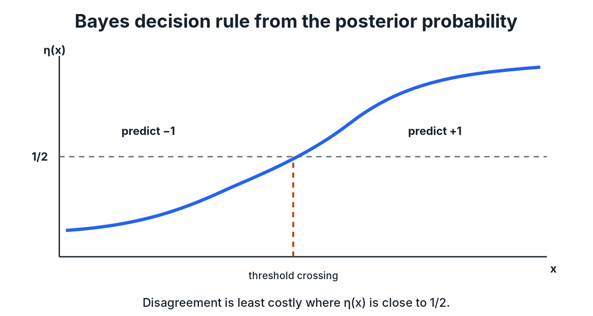

# 1. Probabilistic Prediction and Bayes Classification

Learning theory starts by asking what the *best possible* classifier is when we know the data distribution. That classifier is the Bayes rule. Then comes the real problem: we don't know the distribution, so we have to estimate the rule from data. This chapter sets up risk, derives the Bayes classifier and its excess-risk identity, and proves that a good estimate of $P(Y=1\mid X)$ gives a good classifier.

## 1. Prediction as a probabilistic problem

We predict $y\in\mathcal Y$ from $x\in\mathcal X$ with a function $f:\mathcal{X}\to\mathcal{Y}$. The training sample

$$\mathcal{D}_{n}=\{(X_{1},Y_{1}),\ldots,(X_{n},Y_{n})\}$$

consists of independent draws from an unknown joint distribution $P$ on $\mathcal{X}\times\mathcal{Y}$. A loss $\ell(\widehat y,y)$ measures the cost of predicting $\widehat{y}=f(x)$ when the truth is $y$, and the **population risk** is

$$R(f)=\mathbb{E}_{(X,Y)\sim P}\left[\ell(f(X),Y)\right].$$

We want $f$ with small risk.

> [!IMPORTANT]
> **The learned predictor is random**
>
> The learned $f$ depends on the random sample, so it is itself random. That is why learning theory states its guarantees "with probability at least $1-\delta$ over the draw of the training data."

## 2. Losses

For classification, the **zero-one loss** is $\ell(\widehat{y},y)=\mathbf{1}_{\{\widehat{y}\neq y\}}$, so the risk is the probability of a mistake:

$$R(f)=\mathbb{E}\left[\mathbf{1}_{\{f(X)\neq Y\}}\right]=P\left(f(X)\neq Y\right).$$

For regression ($\mathcal Y=\mathbb R$) the usual choice is squared loss $(\widehat{y}-y)^{2}$.

## 3. Conditioning on the input

Take $\mathcal{Y}=\{-1,1\}$ and define the **regression function** (the conditional class probability)

$$\eta(x)=P(Y=1\mid X=x).$$

Condition on $X$ first, then average over $X$:

$$R(f)=\mathbb{E}_{X}\left[\mathbb{E}\left[\ell(f(X),Y)\mid X\right]\right]=\mathbb{E}_{X}\left[\mathbf{1}_{\{f(X)\neq 1\}}\eta(X)+\mathbf{1}_{\{f(X)\neq -1\}}\left(1-\eta(X)\right)\right].$$

Since $f$ predicts either $1$ or $-1$, $\mathbf{1}_{\{f\neq -1\}}=1-\mathbf{1}_{\{f\neq 1\}}$, and

$$R(f)=\mathbb{E}_{X}\left[\mathbf{1}_{\{f(X)\neq 1\}}\left(2\eta(X)-1\right)+1-\eta(X)\right].$$

At each fixed $x$, the best choice depends only on whether $\eta(x)$ is above or below $1/2$.

## 4. The Bayes classifier

$$f^{\star}(x)=\begin{cases}1 & \eta(x)\geq\frac12\\ -1 & \eta(x)<\frac12\end{cases}, \qquad R^{\star}=\inf_{f}R(f).$$

*The Bayes label switches where $\eta(x)$ crosses $1/2$. Disagreeing with it close to the threshold costs little; far from it, a lot.*

### Theorem 1 (excess-risk identity)

For any classifier $f:\mathcal{X}\to\{-1,1\}$,

$$R(f)-R(f^{\star})=\mathbb{E}\left[\mathbf{1}_{\{f(X)\neq f^{\star}(X)\}}\left\lvert 2\eta(X)-1\right\rvert\right].$$

**Proof.** From §3,

$$R(f)-R(f^{\star})=\mathbb{E}\left[\left(\mathbf{1}_{\{f(X)\neq 1\}}-\mathbf{1}_{\{f^{\star}(X)\neq 1\}}\right)\left(2\eta(X)-1\right)\right].$$

Fix $X$. If $f(X)=f^\star(X)$ the bracket is 0. If they disagree and $2\eta-1\ge0$, then $f^\star=1$ and $f=-1$, so the product is $2\eta-1$. If they disagree and $2\eta-1<0$, then $f^\star=-1$ and $f=1$, so the product is $-(2\eta-1)$. In every case the integrand is $\mathbf{1}_{\{f\neq f^\star\}}|2\eta-1|$. $\square$

Because the integrand is non-negative, $R(f)\ge R(f^\star)$ for every $f$, so **the Bayes classifier attains the Bayes risk**: $R(f^\star)=R^\star$.

> [!TIP]
> **Why disagreements near $\eta=1/2$ are cheap**
>
> $|2\eta(x)-1|$ measures how strongly one label is preferred at $x$. Near $1/2$ both labels are almost equally likely, so picking the "wrong" one barely changes the error probability. Near 0 or 1 it costs almost a full mistake.

## 5. Why we still need learning

$f^\star$ needs $\eta$, which needs $P$, which we don't know. The learning problem is therefore

$$\text{estimate }\eta\text{ from data}\;\Longrightarrow\;\text{plug the estimate into the Bayes rule}.$$

## 6. A partition estimate of $\eta$

On $\mathcal X=[0,1]^2$, cut the square into cells $Q_1,\ldots,Q_M$ and use the fraction of positive labels in each cell:

$$P_{j}=\frac{\sum_{i}\mathbf{1}_{\{X_{i}\in Q_{j},\,Y_{i}=1\}}}{\sum_{i}\mathbf{1}_{\{X_{i}\in Q_{j}\}}}, \qquad \widehat{\eta}(x)=\sum_{j=1}^{M}P_{j}\mathbf{1}_{\{x\in Q_{j}\}} .$$

The **plug-in classifier** predicts $1$ when $\widehat\eta(x)\ge\frac12$ and $-1$ otherwise.

> [!TIP]
> **Why cells, and how small?**
>
> With continuous inputs we almost never see the same $x$ twice, so we pool nearby points and treat them as comparable. Smaller cells mean the pooled points really are similar (less approximation bias), but each cell holds fewer samples (more estimation variance). This is the bias–variance trade-off in its simplest form. With $n$ points in $d$ dimensions, cells of side $h$ contain about $nh^d$ points each; the best $h$ shrinks as $n$ grows, but slowly when $d$ is large.

## 7. The plug-in bound

### Theorem 2

For any estimator $\widehat{\eta}:\mathcal{X}\to\mathbb{R}$,

$$R(f_{\widehat{\eta}})-R^{\star}\leq 2\,\mathbb{E}\left[\left\lvert\eta(X)-\widehat{\eta}(X)\right\rvert\right].$$

**Proof.** By Theorem 1 and $|2\eta-1|=2|\eta-\frac12|$,

$$R(f_{\widehat{\eta}})-R^{\star}=2\,\mathbb{E}\left[\mathbf{1}_{\{f_{\widehat{\eta}}(X)\neq f^{\star}(X)\}}\left\lvert\eta(X)-\tfrac{1}{2}\right\rvert\right].$$

If the plug-in and Bayes rules disagree, then $\eta(X)$ and $\widehat\eta(X)$ are on opposite sides of $\frac12$, so $\frac12$ lies between them and $|\eta(X)-\frac12|\le|\eta(X)-\widehat\eta(X)|$. Substituting gives the result. $\square$

The theorem turns classification into estimation: estimate $\eta$ well in $L^1$ and the classifier's excess risk is at most twice that error.

## 8. Function classes

In practice we don't estimate $\eta$ over all functions. We search a restricted **function class** $\mathcal F$, because optimizing over every possible function is neither feasible nor statistically wise. The next chapters use linear classifiers and their kernelized versions; Chapters 6–8 measure how "big" such a class is.

## Summary

- Risk is expected loss; under zero-one loss it is the misclassification probability.
- The Bayes classifier thresholds $\eta(x)=P(Y=1\mid X=x)$ at $1/2$ and is optimal.
- Excess risk only accrues where $f$ disagrees with $f^\star$, weighted by $|2\eta-1|$.
- A plug-in classifier's excess risk is at most $2\,\mathbb E|\eta-\widehat\eta|$.

## Questions to test yourself

If the Bayes classifier is optimal, why do we need learning at all?

Because it requires $\eta$, and $\eta$ depends on the unknown distribution $P$. Learning is how we approximate it from finite data.

How does cell size trade approximation against sample size?

Small cells approximate $\eta$ locally (low bias) but contain few samples (high variance); large cells average many samples (low variance) but blur $\eta$ (high bias).

Where does the factor 2 in the plug-in bound come from?

From $|2\eta-1|=2|\eta-\tfrac12|$: the excess-risk weight is twice the distance of $\eta$ from the threshold, and that distance is at most $|\eta-\widehat\eta|$ wherever the two rules disagree.

---

[Course map](../course_map.md) · [Next: Hard-Margin SVM and Duality →](02_hard_margin_svm.md)
