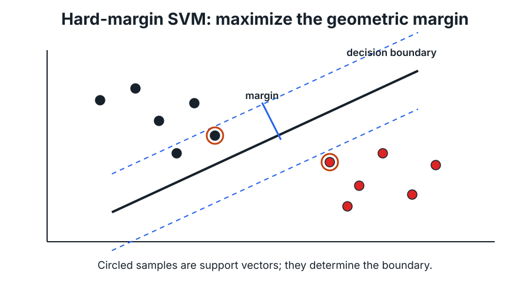

# 2. Hard-Margin SVM and Duality

This chapter turns "pick the separating hyperplane with the biggest margin" into a convex optimization problem, then uses Lagrangian duality and the KKT conditions to derive the SVM dual. The dual matters for two reasons: it shows that only a few training points (the support vectors) determine the solution, and it depends on the data only through inner products, which is the door to kernels in Chapter 3.

## 1. Linear classification

Data $\{(x_i,y_i)\}_{i=1}^n$ with $x_i\in\mathbb R^d$, $y_i\in\{-1,1\}$. A linear classifier is

$$f(x)=\mathrm{sign}\left(w^{\top}x+b\right),$$

with decision boundary $w^\top x+b=0$. In this chapter we assume the data are **linearly separable**.

## 2. The geometric margin

The distance from $x$ to the boundary is $|w^{\top}x+b|/\lVert w\rVert_{2}$, and for a correctly classified point its signed version is $y_i(w^\top x_i+b)/\lVert w\rVert_2$. The margin of the classifier is the worst case over the sample,

$$\gamma(w,b)=\min_{1\leq i\leq n}\frac{y_{i}\left(w^{\top}x_{i}+b\right)}{\lVert w\rVert_{2}},$$

and the maximum-margin classifier solves $\max_{w,b}\gamma(w,b)$.

*Separable data, the max-margin boundary, and the two margin lines $w^\top x+b=\pm1$. The circled support vectors lie exactly on the margin lines; moving any other point (without crossing a margin line) leaves the solution unchanged.*

## 3. Canonical scaling and the primal problem

$(w,b)$ and $(cw,cb)$ for $c>0$ define the same classifier, so we can fix the scale by requiring $\min_i y_i(w^\top x_i+b)=1$. The margin is then $1/\lVert w\rVert_2$, and maximizing it is minimizing $\lVert w\rVert_2$. Squaring (and halving, for tidy derivatives) gives the **hard-margin primal**:

$$\min_{w,b}\;\frac{1}{2}\lVert w\rVert_{2}^{2}\quad\text{s.t.}\quad y_{i}\left(w^{\top}x_{i}+b\right)\geq 1,\quad i=1,\ldots,n.$$

This is a convex quadratic program: a convex objective with affine constraints.

> [!TIP]
> **Why labels in $\{-1,1\}$?**
>
> They fold two conditions into one. $y_i=1$ requires $w^\top x_i+b\ge1$; $y_i=-1$ requires $w^\top x_i+b\le-1$. Both are $y_i(w^\top x_i+b)\ge1$.

## 4. Constrained optimization and the Lagrangian

For a general problem

$$\min_x f_0(x)\quad\text{s.t.}\quad f_i(x)\le0\;(i=1..m),\quad h_j(x)=0\;(j=1..p),$$

the **Lagrangian** is

$$L(x,\lambda,\nu)=f_{0}(x)+\sum_{i=1}^{m}\lambda_{i}f_{i}(x)+\sum_{j=1}^{p}\nu_{j}h_{j}(x),\qquad\lambda_i\ge0,$$

the **dual function** is $g(\lambda,\nu)=\inf_{x}L(x,\lambda,\nu)$, and the **dual problem** is $\max_{\lambda\geq 0,\nu}g(\lambda,\nu)$.

For any feasible $x$ and $\lambda\ge0$, $L(x,\lambda,\nu)\le f_0(x)$, so $g(\lambda,\nu)\le f_0(x)$. The dual optimum is always a lower bound on the primal optimum (**weak duality**). For convex problems satisfying a constraint qualification, such as Slater's condition (a strictly feasible point exists), the two optima are equal (**strong duality**).

## 5. KKT conditions

At a primal–dual optimal pair $(x^\star,\lambda^\star,\nu^\star)$ of a differentiable problem with strong duality:

1. **Primal feasibility:** $f_{i}(x^{\star})\leq 0$, $h_{j}(x^{\star})=0$.
2. **Dual feasibility:** $\lambda_{i}^{\star}\geq 0$.
3. **Complementary slackness:** $\lambda_{i}^{\star}f_{i}(x^{\star})=0$ for every $i$. Either the constraint is tight or its multiplier is zero.
4. **Stationarity:** $\nabla f_{0}(x^{\star})+\sum_{i}\lambda_{i}^{\star}\nabla f_{i}(x^{\star})+\sum_{j}\nu_{j}^{\star}\nabla h_{j}(x^{\star})=0$.

For convex problems the KKT conditions are also *sufficient*: any point satisfying them is optimal. The hard-margin SVM is convex, and for separable data a strictly feasible point exists (scale up any separating $(w,b)$), so Slater holds and KKT characterizes the solution exactly.

## 6. The SVM Lagrangian

Write each constraint as $1-y_i(w^\top x_i+b)\le0$ and attach $\alpha_i\ge0$:

$$L(w,b,\alpha)=\frac{1}{2}\lVert w\rVert_{2}^{2}-\sum_{i=1}^{n}\alpha_{i}\left(y_{i}\left(w^{\top}x_{i}+b\right)-1\right).$$

## 7. Deriving the dual

Minimize over the primal variables:

$$\nabla_{w}L=w-\sum_{i}\alpha_{i}y_{i}x_{i}=0\;\Longrightarrow\; w=\sum_{i=1}^{n}\alpha_{i}y_{i}x_{i}, \qquad \frac{\partial L}{\partial b}=-\sum_{i}\alpha_{i}y_{i}=0 .$$

Substituting back (the $b$ term vanishes by the second condition):

$$g(\alpha)=\sum_{i=1}^{n}\alpha_{i}-\frac{1}{2}\sum_{i=1}^{n}\sum_{j=1}^{n}\alpha_{i}\alpha_{j}y_{i}y_{j}\,x_{i}^{\top}x_{j}.$$

**Dual problem:**

$$\max_{\alpha}\;\sum_{i}\alpha_{i}-\frac{1}{2}\sum_{i,j}\alpha_{i}\alpha_{j}y_{i}y_{j}\,x_{i}^{\top}x_{j}\quad\text{s.t.}\quad\alpha_{i}\geq 0,\quad\sum_{i}\alpha_{i}y_{i}=0 .$$

The data appear **only through inner products $x_i^\top x_j$**, which is what makes the kernel trick possible.

## 8. Support vectors and recovering the classifier

From a dual solution $\alpha^\star$,

$$w^{\star}=\sum_{i=1}^{n}\alpha_{i}^{\star}y_{i}x_{i}.$$

Complementary slackness says $\alpha_{i}^{\star}\left(y_{i}\left((w^{\star})^{\top}x_{i}+b^{\star}\right)-1\right)=0$, so:

- $\alpha_i^\star>0$ ⇒ $y_i(w^{\star\top}x_i+b^\star)=1$: the point lies on the margin. These are the **support vectors**.
- Points strictly outside the margin have $\alpha_i^\star=0$ and don't appear in $w^\star$.

Any support vector gives $b^\star=y_i-w^{\star\top}x_i$ (in practice, average over all of them for numerical stability). The classifier is

$$f(x)=\mathrm{sign}\left(\sum_{i:\,\alpha_i^\star>0}\alpha_i^\star y_i\,x_i^\top x+b^{\star}\right).$$

## 9. Limits of the hard margin

Hard margin requires separable data. There are two ways out, developed next and then combined:

1. map the inputs to a feature space where they become separable (Chapter 3);
2. allow margin violations at a price (Chapter 4).

> [!NOTE]
> **Beyond the lecture: why solve the dual?**
>
> The primal has $d+1$ variables and the dual has $n$. When $d$ is huge or infinite (after a feature map), the dual is the only option. It also exposes sparsity, since most $\alpha_i$ are zero, which specialized solvers such as SMO exploit by updating two $\alpha$'s at a time while keeping $\sum_i\alpha_iy_i=0$. When $d\ll n$ and no kernel is used, primal methods (e.g. LIBLINEAR) are usually faster.

## Summary

- Max-margin classification with canonical scaling is $\min\frac12\lVert w\rVert^2$ s.t. $y_i(w^\top x_i+b)\ge1$.
- Lagrangian duality gives a dual QP in $\alpha$ that depends only on inner products.
- KKT complementary slackness identifies support vectors, and $w^\star$ is a combination of them.

## Questions to test yourself

Why does maximizing the margin reduce to minimizing ‖w‖²?

After fixing $\min_i y_i(w^\top x_i+b)=1$, the geometric margin is $1/\lVert w\rVert$; maximizing it is minimizing $\lVert w\rVert$, and squaring is monotone.

Which assumptions make the KKT conditions sufficient here?

Convexity (quadratic objective, affine constraints) plus Slater's condition, which holds for separable data because any strictly separating hyperplane can be rescaled to satisfy all constraints strictly.

Why does the final weight vector depend only on support vectors?

$w^\star=\sum_i\alpha_i^\star y_ix_i$ and complementary slackness forces $\alpha_i^\star=0$ for every point not on the margin.

---

[← Previous: Probabilistic Prediction](01_probabilistic_prediction.md) · [Course map](../course_map.md) · [Next: Feature Maps and Kernels →](03_feature_maps_and_kernels.md)
