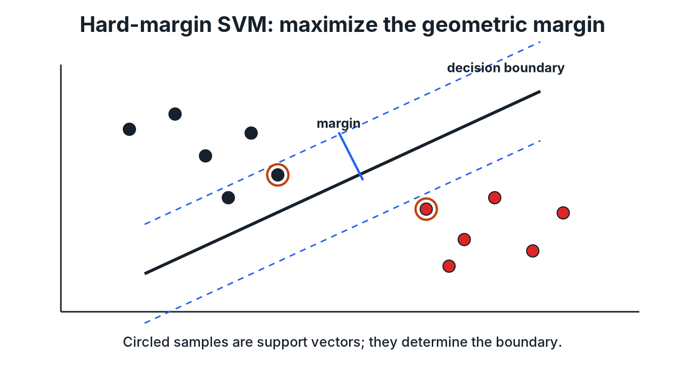

# Hard-Margin SVM and Duality

**Source:** 598SLT.pdf, pp. 7-12.

## 1. Linear classification

Consider training data

$$\{(x_{1},y_{1}),\ldots,(x_{n},y_{n})\},$$

where $x_{i}\in\mathbb{R}^{d}$ and $y_{i}\in\{-1,1\}$.

A linear score function is

$$g(x)=w^{\top}x+b,$$

and the corresponding classifier is

$$f(x)=\mathrm{sign}\left(w^{\top}x+b\right).$$

The decision boundary is the hyperplane

$$w^{\top}x+b=0.$$

The hard-margin formulation assumes that the training data are linearly separable.

## 2. Geometric margin

The perpendicular distance from a point $x$ to the decision boundary is

$$\frac{\left\lvert w^{\top}x+b\right\rvert}{\lVert w\rVert_{2}}.$$

For a correctly classified point $(x_{i},y_{i})$, the signed distance is

$$\frac{y_{i}\left(w^{\top}x_{i}+b\right)}{\lVert w\rVert_{2}}.$$

Therefore, the margin of the classifier on the training sample is

$$\gamma(w,b)=\min_{1\leq i\leq n}\frac{y_{i}\left(w^{\top}x_{i}+b\right)}{\lVert w\rVert_{2}}.$$

The maximum-margin classifier solves

$$\max_{w,b}\;\min_{1\leq i\leq n}\frac{y_{i}\left(w^{\top}x_{i}+b\right)}{\lVert w\rVert_{2}}.$$

*Redrawn course diagram: the hard-margin separator is centered between the two supporting class boundaries, and the circled samples determine the margin.*

## 3. Canonical scaling and the hard-margin primal problem

The classifier does not change when $(w,b)$ is multiplied by a positive constant. We may therefore choose a canonical scaling such that

$$\min_{1\leq i\leq n}y_{i}\left(w^{\top}x_{i}+b\right)=1.$$

Under this normalization, maximizing the margin is equivalent to minimizing $\lVert w\rVert_{2}$.

The hard-margin SVM primal objective is

$$\min_{w,b}\;\frac{1}{2}\lVert w\rVert_{2}^{2},$$

subject to

$$y_{i}\left(w^{\top}x_{i}+b\right)\geq 1 \quad \text{for } i=1,\ldots,n.$$

The factor $1/2$ is included because it simplifies derivatives and does not change the optimizer.

!!! clarification "Why are the labels encoded as $\{-1,1\}$?"
    With this encoding, the two correctness conditions combine into one inequality. If $y_{i}=1$, the constraint requires $w^{\top}x_{i}+b\geq 1$. If $y_{i}=-1$, it requires $w^{\top}x_{i}+b\leq -1$. Both are represented by $y_{i}(w^{\top}x_{i}+b)\geq 1$.

## 4. Constrained optimization and the Lagrangian

A standard constrained optimization problem minimizes

$$f_{0}(x),$$

subject to inequality constraints

$$f_{i}(x)\leq 0 \quad \text{for } i=1,\ldots,m,$$

and equality constraints

$$h_{j}(x)=0 \quad \text{for } j=1,\ldots,p.$$

Its Lagrangian is

$$L(x,\lambda,\nu)=f_{0}(x)+\sum_{i=1}^{m}\lambda_{i}f_{i}(x)+\sum_{j=1}^{p}\nu_{j}h_{j}(x),$$

where $\lambda_{i}\geq 0$ are multipliers for inequality constraints.

The Lagrange dual function is

$$g(\lambda,\nu)=\inf_{x}L(x,\lambda,\nu),$$

and the dual problem maximizes this lower bound:

$$\max_{\lambda\geq 0,\nu}g(\lambda,\nu).$$

## 5. KKT conditions

For differentiable objective and constraint functions, the course lists four Karush-Kuhn-Tucker conditions.

### 5.1 Primal feasibility

$$f_{i}(x^{\star})\leq 0 \quad \text{for } i=1,\ldots,m.$$

$$h_{j}(x^{\star})=0 \quad \text{for } j=1,\ldots,p.$$

### 5.2 Dual feasibility

$$\lambda_{i}^{\star}\geq 0 \quad \text{for } i=1,\ldots,m.$$

### 5.3 Complementary slackness

$$\lambda_{i}^{\star}f_{i}(x^{\star})=0 \quad \text{for } i=1,\ldots,m.$$

### 5.4 Stationarity

$$\nabla f_{0}(x^{\star})+\sum_{i=1}^{m}\lambda_{i}^{\star}\nabla f_{i}(x^{\star})+\sum_{j=1}^{p}\nu_{j}^{\star}\nabla h_{j}(x^{\star})=0.$$

!!! note "Technical condition"
    The source uses the KKT system to recover the primal solution from the dual. In general, the exact necessity and sufficiency of KKT conditions depend on convexity and a suitable constraint qualification. The hard-margin SVM is a convex quadratic program, and under the separability assumption its constraints are feasible.

## 6. Lagrangian of the hard-margin SVM

Write the constraints as

$$1-y_{i}\left(w^{\top}x_{i}+b\right)\leq 0.$$

Introduce multipliers $\alpha_{i}\geq 0$. The Lagrangian is

$$L(w,b,\alpha)=\frac{1}{2}\lVert w\rVert_{2}^{2}-\sum_{i=1}^{n}\alpha_{i}\left(y_{i}\left(w^{\top}x_{i}+b\right)-1\right).$$

## 7. Deriving the dual

The dual function is

$$g(\alpha)=\inf_{w,b}L(w,b,\alpha).$$

Stationarity with respect to $w$ gives

$$\nabla_{w}L=w-\sum_{i=1}^{n}\alpha_{i}y_{i}x_{i}=0,$$

so

$$w=\sum_{i=1}^{n}\alpha_{i}y_{i}x_{i}.$$

Stationarity with respect to $b$ gives

$$\frac{\partial L}{\partial b}=-\sum_{i=1}^{n}\alpha_{i}y_{i}=0,$$

so

$$\sum_{i=1}^{n}\alpha_{i}y_{i}=0.$$

Substituting these relations into the Lagrangian yields

$$g(\alpha)=\sum_{i=1}^{n}\alpha_{i}-\frac{1}{2}\sum_{i=1}^{n}\sum_{j=1}^{n}\alpha_{i}\alpha_{j}y_{i}y_{j}x_{i}^{\top}x_{j}.$$

Therefore, the dual problem maximizes

$$\sum_{i=1}^{n}\alpha_{i}-\frac{1}{2}\sum_{i=1}^{n}\sum_{j=1}^{n}\alpha_{i}\alpha_{j}y_{i}y_{j}x_{i}^{\top}x_{j},$$

subject to

$$\alpha_{i}\geq 0 \quad \text{for } i=1,\ldots,n,$$

and

$$\sum_{i=1}^{n}\alpha_{i}y_{i}=0.$$

The dual objective depends on the data only through inner products $x_{i}^{\top}x_{j}$. This observation motivates the kernel method in the next chapter.

## 8. Support vectors and reconstruction of the classifier

Let $\alpha^{\star}$ solve the dual problem. The primal weight vector is

$$w^{\star}=\sum_{i=1}^{n}\alpha_{i}^{\star}y_{i}x_{i}.$$

Complementary slackness gives

$$\alpha_{i}^{\star}\left(y_{i}\left((w^{\star})^{\top}x_{i}+b^{\star}\right)-1\right)=0.$$

A training point with $\alpha_{i}^{\star}>0$ is called a support vector. For such a point,

$$y_{i}\left((w^{\star})^{\top}x_{i}+b^{\star}\right)=1.$$

This equation can be used to recover $b^{\star}$.

The final classifier is

$$f(x)=\mathrm{sign}\left((w^{\star})^{\top}x+b^{\star}\right).$$

Because $w^{\star}$ is a linear combination of points with nonzero multipliers, the decision boundary depends on the support vectors.

## 9. Limitation of the hard-margin formulation

The hard-margin SVM requires linear separability. The notes introduce two responses when the data are not linearly separable:

1. transform the inputs with a feature map;
2. allow margin violations through a soft-margin formulation.

The following chapters develop both ideas and then combine them.

## Chapter summary

- A linear classifier predicts with the sign of $w^{\top}x+b$.
- The margin is the smallest signed distance from a training point to the separating hyperplane.
- Scale invariance converts maximum-margin classification into a convex constrained optimization problem.
- The Lagrangian and KKT conditions produce the SVM dual.
- The dual depends only on pairwise inner products.
- Nonzero dual coefficients identify support vectors.

---

[← Previous: Probabilistic Prediction and Bayes Classification](01_probabilistic_prediction.md) · [Course map](../course_map.md) · [Next: Feature Maps and Kernels →](03_feature_maps_and_kernels.md)
