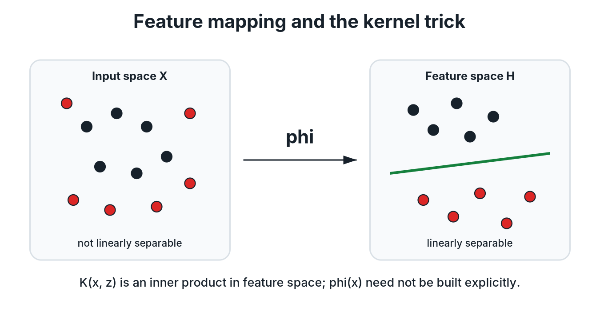

# Feature Maps and Kernels

**Source:** 598SLT.pdf, pp. 13-14.

## 1. Why transform the features?

A linear classifier can fail when the classes are not linearly separable in the original input space $\mathcal{X}$. The course introduces a feature map

$$\phi:\mathcal{X}\to\mathcal{H},$$

which sends each input $x$ to a transformed feature $\phi(x)$ in a Hilbert space $\mathcal{H}$.

*Redrawn course diagram: a feature map can make the classes linearly separable, while the kernel computes feature-space inner products without constructing the mapped vectors explicitly.*

The motivation is that data that are not linearly separable in $\mathcal{X}$ may become linearly separable after transformation into $\mathcal{H}$.

!!! clarification "What changes after feature mapping?"
    The classifier is still linear in the transformed feature $\phi(x)$, even when the resulting decision boundary is nonlinear as a function of the original input $x$. The source illustrates this by showing a nonseparable configuration before the map and a separable configuration afterward.

## 2. Hilbert spaces

### Definition 1: Hilbert space

A Hilbert space $\mathcal{H}$ is a complete vector space equipped with an inner product.

For $f,g,f_{1},f_{2}\in\mathcal{H}$, the inner product satisfies the following properties.

### Symmetry

$$\langle f,g\rangle_{\mathcal{H}}=\langle g,f\rangle_{\mathcal{H}}.$$

### Linearity

For $\alpha,\beta\in\mathbb{R}$,

$$\langle \alpha f_{1}+\beta f_{2},g\rangle_{\mathcal{H}}=\alpha\langle f_{1},g\rangle_{\mathcal{H}}+\beta\langle f_{2},g\rangle_{\mathcal{H}}.$$

### Positive definiteness

$$\langle f,f\rangle_{\mathcal{H}}\geq 0.$$

Moreover,

$$\langle f,f\rangle_{\mathcal{H}}=0\quad\Longrightarrow\quad f=0.$$

The familiar finite-dimensional example is $\mathbb{R}^{d}$ with

$$\langle x,x'\rangle=x^{\top}x'.$$

The notes suggest viewing a Hilbert space as a possibly infinite-dimensional analogue of Euclidean space.

!!! note "Completeness is deferred"
    Page 13 states that a Hilbert space is complete, but the construction and meaning of completion are developed later when the course builds a reproducing-kernel Hilbert space. At this point, the important structure is the vector space together with its inner product.

## 3. Kernels

### Definition 2: Kernel

Let $\mathcal{X}$ be a nonempty input set. A function

$$K:\mathcal{X}\times\mathcal{X}\to\mathbb{R}$$

is a kernel if there exist a Hilbert space $\mathcal{H}$ and a feature map $\phi:\mathcal{X}\to\mathcal{H}$ such that

$$K(x,x')=\langle\phi(x),\phi(x')\rangle_{\mathcal{H}}.$$

A kernel therefore evaluates an inner product between transformed features without requiring the transformed coordinates to be written explicitly.

## 4. Hard-margin SVM after feature mapping

The hard-margin SVM in the original feature space solves

$$\min_{w,b}\;\frac{1}{2}\lVert w\rVert_{2}^{2},$$

subject to

$$y_{i}\left(w^{\top}x_{i}+b\right)\geq 1\quad\text{for }i=1,\ldots,n.$$

After applying $\phi$, the weight vector belongs to $\mathcal{H}$ and the primal problem becomes

$$\min_{w\in\mathcal{H},b}\;\frac{1}{2}\langle w,w\rangle_{\mathcal{H}},$$

subject to

$$y_{i}\left(\langle w,\phi(x_{i})\rangle_{\mathcal{H}}+b\right)\geq 1\quad\text{for }i=1,\ldots,n.$$

The transformed dual problem is

$$\max_{\alpha}\;\sum_{i=1}^{n}\alpha_{i}-\frac{1}{2}\sum_{i=1}^{n}\sum_{j=1}^{n}\alpha_{i}\alpha_{j}y_{i}y_{j}\langle\phi(x_{i}),\phi(x_{j})\rangle_{\mathcal{H}},$$

subject to

$$\alpha_{i}\geq 0\quad\text{for }i=1,\ldots,n,$$

and

$$\sum_{i=1}^{n}\alpha_{i}y_{i}=0.$$

## 5. The kernel trick

By the kernel definition,

$$\langle\phi(x_{i}),\phi(x_{j})\rangle_{\mathcal{H}}=K(x_{i},x_{j}).$$

The dual can therefore be written as

$$\max_{\alpha}\;\sum_{i=1}^{n}\alpha_{i}-\frac{1}{2}\sum_{i=1}^{n}\sum_{j=1}^{n}\alpha_{i}\alpha_{j}y_{i}y_{j}K(x_{i},x_{j}),$$

subject to the same feasibility conditions.

This substitution is the kernel trick: compute the transformed inner products directly through $K$ instead of explicitly constructing every $\phi(x_{i})$.

!!! clarification "Why is the kernel trick useful?"
    If $\mathcal{H}$ is very high-dimensional or infinite-dimensional, explicitly storing and multiplying transformed feature vectors may be expensive or impossible. The SVM dual needs only pairwise inner products, so a kernel can provide exactly the quantities required by the optimization problem.

## 6. Kernel matrix and quadratic programming

For the training sample, define the kernel matrix by

$$K_{ij}=K(x_{i},x_{j}).$$

The notes state that these pairwise values can be computed before solving the dual with a standard quadratic-programming method.

!!! note "What is not proved yet?"
    Pages 13-14 define a kernel through an existing feature map and Hilbert space. They do not yet give a practical criterion for deciding whether an arbitrary proposed function $K$ is a valid kernel. The positive-definite-function criterion and the associated RKHS construction appear in Chapter 5.

## Chapter summary

- A feature map can make a nonseparable problem separable in a transformed space.
- A Hilbert space provides vector-space operations and an inner product, even in infinite-dimensional settings.
- A kernel evaluates inner products between transformed features.
- The feature-mapped SVM dual depends only on those inner products.
- The kernel trick replaces explicit transformed features with kernel evaluations.

---

[← Previous: Hard-Margin SVM and Duality](02_hard_margin_svm.md) · [Course map](../course_map.md) · [Next: Soft-Margin SVM and Hinge Loss →](04_soft_margin_svm.md)
