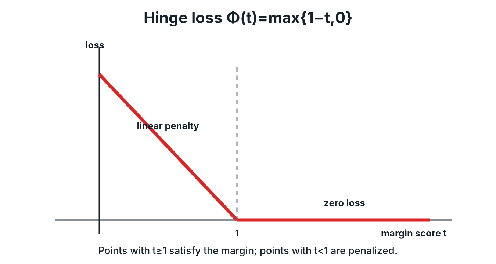

# 4. Soft-Margin SVM and Hinge Loss

Real data overlap, so the hard-margin constraints are usually infeasible. This chapter relaxes them with slack variables and proves that the result is exactly "hinge loss + L2 regularization". That identity is what connects SVMs to the generalization theory of Chapter 7.

## 1. Why hard margins aren't enough

$y_{i}(w^{\top}x_{i}+b)\geq 1$ for every $i$ is possible only if the data are linearly separable in the chosen feature space. Noise, class overlap or a single outlier breaks it. The fix: let each point violate its constraint by a non-negative amount $\xi_i$, and pay for it.

## 2. Slack variables

$$\min_{w,b,\xi}\;\frac{1}{2}\lVert w\rVert_{2}^{2}+C\sum_{i=1}^{n}\xi_{i}\quad\text{s.t.}\quad y_{i}\left(w^{\top}x_{i}+b\right)\geq 1-\xi_{i},\quad\xi_{i}\geq 0 .$$

$C>0$ prices violations and is chosen by cross-validation.

| $\xi_i$ | Meaning |
|---|---|
| $0$ | meets the unit-margin constraint |
| $(0,1)$ | correctly classified, inside the margin |
| $1$ | exactly on the decision boundary |
| $>1$ | misclassified |

Every misclassified point has $\xi_i>1$, so $\sum_i\xi_i$ upper-bounds the number of training errors.

> [!TIP]
> **What $C$ trades**
>
> $\frac12\lVert w\rVert^2$ wants a wide margin (strong regularization). $C\sum\xi_i$ wants few, small violations. Large $C$ gives a narrow margin that fits the training data closely; small $C$ gives a wide margin that tolerates errors.

## 3. With a feature map

$$\min_{w\in\mathcal{H},b,\xi}\;\frac{1}{2}\langle w,w\rangle_{\mathcal{H}}+C\sum_{i=1}^{n}\xi_{i}\quad\text{s.t.}\quad y_{i}\left(\langle w,\phi(x_{i})\rangle_{\mathcal{H}}+b\right)\geq 1-\xi_{i},\quad\xi_{i}\geq 0 .$$

## 4. Hinge loss

Define $\Phi(t)=\max\{1-t,0\}$. For the signed score $t=y_i(\langle w,\phi(x_i)\rangle+b)$, $\Phi(t)$ is 0 when $t\ge1$ (confidently correct) and grows linearly as $t$ falls below 1.

*Hinge loss is zero beyond a signed margin of 1 and linear below it.*

The unconstrained **hinge formulation** is

$$\min_{w\in\mathcal{H},b}\;\frac{1}{2}\langle w,w\rangle_{\mathcal{H}}+C\sum_{i=1}^{n}\Phi\left(y_{i}\left(\langle w,\phi(x_{i})\rangle_{\mathcal{H}}+b\right)\right).$$

## 5. The two formulations are equivalent

### Theorem 1

Let LHS be the optimal value of the slack formulation (§3) and RHS the optimal value of the hinge formulation (§4). Then LHS = RHS.

**Proof, LHS ≥ RHS.** Take an optimal $(w^\star,b^\star,\xi^\star)$ of the slack problem. For fixed $w^\star,b^\star$, each $\xi_i$ must satisfy $\xi_i\ge0$ and $\xi_i\ge1-y_i(\langle w^\star,\phi(x_i)\rangle+b^\star)$, and the objective increases in $\xi_i$. So at the optimum each slack is the smallest feasible value:

$$\xi_{i}^{\star}=\max\left\lbrace 1-y_{i}\left(\langle w^{\star},\phi(x_{i})\rangle_{\mathcal{H}}+b^{\star}\right),0\right\rbrace=\Phi\left(y_{i}\left(\langle w^{\star},\phi(x_{i})\rangle_{\mathcal{H}}+b^{\star}\right)\right).$$

The slack optimum therefore equals the hinge objective at $(w^\star,b^\star)$, which is at least the hinge minimum.

**Proof, LHS ≤ RHS.** Take an optimal $(w^\star,b^\star)$ of the hinge problem and set $\xi_i^\star=\Phi(y_i(\langle w^\star,\phi(x_i)\rangle+b^\star))$. Then $\xi_i^\star\ge0$ and $\xi_i^\star\ge1-y_i(\cdot)$, so the tuple is feasible for the slack problem with the same objective value. The slack minimum is at most that. $\square$

> [!TIP]
> **Why one loss replaces $n$ constraints**
>
> For fixed $(w,b)$ each slack has an obvious optimal value, the positive part of the margin shortfall. Substituting it eliminates both the slack variables and their constraints.

## 6. Convexity

$\Phi$ is convex (a maximum of two affine functions), composing it with the affine map $(w,b)\mapsto y_i(\langle w,\phi(x_i)\rangle+b)$ preserves convexity, and $\frac12\lVert w\rVert^2$ is strictly convex. The soft-margin objective is therefore convex, and every local minimum is global.

> [!NOTE]
> **Beyond the lecture: the dual and the loss-function family**
>
> Redoing Chapter 2's derivation with slacks gives the same dual objective, with the box constraint $0\le\alpha_i\le C$ in place of $\alpha_i\ge0$. Points with $0<\alpha_i<C$ lie on the margin, and points with $\alpha_i=C$ are inside the margin or misclassified.
>
> The template "regularizer + convex surrogate of 0-1 loss" covers most linear classifiers: hinge gives the SVM, logistic loss $\log(1+e^{-t})$ gives logistic regression, and squared hinge gives the L2-SVM. Hinge is the only one of these that is exactly zero for $t\ge1$, which is where sparsity in $\alpha$ comes from.

## Summary

- Slack variables make the problem feasible for any data; $C$ prices violations.
- The optimal slack is the hinge loss, so the soft-margin SVM is hinge loss + L2 regularization.
- The objective is convex, and $\sum_i\xi_i$ bounds the training errors.

## Questions to test yourself

What does increasing C do to the margin and to overfitting?

Violations become more expensive, so the margin narrows and the boundary fits the training data more tightly: lower bias, higher variance.

Why is the optimal slack exactly the hinge loss?

The objective increases with each $\xi_i$, and the constraints require $\xi_i\ge\max\{0,1-t_i\}$; the minimum feasible value is that bound.

---

[← Previous: Feature Maps and Kernels](03_feature_maps_and_kernels.md) · [Course map](../course_map.md) · [Next: RKHS and the Representer Theorem →](05_rkhs_and_representer.md)
