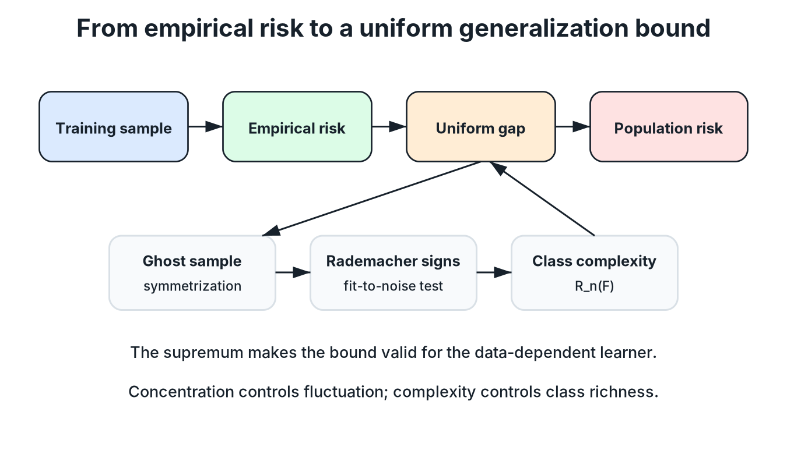

# Generalization Bounds and Rademacher Complexity

**Source:** 598SLT.pdf, pp. 38-54.

## 1. Generalization of a learning algorithm

Given independent training data

$$\left\lbrace (X_{i},Y_{i})\right\rbrace_{i=1}^{n}\sim P^{n},$$

the empirical risk of a prediction function $f$ is

$$\widehat{R}_{n}(f)=\frac{1}{n}\sum_{i=1}^{n}\ell\left(f(X_{i}),Y_{i}\right).$$

Many learning algorithms produce a prediction function by minimizing empirical risk over a function class $\mathcal{F}$:

$$f_{n}\in\underset{f\in\mathcal{F}}{\arg\min}\;\widehat{R}_{n}(f).$$

The population risk is

$$R(f)=\mathbb{E}_{(X,Y)\sim P}\left[\ell\left(f(X),Y\right)\right].$$

A smaller value of $R(f_{n})$ means better generalization: the learned function has small expected loss on a fresh test point $(X,Y)\sim P$ drawn from the same distribution as the training data.

The empirical risk $\widehat{R}_{n}(f_{n})$ has already been minimized. The central goal is therefore to control the remaining gap between population risk and empirical risk:

$$R(f_{n})\leq \widehat{R}_{n}(f_{n})+\text{a complexity term}+\text{a small probability term}.$$

The notes summarize this structure as

$$R(f_{n})\lesssim \widehat{R}_{n}(f_{n})+\mathrm{Complexity}(\mathcal{F}).$$

*Redrawn course diagram: symmetrization, Rademacher signs, concentration, and class complexity connect empirical risk to a uniform population-risk guarantee.*

> [!TIP]
> **Approximation versus complexity**
>
> Enlarging $\mathcal{F}$ can reduce the minimum empirical risk because the learner has more functions from which to choose. However, a richer function class has greater complexity and therefore pays a larger generalization penalty. The source presents this as the basic tradeoff behind function-class selection.

## 2. Why a pointwise bound is not enough

For one fixed function $f$, a concentration inequality may show that

$$R(f)-\widehat{R}_{n}(f)$$

is small with high probability. This is not sufficient for $f_{n}$ because $f_{n}$ is chosen after observing the training data.

To obtain a statement that remains valid for the data-dependent output of the learning algorithm, define the uniform gap

$$g\left((X,Y)^{n}\right)=\sup_{f\in\mathcal{F}}\left(R(f)-\widehat{R}_{n}(f)\right),$$

where

$$(X,Y)^{n}=\left\lbrace (X_{i},Y_{i})\right\rbrace_{i=1}^{n}.$$

If $g((X,Y)^{n})$ is small, then the inequality

$$R(f)-\widehat{R}_{n}(f)\leq g\left((X,Y)^{n}\right)$$

holds simultaneously for every $f\in\mathcal{F}$. In particular, it holds for the random function $f_{n}$ selected by empirical-risk minimization.

> [!TIP]
> **Why take the supremum?**
>
> Applying a concentration inequality separately to one particular $f$ only controls that fixed function. Taking the supremum first constructs one random variable that dominates the generalization gap of every function in the class.

## 3. Bounded-loss assumption

The source assumes that the loss is bounded:

$$\ell(\widehat{y},y)\in[0,1].$$

For binary labels $y\in\{-1,1\}$, the notes give a clipped hinge-type example:

$$\ell(\widehat{y},y)=\min\left\lbrace \max\left\lbrace 1-y\widehat{y},0\right\rbrace,1\right\rbrace.$$

The upper clipping at $1$ is essential for the bounded-difference argument below.

> [!NOTE]
> **Relation to the ordinary hinge loss**
>
> The ordinary hinge loss $\max\{1-y\widehat{y},0\}$ is not bounded above. The source therefore uses a bounded loss for the McDiarmid step and later returns to the ordinary hinge loss through a Lipschitz-contraction argument.

## 4. Bounded difference of the uniform gap

Consider two training samples that differ only in coordinate $i$:

$$\left((X,Y)^{i-1},(x,y),(X,Y)_{i+1}^{n}\right)$$

and

$$\left((X,Y)^{i-1},(x',y'),(X,Y)_{i+1}^{n}\right).$$

Only one summand of the empirical risk changes. Using the general inequality

$$\sup_{a\in A}h_{1}(a)-\sup_{a\in A}h_{2}(a)\leq \sup_{a\in A}\left(h_{1}(a)-h_{2}(a)\right),$$

the change in $g$ is bounded by

$$\frac{1}{n}\sup_{f\in\mathcal{F}}\left(\ell\left(f(x'),y'\right)-\ell\left(f(x),y\right)\right).$$

Because both losses lie in $[0,1]$,

$$\left\lvert g\left((X,Y)^{i-1},(x,y),(X,Y)_{i+1}^{n}\right)-g\left((X,Y)^{i-1},(x',y'),(X,Y)_{i+1}^{n}\right)\right\rvert\leq \frac{1}{n}.$$

Thus, $g$ has bounded differences with coordinate constants

$$c_{i}=\frac{1}{n}.$$

## 5. McDiarmid bound for the uniform gap

McDiarmid's inequality gives, for every $t>0$,

$$P\left(g\left((X,Y)^{n}\right)-\mathbb{E}\left[g\left((X,Y)^{n}\right)\right]\geq t\right)\leq \exp\left(-2nt^{2}\right).$$

Equivalently, with probability at least $1-\exp(-2nt^{2})$,

$$g\left((X,Y)^{n}\right)\leq \mathbb{E}\left[g\left((X,Y)^{n}\right)\right]+t.$$

Set

$$\delta=\exp\left(-2nt^{2}\right).$$

Solving for $t$ gives

$$t=\sqrt{\frac{\log(1/\delta)}{2n}}.$$

Therefore, with probability at least $1-\delta$,

$$g\left((X,Y)^{n}\right)\leq \mathbb{E}\left[g\left((X,Y)^{n}\right)\right]+\sqrt{\frac{\log(1/\delta)}{2n}}.$$

Since $g$ is the supremum of all generalization gaps, with the same probability, every $f\in\mathcal{F}$ satisfies

$$R(f)\leq \widehat{R}_{n}(f)+\mathbb{E}\left[g\left((X,Y)^{n}\right)\right]+\sqrt{\frac{\log(1/\delta)}{2n}}.$$

The remaining problem is to bound

$$\mathbb{E}\left[g\left((X,Y)^{n}\right)\right]=\mathbb{E}\left[\sup_{f\in\mathcal{F}}\left(R(f)-\widehat{R}_{n}(f)\right)\right].$$

## 6. Why the expected supremum measures class complexity

Suppose $\mathcal{F}_{1}\subseteq\mathcal{F}_{2}$. Then

$$\sup_{f\in\mathcal{F}_{1}}\left(R(f)-\widehat{R}_{n}(f)\right)\leq \sup_{f\in\mathcal{F}_{2}}\left(R(f)-\widehat{R}_{n}(f)\right).$$

Taking expectations preserves the inequality. A richer class creates more opportunities for some function to fit the sample unusually well relative to its population behavior. The expected supremum therefore serves as a complexity measure of the function class.

Directly working with the population expectation inside $R(f)$ is difficult. The source replaces it with an independent training sample.

## 7. Ghost sample and symmetrization

Introduce an independent sample

$$(X',Y')^{n}=\left\lbrace (X_{i}',Y_{i}')\right\rbrace_{i=1}^{n}\sim P^{n},$$

independent of $(X,Y)^{n}$. Because each ghost observation has distribution $P$,

$$R(f)=\mathbb{E}_{(X',Y')^{n}}\left[\frac{1}{n}\sum_{i=1}^{n}\ell\left(f(X_{i}'),Y_{i}'\right)\right].$$

Substituting this expression into the expected supremum and using the inequality

$$\sup_{f}\mathbb{E}[Z_{f}]\leq \mathbb{E}\left[\sup_{f}Z_{f}\right],$$

gives

$$\mathbb{E}\left[g\left((X,Y)^{n}\right)\right]\leq \mathbb{E}_{(X,Y)^{n},(X',Y')^{n}}\left[\sup_{f\in\mathcal{F}}\frac{1}{n}\sum_{i=1}^{n}\left(\ell\left(f(X_{i}'),Y_{i}'\right)-\ell\left(f(X_{i}),Y_{i}\right)\right)\right].$$

This replacement of a population expectation by a difference between two independent samples is the symmetrization step.

> [!TIP]
> **What the ghost sample accomplishes**
>
> The ghost sample is not additional observed data used by the learning algorithm. It is an independent mathematical copy introduced only in the proof so that both terms in the generalization gap have the same finite-sample form.

## 8. Rademacher variables

Let

$$\sigma_{1},\ldots,\sigma_{n}$$

be independent random variables satisfying

$$P(\sigma_{i}=1)=P(\sigma_{i}=-1)=\frac{1}{2}.$$

These are called **Rademacher variables**.

Because each pair

$$\left((X_{i},Y_{i}),(X_{i}',Y_{i}')\right)$$

has the same distribution after swapping its two elements, multiplying the difference by an independent random sign does not change the joint distribution. Consequently,

$$\mathbb{E}\left[g\left((X,Y)^{n}\right)\right]\leq \mathbb{E}\left[\sup_{f\in\mathcal{F}}\frac{1}{n}\sum_{i=1}^{n}\sigma_{i}\left(\ell\left(f(X_{i}'),Y_{i}'\right)-\ell\left(f(X_{i}),Y_{i}\right)\right)\right].$$

Using

$$\sup_{f}\left(A_{f}+B_{f}\right)\leq \sup_{f}A_{f}+\sup_{f}B_{f},$$

the right-hand side is at most the sum of two signed empirical-process terms. Since $-\sigma_{i}$ has the same distribution as $\sigma_{i}$ and the original and ghost samples have the same distribution, the two terms are equal. Therefore,

$$\mathbb{E}\left[g\left((X,Y)^{n}\right)\right]\leq 2\mathbb{E}_{(X,Y)^{n},\sigma_{1:n}}\left[\sup_{f\in\mathcal{F}}\frac{1}{n}\sum_{i=1}^{n}\sigma_{i}\ell\left(f(X_{i}),Y_{i}\right)\right].$$

## 9. Definition of Rademacher complexity

Let $X_{1},\ldots,X_{n}$ be i.i.d. observations and let $\sigma_{1},\ldots,\sigma_{n}$ be independent Rademacher variables. The Rademacher complexity of a function class $\mathcal{F}$ is

$$\mathfrak{R}_{n}(\mathcal{F})=\mathbb{E}_{X^{n},\sigma_{1:n}}\left[\sup_{f\in\mathcal{F}}\frac{1}{n}\sum_{i=1}^{n}\sigma_{i}f(X_{i})\right].$$

The source often writes $\mathfrak{R}(\mathcal{F})$ when the sample size is understood.

The random signs make the sum behave like a correlation between $f(X_{i})$ and pure noise. A class with enough flexibility to align strongly with many random sign patterns has high Rademacher complexity.

Combining the preceding concentration and symmetrization steps gives, with probability at least $1-\delta$,

$$R(f)\leq \widehat{R}_{n}(f)+2\mathbb{E}_{(X,Y)^{n},\sigma_{1:n}}\left[\sup_{f\in\mathcal{F}}\frac{1}{n}\sum_{i=1}^{n}\sigma_{i}\ell\left(f(X_{i}),Y_{i}\right)\right]+\sqrt{\frac{\log(1/\delta)}{2n}}$$

for every $f\in\mathcal{F}$.

To replace the signed loss class by $\mathfrak{R}_{n}(\mathcal{F})$, the notes introduce a contraction result.

## 10. Lipschitz loss functions

A loss is called $M$-Lipschitz continuous in the prediction when

$$\left\lvert \ell\left(f(x),y\right)-\ell\left(f(x'),y\right)\right\rvert\leq M\left\lvert f(x)-f(x')\right\rvert$$

for all relevant $x,x'$ and $y$, where $M>0$ is a constant.

### Theorem 1: contraction principle

Under the source's $M$-Lipschitz assumption,

$$\mathbb{E}_{(X,Y)^{n},\sigma_{1:n}}\left[\sup_{f\in\mathcal{F}}\frac{1}{n}\sum_{i=1}^{n}\sigma_{i}\ell\left(f(X_{i}),Y_{i}\right)\right]\leq M\mathfrak{R}_{n}(\mathcal{F}).$$

### Proof structure used in the notes

The notes first prove the result for $n=1$. For two candidate functions $f_{1},f_{2}\in\mathcal{F}$, the average over one Rademacher variable can be rewritten using a maximum and minimum. The identity

$$\max\{a,b\}=\frac{a+b+\lvert a-b\rvert}{2}$$

shows that the difference between the two loss values is controlled by the Lipschitz constant:

$$\left\lvert \ell\left(f_{1}(x),y\right)-\ell\left(f_{2}(x),y\right)\right\rvert\leq M\left\lvert f_{1}(x)-f_{2}(x)\right\rvert.$$

This gives the one-coordinate contraction. The general case is obtained by applying the same argument one Rademacher coordinate at a time while conditioning on the remaining variables.

> [!NOTE]
> **Level of proof in the source**
>
> The notebook gives the $n=1$ calculation and states that the general case follows by the same strategy. This chapter preserves that proof level rather than introducing a different full contraction-lemma proof.

## 11. Rademacher generalization theorem

### Theorem 2: risk bound by Rademacher complexity

Assume:

- the training data are i.i.d. from $P$;
- the loss takes values in $[0,1]$;
- the loss is $M$-Lipschitz in the prediction.

Then, with probability at least $1-\delta$, every $f\in\mathcal{F}$ satisfies

$$R(f)\leq \widehat{R}_{n}(f)+2M\mathfrak{R}_{n}(\mathcal{F})+\sqrt{\frac{\log(1/\delta)}{2n}}.$$

The three terms have distinct roles:

1. $\widehat{R}_{n}(f)$ measures fit to the observed data.
2. $2M\mathfrak{R}_{n}(\mathcal{F})$ measures the richness of the prediction class after accounting for the sensitivity of the loss.
3. $\sqrt{\log(1/\delta)/(2n)}$ is the confidence penalty.

## 12. Basic properties of Rademacher complexity

### Monotonicity

If

$$\mathcal{F}_{1}\subseteq\mathcal{F}_{2},$$

then

$$\mathfrak{R}_{n}(\mathcal{F}_{1})\leq \mathfrak{R}_{n}(\mathcal{F}_{2}).$$

This follows immediately because a supremum over a smaller set cannot exceed a supremum over a larger set.

### Affine transformation

For constants $a,b\in\mathbb{R}$, define

$$\mathcal{F}_{a,b}=\left\lbrace af+b:f\in\mathcal{F}\right\rbrace.$$

Then

$$\mathfrak{R}_{n}(\mathcal{F}_{a,b})=\lvert a\rvert\mathfrak{R}_{n}(\mathcal{F}).$$

Indeed, the constant shift contributes

$$\frac{b}{n}\sum_{i=1}^{n}\sigma_{i},$$

whose expectation is zero, and changing the sign of $a$ can be absorbed into the symmetric Rademacher variables.

## 13. The hinge loss is 1-Lipschitz

For binary classification, the hinge loss is

$$\ell(\widehat{y},y)=\max\left\lbrace 1-y\widehat{y},0\right\rbrace.$$

The source uses the elementary fact

$$\left\lvert \max\{a,0\}-\max\{b,0\}\right\rvert\leq \lvert a-b\rvert.$$

With $a=1-yf(x)$ and $b=1-yf(x')$, and with $\lvert y\rvert=1$,

$$\left\lvert \ell\left(f(x),y\right)-\ell\left(f(x'),y\right)\right\rvert\leq \left\lvert f(x)-f(x')\right\rvert.$$

Thus the hinge loss is $1$-Lipschitz, so the general theorem becomes

$$R(f)\leq \widehat{R}_{n}(f)+2\mathfrak{R}_{n}(\mathcal{F})+\sqrt{\frac{\log(1/\delta)}{2n}}.$$

## 14. Returning to soft-margin SVMs

The feature-mapped soft-margin SVM solves

$$\min_{w\in\mathcal{H},b}\;\frac{1}{2}\lVert w\rVert_{\mathcal{H}}^{2}+C\sum_{i=1}^{n}\Phi\left(y_{i}\left(\langle w,\phi(x_{i})\rangle_{\mathcal{H}}+b\right)\right),$$

where

$$\Phi(t)=\max\{1-t,0\}$$

and $\mathcal{H}$ is the RKHS associated with a kernel $K$.

By the representer theorem, an optimizer can be written as

$$w^{\star}=\sum_{i=1}^{n}\alpha_{i}\phi(x_{i}).$$

The prediction score is

$$f_{w,b}(x)=\langle w,\phi(x)\rangle_{\mathcal{H}}+b.$$

The source defines the SVM function class as the collection of such scores:

$$\mathcal{F}=\left\lbrace f_{w,b}:f_{w,b}(x)=\langle w,\phi(x)\rangle_{\mathcal{H}}+b,\;w=\sum_{i=1}^{n}\alpha_{i}\phi(x_{i})\right\rbrace.$$

A norm restriction is then imposed:

$$\lVert w\rVert_{\mathcal{H}}\leq B.$$

This restriction is the bridge between the regularization term in the SVM objective and the complexity term in the generalization bound.

## 15. Mathematical tools for the RKHS bound

### Cauchy-Schwarz inequality

For any $f,g\in\mathcal{H}$,

$$\left\lvert\langle f,g\rangle_{\mathcal{H}}\right\rvert\leq \lVert f\rVert_{\mathcal{H}}\lVert g\rVert_{\mathcal{H}}.$$

### Jensen's inequality

If $h$ is concave, then

$$\mathbb{E}[h(Z)]\leq h\left(\mathbb{E}[Z]\right).$$

The proof below uses the concavity of

$$h(z)=\sqrt{z}$$

on $z\geq 0$.

## 16. Rademacher complexity of the norm-bounded RKHS class

### Theorem 3: RKHS class bound

For the class of predictors satisfying $\lVert w\rVert_{\mathcal{H}}\leq B$, the source states the sample-dependent bound

$$\mathfrak{R}_{n}(\mathcal{F})\leq \frac{B}{n}\sqrt{\sum_{i=1}^{n}K(x_{i},x_{i})}.$$

### Proof

Start from the signed sum:

$$\frac{1}{n}\sum_{i=1}^{n}\sigma_{i}f_{w,b}(x_{i})=\frac{1}{n}\sum_{i=1}^{n}\sigma_{i}\left(\langle w,\phi(x_{i})\rangle_{\mathcal{H}}+b\right).$$

The bias term vanishes after expectation because

$$\mathbb{E}[\sigma_{i}]=0.$$

Using linearity of the inner product,

$$\frac{1}{n}\sum_{i=1}^{n}\sigma_{i}\langle w,\phi(x_{i})\rangle_{\mathcal{H}}=\frac{1}{n}\left\langle w,\sum_{i=1}^{n}\sigma_{i}\phi(x_{i})\right\rangle_{\mathcal{H}}.$$

Cauchy-Schwarz gives

$$\sup_{\lVert w\rVert_{\mathcal{H}}\leq B}\frac{1}{n}\left\langle w,\sum_{i=1}^{n}\sigma_{i}\phi(x_{i})\right\rangle_{\mathcal{H}}\leq \frac{B}{n}\left\lVert\sum_{i=1}^{n}\sigma_{i}\phi(x_{i})\right\rVert_{\mathcal{H}}.$$

Jensen's inequality for the square root yields

$$\mathbb{E}_{\sigma}\left[\left\lVert\sum_{i=1}^{n}\sigma_{i}\phi(x_{i})\right\rVert_{\mathcal{H}}\right]\leq \sqrt{\mathbb{E}_{\sigma}\left[\left\lVert\sum_{i=1}^{n}\sigma_{i}\phi(x_{i})\right\rVert_{\mathcal{H}}^{2}\right]}.$$

Expand the squared norm:

$$\left\lVert\sum_{i=1}^{n}\sigma_{i}\phi(x_{i})\right\rVert_{\mathcal{H}}^{2}=\sum_{i=1}^{n}\sum_{j=1}^{n}\sigma_{i}\sigma_{j}\langle\phi(x_{i}),\phi(x_{j})\rangle_{\mathcal{H}}.$$

By the kernel identity,

$$\langle\phi(x_{i}),\phi(x_{j})\rangle_{\mathcal{H}}=K(x_{i},x_{j}).$$

The Rademacher variables satisfy

$$\mathbb{E}[\sigma_{i}\sigma_{j}]=0$$

when $i\neq j$, and

$$\mathbb{E}[\sigma_{i}^{2}]=1.$$

Therefore,

$$\mathbb{E}_{\sigma}\left[\left\lVert\sum_{i=1}^{n}\sigma_{i}\phi(x_{i})\right\rVert_{\mathcal{H}}^{2}\right]=\sum_{i=1}^{n}K(x_{i},x_{i}).$$

Combining the steps proves

$$\mathfrak{R}_{n}(\mathcal{F})\leq \frac{B}{n}\sqrt{\sum_{i=1}^{n}K(x_{i},x_{i})}.$$

> [!NOTE]
> **Expected versus sample-dependent notation**
>
> Earlier pages define Rademacher complexity with expectation over both the sample and the Rademacher variables. The theorem on pages 52-53 writes a bound using the realized diagonal values $K(x_{i},x_{i})$. This chapter preserves the source statement and reads it as a conditional or empirical complexity bound for the observed sample. An expected version would additionally average the right-hand side over the sample.

## 17. Risk bound for soft-margin SVMs

Substitute the RKHS complexity bound into the hinge-loss generalization theorem. With probability at least $1-\delta$,

$$R(f_{w,b})\leq \frac{1}{n}\sum_{i=1}^{n}\Phi\left(y_{i}\left(\langle w,\phi(x_{i})\rangle_{\mathcal{H}}+b\right)\right)+\frac{2B}{n}\sqrt{\sum_{i=1}^{n}K(x_{i},x_{i})}+\sqrt{\frac{\log(1/\delta)}{2n}}.$$

The bound becomes small when two quantities are controlled:

- the empirical hinge loss;
- the norm bound $B$, because $B$ controls the Rademacher-complexity term.

The soft-margin SVM objective controls exactly these two quantities:

$$\frac{1}{2}\lVert w\rVert_{\mathcal{H}}^{2}+C\sum_{i=1}^{n}\Phi\left(y_{i}\left(\langle w,\phi(x_{i})\rangle_{\mathcal{H}}+b\right)\right).$$

A small objective value forces both the norm and the empirical hinge loss to remain small. This is the source's statistical-learning justification for the regularized SVM objective.

> [!TIP]
> **Why is the norm in the objective?**
>
> The handwritten notes ask why $\lVert w\rVert_{\mathcal{H}}^{2}$ appears in the objective. The generalization analysis supplies the answer: the norm bounds the complexity of the prediction class and therefore appears in an upper bound on population risk.

> [!TIP]
> **Connection to maximum margin**
>
> In a linear or RKHS classifier, decreasing $\lVert w\rVert$ under an appropriate normalization increases the geometric margin. The maximum-margin interpretation and the Rademacher-complexity interpretation therefore support the same regularizer from two different viewpoints.

## 18. Chapter summary

The source develops the generalization argument in the following sequence:

1. Replace a data-dependent pointwise gap by a uniform supremum over $\mathcal{F}$.
2. Apply McDiarmid's inequality to concentrate that supremum around its expectation.
3. Introduce a ghost sample to replace population risk by a second empirical average.
4. Introduce Rademacher signs to symmetrize the difference of the two samples.
5. Use a Lipschitz contraction principle to replace the loss class by the prediction class.
6. Bound the Rademacher complexity of a norm-bounded RKHS class.
7. Insert that bound into the soft-margin SVM risk inequality.

The final message is that empirical fit alone is not enough. Generalization is controlled by empirical loss together with an explicit measure of function-class complexity.

---

[← Previous: Concentration Inequalities](06_concentration_inequalities.md) · [Course map](../course_map.md) · [Next: VC Dimension →](08_vc_dimension.md)
