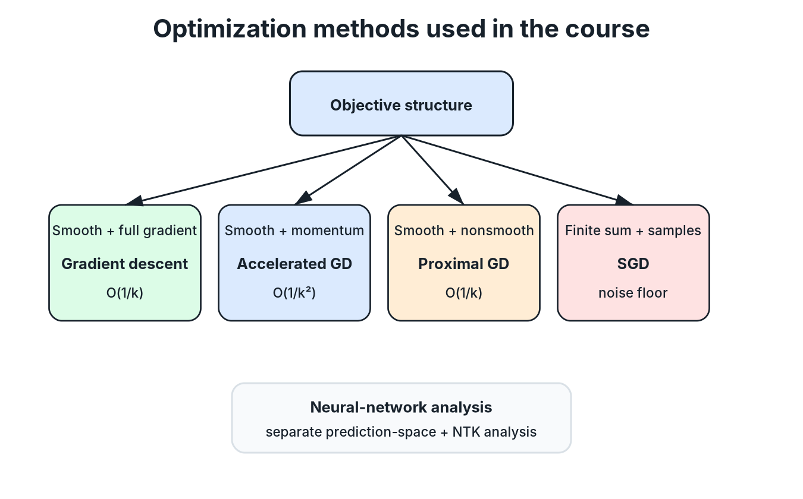

# Study Guide and Theorem Map

This page organizes the transformed course without changing the source sequence. It is intended for review after reading the detailed chapters.

## 1. Three-part course structure

### Part I: Prediction, margins, and kernels

Read Chapters 1-5 in order:

1. [Probabilistic prediction and Bayes classification](chapters/01_probabilistic_prediction.md)
2. [Hard-margin SVM and duality](chapters/02_hard_margin_svm.md)
3. [Feature maps and kernels](chapters/03_feature_maps_and_kernels.md)
4. [Soft-margin SVM and hinge loss](chapters/04_soft_margin_svm.md)
5. [RKHS and the representer theorem](chapters/05_rkhs_and_representer.md)

The progression is

$$\text{population risk}\longrightarrow\text{Bayes rule}\longrightarrow\text{maximum margin}\longrightarrow\text{kernelization}\longrightarrow\text{regularized RKHS optimization}.$$

### Part II: Concentration and generalization

Read Chapters 6-8 after Chapter 1:

1. [Concentration inequalities](chapters/06_concentration_inequalities.md)
2. [Generalization bounds and Rademacher complexity](chapters/07_generalization_and_rademacher.md)
3. [VC dimension](chapters/08_vc_dimension.md)

The progression is

$$\text{one random quantity}\longrightarrow\text{uniform deviation over a class}\longrightarrow\text{quantitative class complexity}.$$

### Part III: Optimization algorithms

Read Chapters 9-12 in order:

1. [Smooth convex optimization](chapters/09_smooth_convex_optimization.md)
2. [Nonsmooth and proximal optimization](chapters/10_nonsmooth_proximal_optimization.md)
3. [Stochastic gradient descent](chapters/11_stochastic_gradient_descent.md)
4. [Optimization of neural networks](chapters/12_neural_network_optimization.md)

*Redrawn course diagram: the objective structure determines whether the course uses full-gradient, accelerated, proximal, stochastic, or neural-network-specific analysis.*

Chapter 12 also depends conceptually on the kernel and generalization material from Chapters 5 and 7.

## 2. Theorem and result map

| Result | Chapter | Treatment in the source-based notes |
|---|---|---|
| Bayes excess-risk identity | 1 | Proved |
| Plug-in classifier excess-risk bound | 1 | Proved |
| Hard-margin SVM dual and support-vector reconstruction | 2 | Derived through stationarity and KKT |
| Slack-variable and hinge-loss equivalence | 4 | Proved in both directions |
| Representer theorem | 5 | Stated; finite-dimensional proof idea developed |
| Hoeffding's lemma | 6 | Proved |
| Hoeffding's inequality | 6 | Derived from the exponential Markov method |
| McDiarmid's inequality | 6 | Stated with the proof structure used in the course |
| Rademacher contraction principle | 7 | Proof structure summarized at the source's level |
| Rademacher generalization bound | 7 | Developed from uniform deviation and symmetrization |
| RKHS Rademacher-complexity bound | 7 | Proved |
| VC dimension of intervals | 8 | Proved |
| Gradient-descent rate O(1/k) | 9 | Proved by a telescoping potential argument |
| Accelerated-gradient rate O(1/k^2) | 9 | Stated without proof |
| Proximal-gradient rate O(1/k) | 10 | Proved |
| Accelerated proximal-gradient rate O(1/k^2) | 10 | Stated without proof |
| Averaged SGD bound with fixed learning rate | 11 | Proved |
| Initial tangent-Gram concentration | 12 | Proved with Hoeffding and a union bound |
| NTK optimization and generalization result | 12 | Separated into proved, informal, and imported components |

## 3. Recurring proof patterns

### Condition on the input

The Bayes-risk derivation first conditions on $X$, turning a global expected loss into a pointwise decision between the two labels.

### Show that an integrand is nonnegative

The Bayes classifier is optimal because the excess-risk integrand is always nonnegative.

### Convert constraints into a dual problem

The SVM derivation introduces Lagrange multipliers, applies stationarity, and then uses complementary slackness to identify support vectors.

### Apply exponential Markov and optimize a free parameter

Hoeffding-style proofs bound a moment-generating function and then choose the exponential parameter that gives the strongest tail bound.

### Control sensitivity to one training example

McDiarmid's inequality applies after showing that replacing one sample changes the target function by only a bounded amount.

### Introduce an independent copy and random signs

Symmetrization uses a ghost sample, then Rademacher signs, to replace an unknown population quantity with a sample-based complexity measure.

### Telescope a potential function

The optimization chapters repeatedly derive a one-step inequality and sum it so that squared-distance terms cancel.

### Analyze contraction in an eigenbasis

The neural-network chapter studies prediction error through the spectrum of the tangent-kernel matrix.

## 4. High-value comparison questions

- Bayes optimality versus learnability: why does knowing the optimal rule not solve the statistical problem?
- Hard margin versus soft margin: which assumption is relaxed, and how is the violation penalized?
- Explicit feature mapping versus a kernel: what computation is avoided?
- Positive definiteness versus the reproducing property: what role does each play in constructing an RKHS?
- Pointwise concentration versus uniform convergence: why is the latter needed for a learned predictor?
- Rademacher complexity versus VC dimension: what different notions of class richness do they capture?
- Gradient descent versus proximal gradient descent: what changes when the objective is nonsmooth?
- Full-gradient methods versus SGD: what is exchanged for cheaper iterations?
- Convex optimization versus NTK analysis: which part of the neural-network argument resembles linear dynamics?

## 5. Recommended review sequence

For an exam or technical interview, use three passes:

1. **Definitions and assumptions:** know exactly when each theorem applies.
2. **Proof skeletons:** reproduce the key inequality or decomposition before filling in algebra.
3. **Connections:** explain how regularization, complexity, and optimization interact rather than treating them as isolated topics.

The unresolved and source-limited points remain collected in [Questions and Discussion](questions_and_discussion.md).
